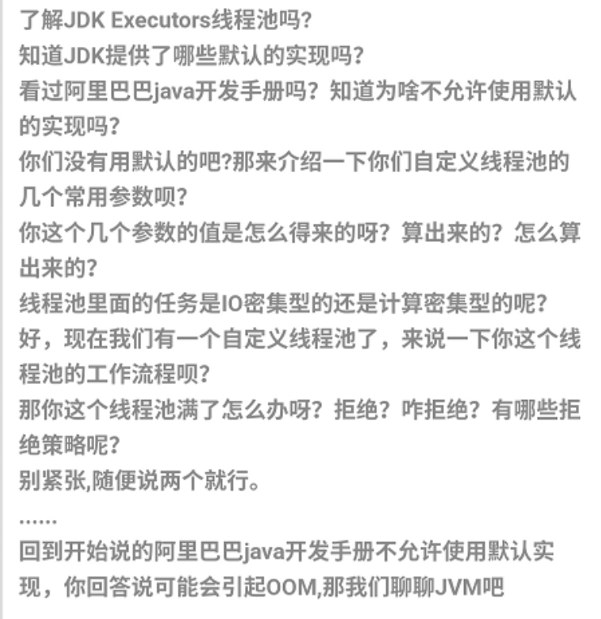

[TOC]

## 基础

- [x] String 类能不能被继承？为什么？
- [x] 实现单例设计模式（懒汉，饿汉）
- [x] == 和 equals() 的区别？
- [ ] 简述 BIO, NIO, AIO 的区别
- [x] 简述 Java 的反射机制及其应用场景
- [x] 什么是内存泄漏，怎么确定内存泄漏？
- [x] 简述动态代理与静态代理
- [x] java的异常体系介绍一下
- [x] Java 是如何实现线程安全的，哪些数据结构是线程安全的？
- [x] Java 中接口和抽象类的区别
- [x] hashcode 和 equals 方法的联系
- [x] 简述常见的工厂模式以及单例模式的使用场景
- [x] 简述生产者消费者模型
- [x] Java 如何高效进行数组拷贝
- [ ] 成员变量和方法的区别？
- [ ] 

## 并发

- [x] volatile 关键字解决了什么问题，它的实现原理是什么？
- [x] synchronized 关键字底层是如何实现的？它与 Lock 相比优缺点分别是什么？
- [x] 简述 Synchronized，Volatile，可重入锁（ReetrantLock） 的不同使用场景及优缺点？
- [x]  ThreadLocal 实现原理是什么？
- [x] Java 常见锁有哪些？ReetrantLock 是怎么实现的？
- [ ] Java 线程和操作系统的线程是怎么对应的？Java线程是怎样进行调度的?
- [x] Java 中 sleep() 与 wait() 的区别
- [x] Java 线程池里的 arrayblockingqueue 与 linkedblockingqueue 的使用场景和区别
- [x] 线程池是如何实现的？简述线程池的任务策略
- [x] Java 线程间有多少通信方式？
- [x] CAS 实现原理是什么？
- [x] 谈谈对AQS的理解
- [ ] 简述乐观锁以及悲观锁的区别以及使用场景
- [ ] 什么情况下会发生死锁，如何解决死锁？

## 集合

- [x] Java 容器有哪些？ 哪些是同步容器？ 哪些是并发容器？
- [ ] HashMap 与 ConcurrentHashMap 的实现原理是怎样的？ConcurrentHashMap 是如何保证线程安全的？
- [x] 集合类中的 List 和 Map 的线程安全版本是什么，如何保证线程安全的？
- [ ] 简述 HashMap 和 TreeMap 的实现原理以及常见操作的时间复杂度
- [ ] 简述 ArrayList 与 LinkedList 的底层实现以及常见操作的时间复杂度

- [ ] hashmap 和 hashtable 的区别是什么？

- [ ] 
  HashMap 实现原理，为什么使用红黑树？

- [ ] hashMap 1.7 / 1.8 的实现区别

## JVM 

- [ ] Java 中垃圾回收机制中如何判断对象需要回收？常见的 GC 回收算法有哪些？
- [ ] 简述 JVM 的内存模型 JVM 内存是如何对应到操作系统内存的？
- [ ] JVM 中内存模型是怎样的，简述新生代与老年代的区别？
- [ ] Java 类的加载流程是怎样的？什么是双亲委派机制？
- [ ] JVM 是怎么去调优的？简述过程和调优的结果
- [ ] 

## 数据库

### Mysql

- [ ] MySQL 为什么使用 B+ 树来作索引，对比 B 树它的优点和缺点是什么？

- [ ] 数据库的事务隔离级别有哪些？各有哪些优缺点？

- [ ] 数据库有哪些常见索引？数据库设计的范式是什么？
- [ ] 简述数据库中的 ACID 分别是什么？

- [ ] 简述脏读和幻读的发生场景，InnoDB 是如何解决幻读的？

- [ ] MySQL 中 varchar 和 char 的区别是什么？

- [ ] 并发事务会引发哪些问题？如何解决？

- [ ] 简述 MySQL 三种日志的使用场景

- [ ] 简述 MySQL MVCC 的实现原理
- [ ] SQL优化的方案有哪些，如何定位问题并解决问题？

- [ ] 简述数据库中什么情况下进行分库，什么情况下进行分表？

- [ ] 简述什么是最左匹配原则

- [ ] 数据库索引的实现原理是什么？

- [ ] 简述 undo log 和 redo log 的作用

- [ ] 数据库查询中左外连接和内连接的区别是什么？

- [ ] 数据库的读写分离的作用是什么？如何实现？
- [ ] 什么是 SQL 注入攻击？如何防止这类攻击？
- [ ] 什么是数据库事务，MySQL 为什么会使用 InnoDB 作为默认选项

- [ ] Redis 有几种数据结构？Zset 是如何实现的？

- [ ] 聚簇索引和非聚簇索引有什么区别？什么情况用聚集索引？

- [ ] 唯一索引与普通索引的区别是什么？使用索引会有哪些优缺点？

- [ ] 简述 MySQL 的间隙锁

- [ ] MySQL 有什么调优的方式？

- [ ] 简述 MySQL 的主从同步机制，如果同步失败会怎么样？

- [ ] MySQL 的索引什么情况下会失效？

### Redis

- [ ] 简述 Redis 持久化中 rdb 以及 aof 方案的优缺点

- [ ] Redis 序列化有哪些方式？

- [ ] 简述 Redis 的哨兵机制

- [ ] Redis 如何实现分布式锁？

- [ ] 简述 Redis 中如何防止缓存雪崩和缓存击穿

- [ ] 简述 Redis 的过期机制和内存淘汰策略

- [ ] 简述 Redis 中常见类型的底层数据结构
- [ ] 简述 Redis 中跳表的应用以及优缺点

- [ ] Redis 有几种数据结构？Zset 是如何实现的？
- [ ] Redis的缓存淘汰策略有哪些？

- [ ] 为什么 Redis 在单线程下能如此快？
- [ ] Redis 如何实现延时队列，分布式锁的实现原理
- [ ] 

### 其他

简述一致性哈希算法的实现方式及原理

## 网络

- [ ] 简述 TCP 三次握手以及四次挥手的流程。为什么需要三次握手以及四次挥手？
- [ ] RestFul 与 RPC 的区别是什么？RestFul 的优点在哪里？
- [ ] RestFul 是什么？RestFul 请求的 URL 有什么特点？
- [ ] 简述 RPC 的调用过程
- [ ] HTTP 与 HTTPS 有哪些区别？
- [ ] 简述 HTTPS 的加密与认证过程
- [ ] 从输入 URL 到展现页面的全过程？
- [ ] TCP 怎么保证可靠传输？
- [ ] TCP 与 UDP 在网络协议中的哪一层，他们之间有什么区别？
- [ ] TCP 中常见的拥塞控制算法有哪些？
- [ ] DNS 查询服务器的基本流程是什么？DNS 劫持是什么？
- [ ] Cookie 和 Session 的关系和区别是什么？
- [ ] 简述 JWT 的原理和校验机制
- [ ] HTTP 的方法有哪些？
- [ ] 简述常见的 HTTP 状态码的含义（301，304，401，403）
- [ ] TCP的拥塞控制具体是怎么实现的？UDP有拥塞控制吗？
- [ ] 简述 OSI 七层模型，TCP，IP 属于哪一层？
- [ ] 什么是跨域，什么情况下会发生跨域请求？
- [ ] 简述 WebSocket 是如何进行传输的
- [ ] 从系统层面上，UDP如何保证尽量可靠？
- [ ] 简述 HTTP 1.0，1.1，2.0 的主要区别
- [ ] 简述 TCP 的 TIME_WAIT
- [ ] 简述 TCP 滑动窗口以及重传机制
- [ ] TCP 四次挥手的时候 CLOSE_WAIT 的话怎么处理？
- [ ] TCP 的 keepalive 了解吗？说一说它和 HTTP 的 keepalive 的区别？
- [ ] HTTP 的方法有哪些？
- [ ] 什么是 TCP 粘包和拆包？
- [ ] TCP四次挥手过程以及所处状态，为什么还需要有 time_wait？
- [ ] 简述 TCP 协议的延迟 ACK 和累计应答
- [ ] 简述对称与非对称加密的概念
- [ ] 什么是中间人攻击？如何防止攻击？
- [ ] TCP 中 SYN 攻击是什么？如何防止？
- [ ] TCP 四次挥手的时候 CLOSE_WAIT 的话怎么处理？
- [ ] 为什么需要序列化？有什么序列化的方式？
- [ ] 

## Spring 

- [ ] Spring mvc 流程
- [ ] 简述 Spring AOP 的原理
- [ ] 简述 Spring 的初始化流程

## 手写

- [ ] 手写生产者消费者模型
- [ ] 

## 算法

- [x] [470. 用 Rand7() 实现 Rand10()](https://leetcode-cn.com/problems/implement-rand10-using-rand7/)

- [x] [53. 最大子序和](https://leetcode-cn.com/problems/maximum-subarray/)
- [x] [21. 合并两个有序链表](https://leetcode-cn.com/problems/merge-two-sorted-lists/)
- [x] [70. 爬楼梯](https://leetcode-cn.com/problems/climbing-stairs/)
- [x] [112. 路径总和](https://leetcode-cn.com/problems/path-sum/)
- [x] [113. 路径总和 II](https://leetcode-cn.com/problems/path-sum-ii/)
- [x] [437. 路径总和 III](https://leetcode-cn.com/problems/path-sum-iii/)
- [x] [215. 数组中的第K个最大元素](https://leetcode-cn.com/problems/kth-largest-element-in-an-array/)
- [ ] [83. 删除排序链表中的重复元素](https://leetcode-cn.com/problems/remove-duplicates-from-sorted-list/)
- [ ] [141. 环形链表](https://leetcode-cn.com/problems/linked-list-cycle/)
- [ ] [142. 环形链表 II](https://leetcode-cn.com/problems/linked-list-cycle-ii/)
- [ ] [剑指 Offer 09. 用两个栈实现队列](https://leetcode-cn.com/problems/yong-liang-ge-zhan-shi-xian-dui-lie-lcof/)
- [ ] [225. 用队列实现栈](https://leetcode-cn.com/problems/implement-stack-using-queues/)
- [ ] [232. 用栈实现队列](https://leetcode-cn.com/problems/implement-queue-using-stacks/)
- [ ] [剑指 Offer 31. 栈的压入、弹出序列](https://leetcode-cn.com/problems/zhan-de-ya-ru-dan-chu-xu-lie-lcof/)
- [ ] [189. 旋转数组](https://leetcode-cn.com/problems/rotate-array/)
- [ ] [300. 最长递增子序列](https://leetcode-cn.com/problems/longest-increasing-subsequence/)
- [ ] [594. 最长和谐子序列](https://leetcode-cn.com/problems/longest-harmonious-subsequence/)
- [ ] [1143. 最长公共子序列](https://leetcode-cn.com/problems/longest-common-subsequence/)
- [ ] [516. 最长回文子序列](https://leetcode-cn.com/problems/longest-palindromic-subsequence/)
- [ ] [1218. 最长定差子序列](https://leetcode-cn.com/problems/longest-arithmetic-subsequence-of-given-difference/)
- [ ] [673. 最长递增子序列的个数](https://leetcode-cn.com/problems/number-of-longest-increasing-subsequence/)
- [ ] [521. 最长特殊序列 Ⅰ](https://leetcode-cn.com/problems/longest-uncommon-subsequence-i/)
- [ ] [522. 最长特殊序列 II](https://leetcode-cn.com/problems/longest-uncommon-subsequence-ii/)
- [ ] [674. 最长连续递增序列](https://leetcode-cn.com/problems/longest-continuous-increasing-subsequence/)
- [ ] [718. 最长重复子数组](https://leetcode-cn.com/problems/maximum-length-of-repeated-subarray/)

- [ ] 常用的限流算法有哪些？简述令牌桶算法原理
- [ ] 有序链表插入的时间复杂度是多少？
- [ ] 实现快速排序
- [ ] 10亿个数中如何高效地找到最大的一个数以及最大的第 K 个数
- [ ] AVL 树和红黑树有什么区别？
- [ ] 给定一个包含 40亿 个无符号整数的大型文件，使用最多 1G 内存，对此文件进行排序
- [ ] 10亿条数据包括 id，上线时间，下线时间，请绘制每一秒在线人数的曲线图
- [ ] 如果通过一个不均匀的硬币得到公平的结果？
- [ ] Hash 表常见操作的时间复杂度是多少？遇到 Hash 冲突是如何解决的？

# 面经整理

拼多多秋招服务端面经汇总：https://leetcode-cn.com/circle/discuss/4GbJP5/

Java 面试高频问题总结：https://leetcode-cn.com/circle/discuss/XXGdoF/

字节跳动面试总结：https://leetcode-cn.com/circle/discuss/mSAtnq/

美团面经：https://leetcode-cn.com/circle/discuss/BOLS8z/

腾讯面经：https://leetcode-cn.com/circle/discuss/NSreS3/

顺丰面经：https://leetcode-cn.com/circle/discuss/iMXktV/

腾讯面经：https://leetcode-cn.com/circle/discuss/jhIY1r/

小米后端：https://leetcode-cn.com/circle/discuss/5r7lrA/ 

腾讯面试题：王者荣耀段位：https://leetcode-cn.com/circle/discuss/pNg0Kp/

面试题TCP：https://leetcode-cn.com/circle/discuss/aqTOW4/

​                      https://leetcode-cn.com/circle/discuss/QER0Su/

算法：https://leetcode-cn.com/circle/discuss/VFVW01/

Spring Aop知识点总结：https://leetcode-cn.com/circle/discuss/rg1taK/

计算机网络系列汇总：https://leetcode-cn.com/circle/discuss/KGfjHI/

https://leetcode-cn.com/circle/discuss/2JG7nY/

面试自测： https://mp.weixin.qq.com/s/PAERD0EHUXVjhZWAj8cMVg

https://www.cnblogs.com/cxhfuujust/p/11720264.html ， https://blog.csdn.net/yowasa/article/details/81320795

https://maimai.cn/article/detail?fid=1373977947&efid=8fQouk1zZ5Jz_x0yp-sQsw&share_channel=2&use_rn=1

HashMap ConcurrentHashMap的区别？

ArrayList的扩容机制？

HashMap 的底层实现、JDK 1.8 的时候为啥将链表转换成红黑树？HashMap 的负载因子

ConcurrentHashMap的底层实现

什么 ConcurrentHashMap 的读操作不需要加锁？

HashMap，LinkedHashMap，TreeMap 有什么区别？HashMap ，TreeMap，

有哪些集合是线程不安全的，又有哪些集合是线程不安全的？怎么解决呢？ 线程安全的集合类.

什么是快速失败(fail-fast)、能举个例子吗？什么是安全失败(fail-safe)呢？

HashMap 多线程操作导致死循环问题异常

vector 底层实现

map, hashmap 底层实现

map 的 key 如果是结构体需要注意什么问题

hash冲突如何解决

static 关键字的使用场景

volatile 关键字的使用场景

什么是多态

如何让类不能被继承

什么是单例模式，工厂模式

指针和引用的区别

Java实现连续空间的内存分配?

创建对象的方式有哪几种？

接口和抽象类有什么区别？

深拷贝和浅拷贝区别？

讲一讲封装，继承，多态（重要）。

编译时多态

运行时多态

泛型是什么?类型擦除？

如何实现静态代理？有啥缺陷？

动态代理的作用？在哪些地方用到了？（AOP、RPC 框架中都有用到，面试笔试中经常要求手写一个动态代理）

 JDK 的动态代理和 CGLIB 有什么区别？

 谈谈对 Java 注解的理解，解决了什么问题？

 Java 反射？反射有什么缺点？你是怎么理解反射的（为什么框架需要反射）？

 为什么框架需要反射技术？

 获取 Class 对象的两种方式

Volatile 关键字的作用，实现

Gc全流程

Gc算法

连接过程中什么时候会出现time_wait状态

为什么要有time_wait状态

一致性hash了解吗？

一致性hash的优点？

Jvm内存区域划分

程序计数器的作用

本地方法栈和虚拟机栈的区别

如果让你设计垃圾回收器 你觉得有什么可优化的吗？

 内存泄露和内存溢出的场景。

内存泄露的场景

内存溢出场景

讲一下，强引用，弱引用，软引用，虚引用。

一个对象是否有虚引用的存在，不会对其生存时间造成影响，也无法通过虚引用 得到一个对象。

讲一下 Java 的 NIO，AIO, BIO?

Java 中 finalize()方法的使用?

GC Root 对象有哪些

Java 中 Class.forName 和 ClassLoader 的区别？

讲一下 CopyOnWriteArrayList 和 CopyOnWriteArraySet?

CopyOnWrite 容器：

CopyOnWrite 的缺点

 Java 中>>和>>>的区别

在多线程情况下如何保证线程安全。

写一个死锁的例子

讲一下volatile关键字的作用。

synchronized 作用，讲一讲底层实现。

ReetrantLock 和 synchronized的区别

说说 synchronized关键字和 volatile关键字的区别

ReetrantLock实现方式

interrupt，interrupted与isInterrupted方法的区别? 如何停止一个正在运行的线程

 线程池作用？Java 线程池有哪些参数？阻塞队列有几种？拒绝策略有几种？线程池的工作机制？

 线程池拒绝策略分别使用在什么场景?

 线程死锁，解除线程死锁有哪几种方式？(两次栽倒这题上了，时间太久又忘记了，如何解决很重要)

 ThreadLocal 是什么，应用场景是什么，原理是怎样的？

 ThreadLocal类为什么要加上private static修饰？

 ThreadLocal有什么缺陷？如果线程池的线程使用ThreadLocal会有什么问题？

 介绍一下 Java 有哪些锁

 乐观锁和悲观锁讲一下，哪些地方用到。

内存泄露几种场景- HashMap原理

堆和栈分配的速度，为什么？

为什么要用虚拟内存

线程怎么同步

## 设计模式

设计模式六大原则

策略模式和state模式的区别？

 说一下你最用的比较多得模式（我说的工厂模式和观察者模式），再实现一个单例模式。

观察者模式

观察者模式的使用场景

## 数据库

什么是聚簇索引？什么是非聚簇索引？二者的区别？

mysql常用存储引擎

存储引擎InnoDB,MyISAM的区别？

B+树的理解？

写sql语句：给一个表，要求按照表中的某一列降序排序（这里多说一句，刷算法题的时候可以顺便刷一下Sql语句，毕竟面试的时候是完全有可能问道的，之前面腾讯的时候就让写过，经验之谈写不出来大概率会挂）

什么是事务？事务的隔离级别？分别解决什么问题

如何解决幻读？具体原理？

索引的使用场景？什么时候适合用索引？什么时候不适合用索引？

什么是联合索引？

为什么myisam不支持行锁

Mysql索引的实现

使用b 树的理由

B 树做索引比红黑树好在哪里？

数据库索引，为什么要用B+树- 知不知道句柄溢出-

## Redis

redis的内存淘汰策略，场景举例

为什么要使用redis分布式，setnx为什么可以达到分布式锁效果

redis宕机后分布式锁就不能使用，如何解决

为什么不直接用数据库的锁

除了redis分布式锁，还知道哪些可以实现分布式锁，这些实现的方式各有什么优缺点、

Redis的数据结构，Redis的主从复制；

为什么用redis做消息队列，有没有考虑过其他消息队列，用redis做消息队列会出现什么问题。

项目里Redis怎么用

分布式缓存可能出现的问题

分布式锁

Setnx加锁的原理

怎么解除分布式锁？

## 操作系统：

多线程的理解

epoll有几种模式？他们之间有什么区别

ET模式下为什么要循环的读取数据或者发送数据?

进程通信有几种方式？

进程和线程的区别？

进程的调度方法？

堆与栈的区别

内核态和用户态的划分与切换

虚拟地址怎么映射到物理地址

简述 IO 多路复用

简述进程通信的各种方法

进程切换的上下文细节

线程切换的上下文细节

CPU 的最小调度单位

多线程同步、多进程通信方式

操作系统的栈和堆的区别

用户态和内核态的区别

用户态和内核态切换的代价

fork 的过程

内存置换算法

什么是虚拟内存，作用

Select，poll，epoll的区别

epoll 的 LT 和 ET 的区别

什么情况下会发生缺页中断，具体流程

如何判断逻辑地址是否已经映射在物理地址上了

页表所在的位置

环形缓冲区的好处

动态链接和静态链接

怎么查看端口号占用情况

操作系统IO，用户态和内存态，读取文件的流程

用户态和内核态的区别

进程的调度算法有哪些？（主要）

常用 IO 模型？

select、poll 和 epoll 的区别？epoll 的底层使用的数据结构。

fork 函数的作用？

协程的概念？

 linux 进程和线程？

通过进程id查看占用的端口，通过端口号查看占用的进程 id？

 如何查看占用内存比较多的进程？

 僵尸进程产生的原因？

 孤儿进程产生的原因？

 讲一下虚拟内存。虚拟内存和物理内存的关系是什么？

 分段和分页讲一下？以及对应的场景？

 讲一下用户态和内核态？所有的系统调用都会进入到内核态吗？

 平常用什么 linux 命令比较多？如何打开文件并进行查找某个单词？怎么在某个目录下找到包含 txt 的文件？

 用过 ping 命令么？简单介绍一下。TTL 是什么意思？

 怎么判断一个主机是不是开放某个端口？

## 数据结构&算法：

哈希冲突的解决方法？

非递归实现中序遍历

自己设计一个任意长度字符串映射一个固定长度的数据？

反转链表

多线程交替打印

实现单例模式

最小栈

给定几十万个ip集合，判断任意一个ip是否属于这个集合

给定一个字符串，判断该字符串是否是环等的（字符串首位相连，如果能找到一个位置，从这个位置顺时针得到的字符串和逆时针得到的字符串相等，即为环等）

合并两个排序链表

快排和归并的复杂度分析

排序链表

二叉树中和为某一值的路径

有事洗牌

打家劫舍II

LFU 缓存

乘积最大子数组

车队

用 Rand7() 实现 Rand10()

大整数加法

三数之和

k个不同整数的子数组

快速查找 IP

最小的k个数

二叉搜索树的第k大节点

数组中的重复数字

XML 格式解析

有序数组找到第一个小于0的数和第一个大于0的数

实现一个 string 类

实现一个智能指针

两个排序数组找中位数

无重复字符的最长字串

string 转 float

 排序算法哪些是稳定的，为什么直接插入排序是稳定的，各种排序算法的时间复杂度和空间复杂度？

 如何进行二叉树的各种遍历的非递归算法实现？简要讲述。

二叉树的后序遍历（非递归）

二叉树的前序遍历（非递归）

手写实现Hashma

算法题，a/b=1/x1+1/x2+1/x3...求出x1,x2,x3

后缀表达式（栈）

四数之和

最长递增子序列

寻找峰值

面试题 08.03. 魔术索引- 写代码：

百万数据找中位数，提出了堆排序，面试官不太满意，于是手写了堆排，中间被怼边界条件没处理

 红黑树和平衡二叉树？

lru了解吗？

怎么实现lru？

布隆过滤器了解吗？

题意
牛牛在一个迷宫中，迷宫有 mm 个格子，有 nn 条通道，每条通道连接两个格子 [i,j]，编号为i的格子与编号为 jj 的格子可互相到达，每人每条通道只能走一次。
牛牛想知道，他是否能从 11 号格子出发回到 11 号格子。
输入
第一行给定两个整数 m,n。
接下来 n 行，每行有两个整数
n 对 u, v 互不相同
输出
若能回到1号格子则返回Yes，否则返回No。
示例1
输入
[4, 4],[(1,2), (2, 3), (3,4),(4,1)]
输出
"Yes"

## 计算机网络：

对称加密和非对称的区别，非对称加密有哪些

http状态码？500表示什么？4开头的表示什么？3开头的表示什么？

HTTPs 和 HTTP 的区别

HTTPS 的原理，客户端为什么信任第三方证书

HTTP 方法了解哪些

HTTP 异常状态码知道哪些

HTTP 长连接短连接使用场景是什么

https的加密流程

TCP 为什么是三次握手四次挥手，为什么要四次挥手？为什么不能是两次握手

一些协议分别位于tcp/ip五层模型的哪一层？

tcp连接过程

简述从输入网址到浏览器显示的过程

TCP 如何保障数据包有效三次握手和四次挥手

TIME_CLOSE 和 TIME_WAIT 的状态和意义

TCP 如何保证可靠传输

安全攻击有哪些

DDOS 有哪些，如何防范

为什么网络要分层？

TCP/IP 4 层模型了解么？

HTTP2.0讲一下

HTTP报文详解？详细说一下请求报文，以及HTTP和TCP的区别

 TCP滑动窗口是干什么的？TCP的可靠性体现在哪里？拥塞控制如何实现的？

TCP和UDP有什么区别？及其适用的场景。

Mac 地址和 ip 地址的区别？既然有了 Mac 地址，为什么还要 ip 地址呢？

电子邮件的发送过程?

 DNS解析过程，DNS劫持了解吗？

GET和POST有什么不一样？

 session和cookie的问题？

 HTTP是不保存状态的协议,如何保存用户状态?

ftp和https属于哪一层，区别，tcp，udp，tcp为什么是可靠的

进程通信方式，管道有什么限制

大端和小端，网络传输用什么

解释 keep-alive 和 content-type

网络7层模型

Tcp和udp位于哪一层

Ip寻址流程

Tcp和udp的区别

同步和异步的区别

非阻塞io和阻塞式io的区别

http如何保持连接

如果不用http，如何保持连接

流量控制和拥塞控制

CRC 循环校验的算法

如何使用 UDP 实现可靠传输

SYN FLOOD 是什么

Arp 攻击

NAT 原理

DNS 服务器与提供内容的服务器的区别

怎么实现 DNS 劫持

AES 的过程

## 项目
有什么设计的好的地方？

遇到什么困难？

有什么可以再改进的地方？

## 场景题

设计题：有一个服务器专门接收大量请求，怎么设计？

如果1000个人抢100个红包怎么设计？假如数据库一次20ms，要求3s内结束  如果要求100ms内结束呢

大量请求打到服务器怎么处理？

限流怎么实现？

## 其他

对称加密，非对称加密？

md5了解过吗

zab和paxos相比的优越性在哪

## HR 问题

大学期间遇到过最大的困难以及解决？

为什么选择读计算机？

为什么不考公务员？

以后想做的方向

10年以后的设想

拼多多和阿里你选哪一个，为什么

如果不写代码，你会考虑做什么工作

能不能接受pdd的工作强度（11116）

