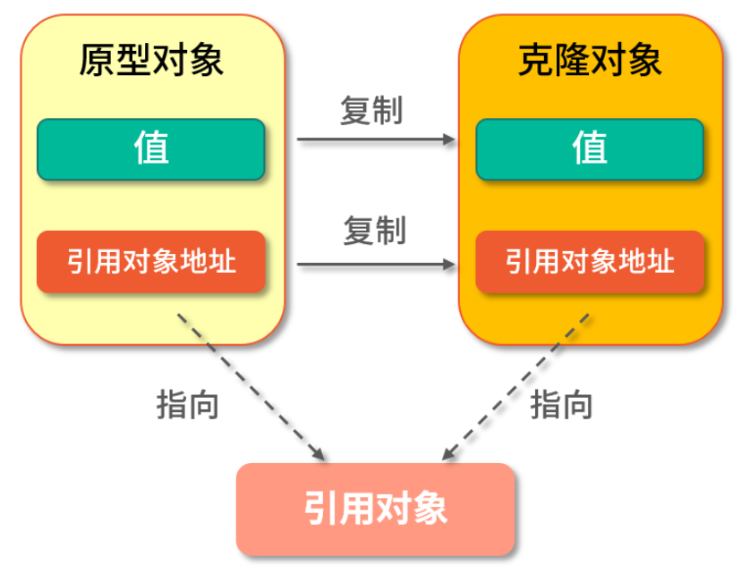
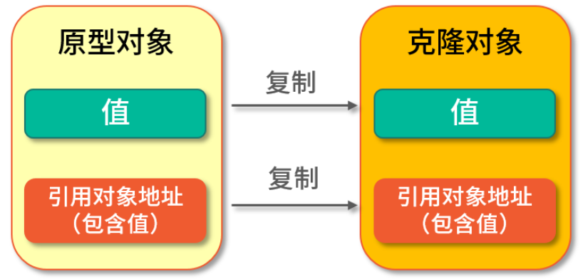
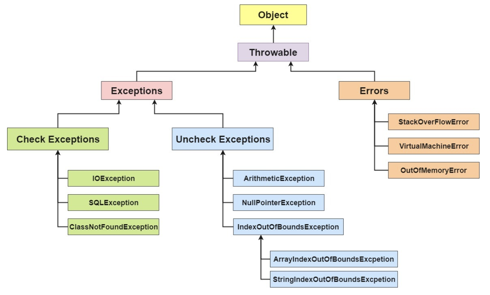

[TOC]

# Java 基础

## JVM  JDK  JRE

Java 虚拟机（**JVM**）是运行 Java 字节码的虚拟机。JVM 有针对不同系统的特定实现。目的主要是使用相同的字节码，都能保证给出相同的结果。字节码和不同系统的JVM实现是java 语言 一次编译，随处运行的关键。

> 什么是字节码？ 有什么好处？
>
> 在 Java 中，jvm可以解释的代码就叫做字节码。（文件扩展名为.class）他不面向任何特定的处理器，只面向虚拟机。由于字节码并不针对一种特定的机器，因此，Java 程序无须重新编译便可在多种不同操作系统的计算机上运行。

**JRE** 是 Java运行时环境。它是运行已编译 java 程序所需的所有内容的集合，包括 java 虚拟机，java类库，java命令和一些其他的基础构建。但是他不能创建新程序。

**JDK** 是 Java Development 的缩写，他是功能齐全的java sdk。 他拥有JRE所拥有的一切，还有编译器（javac）和工具，它能够创建和编译程序。

### Open JDK 和 Oracle JDK 的区别

1. OpenJDK 是一个参考模型并且是完全开源的，而 Oracle JDK 是 OpenJDK 的一个实现，并不是完全开源的；
2. Oracle JDK 比 OpenJDK 更稳定。OpenJDK 和 Oracle JDK 的代码几乎相同，但 Oracle JDK 有更多的类和一些错误修复。因此，如果您想开发企业/商业软件，我建议您选择 Oracle JDK，因为它经过了彻底的测试和稳定。某些情况下，有些人提到在使用 OpenJDK 可能会遇到了许多应用程序崩溃的问题，但是，只需切换到 Oracle JDK 就可以解决问题；
3. 在响应性和 JVM 性能方面，Oracle JDK 与 OpenJDK 相比提供了更好的性能；
4. Oracle JDK 不会为即将发布的版本提供长期支持，用户每次都必须通过更新到最新版本获得支持来获取最新版本；
5. Oracle JDK 大概每 6 个月发一次主要版本，而 OpenJDK 版本大概每三个月发布一次。但这不是固定的，我觉得了解这个没啥用处。详情参见：https://blogs.oracle.com/java-platform-group/update-and-faq-on-the-java-se-release-cadence 。
6. Oracle JDK 根据二进制代码许可协议获得许可，而 OpenJDK 根据 GPL v2 许可获得许可。

## 为什么说 Java 语言“编译与解释并存”？

高级编程语言按照程序的执行方式分为：编译型和解释型两种。

简单来说，编译型语言是指编译器针对特定的操作系统将源代码一次性翻译成可被该平台执行的机器码；

解释型语言是指解释器对源程序逐行解释成特定平台的机器码并立即执行。

比如，你想阅读一本英文名著，你可以找一个英文翻译人员帮助你阅读， 有两种选择方式，你可以先等翻译人员将全本的英文名著（也就是源码）都翻译成汉语，再去阅读，也可以让翻译人员翻译一段，你在旁边阅读一段，慢慢把书读完。

Java 语言既具有编译型语言的特征，也具有解释型语言的特征，因为 Java 程序要经过先编译，后解释两个步骤，由 Java 编写的程序需要先经过编译步骤，生成字节码（*.class 文件），这种字节码必须由 Java 解释器来解释执行。因此，我们可以认为 Java 语言编译与解释并存。

## 字符型常量和字符串常量的区别?

1. 形式上: 字符常量是单引号引起的一个字符; 字符串常量是双引号引起的 0 个或若干个字符

2. 含义上: 字符常量相当于一个整型值( ASCII 值),可以参加表达式运算; 字符串常量代表一个地址值(该字符串在内存中存放位置)

3. 占内存大小 字符常量只占 2 个字节; 字符串常量占若干个字节 (**注意： char 在 Java 中占两个字节**),

   > 字符封装类 `Character` 有一个成员常量 `Character.SIZE` 值为 16,单位是`bits`,该值除以 8(`1byte=8bits`)后就可以得到 2 个字节

## continue、break、和 return 的区别是什么？

在循环结构中，当循环条件不满足或者循环次数达到要求时，循环会正常结束。但是，有时候可能需要在循环的过程中，当发生了某种条件之后 ，提前终止循环，这就需要用到下面几个关键词：

1. continue ：指跳出当前的这一次循环，继续下一次循环。
2. break ：指跳出整个循环体，继续执行循环下面的语句。

return 用于跳出所在方法，结束该方法的运行。return 一般有两种用法：

1. `return;` ：直接使用 return 结束方法执行，用于没有返回值函数的方法
2. `return value;` ：return 一个特定值，用于有返回值函数的方法

## Java 泛型了解么？什么是类型擦除？介绍一下常用的通配符？

Java 泛型，是 Java-5 引入的一个新特性，泛型提供了编译时类型安全检测机制，该机制允许程序员在编译时检测到非法的类型。

泛型的本质是参数化类型，也就是说所操作的数据类型被指定为一个参数。

泛型的好处就是在编译的时候能够检查类型安全，并且所有的强制转换都是自动和隐式的。

[《Java 泛型类型擦除以及类型擦除带来的问题》](https://www.cnblogs.com/wuqinglong/p/9456193.html) 

**Java 的泛型是伪泛型，这是因为 Java 在编译期间，所有的泛型信息都会被擦掉，这也就是通常所说类型擦除 。**

```
List<Integer> list = new ArrayList<>();

list.add(12);
//这里直接添加会报错
list.add("a");
Class<? extends List> clazz = list.getClass();
Method add = clazz.getDeclaredMethod("add", Object.class);
//但是通过反射添加，是可以的
add.invoke(list, "kl");

System.out.println(list)

```

泛型一般有三种使用方式:泛型类、泛型接口、泛型方法。

**1.泛型类**：

```
//此处T可以随便写为任意标识，常见的如T、E、K、V等形式的参数常用于表示泛型
//在实例化泛型类时，必须指定T的具体类型
public class Generic<T>{

    private T key;

    public Generic(T key) {
        this.key = key;
    }

    public T getKey(){
        return key;
    }
}
```

如何实例化泛型类：

```
Generic<Integer> genericInteger = new Generic<Integer>(123456);
```

**2.泛型接口** ：

```
public interface Generator<T> {
    public T method();
}
```

实现泛型接口，不指定类型：

```
class GeneratorImpl<T> implements Generator<T>{
    @Override
    public T method() {
        return null;
    }
}
```

实现泛型接口，指定类型：

```
class GeneratorImpl<T> implements Generator<String>{
    @Override
    public String method() {
        return "hello";
    }
}
```

**3.泛型方法** ：

```
   public static < E > void printArray( E[] inputArray )
   {
         for ( E element : inputArray ){
            System.out.printf( "%s ", element );
         }
         System.out.println();
    }
```

使用：

```
// 创建不同类型数组： Integer, Double 和 Character
Integer[] intArray = { 1, 2, 3 };
String[] stringArray = { "Hello", "World" };
printArray( intArray  );
printArray( stringArray  );
```

**常用的通配符为： T，E，K，V，？**

- ？ 表示不确定的 java 类型
- T (type) 表示具体的一个 java 类型
- K V (key value) 分别代表 java 键值中的 Key Value
- E (element) 代表 Element

更多关于 Java 泛型中的通配符可以查看这篇文章：[《聊一聊-JAVA 泛型中的通配符 T，E，K，V，？》](https://juejin.im/post/5d5789d26fb9a06ad0056bd9)

## ==和 equals 的区别

**`==`** : 它的作用是判断两个对象的地址是不是相等。即判断两个对象是不是同一个对象。(**基本数据类型==比较的是值，引用数据类型==比较的是内存地址**)

> 因为 Java 只有值传递，所以，对于 == 来说，不管是比较基本数据类型，还是引用数据类型的变量，其本质比较的都是值，只是引用类型变量存的值是对象的地址。

**`equals()`** : 它的作用也是判断两个对象是否相等，它不能用于比较基本数据类型的变量。`equals()`方法存在于`Object`类中，而`Object`类是所有类的直接或间接父类。

`equals()` 方法存在两种使用情况：

- 情况 1：类没有覆盖 `equals()`方法。则通过`equals()`比较该类的两个对象时，等价于通过“==”比较这两个对象。使用的默认是 `Object`类`equals()`方法。
- 情况 2：类覆盖了 `equals()`方法。一般，我们都覆盖 `equals()`方法来两个对象的内容相等；若它们的内容相等，则返回 true(即，认为这两个对象相等)


- `String` 中的 `equals` 方法是被重写过的，因为 `Object` 的 `equals` 方法是比较的对象的内存地址，而 `String` 的 `equals` 方法比较的是对象的值。
- 当创建 `String` 类型的对象时，虚拟机会在常量池中查找有没有已经存在的值和要创建的值相同的对象，如果有就把它赋给当前引用。如果没有就在常量池中重新创建一个 `String` 对象。

## hashcode() 和 equals()

`hashCode()` 的作用是获取哈希码，也称为散列码；它实际上是返回一个 int 整数。这个哈希码的作用是确定该对象在哈希表中的索引位置。`hashCode()`定义在 JDK 的 `Object` 类中，这就意味着 Java 中的任何类都包含有 `hashCode()` 函数。另外需要注意的是： `Object` 的 hashcode 方法是本地方法，也就是用 c 语言或 c++ 实现的，该方法通常用来将对象的 内存地址 转换为整数之后返回。

 也就是说：**hashCode() 在散列表中才有用，在其它情况下没用。**在散列表中hashCode() 的作用是获取对象的散列码，进而确定该对象在散列表中的位置。

**为什么重写equals（）时必须要重写hashcode（）?**

如果两个对象相等，则 hashcode 一定也是相同的。两个对象相等,对两个对象分别调用 equals 方法都返回 true。但是，两个对象有相同的 hashcode 值，它们也不一定是相等的 。**因此，equals 方法被覆盖过，则 `hashCode` 方法也必须被覆盖。**

> `hashCode()`的默认行为是对堆上的对象产生独特值。如果没有重写 `hashCode()`，则该 class 的两个对象无论如何都不会相等（即使这两个对象指向相同的数据）
>
> 往HashMap添加元素的时候，需要先定位到在数组的位置（hashCode方法）。如果只重写了 equals 方法，两个对象 equals 返回了true，**集合是不允许出现重复元素的**，只能插入一个。此时如果没有重写 hashCode 方法，那么就无法定位到同一个位置，集合还是会插入元素。这样集合中就出现了重复元素了。那么重写的equals方法就没有意义了。

**为什么两个对象有相同的 hashcode 值，它们也不一定是相等的？**

因为 `hashCode()` 所使用的 hash 算法也许刚好会让多个对象传回相同的 hash 值。越糟糕的 hash 算法越容易碰撞，但这也与数据值域分布的特性有关（所谓碰撞也就是指的是不同的对象得到相同的 `hashCode`。

更多关于 `hashcode()` 和 `equals()` 的内容可以查看：[Java hashCode() 和 equals()的若干问题解答](https://www.cnblogs.com/skywang12345/p/3324958.html)

## Java 中的几种基本数据类型是什么？对应的包装类型是什么？各自占用多少字节呢？

Java 中有 8 种基本数据类型，分别为：

1. 6 种数字类型 ：byte、short、int、long、float、double
2. 1 种字符类型：char
3. 1 种布尔型：boolean。

这八种基本类型都有对应的包装类分别为：Byte、Short、Integer、Long、Float、Double、Character、Boolean

| 基本类型 | 位数 | 字节 | 默认值  |
| -------- | ---- | ---- | ------- |
| int      | 32   | 4    | 0       |
| short    | 16   | 2    | 0       |
| long     | 64   | 8    | 0L      |
| byte     | 8    | 1    | 0       |
| char     | 16   | 2    | 'u0000' |
| float    | 32   | 4    | 0f      |
| double   | 64   | 8    | 0d      |
| boolean  | 1    |      | false   |

对于 boolean，官方文档未明确定义，它依赖于 JVM 厂商的具体实现。逻辑上理解是占用 1 位，但是实际中会考虑计算机高效存储因素。

注意：

1. Java 里使用 long 类型的数据一定要在数值后面加上 **L**，否则将作为整型解析：
2. `char a = 'h'`char :单引号，`String a = "hello"` :双引号

**自动装箱与拆箱**

- **装箱**：将基本类型用它们对应的引用类型包装起来；
- **拆箱**：将包装类型转换为基本数据类型；

装箱过程是通过调用包装器的valueOf方法实现的，而拆箱过程是通过调用包装器的 xxxValue方法实现的。（xxx代表对应的基本数据类型）。

更多内容见：[深入剖析 Java 中的装箱和拆箱](https://www.cnblogs.com/dolphin0520/p/3780005.html)

**8 种基本类型的包装类和常量池**

Java 基本类型的包装类的大部分都实现了常量池技术，即 Byte,Short,Integer,Long,Character,Boolean；前面 4 种包装类默认创建了数值[-128，127] 的相应类型的缓存数据，Character 创建了数值在[0,127]范围的缓存数据，Boolean 直接返回 True Or False。如果超出对应范围仍然会去创建新的对象。 为啥把缓存设置为[-128，127]区间？（[参见 issue/461](https://github.com/Snailclimb/JavaGuide/issues/461)）性能和资源之间的权衡。

## 为什么Java中只有值传递，并没有引用传递。

值传递（pass by value）是指在调用函数时将实际参数**复制**一份传递到函数中，这样在函数中如果对**参数**进行修改，将不会影响到实际参数。

引用传递（pass by reference）是指在调用函数时将实际参数的地址**直接**传递到函数中，那么在函数中对参数所进行的修改，将影响到实际参数。

**值传递，不论传递的参数类型是值类型还是引用类型，都会在调用栈上创建一个形参的副本。不同的是，对于值类型来说，复制的就是整个原始值的复制。而对于引用类型来说，由于在调用栈中只存储对象的引用，因此复制的只是这个引用，而不是原始对象。**

最后，再次强调一下，传递参数是引用类型，或者说是对象时，并不代表它就是引用传递。引用传递不是用来形容参数的类型的，不要被“引用”这个词本身迷惑了。这就如同我们生活中说的地瓜不是瓜，而是红薯一样。

1. 参数传递时，是拷贝实参的副本，然后传递给形参。（值传递）
2. 在函数中，只有修改了**实参**所指向的对象内容，才会影响到实参。以上第三种情况修改的实际上只是形参所指向的对象，因此不会影响实参。

https://segmentfault.com/a/1190000021529503

## 重载和重写的区别

> 重载就是同样的一个方法能够根据输入数据的不同，做出不同的处理
>
> 重写就是当子类继承自父类的相同方法，输入数据一样，但要做出有别于父类的响应时，你就要覆盖父类方法

**重载：**

发生在同一个类中，方法名必须相同，参数类型不同、个数不同、顺序不同，方法返回值和访问修饰符可以不同。

重载就是同一个类中多个同名方法根据不同的传参来执行不同的逻辑处理。

**重写：**

重写发生在运行期，是子类对父类的允许访问的方法的实现过程进行重新编写。

1. 返回值类型、方法名、参数列表必须相同，抛出的异常范围小于等于父类，访问修饰符范围大于等于父类。
2. 如果父类方法访问修饰符为 `private/final/static` 则子类就不能重写该方法，但是被 static 修饰的方法能够被再次声明。
3. 构造方法无法被重写

重写就是子类对父类方法的重新改造，外部样子不能改变，内部逻辑可以改变

| 区别点     | 重载方法 | 重写方法                                                     |
| ---------- | -------- | ------------------------------------------------------------ |
| 发生范围   | 同一个类 | 子类                                                         |
| 参数列表   | 必须修改 | 一定不能修改                                                 |
| 返回类型   | 可修改   | 子类方法返回值类型应比父类方法返回值类型更小或相等           |
| 异常       | 可修改   | 子类方法声明抛出的异常类应比父类方法声明抛出的异常类更小或相等； |
| 访问修饰符 | 可修改   | 一定不能做更严格的限制（可以降低限制）                       |
| 发生阶段   | 编译期   | 运行期                                                       |

## 深克隆 vs 浅克隆

浅克隆（Shadow Clone）是把原型对象中成员变量为值类型的属性都复制给克隆对象，把原型对象中成员变量为引用类型的引用地址也复制给克隆对象，也就是原型对象中如果有成员变量为引用对象，则此引用对象的地址是共享给原型对象和克隆对象的。

简单来说就是浅克隆只会复制原型对象，但不会复制它所引用的对象，如下图所示：



深克隆（Deep Clone）是将原型对象中的所有类型，无论是值类型还是引用类型，都复制一份给克隆对象，也就是说深克隆会把原型对象和原型对象所引用的对象，都复制一份给克隆对象，如下图所示：



在 Java 语言中要实现克隆则需要实现 Cloneable 接口，并重写 Object 类中的 clone() 方法，实现代码如下：

```java
public class CloneExample {

    public static void main(String[] args) throws CloneNotSupportedException {

        // 创建被赋值对象
        People p1 = new People();
        p1.setId(1);
        p1.setName("Java");

        // 克隆 p1 对象
        People p2 = (People) p1.clone();

        // 打印名称
        System.out.println("p2:" + p2.getName());

    }

    static class People implements Cloneable {

        // 属性
        private Integer id;
        private String name;

        /**
         * 重写 clone 方法
         * @throws CloneNotSupportedException
         */
        @Override
        protected Object clone() throws CloneNotSupportedException {
            return super.clone();
        }

        public Integer getId() {
            return id;
        }

        public void setId(Integer id) {
            this.id = id;
        }

        public String getName() {
            return name;
        }

        public void setName(String name) {
            this.name = name;
        }
    }
}
```

#### 在 java.lang.Object 中对 clone() 方法的约定有哪些？

从源码的注释信息中我们可以看出，Object 对 clone() 方法的约定有三条：

- 对于所有对象来说，x.clone() !=x 应当返回 true，因为克隆对象与原对象不是同一个对象；
- 对于所有对象来说，x.clone().getClass() == x.getClass() 应当返回 true，因为克隆对象与原对象的类型是一样的；
- 对于所有对象来说，x.clone().equals(x) 应当返回 true，因为使用 equals 比较时，它们的值都是相同的。

除了注释信息外，我们看 clone() 的实现方法，发现 clone() 是使用 native 修饰的本地方法，因此执行的性能会很高，并且它返回的类型为 Object，因此在调用克隆之后要把对象强转为目标类型才行。

#### Arrays.copyOf() 是深克隆还是浅克隆？

**浅克隆**

如果是数组类型，我们可以直接使用 Arrays.copyOf() 来实现克隆，实现代码如下：

```
People[] o1 = {new People(1, "Java")};
People[] o2 = Arrays.copyOf(o1, o1.length);
// 修改原型对象的第一个元素的值
o1[0].setName("Jdk");
System.out.println("o1:" + o1[0].getName());
System.out.println("o2:" + o2[0].getName());

o1:Jdk
o2:Jdk
```

从结果可以看出，我们在修改克隆对象的第一个元素之后，原型对象的第一个元素也跟着被修改了，**这说明 Arrays.copyOf() 其实是一个浅克隆。**

因为数组比较特殊数组本身就是引用类型，因此在使用 Arrays.copyOf() 其实只是把引用地址复制了一份给克隆对象，如果修改了它的引用对象，那么指向它的（引用地址）所有对象都会发生改变，因此看到的结果是，修改了克隆对象的第一个元素，原型对象也跟着被修改了。

#### 深克隆的实现方式有几种？

深克隆的实现方式有很多种，大体可以分为以下几类：

- 所有对象都实现克隆方法；
- 通过构造方法实现深克隆；
- 使用 JDK 自带的字节流实现深克隆；
- 使用第三方工具实现深克隆，比如 Apache Commons Lang；
- 使用 JSON 工具类实现深克隆，比如 Gson、FastJSON 等。

接下来我们分别来实现以上这些方式，在开始之前先定义一个公共的用户类，代码如下：

```java
/**
 * 用户类
 */
public class People {

    private Integer id;
    private String name;
    private Address address; // 包含 Address 引用对象

    // 忽略构造方法、set、get 方法
}

/**
 * 地址类
 */
public class Address {

    private Integer id;
    private String city;

    // 忽略构造方法、set、get 方法
}

```

**1.所有对象都实现克隆**

这种方式我们需要修改 People 和 Address 类，让它们都实现 Cloneable 的接口，让所有的引用对象都实现克隆，从而实现 People 类的深克隆，代码如下：

```java
public class CloneExample {

    public static void main(String[] args) throws CloneNotSupportedException {

          // 创建被赋值对象
          Address address = new Address(110, "北京");
          People p1 = new People(1, "Java", address);

          // 克隆 p1 对象
          People p2 = p1.clone();

          // 修改原型对象
          p1.getAddress().setCity("西安");

          // 输出 p1 和 p2 地址信息
          System.out.println("p1:" + p1.getAddress().getCity() +
                  " p2:" + p2.getAddress().getCity());

    }

    /**
     * 用户类
     */

    static class People implements Cloneable {

        private Integer id;
        private String name;
        private Address address;

        /**
         * 重写 clone 方法
         * @throws CloneNotSupportedException
         */
        @Override
        protected People clone() throws CloneNotSupportedException {
            People people = (People) super.clone();
            people.setAddress(this.address.clone()); // 引用类型克隆赋值
            return people;
        }
        // 忽略构造方法、set、get 方法
    }

    /**
     * 地址类
     */
    static class Address implements Cloneable {

        private Integer id;
        private String city;

        /**
         * 重写 clone 方法
         * @throws CloneNotSupportedException
         */
        @Override
        protected Address clone() throws CloneNotSupportedException {
            return (Address) super.clone();
        }
        // 忽略构造方法、set、get 方法
    }
}

p1:西安 p2:北京
从结果可以看出，当我们修改了原型对象的引用属性之后，并没有影响克隆对象，这说明此对象已经实现了深克隆。
```

**2.通过构造方法实现深克隆**

《Effective Java》 中推荐使用构造器（Copy Constructor）来实现深克隆，如果构造器的参数为基本数据类型或字符串类型则直接赋值，如果是对象类型，则需要重新 new 一个对象，实现代码如下：

```java
public class SecondExample {

    public static void main(String[] args) throws CloneNotSupportedException {

        // 创建对象
        Address address = new Address(110, "北京");
        People p1 = new People(1, "Java", address);

        // 调用构造函数克隆对象
        People p2 = new People(p1.getId(), p1.getName(),
                new Address(p1.getAddress().getId(), p1.getAddress().getCity()));

        // 修改原型对象
        p1.getAddress().setCity("西安");

        // 输出 p1 和 p2 地址信息
        System.out.println("p1:" + p1.getAddress().getCity() +
                " p2:" + p2.getAddress().getCity());
    }

    /**
     * 用户类
     */
    static class People {
        private Integer id;
        private String name;
        private Address address;
        // 忽略构造方法、set、get 方法
    }

    /**
     * 地址类
     */
    static class Address {
        private Integer id;
        private String city;
        // 忽略构造方法、set、get 方法
    }
}
p1:西安 p2:北京
从结果可以看出，当我们修改了原型对象的引用属性之后，并没有影响克隆对象，这说明此对象已经实现了深克隆。
```

**3.通过字节流实现深克隆**

通过 JDK 自带的字节流实现深克隆的方式，是先将要原型对象写入到内存中的字节流，然后再从这个字节流中读出刚刚存储的信息，来作为一个新的对象返回，那么这个新对象和原型对象就不存在任何地址上的共享，这样就实现了深克隆，代码如下：

```java
import java.io.*;

public class ThirdExample {

    public static void main(String[] args) throws CloneNotSupportedException {

        // 创建对象
        Address address = new Address(110, "北京");
        People p1 = new People(1, "Java", address);

        // 通过字节流实现克隆
        People p2 = (People) StreamClone.clone(p1);

        // 修改原型对象
        p1.getAddress().setCity("西安");

        // 输出 p1 和 p2 地址信息
        System.out.println("p1:" + p1.getAddress().getCity() +
                " p2:" + p2.getAddress().getCity());
    }

    /**
     * 通过字节流实现克隆
     */
    static class StreamClone {

        public static <T extends Serializable> T clone(People obj) {
            T cloneObj = null;
            try {
                // 写入字节流
                ByteArrayOutputStream bo = new ByteArrayOutputStream();
                ObjectOutputStream oos = new ObjectOutputStream(bo);
                oos.writeObject(obj);
                oos.close();

                // 分配内存,写入原始对象,生成新对象
                ByteArrayInputStream bi = new ByteArrayInputStream(bo.toByteArray());//获取上面的输出字节流
                ObjectInputStream oi = new ObjectInputStream(bi);

                // 返回生成的新对象
                cloneObj = (T) oi.readObject();
                oi.close();
            } catch (Exception e) {
                e.printStackTrace();
            }
            return cloneObj;
        }
    }

    /**
     * 用户类
     */
    static class People implements Serializable {
        private Integer id;
        private String name;
        private Address address;
        // 忽略构造方法、set、get 方法
    }

    /**
     * 地址类
     */
    static class Address implements Serializable {
        private Integer id;
        private String city;
        // 忽略构造方法、set、get 方法
    }
}
p1:西安 p2:北京
此方式需要注意的是，由于是通过字节流序列化实现的深克隆，因此每个对象必须能被序列化，必须实现 Serializable 接口，标识自己可以被序列化，否则会抛出异常 (java.io.NotSerializableException)。
```

**4.通过第三方工具实现深克隆**

本课时使用 Apache Commons Lang 来实现深克隆，实现代码如下：

```java
import org.apache.commons.lang3.SerializationUtils;
import java.io.Serializable;

/**
 * 深克隆实现方式四：通过 apache.commons.lang 实现
 */
public class FourthExample {

    public static void main(String[] args) throws CloneNotSupportedException {

        // 创建对象
        Address address = new Address(110, "北京");
        People p1 = new People(1, "Java", address);

        // 调用 apache.commons.lang 克隆对象
        People p2 = (People) SerializationUtils.clone(p1);

        // 修改原型对象
        p1.getAddress().setCity("西安");

        // 输出 p1 和 p2 地址信息
        System.out.println("p1:" + p1.getAddress().getCity() +
                " p2:" + p2.getAddress().getCity());
    }

    /**
     * 用户类
     */
    static class People implements Serializable {
        private Integer id;
        private String name;
        private Address address;
        // 忽略构造方法、set、get 方法
    }

    /**
     * 地址类
     */
    static class Address implements Serializable {
        private Integer id;
        private String city;
        // 忽略构造方法、set、get 方法
    }
}
p1:西安 p2:北京
可以看出此方法和第三种实现方式类似，都需要实现 Serializable 接口，都是通过字节流的方式实现的，只不过这种实现方式是第三方提供了现成的方法，让我们可以直接调用。
```

**5.通过 JSON 工具类实现深克隆**

本课时我们使用 Google 提供的 JSON 转化工具 Gson 来实现，其他 JSON 转化工具类也是类似的，实现代码如下：

```java
import com.google.gson.Gson;

/**
 * 深克隆实现方式五：通过 JSON 工具实现
 */
public class FifthExample {

    public static void main(String[] args) throws CloneNotSupportedException {

        // 创建对象
        Address address = new Address(110, "北京");
        People p1 = new People(1, "Java", address);

        // 调用 Gson 克隆对象
        Gson gson = new Gson();
        People p2 = gson.fromJson(gson.toJson(p1), People.class);

        // 修改原型对象
        p1.getAddress().setCity("西安");

        // 输出 p1 和 p2 地址信息
        System.out.println("p1:" + p1.getAddress().getCity() +
                " p2:" + p2.getAddress().getCity());
    }

    /**
     * 用户类
     */
    static class People {
        private Integer id;
        private String name;
        private Address address;
        // 忽略构造方法、set、get 方法
    }

    /**
     * 地址类
     */
    static class Address {
        private Integer id;
        private String city;
        // 忽略构造方法、set、get 方法
    }
}

p1:西安 p2:北京
使用 JSON 工具类会先把对象转化成字符串，再从字符串转化成新的对象，因为新对象是从字符串转化而来的，因此不会和原型对象有任何的关联，这样就实现了深克隆，其他类似的 JSON 工具类实现方式也是一样的。
```

#### Java 中的克隆为什么要设计成，既要实现空接口 Cloneable，还要重写 Object 的 clone() 方法？

对于克隆为什么要这样设计，官方没有直接给出答案，我们只能凭借一些经验和源码文档来试着回答一下这个问题。Java 中实现克隆需要两个主要的步骤，一是 实现 Cloneable 空接口，二是重写 Object 的 clone() 方法再调用父类的克隆方法 (super.clone())，那为什么要这么做？

从源码中可以看出 Cloneable 接口诞生的比较早，JDK 1.0 就已经存在了，因此从那个时候就已经有克隆方法了，那我们怎么来标识一个类级别对象拥有克隆方法呢？克隆虽然重要，但我们不能给每个类都默认加上克隆，这显然是不合适的，那我们能使用的手段就只有这几个了：

- 在类上新增标识，此标识用于声明某个类拥有克隆的功能，像 final 关键字一样；
- 使用 Java 中的注解；
- 实现某个接口；
- 继承某个类。

先说第一个，为了一个重要但不常用的克隆功能， 单独新增一个类标识，这显然不合适；再说第二个，因为克隆功能出现的比较早，那时候还没有注解功能，因此也不能使用；第三点基本满足我们的需求，第四点和第一点比较类似，为了一个克隆功能需要牺牲一个基类，并且 Java 只能单继承，因此这个方案也不合适。采用排除法，无疑使用实现接口的方式是那时最合理的方案了，而且在 Java 语言中一个类可以实现多个接口。

那为什么要在 Object 中添加一个 clone() 方法呢？

因为 clone() 方法语义的特殊性，因此最好能有 JVM 的直接支持，既然要 JVM 直接支持，就要找一个 API 来把这个方法暴露出来才行，最直接的做法就是把它放入到一个所有类的基类 Object 中，这样所有类就可以很方便地调用到了。

## Java 反射

https://zhuanlan.zhihu.com/p/142593317

JAVA 反射机制是在运行状态中，对于任意一个类，都能够知道这个类的所有属性和方法；对于任意一个对象，都能够调用它的任意一个方法和属性（通过**字节码文件**找到其类中的方法和属性）；这种动态获取的信息以及动态调用对象的方法的功能称为 java 语言的反射机制。

**原理：**

Java代码在编译之后会生成字节码文件（class文件），反射通过字节码文件找到相应的属性和方法。

**反射机制优缺点**

- **优点：** 运行期类型的判断，动态加载类，提高代码灵活度。
- **缺点：** 1,性能瓶颈：反射相当于一系列解释操作，通知 JVM 要做的事情，性能比直接的 java 代码要慢很多。2,安全问题，让我们可以动态操作改变类的属性同时也增加了类的安全隐患。

**反射的应用场景**

在我们平时的项目开发过程中，基本上很少会直接使用到反射机制，但这不能说明反射机制没有用，实际上有很多设计、开发都与反射机制有关，例如模块化的开发，通过反射去调用对应的字节码；动态代理设计模式也采用了反射机制，还有我们日常使用的 Spring／Hibernate 等框架也大量使用到了反射机制。

举例：

1. 我们在使用 JDBC 连接数据库时使用 `Class.forName()`通过反射加载数据库的驱动程序；
2. Spring 框架的 IOC（动态加载管理 Bean）创建对象以及 AOP（动态代理）功能都和反射有联系；
3. 动态配置实例的属性；
4. ......

## Java 关键字

### transient

简单点说，就是被transient修饰的成员变量，在序列化的时候其值会被忽略，在被反序列化后， transient 变量的值被设为初始值， 如 int 型的是 0，对象型的是 null。

> Java语言的关键字，变量修饰符，如果用transient声明一个实例变量，当对象存储时，它的值不需要维持。这里的对象存储是指，Java的serialization提供的一种持久化对象实例的机制。当一个对象被序列化的时候，transient型变量的值不包括在序列化的表示中，然而非transient型的变量是被包括进去的。使用情况是：当持久化对象时，可能有一个特殊的对象数据成员，我们不想用serialization机制来保存它。为了在一个特定对象的一个域上关闭serialization，可以在这个域前加上关键字transient。
>
> 
>
> 在关于java的集合类的学习中，我们发现`ArrayList`类和`Vector`类都是使用数组实现的，但是在定义数组`elementData`这个属性时稍有不同，那就是`ArrayList`使用`transient`关键字

### final

final 关键字，意思为：最终的、不可修改的。用来修饰类、方法、和变量。具有以下特点：

- final 修饰的类不能被继承，final类中的所有成员方法都会被隐式的指定为final方法
- final 修饰的方法不能被重写
- final 修饰的变量是常量，如果是基本数据类型的变量，则其数值一旦被初始化之后便不能更改。如果是引用类型的变量，则对其初始化之后便不能让其指向另一个对象。

说明：使用final方法的原因有两个。第一个原因是把方法锁定，以防任何继承类修改它的含义；第二个原因是效率。在早期的Java实现版本中，会将final方法转为内嵌调用。但是如果方法过于庞大，可能看不到内嵌调用带来的任何性能提升（现在的Java版本已经不需要使用final方法进行这些优化了）。类中所有的private方法都隐式地指定为final。

### instance of

instanceof 是 Java 的一个二元操作符，类似于 ==，>，< 等操作符。

instanceof 是 Java 的保留关键字。它的作用是测试它左边的对象是否是它右边的类的实例，返回 boolean 的数据类型。

```java
public static void displayObjectClass(Object o) {
  if (o instanceof Vector)
     System.out.println("对象是 java.util.Vector 类的实例");
  else if (o instanceof ArrayList)
     System.out.println("对象是 java.util.ArrayList 类的实例");
  else
    System.out.println("对象是 " + o.getClass() + " 类的实例");复制ErrorOK!
}
```

### const

const是Java预留关键字，用于后期扩展用，用法跟final相似，不常用

### static

static表示“静态”的意思，用来修饰成员变量和成员方法，也可以形成静态static代码块

**static 关键字主要有以下四种使用场景：**

1. **修饰成员变量和成员方法:** 被 static 修饰的成员属于类，不属于单个这个类的某个对象，被类的所有对象共享，可以并且建议通过类名调用。被static 声明的成员变量属于静态成员变量，静态变量 存放在 Java 内存区域的方法区。调用格式：`类名.静态变量名` `类名.静态方法名()`
2. **静态代码块:** 静态代码块定义在类中方法外, 静态代码块在非静态代码块之前执行(静态代码块—>非静态代码块—>构造方法)。 该类不管创建多少对象，静态代码块只执行一次.
3. **静态内部类（static修饰类的话只能修饰内部类）：** 静态内部类与非静态内部类之间存在一个最大的区别: 非静态内部类在编译完成之后会隐含地保存着一个引用，该引用是指向创建它的外围类，但是静态内部类却没有。没有这个引用就意味着：1. 它的创建是不需要依赖外围类的创建。2. 它不能使用任何外围类的非static成员变量和方法。
4. **静态导包(用来导入类中的静态资源，1.5之后的新特性):** 格式为：`import static` 这两个关键字连用可以指定导入某个类中的指定静态资源，并且不需要使用类名调用类中静态成员，可以直接使用类中静态成员变量和成员方法。

> 非静态代码块与构造函数的区别是： 非静态代码块是给所有对象进行统一初始化，而构造函数是给对应的对象初始化，因为构造函数是可以多个的，运行哪个构造函数就会建立什么样的对象，但无论建立哪个对象，都会先执行相同的构造代码块。也就是说，构造代码块中定义的是不同对象共性的初始化内容。

### this

this关键字用于引用类的当前实例。 例如：

```
class Manager {
    Employees[] employees;
     
    void manageEmployees() {
        int totalEmp = this.employees.length;
        System.out.println("Total employees: " + totalEmp);
        this.report();
    }
     
    void report() { }
}
```

在上面的示例中，this关键字用于两个地方：

- this.employees.length：访问类Manager的当前实例的变量。
- this.report（）：调用类Manager的当前实例的方法。

此关键字是可选的，这意味着如果上面的示例在不使用此关键字的情况下表现相同。 但是，使用此关键字可能会使代码更易读或易懂。

### super

super关键字用于从子类访问父类的变量和方法。 例如：

```
public class Super {
    protected int number;
     
    protected showNumber() {
        System.out.println("number = " + number);
    }
}
 
public class Sub extends Super {
    void bar() {
        super.number = 10;
        super.showNumber();
    }
}
```

在上面的例子中，Sub 类访问父类成员变量 number 并调用其其父类 Super 的 `showNumber（）` 方法。

**使用 this 和 super 要注意的问题：**

- 在构造器中使用 `super()` 调用父类中的其他构造方法时，该语句必须处于构造器的首行，否则编译器会报错。另外，this 调用本类中的其他构造方法时，也要放在首行。
- this、super不能用在static方法中。

**简单解释一下：**

被 static 修饰的成员属于类，不属于单个这个类的某个对象，被类中所有对象共享。而 this 代表对本类对象的引用，指向本类对象；而 super 代表对父类对象的引用，指向父类对象；所以， **this和super是属于对象范畴的东西，而静态方法是属于类范畴的东西**。

## Java 枚举

**优点：** 可读性较强，允许进行编译时检查，预先记录可接受值的列表，并避免由于传入无效值而引起的意外行为。

。。。

## BIO,NIO,AIO 有什么区别?

- **BIO (Blocking I/O):** 同步阻塞 I/O 模式，数据的读取写入必须阻塞在一个线程内等待其完成。在活动连接数不是特别高（小于单机 1000）的情况下，这种模型是比较不错的，可以让每一个连接专注于自己的 I/O 并且编程模型简单，也不用过多考虑系统的过载、限流等问题。线程池本身就是一个天然的漏斗，可以缓冲一些系统处理不了的连接或请求。但是，当面对十万甚至百万级连接的时候，传统的 BIO 模型是无能为力的。因此，我们需要一种更高效的 I/O 处理模型来应对更高的并发量。
- **NIO (Non-blocking/New I/O):** NIO 是一种同步非阻塞的 I/O 模型，在 Java 1.4 中引入了 NIO 框架，对应 java.nio 包，提供了 Channel , Selector，Buffer 等抽象。NIO 中的 N 可以理解为 Non-blocking，不单纯是 New。它支持面向缓冲的，基于通道的 I/O 操作方法。 NIO 提供了与传统 BIO 模型中的 `Socket` 和 `ServerSocket` 相对应的 `SocketChannel` 和 `ServerSocketChannel` 两种不同的套接字通道实现,两种通道都支持阻塞和非阻塞两种模式。阻塞模式使用就像传统中的支持一样，比较简单，但是性能和可靠性都不好；非阻塞模式正好与之相反。对于低负载、低并发的应用程序，可以使用同步阻塞 I/O 来提升开发速率和更好的维护性；对于高负载、高并发的（网络）应用，应使用 NIO 的非阻塞模式来开发
- **AIO (Asynchronous I/O):** AIO 也就是 NIO 2。在 Java 7 中引入了 NIO 的改进版 NIO 2,它是异步非阻塞的 IO 模型。异步 IO 是基于事件和回调机制实现的，也就是应用操作之后会直接返回，不会堵塞在那里，当后台处理完成，操作系统会通知相应的线程进行后续的操作。AIO 是异步 IO 的缩写，虽然 NIO 在网络操作中，提供了非阻塞的方法，但是 NIO 的 IO 行为还是同步的。对于 NIO 来说，我们的业务线程是在 IO 操作准备好时，得到通知，接着就由这个线程自行进行 IO 操作，IO 操作本身是同步的。查阅网上相关资料，我发现就目前来说 AIO 的应用还不是很广泛，Netty 之前也尝试使用过 AIO，不过又放弃了。

#### 既然有了字节流,为什么还要有字符流?

问题本质想问：**不管是文件读写还是网络发送接收，信息的最小存储单元都是字节，那为什么 I/O 流操作要分为字节流操作和字符流操作呢？**

回答：字符流是由 Java 虚拟机将字节转换得到的，问题就出在这个过程还算是非常耗时，并且，如果我们不知道编码类型就很容易出现乱码问题。所以， I/O 流就干脆提供了一个直接操作字符的接口，方便我们平时对字符进行流操作。如果音频文件、图片等媒体文件用字节流比较好，如果涉及到字符的话使用字符流比较好。

#### Java 中 IO 流分为几种?

- 按照流的流向分，可以分为输入流和输出流；
- 按照操作单元划分，可以划分为字节流和字符流；
- 按照流的角色划分为节点流和处理流。

Java Io 流共涉及 40 多个类，这些类看上去很杂乱，但实际上很有规则，而且彼此之间存在非常紧密的联系， Java I0 流的 40 多个类都是从如下 4 个抽象类基类中派生出来的。

- InputStream/Reader: 所有的输入流的基类，前者是字节输入流，后者是字符输入流。
- OutputStream/Writer: 所有输出流的基类，前者是字节输出流，后者是字符输出流。


## 谈谈对 Java 注解的理解，解决了什么问题？

从本质上来说，**注解是一种标签，其实质上可以视为一种特殊的注释，如果没有解析它的代码，它并不比普通注释强。**

解析一个注解往往有两种形式：

- **编译期直接的扫描** - 编译器的扫描指的是编译器在对 java 代码编译字节码的过程中会检测到某个类或者方法被一些注解修饰，这时它就会对于这些注解进行某些处理。这种情况只适用于 JDK 内置的注解类。
- **运行期的反射** - 如果要自定义注解，Java 编译器无法识别并处理这个注解，它只能根据该注解的作用范围来选择是否编译进字节码文件。如果要处理注解，必须利用反射技术，识别该注解以及它所携带的信息，然后做相应的处理。

**注解的作用**

注解有许多用途：

- 编译器信息 - 编译器可以使用注解来检测错误或抑制警告。
- 编译时和部署时的处理 - 程序可以处理注解信息以生成代码，XML 文件等。
- 运行时处理 - 可以在运行时检查某些注解并处理。

作为 Java 程序员，多多少少都曾经历过被各种配置文件（xml、properties）支配的恐惧。过多的配置文件会使得项目难以维护。个人认为，使用注解以减少配置文件或代码，是注解最大的用处。

**注解的代价**

凡事有得必有失，注解技术同样如此。使用注解也有一定的代价：

- 显然，它是一种侵入式编程，那么，自然就存在着增加程序耦合度的问题。
- 自定义注解的处理需要在运行时，通过反射技术来获取属性。如果注解所修饰的元素是类的非 public 成员，也可以通过反射获取。这就违背了面向对象的封装性。
- 注解所产生的问题，相对而言，更难以 debug 或定位。

但是，正所谓瑕不掩瑜，注解所付出的代价，相较于它提供的功能而言，还是可以接受的。

**注解的应用范围**

注解可以应用于类、字段、方法和其他程序元素的声明。

**内置注解**

JDK 中内置了以下注解：

- `@Override`
- `@Deprecated`
- `@SuppressWarnnings`
- `@SafeVarargs`（JDK7 引入）
- `@FunctionalInterface`（JDK8 引入）

https://blog.csdn.net/lxlmycsdnfree/article/details/79199365

https://juejin.cn/post/6844903813631983623

## `String` `、 StringBuffer` 和 `StringBuilder` 的区别是什么? `String` 为什么是不可变的?

1、String是字符串常量，而StringBuffer和StringBuilder是字符串变量。由String创建的字符内容是不可改变的，而由StringBuffer和StringBuidler创建的字符内容是可以改变的。

2、StringBuffer是线程安全的，而StringBuilder是非线程安全的。StringBuilder是从JDK 5开始，为StringBuffer类补充的一个单线程的等价类。我们在使用时应优先考虑使用StringBuilder，因为它支持StringBuffer的所有操作，但是因为它不执行同步，不会有线程安全带来额外的系统消耗，所以速度更快。

**String为什么不可变**

虽然String、StringBuffer和StringBuilder都是final类，它们生成的对象都是不可变的，而且它们内部也都是靠char数组实现的。

但是不同之处在于，String类中定义的char数组是final的，而StringBuffer和StringBuilder都是继承自AbstractStringBuilder类，它们的内部实现都是靠这个父类完成的，而这个父类中定义的char数组只是一个普通是私有变量，可以用append追加。因为AbstractStringBuilder实现了Appendable接口。

**为什么String要设计成不可变**

在Java中将String设计成不可变的是综合考虑到各种因素的结果,想要理解这个问题,需要综合内存,同步,数据结构以及安全等方面的考虑. 在下文中,我将为各种原因做一个小结。

1. 字符串常量池的需要

字符串常量池(String pool, String intern pool, String保留池) 是Java堆内存中一个特殊的存储区域, 当创建一个String对象时,假如此字符串值已经存在于常量池中,则不会创建一个新的对象,而是引用已经存在的对象。

如下面的代码所示,将会在堆内存中只创建一个实际String对象.

```
String s1 = "abcd";  
String s2 = "abcd";  
```

假若字符串对象允许改变,那么将会导致各种逻辑错误,比如改变一个对象会影响到另一个独立对象. 严格来说，这种常量池的思想,是一种优化手段.

请**思考**: 假若代码如下所示，s1和s2还会指向同一个实际的String对象吗?

```
String s1= "ab" + "cd"; 
String s2= "abc" + "d"; 
```

也许这个问题违反新手的直觉, 但是考虑到现代编译器会进行常规的优化, 所以他们都会指向常量池中的同一个对象. 

2. 允许String对象缓存HashCode
   Java中String对象的哈希码被频繁地使用, 比如在hashMap 等容器中。

字符串不变性保证了hash码的唯一性,因此可以放心地进行缓存.这也是一种性能优化手段,意味着不必每次都去计算新的哈希码. 在String类的定义中有如下代码:

```
private int hash;//用来缓存HashCode 
```

3. 安全性

   String被许多的Java类(库)用来当做参数,例如 网络连接地址URL,文件路径path,还有反射机制所需要的String参数等, 假若String不是固定不变的,将会引起各种安全隐患。

假如有如下的代码:

```
boolean connect(string s){  
    if (!isSecure(s)) {   
		throw new SecurityException();   
	}  
    // 如果在其他地方可以修改String,那么此处就会引起各种预料不到的问题/错误   
    causeProblem(s);  
} 
```

**String类不可变性的好处**

String是所有语言中最常用的一个类。我们知道在Java中，String是不可变的、final的。Java在运行时也保存了一个字符串池(String pool)，这使得String成为了一个特别的类。

**String类不可变性的好处**

1. 只有当字符串是不可变的，字符串池才有可能实现。字符串池的实现可以在运行时节约很多heap空间，因为不同的字符串变量都指向池中的同一个字符串。但如果字符串是可变的，那么String interning将不能实现。因为这样的话，如果变量改变了它的值，那么其它指向这个值的变量的值也会一起改变。
2. 如果字符串是可变的，那么会引起很严重的安全问题。譬如，数据库的用户名、密码都是以字符串的形式传入来获得数据库的连接，或者在socket编程中，主机名和端口都是以字符串的形式传入。因为字符串是不可变的，所以它的值是不可改变的，否则黑客们可以钻到空子，改变字符串指向的对象的值，造成安全漏洞。
3. 因为字符串是不可变的，所以是多线程安全的，同一个字符串实例可以被多个线程共享。这样便不用因为线程安全问题而使用同步。字符串自己便是线程安全的。
4. 类加载器要用到字符串，不可变性提供了安全性，以便正确的类被加载。譬如你想加载java.sql.Connection类，而这个值被改成了myhacked.Connection，那么会对你的数据库造成不可知的破坏。
5. 因为字符串是不可变的，所以在它创建的时候hashcode就被缓存了，不需要重新计算。这就使得字符串很适合作为Map中的键，字符串的处理速度要快过其它的键对象。这就是HashMap中的键往往都使用字符串。

总体来说, String不可变的原因包括 设计考虑,效率优化问题,以及安全性这三大方面. 

https://blog.csdn.net/dorapan1987/article/details/44347933

## 构造器 Constructor 是否可被 override?

Constructor 不能被 override（重写）,但是可以 overload（重载）,所以你可以看到一个类中有多个构造函数的情况。

## 在 Java 中定义一个不做事且没有参数的构造方法的作用

Java 程序在执行子类的构造方法之前，如果没有用 `super()`来调用父类特定的构造方法，则会调用父类中“没有参数的构造方法”。因此，如果父类中只定义了有参数的构造方法，而在子类的构造方法中又没有用 `super()`来调用父类中特定的构造方法，则编译时将发生错误，因为 Java 程序在父类中找不到没有参数的构造方法可供执行。解决办法是在父类里加上一个不做事且没有参数的构造方法。

#### 成员变量与局部变量的区别有哪些？

1. 从语法形式上看:成员变量是属于类的，而局部变量是在代码块或方法中定义的变量或是方法的参数；成员变量可以被 public,private,static 等修饰符所修饰，而局部变量不能被访问控制修饰符及 static 所修饰；但是，成员变量和局部变量都能被 final 所修饰。
2. 从变量在内存中的存储方式来看:如果成员变量是使用`static`修饰的，那么这个成员变量是属于类的，如果没有使用`static`修饰，这个成员变量是属于实例的。而对象存在于堆内存，局部变量则存在于栈内存。
3. 从变量在内存中的生存时间上看:成员变量是对象的一部分，它随着对象的创建而存在，而局部变量随着方法的调用而自动消失。
4. 成员变量如果没有被赋初值:则会自动以类型的默认值而赋值（一种情况例外:被 final 修饰的成员变量也必须显式地赋值），而局部变量则不会自动赋值。

#### 创建一个对象用什么运算符?对象实体与对象引用有何不同?

new 运算符，new 创建对象实例（对象实例在堆内存中），对象引用指向对象实例（对象引用存放在栈内存中）。一个对象引用可以指向 0 个或 1 个对象（一根绳子可以不系气球，也可以系一个气球）;一个对象可以有 n 个引用指向它（可以用 n 条绳子系住一个气球）。

#### 一个类的构造方法的作用是什么? 若一个类没有声明构造方法，该程序能正确执行吗? 为什么?

主要作用是完成对类对象的初始化工作。可以执行。因为一个类即使没有声明构造方法也会有默认的不带参数的构造方法。如果我们自己添加了类的构造方法（无论是否有参），Java 就不会再添加默认的无参数的构造方法了，这时候，就不能直接 new 一个对象而不传递参数了，所以我们一直在不知不觉地使用构造方法，这也是为什么我们在创建对象的时候后面要加一个括号（因为要调用无参的构造方法）。如果我们重载了有参的构造方法，记得都要把无参的构造方法也写出来（无论是否用到），因为这可以帮助我们在创建对象的时候少踩坑。

#### 构造方法有哪些特性？

1. 名字与类名相同。
2. 没有返回值，但不能用 void 声明构造函数。
3. 生成类的对象时自动执行，无需调用。

#### 在调用子类构造方法之前会先调用父类没有参数的构造方法,其目的是?

帮助子类做初始化工作。

#### 对象的相等与指向他们的引用相等,两者有什么不同?

对象的相等，比的是内存中存放的内容是否相等。而引用相等，比较的是他们指向的内存地址是否相等。

## 面向对象和面向过程的区别

#### 面向过程

面向过程就是分析出解决问题所需要的步骤，然后用函数把这些步骤一步一步实现，使用的时候一个一个依次调用就可以了；

面向过程编程也是—种编程范式或编程风格。它以过程(可以理解为方法、函数、操作)作为组织代码的基本单元,以数据(可以理解为成员变量、属性)与方法相分离为最主要的特点。

面向过程风格是一种流程化的编程风格,通过拼接—组顺序执行的方法来操作数据完成一项功能。

#### 面向对象

面向对象是一种以“对象”为中心的编程思想，把要解决的问题分解成各个对象，建立对象的目的不是为了完成一个步骤，而是为了描叙某个对象在整个解决问题的步骤中的属性和行为。

#### 优缺点

**面向过程：** 性能比面向对象高，因为类调用时需要实例化，开销比较大，比较消耗资源;比如单片机、嵌入式开发、 Linux/Unix等一般采用面向过程开发，性能是最重要的因素。

**面向对象**：易维护、易复用、易扩展，由于面向对象有封装、继承、多态性的特性，可以设计出低耦合的系统，使系统 更加灵活、更加易于维护

面向对象性能没有面向过程好。

## 什么是面向对象编程

面向对象编程是一种编程范式或编程风格。它以类或对象作为组织代码的基本单元,并将封装、抽象、继承、多态四个特性,作为代码设计和实现的基石。

#### 什么是面向对象编程语言?

面向对象编程语言是**支持类或对象的语法机制**,并有现成的语法机制,能方便地实现面向对象编程四大特性(封装、抽象、继承、多态)的编程语言

#### 如何判定一个编程语言是否是面向对象编程语言?

如果按照严格的的定义,需要有现成的语法支持类、对象、四大特性才能叫作面向对象编程语言。如果放宽要求的话,只要某种编程语言支持类、对象语法机制,那基本上就可以说这种编程语言是面向对象编程语言了,不一定非得要求貝有所有的四大特性。

#### 面向对象编程和面向对象编程语言之间有何关系?

面向对象编程一般使用面向对象编程语言来进行,但是,不用面向对象编程语言,我们照样可以进行面向对象编程。反过来讲,即便我们使用面向对象编程语言,写出来的代码也不定是面向对象编程风格的,也有可能是面向过程编程风格的

#### 什么是面向对象分析和面向对象设计?

简单点讲,面向对象分析就是要搞清楚做什么,面向对象设计就是要搞清楚怎么做。两个段最终的产出是类的设计,包括程序被拆解为哪些类,每个类有哪些属性方法、类与类之间如何交互等等

## 面向对象的特性

封装、继承、多态、抽象

#### 封装

封裝也叫作信息隐藏或者数据访问保护。类通过暴露有限的访问接口,授权外部仅能通过类提供的方式来访问内部信息或者数据。它需要编程语言提倛权限访问控制语法来支持,例如Java中的 private、 protected、 public关键字。

封装特性存在的意义：一方面是保护数据不被随意修改,提高代码的可维护性; 另一方面是仅暴露有限的必要接口,提高类的易用性

#### 继承

继承是用来表示类之间的is-a关系,分为两种模式:单继承(java是单继承)和多继承。单继承表示一个子类只继承一个父类,多继承表示一个子类可以继承多个父类。为了实现继承这个特性,编程语言需要提供特殊的语法机制来攴持。

**继承主要是用来解决代码复用的问题**。

**关于继承如下 3 点请记住：**

1. 子类拥有父类对象所有的属性和方法（包括私有属性和私有方法），但是父类中的私有属性和方法子类是无法访问，**只是拥有**。
2. 子类可以拥有自己属性和方法，即子类可以对父类进行扩展。
3. 子类可以用自己的方式实现父类的方法。（以后介绍）。

#### 多态

多态是指子类可以替换父类,在实际的代码运行过程中,调用子类的方法实现。多态这种特性也需要编程语言提倛特殊的语法机制来实现,比如继承、接口类、duck- typing。多态可以提髙代码的扩展性和复用性,是很多设计模式、设计原则、编程技巧的代码实现基础。

**多态的特点:**

- 对象类型和引用类型之间具有继承（类）/实现（接口）的关系；
- 引用类型变量发出的方法调用的到底是哪个类中的方法，必须在程序运行期间才能确定；
- 多态不能调用“只在子类存在但在父类不存在”的方法；
- 如果子类重写了父类的方法，真正执行的是子类覆盖的方法，如果子类没有覆盖父类的方法，执行的是父类的方法。

#### 抽象

封装主要讲如何隐藏信息、保护数据,那抽象就是讲如何隐藏方法的具体实现,让使用者只需要关心方法提供了哪些功能,不需要知道这些功能是如何实现的。

抽象可以通过接口类或者抽象类来实现,但也并不需要特殊的语法机制来支持。

抽象存在的意义,一方面是提高代码的可扩展性、维护性,修改实现不需要改变定义,減少代码的改动范围;另一方面,它也是处理复杂系统的有效手段,能有效地过滤掉不必要关注的信息。

## Java 异常

在 Java 中，所有的异常都有一个共同的祖先 `java.lang` 包中的 `Throwable` 类。`Throwable` 类有两个重要的子类 `Exception`（异常）和 `Error`（错误）。`Exception` 能被程序本身处理(`try-catch`)， `Error` 是无法处理的(只能尽量避免)。



`Exception` 和 `Error` 二者都是 Java 异常处理的重要子类，各自都包含大量子类。

- **`Exception`** :程序本身可以处理的异常，可以通过 `catch` 来进行捕获。`Exception` 又可以分为 受检查异常(必须处理) 和 不受检查异常(可以不处理)。
- **`Error`** ：`Error` 属于程序无法处理的错误 ，我们没办法通过 `catch` 来进行捕获 。例如，Java 虚拟机运行错误（`Virtual MachineError`）、虚拟机内存不够错误(`OutOfMemoryError`)、类定义错误（`NoClassDefFoundError`）等 。这些异常发生时，Java 虚拟机（JVM）一般会选择线程终止。

**受检查异常**

Java 代码在编译过程中，如果受检查异常没有被 `catch`/`throw` 处理的话，就没办法通过编译 。

除了`RuntimeException`及其子类以外，其他的`Exception`类及其子类都属于受检查异常 。常见的受检查异常有： IO 相关的异常、`ClassNotFoundException` 、`SQLException`...。

**不受检查异常**

Java 代码在编译过程中 ，我们即使不处理不受检查异常也可以正常通过编译。

`RuntimeException` 及其子类都统称为非受检查异常，例如：`NullPointExecrption`、`NumberFormatException`（字符串转换为数字）、`ArrayIndexOutOfBoundsException`（数组越界）、`ClassCastException`（类型转换错误）、`ArithmeticException`（算术错误）等。

**Throwable 类常用方法**

- **`public string getMessage()`**:返回异常发生时的简要描述
- **`public string toString()`**:返回异常发生时的详细信息
- **`public string getLocalizedMessage()`**:返回异常对象的本地化信息。使用 `Throwable` 的子类覆盖这个方法，可以生成本地化信息。如果子类没有覆盖该方法，则该方法返回的信息与 `getMessage（）`返回的结果相同
- **`public void printStackTrace()`**:在控制台上打印 `Throwable` 对象封装的异常信息

**try-catch-finally**

- **`try`块：** 用于捕获异常。其后可接零个或多个 `catch` 块，如果没有 `catch` 块，则必须跟一个 `finally` 块。
- **`catch`块：** 用于处理 try 捕获到的异常。
- **`finally` 块：** 无论是否捕获或处理异常，`finally` 块里的语句都会被执行。当在 `try` 块或 `catch` 块中遇到 `return` 语句时，`finally` 语句块将在方法返回之前被执行。

**在以下 3 种特殊情况下，`finally` 块不会被执行：**

1. 在 `try` 或 `finally `块中用了 `System.exit(int)`退出程序。但是，如果 `System.exit(int)` 在异常语句之后，`finally` 还是会被执行
2. 程序所在的线程死亡。
3. 关闭 CPU。

**使用 `try-with-resources` 来代替`try-catch-finally`**

1. **适用范围（资源的定义）：** 任何实现 `java.lang.AutoCloseable`或者 `java.io.Closeable` 的对象
2. **关闭资源和 final 的执行顺序：** 在 `try-with-resources` 语句中，任何 catch 或 finally 块在声明的资源关闭后运行

## 内部类

https://github.com/Ccww-lx/JavaCommunity/blob/master/doc/javabase/%E4%B8%80%E7%AF%87%E6%96%87%E7%AB%A0%E8%AE%A9%E4%BD%A0%E5%BD%BB%E5%BA%95%E4%BA%86%E8%A7%A3Java%E5%86%85%E9%83%A8%E7%B1%BB.md

