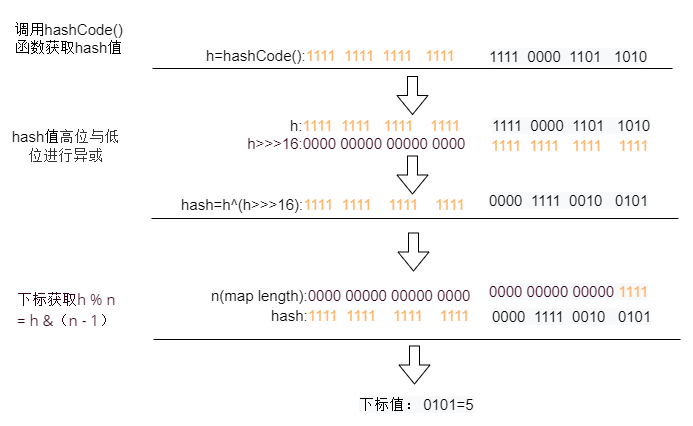
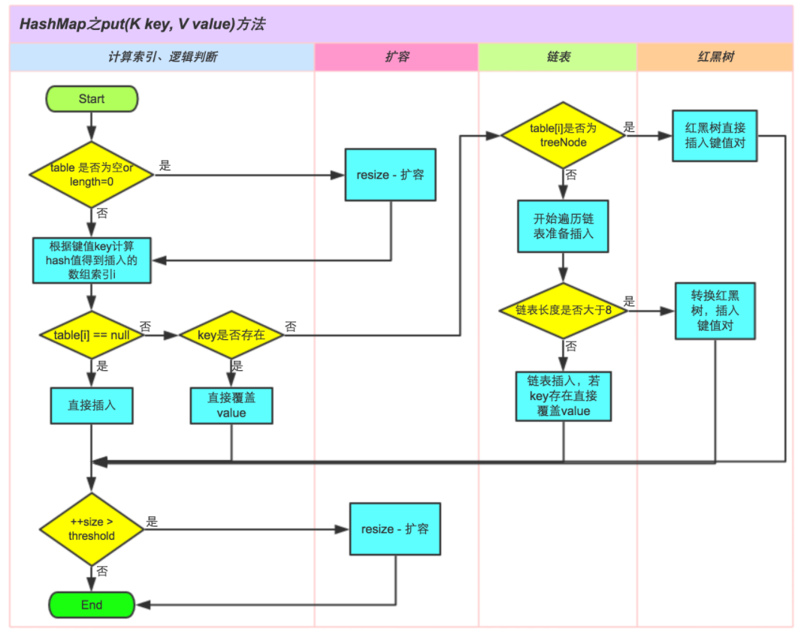

## Java 容器有哪些？ 哪些是同步容器？ 哪些是并发容器？

https://juejin.cn/post/6844903954719965192

Java 容器主要分两种：Collection 和 Map，Collection 是用于存储对象的集合，Map是用于存储键值对的集合。 其中Collection又可以分为List 和 Set两种集合。

实现List接口的集合主要有：ArrayList，Vector（Stack），LinkedList

实现Set接口的集合主要有：HashSet，TreeSet，LinkedSet

实现map接口的集合主要有：HashMap，LinkedHashMap，TreeMap，HashTable

**同步容器** 

其中属于 **同步容器** 的有：Vector，Stack，HashTable，另外Collections提供了一下几种方法可以将非同步容器转化为同步容器

List list = Collections.synchronizedList(new ArrayList());

Set set = Collections.synchronizedSet(new HashSet());

Map map = Collections.synchronizedMap(new HashMap());

**并发容器**

1.CopyOnWriteArrayList

2.CopyOnWriteArraySet

3.ConcurrentHashMap

4.ConcurrentSkipListMap

5.ConcurrentSkipListSet

## 集合框架有哪些优点

- 使用核心集合类降低开发成本，而非实现我们自己的集合类。
- 随着使用经过严格测试的集合框架类，代码质量会得到提高。
- 通过使用 JDK 附带的集合类，可以降低代码维护成本。
- 复用性和可操作性。

## Java集合类框架的基本接口有哪些？

Java 集合类提供了一套设计良好的支持对一组对象进行操作的接口和类。Java集合类里面最基本的接口有：

- Collection：代表一组对象，每一个对象都是它的子元素。
- Set：不包含重复元素的 Collection。
- List：有顺序的 collection，并且可以包含重复元素。
- Map：可以把键(key)映射到值(value)的对象，键不能重复。
- 还有其它接口 Queue、Dequeue、SortedSet、SortedMap 和 ListIterator。

## 为什么集合类没有实现 Cloneable 和 Serializable 接口？

克隆（cloning）或者序列化（serialization）的语义和含义是跟具体的实现相关的。因此应该由集合类的具体实现类来决定如何被克隆或者序列化

### 1.4 集合框架中的泛型有什么优点？

Java5 引入了泛型，所有的集合接口和实现都大量地使用它。泛型允许我们为集合提供一个可以容纳的对象类型。因此，如果你添加其它类型的任何元素，它会在编译时报错。这避免了在运行时出现 ClassCastException，因为你将会在编译时得到报错信息。

泛型也使得代码整洁，我们不需要使用显式转换和 instanceOf 操作符。它也给运行时带来好处，因为不会产生类型检查的字节码指令。

- 编译时类型检查
- 使代码整洁
- 运行时不会产生类型检查相关的字节码指令

## Collection 和 Collections 的区别？

- Collection ，是集合类的上级接口，继承与他的接口主要有 Set 和List 。
- Collections ，是针对集合类的一个工具类，它提供一系列静态方法实现对各种集合的搜索、排序、线程安全化等操作。

## 什么是迭代器(Iterator)？

Iterator 接口提供了很多对集合元素进行迭代的方法。每一个集合类都包含了可以返回迭代器实例的 迭代方法。迭代器可以在迭代的过程中删除底层集合的元素。

克隆(cloning)或者是序列化(serialization)的语义和含义是跟具体的实现相关的。因此，应该由集合类的具体实现来决定如何被克隆或者是序列化。

### Iterator和ListIterator的区别是什么？

下面列出了他们的区别：

- Iterator 可用来遍历 Set 和 List 集合，但是 ListIterator 只能用来遍历 List 。
- Iterator 对集合只能是前向遍历，ListIterator 既可以前向也可以后向。
- ListIterator 实现了 Iterator 接口，并包含其他的功能，比如：增加元素，替换元素，获取前一个和后一个元素的索引，等等。

## fail-fast

fail-fast 机制是java集合(Collection)中的一种错误机制。当多个线程对同一个集合的内容进行操作时，就可能会产生fail-fast事件。例如：当某一个线程A通过iterator去遍历某集合的过程中，若该集合的内容被其他线程所改变了；那么线程A访问集合时，就会抛出ConcurrentModificationException异常，产生fail-fast事件。

**快速失败（fail—fast）**
在用迭代器遍历一个集合对象时，如果遍历过程中对集合对象的内容进行了修改（增加、删除、修改），则会抛出Concurrent Modification Exception。

**原理：**迭代器在遍历时直接访问集合中的内容，并且在遍历过程中使用一个 modCount 变量。集合在被遍历期间如果内容发生变化，就会改变modCount的值。每当迭代器使用hashNext()/next()遍历下一个元素之前，都会检测modCount变量是否为expectedmodCount值，是的话就返回遍历；否则抛出异常，终止遍历。
注意：这里异常的抛出条件是检测到 modCount！=expectedmodCount 这个条件。如果集合发生变化时修改modCount值刚好又设置为了expectedmodCount值，则异常不会抛出。因此，不能依赖于这个异常是否抛出而进行并发操作的编程，这个异常只建议用于检测并发修改的bug。
场景：java.util包下的集合类都是快速失败的，不能在多线程下发生并发修改（迭代过程中被修改）。

**安全失败（fail—safe）**
采用安全失败机制的集合容器，在遍历时不是直接在集合内容上访问的，而是先复制原有集合内容，在拷贝的集合上进行遍历。

**原理：**由于迭代时是对原集合的拷贝进行遍历，所以在遍历过程中对原集合所作的修改并不能被迭代器检测到，所以不会触发Concurrent Modification Exception。

缺点：基于拷贝内容的优点是避免了Concurrent Modification Exception，但同样地，迭代器并不能访问到修改后的内容，即：迭代器遍历的是开始遍历那一刻拿到的集合拷贝，在遍历期间原集合发生的修改迭代器是不知道的。

场景：java.util.concurrent包下的容器都是安全失败，可以在多线程下并发使用，并发修改。

https://blog.csdn.net/Kato_op/article/details/80356618

## 快速失败(fail-fast)和安全失败(fail-safe)的区别是什么？

Iterator 的安全失败是基于对底层集合做拷贝，因此，它不受源集合上修改的影响。

java.util 包下面的所有的集合类都是快速失败的，而 java.util.concurrent 包下面的所有的类都是安全失败的。快速失败的迭代器会抛出 ConcurrentModificationException 异常，而安全失败的迭代器永远不会抛出这样的异常。

## Enumeration 接口和 Iterator 接口的区别有哪些？

Enumeration 速度是 Iterator 的2倍，同时占用更少的内存。但是，Iterator 远远比 Enumeration 安全，因为其他线程不能够修改正在被 iterator 遍历的集合里面的对象。同时，Iterator 允许调用者删除底层集合里面的元素，这对 Enumeration 来说是不可能的。

## comparable 和 Comparator 的区别

- `comparable` 接口实际上是出自`java.lang`包 它有一个 `compareTo(Object obj)`方法用来排序
- `comparator`接口实际上是出自 java.util 包它有一个`compare(Object obj1, Object obj2)`方法用来排序

一般我们需要对一个集合使用自定义排序时，我们就要重写`compareTo()`方法或`compare()`方法，当我们需要对某一个集合实现两种排序方式，比如一个 song 对象中的歌名和歌手名分别采用一种排序方法的话，我们可以重写`compareTo()`方法和使用自制的`Comparator`方法或者以两个 Comparator 来实现歌名排序和歌星名排序，第二种代表我们只能使用两个参数版的 `Collections.sort()`.

```java
ArrayList<Integer> arrayList = new ArrayList<Integer>();
arrayList.add(-1);
arrayList.add(3);
arrayList.add(3);
arrayList.add(-5);
arrayList.add(7);
arrayList.add(4);
arrayList.add(-9);
arrayList.add(-7);
System.out.println("原始数组:");
System.out.println(arrayList);
// void reverse(List list)：反转
Collections.reverse(arrayList);
System.out.println("Collections.reverse(arrayList):");
System.out.println(arrayList);

// void sort(List list),按自然排序的升序排序
Collections.sort(arrayList);
System.out.println("Collections.sort(arrayList):");
System.out.println(arrayList);
// 定制排序的用法
Collections.sort(arrayList, new Comparator<Integer>() {

    @Override
    public int compare(Integer o1, Integer o2) {
        return o2.compareTo(o1);
    }
});
System.out.println("定制排序后：");
System.out.println(arrayList);

OutPut :

原始数组:
[-1, 3, 3, -5, 7, 4, -9, -7]
Collections.reverse(arrayList):
[-7, -9, 4, 7, -5, 3, 3, -1]
Collections.sort(arrayList):
[-9, -7, -5, -1, 3, 3, 4, 7]
定制排序后：
[7, 4, 3, 3, -1, -5, -7, -9]
    
    
// person对象没有实现Comparable接口，所以必须实现，这样才不会出错，才可以使treemap中的数据按顺序排列
// 前面一个例子的String类已经默认实现了Comparable接口，详细可以查看String类的API文档，另外其他
// 像Integer类等都已经实现了Comparable接口，所以不需要另外实现了
public  class Person implements Comparable<Person> {
    private String name;
    private int age;

    public Person(String name, int age) {
        super();
        this.name = name;
        this.age = age;
    }

    public String getName() {
        return name;
    }

    public void setName(String name) {
        this.name = name;
    }

    public int getAge() {
        return age;
    }

    public void setAge(int age) {
        this.age = age;
    }

    /**
     * T重写compareTo方法实现按年龄来排序
     */
    @Override
    public int compareTo(Person o) {
        if (this.age > o.getAge()) {
            return 1;
        }
        if (this.age < o.getAge()) {
            return -1;
        }
        return 0;
    }
}

    public static void main(String[] args) {
        TreeMap<Person, String> pdata = new TreeMap<Person, String>();
        pdata.put(new Person("张三", 30), "zhangsan");
        pdata.put(new Person("李四", 20), "lisi");
        pdata.put(new Person("王五", 10), "wangwu");
        pdata.put(new Person("小红", 5), "xiaohong");
        // 得到key的值的同时得到key所对应的值
        Set<Person> keys = pdata.keySet();
        for (Person key : keys) {
            System.out.println(key.getAge() + "-" + key.getName());

        }
    }

OutPut :

5-小红
10-王五
20-李四
30-张三
```

## Set

Set接口继承了Collection接口。Set集合中不能包含重复的元素，每个元素必须是唯一的。你只需将元素加入set中，重复的元素会自动移除。有三种常见的Set实现——HashSet, TreeSet和LinkedHashSet。如果你需要一个访问快速的Set，你应该使用HashSet；当你需要一个排序的Set，你应该使用TreeSet；当你需要记录下插入时的顺序时，你应该使用LinedHashSet。

### HashSet

HashSet是是基于 HashMap 实现的，底层采用 HashMap 来保存元素,所以它不保证set 的迭代顺序；特别是它不保证该顺序恒久不变。add()、remove()以及contains()等方法都是复杂度为O(1)的方法。由于HashMap中key不可重复，所以HashSet元素不可重复。可以存储null元素，是线程不安全的。

### TreeSet

TreeSet是一个有序集，基于TreeMap实现，是线程不安全的。

TreeSet底层采用TreeMap存储，构造器启动时新建TreeMap。TreeSet存储元素实际为TreeMap存储的键值对为<key,PRESENT>的key;，PRESENT为固定对象：private static final Object PRESENT = new Object().

TreeSet支持两种两种排序方式，通过不同构造器调用实现。

### LinkedHashSet

LinkedHashSet介于HashSet和TreeSet之间。哈希表和链接列表实现。基本方法的复杂度为O(1)。

LinkedHashSet 是 Set 的一个具体实现，其维护着一个运行于所有条目的双重链接列表。此链接列表定义了迭代顺序，该迭代顺序可为插入顺序或是访问顺序。

LinkedHashSet 继承于 HashSet，并且其内部是通过 LinkedHashMap 来实现的。有点类似于我们之前说的LinkedHashMap 其内部是基于 Hashmap 实现的一样。

如果我们需要迭代的顺序为插入顺序或者访问顺序，那么 LinkedHashSet 是需要你首先考虑的。

LinkedHashSet 底层使用 LinkedHashMap 来保存所有元素，因为继承于 HashSet，所有的方法操作上又与 HashSet 相同，因此 LinkedHashSet 的实现上非常简单，只提供了四个构造方法，并通过传递一个标识参数，调用父类的构造器，底层构造一个 LinkedHashMap 来实现，在相关操作上与父类 HashSet 的操作相同，直接调用父类 HashSet 的方法即可。

### 无序性和不可重复性的含义是什么

1、什么是无序性？无序性不等于随机性 ，无序性是指存储的数据在底层数组中并非按照数组索引的顺序添加 ，而是根据数据的哈希值决定的。
2、什么是不可重复性？不可重复性是指添加的元素按照 equals()判断时 ，返回 false，需要同时重写 equals()方法和 HashCode()方法。

### 比较 HashSet、LinkedHashSet 和 TreeSet 三者的异同

HashSet 是 Set 接口的主要实现类 ，HashSet 的底层是 HashMap，线程不安全的，可以存储 null 值；

LinkedHashSet 是 HashSet 的子类，能够按照添加的顺序遍历；

TreeSet 底层使用红黑树，能够按照添加元素的顺序进行遍历，排序的方式有自然排序和定制排序。

### Set中的元素不能重复，如何实现？

HashSet实现了Set接口底层基于HashMap来实现，在将一个key-value对放入HashMap中时，首先根据key的hashCode()返回值决定该Entry的存储位置，如果两个key的hash值相同，那么它们的存储位置相同。如果这个两个key的equals比较返回true。那么新添加的Entry的value会覆盖原来的Entry的value，key不会覆盖。且HashSet中add()中 map.put(e, PRESENT)==null 为false，HashSet添加元素失败。因此,如果向HashSet中添加一个已经存在的元素，新添加的集合元素不会覆盖原来已有的集合元素。

### HashSet 和 TreeSet 有什么区别？

HashSet 是由一个 hash 表来实现的，因此，它的元素是无序的。add()，remove()，contains()方法的时间复杂度是 O(1)。

另一方面，TreeSet 是由一个树形的结构来实现的，它里面的元素是有序的。因此，add()，remove()，contains() 方法的时间复杂度是 O(logn)。

## List

### Vector

`Vector`，一个可变长的数组，底层实现与 ArrayList 大同小异，但`Vector`是同步的（线程安全），`Vector`的很多方法之前都加了关键字`synchronized`，所以是线程安全的。

初始容量为10， 默认扩展2倍

```java
int newCapacity = oldCapacity + ((capacityIncrement > 0) ?
                                  capacityIncrement : oldCapacity);
```

### LinkedList

LinkedList是一个实现了List接口和Deque接口的双端链表。 LinkedList底层的链表结构使它支持高效的插入和删除操作，另外它实现了Deque接口，使得LinkedList类也具有队列的特性;允许包含null值。 LinkedList不是线程安全的，如果想使LinkedList变成线程安全的，可以调用静态类Collections类中的synchronizedList方法：

List list=Collections.synchronizedList(new LinkedList(...));

LinkedList是一种可以在任何位置进行高效地插入和移除操作的有序序列，它是基于双向链表实现的。内部有三个变量，size表示链表中元素的个数， first指向链表头部，last指向链表尾部。

### ArrayList

**默认初始容量为0（无参构造，懒初始化，首次初始化10）， 扩容时，扩容大小为之前的1.5倍**

ArrayList 是 List 接口的可变数组的实现。底层使用 Object[] 来存储对象。同时是线程不安全的集合。

每个ArrayList实例都有一个容量，该容量是指用来存储列表元素的数组的大小。随着向ArrayList中不断添加元素，其容量也自动增长。自动增长会带来数据向新数组的重新拷贝，因此，如果可预知数据量的大小，就可在构造ArrayList实例时指定其容量。

在添加大量元素前，应用程序也可以使用ensureCapacity操作来增加ArrayList实例的容量，这可以减少递增式再分配的数量。

- 继承自 AbstractList，这是一个抽象类对一些基础的list操作做了一些封装。

- 实现了RandomAccess 标记接口，表明可以实现快速随机访问。

- 实现了Cloneable接口的实现表示该容器具有Clone函数操作，Serializable是序列化。

#### RandomAccess 接口的作用

**`ArrayList` **实现了** `RandomAccess` **接口，就表明了他具有快速随机访问功能。** `RandomAccess` **接口只是标识，并不是说** `ArrayList` **实现** `RandomAccess`  接口才具有快速随机访问功能的！

#### 为什么ArrayList自动容量扩充选择扩充1.5倍？

这种算法构造出来的新的数组长度的增量都会比上一次大( 而且是越来越大) ，避免频繁newInstance 的情况。

#### 为什么ArrayList 不适合频繁插入和删除操作？

ArrayList中经常会调用 System.arraycopy 这个效率很低的操作来复制数组，所以导致ArrayList在插入和删除操作中效率不高。

#### jdk1.6中扩容算法的缺陷

（由于jdk1.7和jdk1.8在扩容算法方面差别不大，所以下面没有严格区分）

```java
jdk1.6
public void ensureCapacity(int minCapacity) {  
    modCount++;  
    int oldCapacity = elementData.length;  
    if (minCapacity > oldCapacity) {  
        Object oldData[] = elementData;  
        int newCapacity = (oldCapacity * 3)/2 + 1;  
        if (newCapacity < minCapacity)  
            newCapacity = minCapacity;  
        // minCapacity is usually close to size, so this is a win:  
        elementData = Arrays.copyOf(elementData, newCapacity);  
    }  
}
```

从上面的代码可以看出jdk1.6的ensureCapacity方法只是简单进行了逻辑上的操作，没有过多考虑int型溢出的问题，从1.7开始对这个进行了完善。

而且没考虑入参minCapacity可能因为int溢出变为负数。这个方法可以外部手动调用，手动扩容传入负数这个肯定是应该拦截掉的。但是自动扩容会因为int溢出产生负数，碰到这种情况时应该特殊处理，而不是什么都不做，等着后面抛出一个ArrayIndexOutOfBoundsException。

还有就是下面这句代码会造成过早溢出

```java
int newCapacity = (oldCapacity * 3)/2 + 1;
```

虽然上面这行代码和1.7开始的oldCapacity + (oldCapacity >> 1) 差不多，都是相当于1.5倍，但实际上是有区别的。

**这里主要有两个区别**

**第一个区别**是jdk1.6的乘除运算的数学结果比后面一个大1比如oldCapacity=10，1.6的算法得到16，1.7开始的算法得到15，这个影响不大；

**第二个区别**就是两者在数字比较大时运算结果不一样，比如oldCapacity=10^9，这个数和Integer.MAX_VALUE位数一样，用1.6的算法得到的会是错误的-647483647，用1.7的则是正确的1500000000，这时候明明可以1.5倍扩容，但是jdk1.6却用的是按需扩容。

ensureCapacity（称之为手动，是因为此方法是public的，可以外部手动调用）。在1.6版本是只有这个手动的方法，内部自动操作也是调用这个方法，1.7开始进行了区分，并且进一步改进了扩容操作。

- 从1.7开始将内部扩容和外部可以调用的扩容方法分开了，通过源码可以看出：外部调用的手动扩容方法ensureCapacity要多一个判断条件 minCapacity >  minExpand，这个判断条件拦截掉负数的minCapacity，这样调用内部扩容ensureCapacityInternal方法时，minCapacity一定是正数；内部扩容方法直接就用minCapacity - elementData.length > 0判断，此条件可以检测出int型溢出，碰到溢出最后会抛出一个OOM错误。jdk1.7用OOM，这比jdk1.6用ArrayIndexOutOfBoundsException更好，因为此时数组大小超出了虚拟机对数组的限制，虚拟机无法处理这种情况了，抛出一个ERROR是合理的。

- 使用这行代码

```java
newCapacity = oldCapacity + (oldCapacity >> 1);
```

这行代码不仅仅是使用位运算加快执行速度，上面说了，这种做法才是对的，是真正的1.5倍。不仅仅因为那一个大小的差别，更重要的是避免过早出现int溢出的情况，保证了内部自动扩容会尽量按规定的策略执行。同时整个扩容处理流程中多增加了几处if判断，对各种情况处理更加完善。

#### Integer.MAX_VALUE - 8  这里为什么要减去8？

主要是考虑到不同的JVM,有的VM会在加入一些数据头,当扩容后的容量大于MAX_ARRAY_SIZE,我们会将最小需要容量和MAX_ARRAY_SIZE做比较,如果比它大, 只能取Integer.MAX_VALUE,否则是Integer.MAX_VALUE -8。**这个是从jdk1.7开始才有的**

#### modCount属性的作用？

`modCount`属性代表为结构性修改（ 改变list的size大小、以其他方式改变他导致正在进行迭代时出现错误的结果）的次数，该属性被`Iterato`r以及`ListIterator`的实现类所使用，且很多非线程安全使用`modCount`属性。

 初始化迭代器时会给这个modCount赋值，如果在遍历的过程中，一旦发现这个对象的modCount和迭代器存储的modCount不一样，`Iterator`或者`ListIterator` 将抛出`ConcurrentModificationException`异常，

这是jdk在面对迭代遍历的时候为了避免不确定性而采取的 fail-fast（快速失败）原则：

在线程不安全的集合中，如果使用迭代器的过程中，发现集合被修改，会抛出`ConcurrentModificationExceptions`错误，这就是fail-fast机制。对集合进行结构性修改时，`modCount`都会增加，在初始化迭代器时，`modCount`的值会赋给`expectedModCount`，在迭代的过程中，只要`modCount`改变了，`int expectedModCount = modCount`等式就不成立了，迭代器检测到这一点，就会抛出错误：`urrentModificationExceptions`。

#### jdk1.8的无参构造函数和之前版本的构造函数有什么区别?


```java
jdk1.6
public ArrayList() {    
    this(10);    
} 
jdk1.7
public ArrayList() {    
    super();    
    this.elementData = EMPTY_ELEMENTDATA;    
}
jdk1.8
public ArrayList() {    
    this.elementData = DEFAULTCAPACITY_EMPTY_ELEMENTDATA;    
}
```

对比下可以看出：jdk1.6的无参构造方法（默认构造方法）构造的ArrayList的底层数组elementData大小（容量）默认为10；从1.7开始，无参构造方法构造的ArrayList的底层数组elementData大小默认为0。

java集合类在jdk1.7版本基本上都有一种改动：懒初始化。懒初始化指的是默认构造方法构造的集合类，占据尽可能少的内存空间（对于ArrayList来说，使用空数组来占据尽量少的空间，不使用null是为了避免null判断），在第一次进行包含有添加语义的操作时，才进行真正的**初始化**工作。

1.7开始的ArrayList，默认构造方法构造的实例，底层数组是空数组，容量为0，在进行第一次add/addAll等操作时才会真正给底层数组赋非empty的值。如果add/addAll添加的元素小于10，则把elementData数组扩容为10个元素大小，否则使用刚好合适的大小（例如，第一次addAll添加6个，那么扩容为10个，第一次添加大于10个的，比如24个，扩容为24个，刚好合适）

1.8版本，默认构造的实例这个行为没有改变，只是用的数组名字变了。

### ArrayList 和 LinkedList 的插入和访问的时间复杂度

ArrayList 底层是基于 Object[] 来进行数据存储的，针对数据的插入和删除需要进行数据的移动因此时间复杂度大致为O（n），数据支持按照下标进行随机访问，因此访问时间复杂度为O（1）

LinkedList 底层是基于双向链表来进行数据存储的，针对数据的插入和删除只需要替换响应的指针即可，因此插入的时间复杂度为O（1），由于链表结构不支持随机访问查找元素只能进行遍历，因此访问时间复杂度为O（n）

### ArrayList和LinkedList的区别、优缺点以及应用场景

**区别：**

- `ArrayList`是实现了基于动态数组的数据结构，`LinkedList`是基于链表结构。
- 对于随机访问的`get`和`set`方法查询元素，`ArrayList`要优于`LinkedList`，因为`LinkedList`循环链表寻找元素。
- 对于新增和删除操作`add`和`remove`，`LinkedList`比较高效，因为`ArrayList`要移动数据。

**优缺点：**

- 对`ArrayList`和`LinkedList`而言，在末尾增加一个元素所花的开销都是固定的。对`ArrayList`而言，主要是在内部数组中增加一项，指向所添加的元素，偶尔可能会导致对数组重新进行分配；而对`LinkedList`而言，这个开销是 统一的，分配一个内部`Entry`对象。
- 在`ArrayList`集合中添加或者删除一个元素时，当前的列表移动元素后面所有的元素都会被移动。而`LinkedList`集合中添加或者删除一个元素的开销是固定的。
- `LinkedList`集合不支持 高效的随机随机访问（`RandomAccess`），因为可能产生二次项的行为。
- `ArrayList`的空间浪费主要体现在在list列表的结尾预留一定的容量空间，而`LinkedList`的空间花费则体现在它的每一个元素都需要消耗相当的空间

**应用场景:**

`ArrayList`使用在查询比较多，但是插入和删除比较少的情况，而`LinkedList`用在查询比较少而插入删除比较多的情况

### Vector和ArrayList

**相同点：**这两个类都实现了List接口，他们都是有序的集合（储存有序），底层都用数组实现。可以通过索引来获取某个元素。允许元素重复和出现null值。ArrayList和Vector的迭代器实现都是fail-fast的。

**不同点：**vector是线程同步的，所以它也是线程安全的，而arraylist是线程异步的，是不安全的。如果不考虑到线程的安全因素，一般用arraylist效率比较高。

扩容时，arraylist扩容1.5倍，vector扩容2倍（或者扩容指定的大小）

ArrayList 和Vector是采用数组方式存储数据，此数组元素数大于实际存储的数据以便增加和插入元素，都允许直接序号索引元素，但是插入数据要设计到数组元素移动等内存操作，所以索引数据快插入数据慢，Vector由于使用了synchronized方法（线程安全）所以性能上比ArrayList要差，LinkedList使用双向链表实现存储，按序号索引数据需要进行向前或向后遍历，但是插入数据时只需要记录本项的前后项即可，所以插入数度较快！

### Iterater和ListIterator之间有什么区别？

我们可以使用Iterator来遍历Set和List集合，而ListIterator只能遍历List。Iterator只可以向前遍历，而LIstIterator可以双向遍历。ListIterator从Iterator接口继承，然后添加了一些额外的功能，比如添加一个元素、替换一个元素、获取前面或后面元素的索引位置。

## Map

### LinkedHashMap

LinkedHashMap 继承自 HashMap，在 HashMap 基础上，通过维护一条双向链表，解决了 HashMap 不能随时保持遍历顺序和插入顺序一致的问题。除此之外，LinkedHashMap 对访问顺序也提供了相关支持。在一些场景下，该特性很有用，比如缓存。在实现上，LinkedHashMap 很多方法直接继承自 HashMap，仅为维护双向链表覆写了部分方法。

LinkedHashMap继承了HashMap，内部静态类Entry继承了HashMap的Entry，但是LinkedHashMap.Entry多了两个字段：before和after，before表示在本节点之前添加到LinkedHashMap的那个节点，after表示在本节点之后添加到LinkedHashMap的那个节点，这里的之前和之后指时间上的先后顺序。

默认情况下，LinkedHashMap的迭代顺序是按照插入节点的顺序。也可以通过改变accessOrder参数的值，使得其遍历顺序按照访问顺序输出。

#### 添加

LinkedHashMap在添加元素的时候，依旧使用的是HashMap中的put方法。不同的是LinkedHashMap重写了newNode()方法在每次构建新节点时，通过linkNodeLast(p);将新节点链接在内部双向链表的尾部。

#### 查找

LinkedHashMap重写了get()和getOrDefault()方法默认情况下，LinkedHashMap是按插入顺序维护链表。不过如果我们在初始化 LinkedHashMap时，指定 accessOrder参数为 true，即可让它按访问顺序维护链表。访问顺序的原理是，当我们调用get/getOrDefault/replace等方法时，会将这些方法访问的节点移动到链表的尾部。

https://github.com/Ccww-lx/JavaCommunity/blob/master/doc/javabase/collection/LinkedHashMap%20%E6%BA%90%E7%A0%81%E8%AF%A6%E7%BB%86%E5%88%86%E6%9E%90.md

https://gyl-coder.top/java/collection/LinkedHashMap/

### TreeMap

TreeMap最早出现在JDK 1.2中，是 Java 集合框架中比较重要一个的实现。TreeMap 底层基于红黑树实现，可保证在log(n)时间复杂度内完成 containsKey、get、put 和 remove 操作，效率很高。另一方面，由于 TreeMap 基于红黑树实现，这为 TreeMap 保持键的有序性打下了基础。总的来说，TreeMap 的核心是红黑树，其很多方法也是对红黑树增删查基础操作的一个包装。

https://github.com/Ccww-lx/JavaCommunity/blob/master/doc/javabase/collection/TreeMap%E6%BA%90%E7%A0%81%E5%88%86%E6%9E%90.md

### HashMap

`HashMap` 是 `Map` 的一个实现类，它代表的是一种键值对的数据存储形式。大多数情况下可以直接定位到它的值，因而具有很快的访问速度，但遍历顺序却是不确定的。

`jdk 8` 之前，其内部是由 **数组 + 链表** 来实现的，而 `jdk 8` 对于链表长度超过 8 的链表将转储为 红黑树。JDK 1.8 之所以添加红黑树是因为一旦链表过长，会严重影响 HashMap 的性能，而红黑树具有快速增删改查的特点，这样就可以有效的解决链表过长时操作比较慢的问题。

`HashMap`最多只允许一条记录的键为`null`（null key 哈希值为0），允许多条记录的值为`null`。不保证有序 (比如插入的顺序)、也不保证序不随时间变化。

`HashMap`非线程安全，即任一时刻可以有多个线程同时写`HashMap`，可能会导致数据的不一致。如果需要满足线程安全，可以用 `Collections`的`synchronizedMap`方法使`HashMap`具有线程安全的能力，或者使用`ConcurrentHashMap`，HashTable。

#### HashMap的hash哈希函数的设计原理，以及HashMap下标获取方式？

``` java
static final int hash(Object key) {
  int h;
  return (key == null) ? 0 : (h = key.hashCode()) ^ (h >>> 16);
}

// indexFor 是 jdk1.7 的源码，jdk1.8 没有这个方法但是 jdk1.8 也是通过取模运算来计算的
static int indexFor(int h, int length) { 
   return h & (length-1); 
}
```



1. 首先获取hashcode，一个32位的int值
2. 然后将hashcode左移16位的值进行与或，即将高位与低位进行异或运算，减少碰撞机率。
3. 将计算得到的hash值与hashmap容量-1，进行取余运算，但在计算机运算中&肯定比%快，又因为h % n = h &（n - 1），所以最终将第二步得到的hash跟n-1进行与运算。n是table中的长度。

> 对于任意给定的对象，只要它的`hashCode()`返回值相同，那么程序调用方法一所计算得到的`Hash`码值总是相同的。我们首先想到的就是把`hash`值对数组长度取模运算，这样一来，元素的分布相对来说是比较均匀的。但是，模运算的消耗还是比较大的，这里我们用 `&` 位运算来优化效率。
>
> 这个方法非常巧妙，它通过`h & (table.length -1)`来得到该对象的保存位，而`HashMap`底层数组的长度总是 ***\*2 的 n 次方\****，这是`HashMap`在速度上的优化。当 length 总是 2 的 n 次方时，`h& (length-1)`运算等价于对 length 取模，也就是`h%length`，但是 ***\*&\**** 比 ***\*%\**** 具有更高的效率。
>
> 在`JDK1.8`的实现中，优化了高位运算的算法，通过`hashCode()`的高 16 位异或低 16 位实现的：(h = k.hashCode()) ^ (h >>> 16)，主要是从速度、功效、质量来考虑的，这么做可以 Node 数组 table 的 length 比较小的时候，也能保证考虑到高低 Bit 都参与到 Hash 的计算中，同时不会有太大的开销。

**设计原因：**

1. 一定要尽可能降低hash碰撞，越分散越好；
2. 算法一定要尽可能高效，因为这是高频操作, 因此采用位运算；

#### HashMap 在什么情况下回进行扩容？或者有哪些操作会导致扩容？

1. 在执行 HashMap 的构造函数或者 putAll() 方法时如果待添加的 map.size() 大于阈值时进行扩容
2. 因为hashmap使用的是懒初始化，首次添加元素的时候会进行resize()
3. 当put加入节点后，发现size（键值对数量）>threshold时，进行扩容

> JDK1.7的时候是先进行扩容后进行插入，而在JDK1.8的时候则是先插入后进行扩容
>
> 先扩容再put就是不管当前插入的值所属的桶是不是空，都先扩容，会造成无效扩容；先put在扩容，会在put时发现是否当前桶为空，即是否发生hash冲突，如果发生了就扩容，不发生就等下一次插入冲突或大于阀值时扩容

#### Java中HashMap的key值要是为类对象则该类需要满足什么条件？

需要同时重写该类的hashCode()方法和它的equals()方法。

从源码可以得知，在插入元素的时候是先算出该对象的hashCode。如果hashcode相等话的。那么表明该对象是存储在同一个位置上的。如果调用equals()方法，两个key相同，则替换元素如果调用equals()方法，两个key不相同，则说明该hashCode仅仅是碰巧相同，此时是散列冲突，将新增的元素放在桶子上

重写了equals()方法，就要重写hashCode()的方法。因为equals()认定了这两个对象相同，而同一个对象调用hashCode()方法时，是应该返回相同的值的！

#### HashMap get 方法的执行过程

**jdk 1.8**

对输入的key的值计算hash值,

首先判断hashmap中的数组是否为空和数组的长度是否为0,如果为空和为0,则直接放回null

如果不为空和0,计算key对应的数组下标,判断对应位置上的第一个node是否满足条件,如果满足条件,直接返回

如果不满足条件,判断当前node是否是最后一个,如果是,说明不存在key,则返回null

如果不是最后一个,判断是否是红黑树,如果是红黑树,则使用红黑树的方式获取对应的key,

如果不是红黑树,遍历链表是否有满足条件的,如果有,直接放回,否则返回null

#### HashMap put 方法的执行过程



①.判断键值对数组 table 是否为空或为null，否则执行resize()进行扩容； 

②.根据键值key计算hash值得到插入的数组索引 i，如果table[i]==null，直接新建节点添加，转向⑥，如果table[i]不为空，转向③；

 ③.判断 table[i] 的首个元素是否和key一样，如果相同直接覆盖value，否则转向④，这里的相同指的是hashCode以及equals； 

④.判断table[i] 是否为treeNode，即table[i] 是否是红黑树，如果是红黑树，则直接在树中插入键值对，否则转向⑤； 

⑤.遍历table[i]，判断链表长度是否大于8，大于8的话把链表转换为红黑树，在红黑树中执行插入操作，否则进行链表的插入操作；遍历过程中若发现key已经存在直接覆盖value即可； 

⑥.插入成功后，判断实际存在的键值对数量size是否超多了最大容量threshold，如果超过，进行扩容。

```java
public V put(K key, V value) {
    // 对key的hashCode()做hash
    return putVal(hash(key), key, value, false, true);
}

final V putVal(int hash, K key, V value, boolean onlyIfAbsent,
               boolean evict) {
    Node<K,V>[] tab; Node<K,V> p; int n, i;
    // 步骤①：tab为空则创建
    if ((tab = table) == null || (n = tab.length) == 0)
        n = (tab = resize()).length;
    // 步骤②：计算index，并对null做处理 
    if ((p = tab[i = (n - 1) & hash]) == null) 
        tab[i] = newNode(hash, key, value, null);
    else {
        Node<K,V> e; K k;
        // 步骤③：节点key存在，直接覆盖value
        if (p.hash == hash &&
            ((k = p.key) == key || (key != null && key.equals(k))))
            e = p;
        // 步骤④：判断该链为红黑树
        else if (p instanceof TreeNode)
            e = ((TreeNode<K,V>)p).putTreeVal(this, tab, hash, key, value);
        // 步骤⑤：该链为链表
        else {
            for (int binCount = 0; ; ++binCount) {
                if ((e = p.next) == null) {
                    p.next = newNode(hash, key,value,null);
                     //链表长度大于8转换为红黑树进行处理
                    if (binCount >= TREEIFY_THRESHOLD - 1) // -1 for 1st  
                        treeifyBin(tab, hash);
                    break;
                }
                 // key已经存在直接覆盖value
                if (e.hash == hash &&
                    ((k = e.key) == key || (key != null && key.equals(k)))) 
                         break;
                p = e;
            }
        }
        
        if (e != null) { // existing mapping for key
            V oldValue = e.value;
            if (!onlyIfAbsent || oldValue == null)
                e.value = value;
            afterNodeAccess(e);
            return oldValue;
        }
    }

    ++modCount;
    // 步骤⑥：超过最大容量 就扩容
    if (++size > threshold)
        resize();
    afterNodeInsertion(evict);
    return null;
}
```

jdk 1.7  put()方法

- 调用put方法的时候首先判断hashmap数组是否为空数组,
- 如果为空,进行初始化,判断key的值是否是null,
- 如果是null,把对应的value值存进数组中下标为0的位置,
- 计算key的hash值,并计算出下标,
- 遍历下标对应的链表,匹配hash值和key的值,
- 如果存在,则覆盖,返回旧值
- 如果不存在,新添加一个,返回null
- 如果扩容,是先扩容之后再把数据添加进新扩容的数组中
  如果数组中元素的容量超过阈值,会触发扩容,
  扩容是先把源数组放进一个临时数组中,获取老数组的长度,通过老数组长度乘2获取新数组长度,并创建新数组,
  把临时数组中的数据通过重新计算下表,存进扩容后的数组中.

#### HashMap检测到hash冲突之后将元素插入到链表的头部还是尾部？

hashmap 执行尾插法（直接插入链表或红黑树尾部）

> 尾插法不会出现逆序，环形列表，死循环等问题

#### HashMap红黑树的阈值为什么是8？

首先和hashcode碰撞次数的泊松分布有关，主要是为了寻找一种时间和空间的平衡。在负载因子0.75（HashMap默认）的情况下，单个hash槽内元素个数为8的概率小于百万分之一，将7作为一个分水岭，等于7时不做转换，大于等于8才转红黑树，小于等于6才转链表。链表中元素个数为8时的概率已经非常小，再多的就更少了，所以原作者在选择链表元素个数时选择了8，是根据概率统计而选择的。

红黑树中的TreeNode是链表中的Node所占空间的2倍，虽然红黑树的查找效率为o(logN)，要优于链表的o(N)，但是当链表长度比较小的时候，即使全部遍历，时间复杂度也不会太高。所以，要寻找一种时间和空间的平衡，即在链表长度达到一个阈值之后再转换为红黑树。

#### Hash 冲突时为什么是红黑树而不是AVL树或B树？

AVL树比红黑树保持更加严格的平衡。因此，在AVL树中查找通常更快，但这是以更多旋转操作导致更慢的插入和删除为代价的。因此，AVL树更加适合**查找密集型**任务。

红黑树适用于 **插入密集型** 任务，而且更加通用，在添加，插入和删除方面都有不错的表现。

#### 扩容机制

hashmap在以下几种情况时，会触发扩容机制。

1. 在执行 HashMap 的构造函数或者 putAll() 方法时如果待添加的 map.size() 大于阈值时进行扩容
2. 因为hashmap使用的是懒初始化，首次添加元素的时候会进行resize()
3. 当put加入节点后，发现size（键值对数量）>threshold时，进行扩容

扩容就是重新定义容量，在hashmap中，如果不断的put元素，而hashMap对象中的数组无法装得下更多对象时，对象就需要进行扩容，扩大数组长度。

在java中数组是不能够自动扩容的，是采用一个新的大容量数组代替原有的小数组。

扩容后，普通链表上的节点包括红黑树都得重新映射，此时由于jdk1.8 中的hashmap规定数组的容量必须是二的幂大小，所以在重新计算元素位置时，要么在原位置，要么在原位置的基础上+原长度。

#### 加载因子为什么是0.75？

加载因子也叫扩容因子或负载因子，用来判断什么时候进行扩容的，假如加载因子是 0.5，HashMap 的初始化容量是 16，那么当 HashMap 中有 16*0.5=8 个元素时，HashMap 就会进行扩容。 

那加载因子为什么是 0.75 而不是 0.5 或者 1.0 呢？ 

这其实是出于容量和性能之间平衡的结果： 

- 当加载因子设置比较大的时候，扩容的门槛就被提高了，扩容发生的频率比较低，占用的空间会比较小，但此时发生 Hash 冲突的几率就会提升，因此需要更复杂的数据结构来存储元素，这样对元素的操作时间就会增加，运行效率也会因此降低； 

- 而当加载因子值比较小的时候，扩容的门槛会比较低，因此会占用更多的空间，此时元素的存储就比较稀疏，发生哈希冲突的可能性就比较小，因此操作性能会比较高。 

所以综合了以上情况就取了一个 0.5 到 1.0 的平均数 0.75 作为加载因子。

#### 当有哈希冲突时，HashMap是如何查找并确认元素的？

bucket 里的第一个节点，直接命中； 

如果有冲突，则通过 key.equals(k) 去查找对应的 entry 

若为树，则在树中通过 key.equals(k) 查找，O(logn)； 

若为链表，则在链表中通过 key.equals(k) 查找，O(n)。

具体代码的实现如下：

```java
public V get(Object key) {
    Node<K,V> e;
    // 对 key 进行哈希操作
    return (e = getNode(hash(key), key)) == null ? null : e.value;
}
final Node<K,V> getNode(int hash, Object key) {
    Node<K,V>[] tab; Node<K,V> first, e; int n; K k;
    // 非空判断
    if ((tab = table) != null && (n = tab.length) > 0 &&
        (first = tab[(n - 1) & hash]) != null) {
        
        // 判断第一个元素是否是要查询的元素
        if (first.hash == hash && 
            ((k = first.key) == key || (key != null && key.equals(k))))
            return first;
        // 一下一个节点非空判断
        if ((e = first.next) != null) {
            // 如果第一节点是树结构，则使用 getTreeNode 直接获取相应的数据
            if (first instanceof TreeNode)
                return ((TreeNode<K,V>)first).getTreeNode(hash, key);
            // 非树结构循环节点判断
            do {
                // hash 相等并且 key 相同，则返回此节点
                if (e.hash == hash &&
                    ((k = e.key) == key || (key != null && key.equals(k))))
                    return e;
            } while ((e = e.next) != null);
        }
    }
    return null;
}
```

从以上源码可以看出，当哈希冲突时我们需要通过判断 key 值是否相等，才能确认此元素是不是我们想要的元素。

#### JDK 7 与 JDK 8 中关于 HashMap的对比（优化点）

1. JDK 8 为红黑树 + 链表 + 数组的形式，当桶内元素大于 8 时，便会**树化**；
2. hash 值的计算方式不同 (jdk 8 简化)；
3. 1.7 table 在创建 hashmap 时分配空间，而 1.8 在 put 的时候分配，如果 table 为空，则为 table 分配空间；
4. 在发生冲突，插入链中时，**7 是头插法，8 是尾插法**；
5. 在 resize 操作中，7 需要重新进行 index 的计算，而 **8 不需要，通过判断相应的位是 0 还是 1，要么依旧是原 index，要么是 oldCap + 原 index**。

#### 死循环分析

jdk1.7 头插法 + hashmap本来就不是线程安全的集合，所以导致该问题的出现。

https://coolshell.cn/articles/9606.html

### hashtable与hashmap

**相同点：**储存结构和实现基本相同，都是是实现的Map接口

**不同点：**HashTable是同步的，HashMap是非同步的，需要同步的时候可以ConcurrentHashMap方法

HashMap允许为null，HashTable不允许为null

继承不同，HashMap继承的是AbstractMap，HashTable继承的是Dictionary

HashMap提供对key的Set进行遍历，因此它是fail-fast的，但HashTable提供对key的Enumeration进行遍历，它不支持fail-fast。

HashTable是一个遗留类，如果需要保证线程安全推荐使用CocurrentHashMap

### HashMap与TreeMap

HashMap通过hashcode对其内容进行快速查找，而TreeMap中所有的元素都保持着某种固定的顺序，如果你需要得到一个有序的结果你就应该使用TreeMap（HashMap中元素的排列顺序是不固定的）。HashMap中元素的排列顺序是不固定的）。

在Map 中插入、删除和定位元素，HashMap 是最好的选择。但如果您要按自然顺序或自定义顺序遍历键，那么TreeMap会更好。使用HashMap要求添加的键类明确定义了hashCode()和 equals()的实现。 这个TreeMap没有调优选项，因为该树总处于平衡状态。

### TreeMap和TreeSet在排序时如何比较元素？Collections工具类中的sort()方法如何比较元素？

TreeSet要求存放的对象所属的类必须实现Comparable接口，该接口提供了比较元素的compareTo()方法，当插入元素时会回调该方法比较元素的大小。

TreeMap要求存放的键值对映射的键必须实现Comparable接口从而根据键对元素进行排序。

Collections工具类的sort方法有两种重载的形式，**第一种**要求传入的待排序容器中存放的对象比较实现Comparable接口以实现元素的比较；**第二种**不强制性的要求容器中的元素必须可比较，但是要求传入第二个参数，参数是Comparator接口的子类型（需要重写compare方法实现元素的比较），相当于一个临时定义的排序规则，其实就是通过接口注入比较元素大小的算法，也是对回调模式的应用（Java中对函数式编程的支持）。

## ConcurrentHashMap

https://github.com/Ccww-lx/JavaCommunity/blob/master/doc/javabase/collection/ConcurrentHashMap%E6%BA%90%E7%A0%81%E5%92%8C%E9%9D%A2%E8%AF%95%E9%A2%98%E4%B8%80.md

https://juejin.cn/post/6844904023003250701#heading-0

ConcurrentHashMap的出现主要为了解决hashmap在并发环境下不安全，JDK1.8ConcurrentHashMap的设计与实现非常精巧，大量的利用了volatile，CAS等乐观锁技术来减少锁竞争对于性能的影响，

**ConcurrentHashMap保证线程安全的方案是：**

- **JDK1.8：synchronized+CAS+HashEntry+红黑树；**
- **JDK1.7：ReentrantLock+Segment+HashEntry。**

#### JDK7 ConcurrentHashMap

在JDK1.7中ConcurrentHashMap由Segment(分段锁)数组结构和HashEntry数组组成，且主要通过Segment(分段锁)段技术实现线程安全。

Segment是一种可重入锁，是一种数组和链表的结构，一个Segment中包含一个HashEntry数组，每个HashEntry又是一个链表结构，因此在ConcurrentHashMap查询一个元素的过程需要进行两次Hash操作，如下所示：

- 第一次Hash定位到Segment，
- 第二次Hash定位到元素所在的链表的头部

正是通过Segment分段锁技术，将数据分成一段一段的存储，然后给每一段数据配一把锁，当一个线程占用锁访问其中一个段数据的时候，其他段的数据也能被其他线程访问，能够实现真正的并发访问。

这样结构会使Hash的过程要比普通的HashMap要长，影响性能，但写操作的时候可以只对元素所在的Segment进行加锁即可，不会影响到其他的Segment，ConcurrentHashMap提升了并发能力。

#### JDK8 ConcurrentHashMap

在JDK8ConcurrentHashMap内部机构：数组+链表+红黑树，Java 8在链表长度超过一定阈值(8)时将链表（寻址时间复杂度为O(N)）转换为红黑树（寻址时间复杂度为O(long(N)))，结构基本上与功能和JDK8的HashMap一样，只不过ConcurrentHashMap保证线程安全性。

[](https://camo.githubusercontent.com/a8e30fb93f536f07d9b9cc967baef090022d82043d8db9c457a6f0d44412c47c/68747470733a2f2f70312d6a75656a696e2e62797465696d672e636f6d2f746f732d636e2d692d6b3375316662706663702f37636366316561383436333534383230386334376231303438396131366231657e74706c762d6b3375316662706663702d7a6f6f6d2d312e696d616765)

但在JDK1.8中摒弃了Segment分段锁的数据结构，基于CAS操作保证数据的获取以及使用synchronized关键字对相应数据段加锁来实现线程安全，这进一步提高了并发性。

```
static class Node<K,V> implements Map.Entry<K,V> {
        final int hash;
        final K key;
        volatile V val;  //使用了volatile属性
        volatile Node<K,V> next;  //使用了volatile属性
    	...
    }
```

ConcurrentHashMap采用Node类作为基本的存储单元，每个键值对(key-value)都存储在一个Node中，使用了volatile关键字修饰value和next，保证并发的可见性。其中Node子类有：

- ForwardingNode：扩容节点，只是在扩容阶段使用的节点，主要作为一个标记，在处理并发时起着关键作用，有了ForwardingNodes，也是ConcurrentHashMap有了分段的特性，提高了并发效率
- TreeBin：TreeNode的代理节点，用于维护TreeNodes，ConcurrentHashMap的红黑树存放的是TreeBin
- TreeNode：用于树结构中，红黑树的节点（当链表长度大于8时转化为红黑树），此节点不能直接放入桶内，只能是作为红黑树的节点
- ReservationNode：保留结点

ConcurrentHashMap中查找元素、替换元素和赋值元素都是基于`sun.misc.Unsafe`中**原子操作**实现**多并发的无锁化**操作。

```
static final <K,V> Node<K,V> tabAt(Node<K,V>[] tab, int i) {
        return (Node<K,V>)U.getObjectAcquire(tab, ((long)i << ASHIFT) + ABASE);
    }

    static final <K,V> boolean casTabAt(Node<K,V>[] tab, int i,
                                        Node<K,V> c, Node<K,V> v) {
        return U.compareAndSetObject(tab, ((long)i << ASHIFT) + ABASE, c, v);
    }

    static final <K,V> void setTabAt(Node<K,V>[] tab, int i, Node<K,V> v) {
        U.putObjectRelease(tab, ((long)i << ASHIFT) + ABASE, v);
    }
```

### ConcurrentHashMap的put()方法

ConcurrentHashMap的put的流程步骤

1. 如果key或者value为null，则抛出空指针异常，和HashMap不同的是HashMap单线程是允许为Null；

   `if (key == null || value == null) throw new NullPointerException();`

2. for的死循环，为了实现CAS的无锁化更新，如果table为null或者table的长度为0，则初始化table，调用`initTable()`方法（第一次put数据，调用默认参数实现，其中重要的`sizeCtl`参数）。

   ```
       //计算索引的第一步，传入键值的hash值
       int hash = spread(key.hashCode());
       int binCount = 0; //保存当前节点的长度
       for (Node<K,V>[] tab = table;;) {
           Node<K,V> f; int n, i, fh; K fk; V fv;
           if (tab == null || (n = tab.length) == 0)
               tab = initTable(); //初始化Hash表
           ...
       }
   ```

3. 确定元素在Hash表的索引

   通过hash算法可以将元素分散到哈希桶中。在ConcurrentHashMap中通过如下方法确定数组索引：

   第一步：

   ```
   static final int spread(int h) {
           return (h ^ (h >>> 16)) & HASH_BITS; 
       }
   ```

   第二步：`(length-1) & (h ^ (h >>> 16)) & HASH_BITS);`

4. 通过`tableAt()`方法找到位置`tab[i]`的`Node`,当Node为null时为没有`hash`冲突的话，使用`casTabAt()`方法`CAS`操作将元素插入到`Hash`表中，`ConcurrentHashmap`使用`CAS`无锁化操作，这样在高并发`hash`冲突低的情况下，性能良好。

   ```
   else if ((f = tabAt(tab, i = (n - 1) & hash)) == null) {
   	            //利用CAS操作将元素插入到Hash表中
                   if (casTabAt(tab, i, null, new Node<K,V>(hash, key, value)))
                       break;  // no lock when adding to empty bin(插入null的节点，无需加锁)
               }
   ```

5. 当f不为null时，说明发生了hash冲突，当f.hash == MOVED==-1 时，说明`ConcurrentHashmap`正在发生`resize`操作,使用`helpTransfer()`方法帮助正在进行resize操作。

   ```
   else if ((fh = f.hash) == MOVED) //f.hash == -1 
           //hash为-1 说明是一个forwarding nodes节点，表明正在扩容
           tab = helpTransfer(tab, f);
   ```

6. 以上情况都不满足的时，使用`synchronized`同步块上锁当前节点`Node `,并判断有没有线程对数组进行了修改，如果没有则进行：

   - 遍历该链表并统计该链表长度`binCount`，查找是否有和key相同的节点，如果有则将查找到节点的val值替换为新的value值，并返回旧的value值，否则根据key，value，hash创建新Node并将其放在链表的尾部
   - 如果`Node f`是`TreeBin`的类型，则使用红黑树的方式进行插入。然后则退出`synchronized(f)`锁住的代码块

   ```
   //当前节点加锁
    synchronized (f) {
    //判断下有没有线程对数组进行了修改
    if (tabAt(tab, i) == f) {
          //如果hash值是大于等于0的说明是链表
           if (fh >= 0) {
                 binCount = 1;
                 for (Node<K,V> e = f;; ++binCount) {
                       K ek;
                      //插入的元素键值的hash值有节点中元素的hash值相同，替换当前元素的值
                         if (e.hash == hash &&
                              ((ek = e.key) == key ||
                               (ek != null && key.equals(ek)))) {
                               oldVal = e.val;
                               if (!onlyIfAbsent)
                                   //替换当前元素的值
                                   e.val = value;
                               break;
                           }
                        Node<K,V> pred = e;
                         //如果循环到链表结尾还没发现，那么进行插入操作
                        if ((e = e.next) == null) {
                               pred.next = new Node<K,V>(hash, key, value);
                               break;
                      		}
               	}
        	 }else if (f instanceof TreeBin) { //节点为树
                           Node<K,V> p;
                           binCount = 2;
                           if ((p = ((TreeBin<K,V>)f).putTreeVal(hash, key,
                                                          value)) != null) {
                               oldVal = p.val;
                               if (!onlyIfAbsent)
                                   //替换旧值
                                   p.val = value;
                           }
                       }
                       else if (f instanceof ReservationNode)
                           throw new IllegalStateException("Recursive update");
                   }
               }	 
   ```

7. 执行完`synchronized(f)`同步代码块之后会先检查`binCount`,如果大于等于TREEIFY_THRESHOLD = 8则进行treeifyBin操作尝试将该链表转换为红黑树。

   ```
   if (binCount != 0) {
                 //如果节点长度大于8,转化为树
                 if (binCount >= TREEIFY_THRESHOLD)
                      treeifyBin(tab, i);
                 if (oldVal != null)
                      return oldVal; 
                  break;
            }
   ```

8. 执行了一个`addCount`方法,主要用于统计数量以及决定是否需要扩容.

   ```
   addCount(1L, binCount);
   ```

#### ConcurrentHashmap 不支持 key 或者 value 为 null 的原因？

`ConcurrentHashmap`和`hashMap`不同的是，`concurrentHashMap`的`key`和`value`都不允许为null，

因为`concurrenthashmap`它们是用于多线程的，并发的 ，如果`map.get(key)`得到了null，不能判断到底是映射的value是null,还是因为没有找到对应的key而为空，

而用于单线程状态的`hashmap`却可以用`containKey（key）` 去判断到底是否包含了这个null。

#### put()方法如何实现线程安全呢？

1. 在第一次put数据时，调用`initTable()`方法

```
 /**  
 * Hash表的初始化和调整大小的控制标志。为负数，Hash表正在初始化或者扩容;  
 * (-1表示正在初始化,-N表示有N-1个线程在进行扩容)  
 * 否则，当表为null时，保存创建时使用的初始化大小或者默认0;  
 * 初始化以后保存下一个调整大小的尺寸。  
 */  
 private transient volatile int sizeCtl;  
     //第一次put，初始化数组  
     private final Node<K,V>[] initTable() {  
         Node<K,V>[] tab; int sc;  
         while ((tab = table) == null || tab.length == 0) {  
             //如果已经有别的线程在初始化了，这里等待一下  
             if ((sc = sizeCtl) < 0)  
             Thread.yield(); // lost initialization race; just spin  
             //-1 表示正在初始化  
             else if (U.compareAndSwapInt(this, SIZECTL, sc, -1)) {  
             ...  
         } finally {  
            sizeCtl = sc;  
         }  
            break;  
         }  
     }  
     return tab;  
 }
```

使用`sizeCtl`参数作为控制标志的作用，当在从插入元素时，才会初始化Hash表。在开始初始化的时候，

- 首先判断`sizeCtl`的值，如果**sizeCtl < 0**，说明**有线程在初始化**，**当前线程便放弃初始化操作**。否则，将**`SIZECTL`设置为-1**，**Hash表进行初始化**。
- 初始化成功以后，将`sizeCtl`的值设置为当前的容量值

1. 在不存在hash冲突的时

```
else if ((f = tabAt(tab, i = (n - 1) & hash)) == null) {  
     //利用CAS操作将元素插入到Hash表中  
     if (casTabAt(tab, i, null, new Node<K,V>(hash, key, value)))  
     break;  // no lock when adding to empty bin(插入null的节点，无需加锁)  
 }
```

`(f = tabAt(tab, i = (n - 1) & hash)) == null`中使用tabAt原子操作获取数组，并利用`casTabAt(tab, i, null, new Node<K,V>(hash, key, value))`CAS操作将元素插入到Hash表中

1. 在存在hash冲突时，先把当前节点使用关键字`synchronized`加锁，然后再使用`tabAt()`原子操作判断下有没有线程对数组进行了修改，最后再进行其他操作。

**为什么要锁住更新操作的代码块?**

因为发生了哈希冲突，当前线程正在f所在的链表上进行更新操作，假如此时另外一个线程也需要到这个链表上进行更新操作，则需要等待当前线程更新完后再执行

```
//当前节点加锁  
synchronized (f) {  
     //这里判断下有没有线程对数组进行了修改  
     if (tabAt(tab, i) == f) {  
     ......//do something  
 }
}
```

#### ConcurrentHashMap的get方法是否要加锁，为什么？

```
public V get(Object key) {
        Node<K,V>[] tab; Node<K,V> e, p; int n, eh; K ek;
        int h = spread(key.hashCode());
        //满足条件直接返回对应的值
        if ((tab = table) != null && (n = tab.length) > 0 &&
            (e = tabAt(tab, (n - 1) & h)) != null) {
            if ((eh = e.hash) == h) {
                if ((ek = e.key) == key || (ek != null && key.equals(ek)))
                    return e.val;
            }
            //e.hash<0，正在扩容
            else if (eh < 0)
                return (p = e.find(h, key)) != null ? p.val : null;
            //遍历当前节点
            while ((e = e.next) != null) {
                if (e.hash == h &&
                    ((ek = e.key) == key || (ek != null && key.equals(ek))))
                    return e.val;
            }
        }
        return null;
    }
```

ConcurrentHashMap的get方法就是从Hash表中读取数据，并不会与扩容不冲突，因此该方法也不需要同步锁，这样可提高ConcurrentHashMap 的并发性能。

#### 1.7虽然可以支持每个Segment并发访问，但是还是存在一些问题？

因为基本上还是数组加链表的方式，我们去查询的时候，还得遍历链表，会导致效率很低，这个跟jdk1.7的HashMap是存在的一样问题，所以他在jdk1.8完全优化了。

#### 扩容 transfer 方法

https://segmentfault.com/a/1190000021237438

## CopyOnWriteArrayList

https://juejin.cn/post/6844903705599279118#heading-8

读写分离思想，写时复制思想

CopyOnWriteArrayList 是一个写时复制的容器，当我们往一个容器添加元素的时候，不直接往当前容器添加，而是先将当前容器进行 Copy，复制出一个新的容器，然后往新的容器里添加元素，添加完元素之后，再将原容器的引用指向新的容器。这样做的好处是我们可以对 CopyOnWriteArrayList 进行并发的读，而不需要加锁，因为当前容器不会添加任何元素。所以 CopyOnWriteArrayList 是一种读写分离的容器，适用于读多写少的场景，支持高并发读取。

> CopyOnWriteArrayList 是如何保证写时线程安全的？

使用了 ReentrantLock 独占锁，保证同时只有一个线程对集合进行修改操作。

> 如何理解 CopyOnWrite 思想？

写时复制。就是在写的时候，拷贝一份原对象，只操作拷贝的对象，操作完后再覆盖原对象，保证 volatile 语义。

> CopyOnWriteArrayList 的缺点是什么？

1. 占用内存问题。因为 CopyOnWrite 的写时复制机制，所以在进行写操作的时候，内存里会同时驻扎两个对象的内存，旧的对象和新写入的对象，这样如果数据很大可能造成频繁的 GC。
2. 数据一致性问题。因为 CopyOnWrite 容器支持读写分离，所以只能保证数据的最终一致性，不能保证实时一致性。

> CopyOnWriteArrayList 在使用迭代器时是否有什么注意事项？

我们知道，CopyOnWriteArrayList 是底层使用一种安全失败机制。也就是说，可以在迭代时进行增删改操作。

不过，在迭代器使用时有一个注意事项：**迭代器获取的数据取决于迭代器创建的时候，而不是迭代器迭代的时候。**

CopyOnWriteArrayList 是安全的并发容器，有以下两个特点：

1. 对数组的写操作加锁，读操作不加锁；
2. 通过加锁 + 数组拷贝+ volatile 来保证线程安全；

**CopyOnWriteArrayList缺点**

- 内存占用：如果CopyOnWriteArrayList经常要增删改里面的数据，经常要执行add()、set()、remove()

  的话，那是比较耗费内存的。

  - 因为我们知道每次`add()、set()、remove()`这些增删改操作都要**复制一个数组**出来。

- 数据一致性：CopyOnWrite容器只能保证数据的最终一致性，不能保证数据的实时一致性。

  - 从上面的例子也可以看出来，比如线程A在迭代CopyOnWriteArrayList容器的数据。线程B在线程A迭代的间隙中将CopyOnWriteArrayList部分的数据修改了(已经调用`setArray()`了)。但是线程A迭代出来的是原有的数据。

## CopyOnWriteArraySet

```java
private final CopyOnWriteArrayList<E> al;

/**
 * Creates an empty set.
 */
public CopyOnWriteArraySet() {
    al = new CopyOnWriteArrayList<E>();
}
```

CopyOnWriteArraySet是基于CopyOnWriteArrayList实现的（再添加元素是进行去重操作），内部就是这个一个CopyOnWriteArrayList，甚至在实现的时候直接new一个出来，就是这么直接。

## ConcurrentSkipListMap

- ConcurrentSkipListMap是线程安全的有序的哈希表(相当于线程安全的TreeMap); 它继承于AbstractMap类，并且实现ConcurrentNavigableMap接口。ConcurrentSkipListMap是通过“跳表”来实现的，它支持并发。
- ConcurrentSkipListSet是线程安全的有序的集合(相当于线程安全的TreeSet)；它继承于AbstractSet，并实现了NavigableSet接口。ConcurrentSkipListSet是通过ConcurrentSkipListMap实现的，它也支持并发。

ConcurrentSkipListMap是线程安全的有序的哈希表，适用于高并发的场景。

ConcurrentSkipListMap和TreeMap，它们虽然都是有序的哈希表。但是，第一，它们的线程安全机制不同，TreeMap是非线程安全的，而ConcurrentSkipListMap是线程安全的。第二，ConcurrentSkipListMap是通过跳表实现的，而TreeMap是通过红黑树实现的。

但ConcurrentSkipListMap有几个ConcurrentHashMap 不能比拟的优点：

1、ConcurrentSkipListMap 的key是有序的。

2、ConcurrentSkipListMap 支持更高的并发。ConcurrentSkipListMap 的存取时间是log（N），和线程数几乎无关。也就是说在数据量一定的情况下，并发的线程越多，ConcurrentSkipListMap越能体现出他的优势。