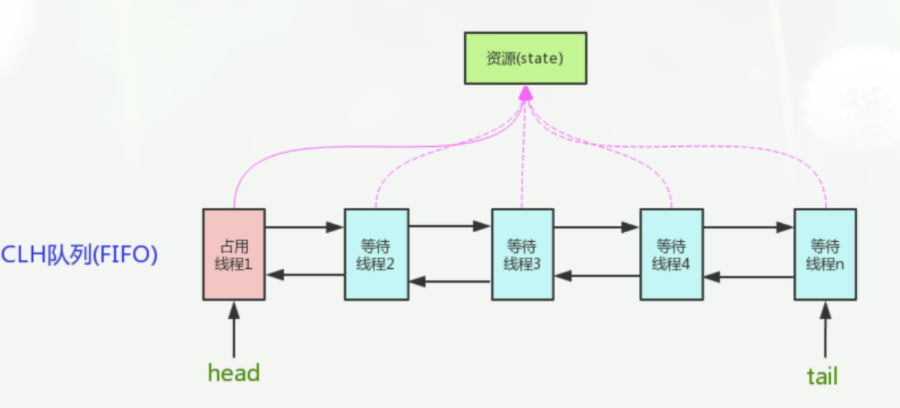

[TOC]


## volatile 

https://bbs.huaweicloud.com/blogs/239766

Java语言为了解决并发编程中存在的原子性、可见性和有序性问题，提供了一系列和并发处理相关的关键字，比如`synchronized`、`volatile`、`final`、`concurren包`等。

`volatile`这个关键字，不仅仅在Java语言中有，在很多语言中都有的，而且其用法和语义也都是不尽相同的。都可以**用来声明变量或者对象。**下面简单来介绍一下Java语言中的`volatile`关键字。

- volatile 可以保证可见性
- volatile禁止指令重排优化（一定程度上可以保证有序性）
- volatile 不能保证原子性

在以下两个场景中可以使用`volatile`来代替`synchronized`：

> 1、运算结果并不依赖变量的当前值，或者能够确保只有单一的线程会修改变量的值。
>
> 2、变量不需要与其他状态变量共同参与不变约束。

除以上场景外，都需要使用其他方式来保证原子性，如`synchronized`或者`concurrent包`。

#### 用法

`volatile`通常被比喻成"轻量级的`synchronized`"，也是Java并发编程中比较重要的一个关键字。和`synchronized`不同，`volatile`是一个变量修饰符，**只能用来修饰变量**。无法修饰方法及代码块等。

`volatile`的用法比较简单，只需要在声明一个可能被多线程同时访问的变量时，使用`volatile`修饰就可以了。

```java
public class Singleton {  
    private volatile static Singleton singleton;  
    private Singleton (){}  
    public static Singleton getSingleton() {  
    if (singleton == null) {  
        synchronized (Singleton.class) {  
        if (singleton == null) {  
            singleton = new Singleton();  
        }  
        }  
    }  
    return singleton;  
    }  
}  
```

#### 原理

**可见性实现原理**

为了提高处理器的执行速度，在处理器和内存之间增加了多级缓存来提升。但是由于引入了多级缓存，就存在缓存数据不一致问题。

对于`volatile`变量，当对`volatile`变量进行写操作的时候，JVM会向处理器发送一条lock前缀的指令，处理器在接收到lock指令的时候会做两件事：

1. 将**缓存行**缓存的数据写回到系统内存中。
2. 这个写回到系统内存中的数据，如果在其他CPU的缓存行中存在相同的数据，则将其置为**失效状态**。

**屏蔽指令重排实现原理**

屏蔽指令重排序：指令重排序是编译器和处理器为了高效对程序进行优化的手段，它只能保证程序执行的结果时正确的，但是无法保证程序的操作顺序与代码顺序一致。这在单线程中不会构成问题，但是在多线程中就会出现问题。非常经典的例子是在单例方法中同时对字段加入voliate，就是为了防止指令重排序。

volatile关键字通过 “**内存屏障**” 的方式来防止指令被重排序，为了实现volatile的内存语义，编译器在生成字节码时，会在指令序列中插入内存屏障来禁止特定类型的处理器重排序。大多数的处理器都支持内存屏障的指令。

对于编译器来说，发现一个最优布置来最小化插入屏障的总数几乎不可能，为此，Java内存模型采取保守策略。下面是基于保守策略的JMM内存屏障插入策略：

- 在每个volatile写操作的前面插入一个StoreStore屏障。
- 在每个volatile写操作的后面插入一个StoreLoad屏障。
- 在每个volatile读操作的后面插入一个LoadLoad屏障。
- 在每个volatile读操作的后面插入一个LoadStore屏障。

> **内存屏障（Memory Barrier，或有时叫做内存栅栏，Memory Fence）是一种CPU指令，用于控制特定条件下的重排序和内存可见性问题。Java编译器也会根据内存屏障的规则禁止重排序。**
>
> 内存屏障可以被分为以下几种类型：
>
> LoadLoad屏障：对于这样的语句Load1; LoadLoad; Load2，在Load2及后续读取操作要读取的数据被访问前，保证Load1要读取的数据被读取完毕。
>
> LoadStore屏障：对于这样的语句Load1; LoadStore; Store2，在Store2及后续写入操作被刷出前，保证Load1要读取的数据被读取完毕。
>
> StoreStore屏障：对于这样的语句Store1; StoreStore; Store2，在Store2及后续写入操作执行前，保证Store1的写入操作对其它处理器可见。
>
> StoreLoad屏障：对于这样的语句Store1; StoreLoad; Load2，在Load2及后续所有读取操作执行前，保证Store1的写入对所有处理器可见。它的开销是四种屏障中最大的。在大多数处理器的实现中，这个屏障是个万能屏障，兼具其它三种内存屏障的功能。

#### volatile 与原子性

原子性是指一个操作是不可中断的，要全部执行完成，要不就都不执行。

线程是CPU调度的基本单位。CPU有时间片的概念，会根据不同的调度算法进行线程调度。当一个线程获得时间片之后开始执行，在时间片耗尽之后，就会失去CPU使用权。所以在多线程场景下，**由于时间片在线程间轮换，就会发生原子性问题。**

`synchronized` 为了保证原子性，需要通过字节码指令`monitorenter`和`monitorexit`，但是`volatile`和这两个指令之间是没有任何关系的。

**所以，`volatile`是不能保证原子性的。**

## synchronized

**`synchronized` 关键字解决的是多个线程之间访问资源的同步性，`synchronized`关键字可以保证被它修饰的方法或者代码块在任意时刻只能有一个线程执行。**

另外，在 Java 早期版本中，`synchronized` 属于 **重量级锁**，效率低下。

**为什么呢？**

因为监视器锁（monitor）是依赖于底层的操作系统的 `Mutex Lock` 来实现的，Java 的线程是映射到操作系统的原生线程之上的。如果要挂起或者唤醒一个线程，都需要操作系统帮忙完成，而操作系统实现线程之间的切换时需要从用户态转换到内核态，这个状态之间的转换需要相对比较长的时间，时间成本相对较高。

庆幸的是在 Java 6 之后 Java 官方对从 JVM 层面对 `synchronized` 较大优化，所以现在的 `synchronized` 锁效率也优化得很不错了。JDK1.6 对锁的实现引入了大量的优化，如自旋锁、适应性自旋锁、锁消除、锁粗化、偏向锁、轻量级锁等技术来减少锁操作的开销。

#### 用法

**1.修饰实例方法:** 作用于当前对象实例加锁，进入同步代码前要获得 **当前对象实例的锁**

```
synchronized void method() {
  //业务代码
}
```

**2.修饰静态方法:** 也就是给当前类加锁，会作用于类的所有对象实例 ，进入同步代码前要获得 **当前 class 的锁**。因为静态成员不属于任何一个实例对象，是类成员（ *static 表明这是该类的一个静态资源，不管 new 了多少个对象，只有一份*）。所以，如果一个线程 A 调用一个实例对象的非静态 `synchronized` 方法，而线程 B 需要调用这个实例对象所属类的静态 `synchronized` 方法，是允许的，不会发生互斥现象，**因为访问静态 `synchronized` 方法占用的锁是当前类的锁，而访问非静态 `synchronized` 方法占用的锁是当前实例对象锁**。

```
synchronized void staic method() {
  //业务代码
}
```

**3.修饰代码块** ：指定加锁对象，对给定对象/类加锁。`synchronized(this|object)` 表示进入同步代码库前要获得**给定对象的锁**。`synchronized(类.class)` 表示进入同步代码前要获得 **当前 class 的锁**

```
synchronized(this) {
  //业务代码
}
```

**总结：**

- `synchronized` 关键字加到 `static` 静态方法和 `synchronized(class)` 代码块上都是是给 Class 类上锁。
- `synchronized` 关键字加到实例方法上是给对象实例上锁。
- 尽量不要使用 `synchronized(String a)` 因为 JVM 中，字符串常量池具有缓存功能！

#### 原理

**synchronized 同步语句块的情况**

```
public class SynchronizedDemo {
	public void method() {
		synchronized (this) {
			System.out.println("synchronized 代码块");
		}
	}
}
```

通过 JDK 自带的 `javap` 命令查看 `SynchronizedDemo` 类的相关字节码信息：首先切换到类的对应目录执行 `javac SynchronizedDemo.java` 命令生成编译后的 .class 文件，然后执行`javap -c -s -v -l SynchronizedDemo.class`。


从上面我们可以看出：

**`synchronized` 同步语句块的实现使用的是 `monitorenter` 和 `monitorexit` 指令，其中 `monitorenter` 指令指向同步代码块的开始位置，`monitorexit` 指令则指明同步代码块的结束位置。**

当执行 `monitorenter` 指令时，线程试图获取锁也就是获取 **对象监视器 `monitor`** 的持有权。

> 在 Java 虚拟机(HotSpot)中，Monitor 是基于 C++实现的，由[ObjectMonitor](https://github.com/openjdk-mirror/jdk7u-hotspot/blob/50bdefc3afe944ca74c3093e7448d6b889cd20d1/src/share/vm/runtime/objectMonitor.cpp)实现的。每个对象中都内置了一个 `ObjectMonitor`对象。
>
> 另外，**`wait/notify`等方法也依赖于`monitor`对象，这就是为什么只有在同步的块或者方法中才能调用`wait/notify`等方法，否则会抛出`java.lang.IllegalMonitorStateException`的异常的原因。**

在执行`monitorenter`时，会尝试获取对象的锁，如果锁的计数器为 0 则表示锁可以被获取，获取后将锁计数器设为 1 也就是加 1。

在执行 `monitorexit` 指令后，将锁计数器设为 0，表明锁被释放。如果获取对象锁失败，那当前线程就要阻塞等待，直到锁被另外一个线程释放为止。

**`synchronized` 修饰方法的的情况**

```
public class SynchronizedDemo2 {
	public synchronized void method() {
		System.out.println("synchronized 方法");
	}
}
```


`synchronized` 修饰的方法并没有 `monitorenter` 指令和 `monitorexit` 指令，取得代之的确实是 `ACC_SYNCHRONIZED` 标识，该标识指明了该方法是一个同步方法。JVM 通过该 `ACC_SYNCHRONIZED` 访问标志来辨别一个方法是否声明为同步方法，从而执行相应的同步调用。

**总结**

`synchronized` 同步语句块的实现使用的是 `monitorenter` 和 `monitorexit` 指令，其中 `monitorenter` 指令指向同步代码块的开始位置，`monitorexit` 指令则指明同步代码块的结束位置。

`synchronized` 修饰的方法并没有 `monitorenter` 指令和 `monitorexit` 指令，取得代之的确实是 `ACC_SYNCHRONIZED` 标识，该标识指明了该方法是一个同步方法。

**不过两者的本质都是对对象监视器 monitor 的获取。**

#### synchronized 与原子性

原子性是指一个操作是不可中断的，要全部执行完成，要不就都不执行。

线程是CPU调度的基本单位。CPU有时间片的概念，会根据不同的调度算法进行线程调度。当一个线程获得时间片之后开始执行，在时间片耗尽之后，就会失去CPU使用权。所以在多线程场景下，由于时间片在线程间轮换，就会发生原子性问题。

在Java中，为了保证原子性，提供了两个高级的字节码指令`monitorenter`和`monitorexit`。前面中，介绍过，这两个字节码指令，在Java中对应的关键字就是`synchronized`。

通过`monitorenter`和`monitorexit`指令，可以保证被`synchronized`修饰的代码在同一时间只能被一个线程访问，在锁未释放之前，无法被其他线程访问到。因此，在Java中可以使用`synchronized`来保证方法和代码块内的操作是原子性的。

> 线程1在执行`monitorenter`指令的时候，会对Monitor进行加锁，加锁后其他线程无法获得锁，除非线程1主动解锁。即使在执行过程中，由于某种原因，比如CPU时间片用完，线程1放弃了CPU，但是，他并没有进行解锁。而由于`synchronized`的锁是可重入的，下一个时间片还是只能被他自己获取到，还是会继续执行代码。直到所有代码执行完。这就保证了原子性。

#### synchronized 与可见性

可见性是指当多个线程访问同一个变量时，一个线程修改了这个变量的值，其他线程能够立即看得到修改的值。

Java内存模型规定了所有的变量都存储在主内存中，每条线程还有自己的工作内存，线程的工作内存中保存了该线程中是用到的变量的主内存副本拷贝，线程对变量的所有操作都必须在工作内存中进行，而不能直接读写主内存。不同的线程之间也无法直接访问对方工作内存中的变量，线程间变量的传递均需要自己的工作内存和主存之间进行数据同步进行。所以，就可能出现线程1改了某个变量的值，但是线程2不可见的情况。

前面我们介绍过，被`synchronized`修饰的代码，在开始执行时会加锁，执行完成后会进行解锁。而为了保证可见性，有一条规则是这样的：对一个变量解锁之前，必须先把此变量同步回主存中。这样解锁后，后续线程就可以访问到被修改后的值。

所以，synchronized关键字锁住的对象，其值是具有可见性的。

#### synchronized 与有序性

有序性即程序执行的顺序按照代码的先后顺序执行。

除了引入了时间片以外，由于处理器优化和指令重排等，CPU还可能对输入代码进行乱序执行，比如load->add->save 有可能被优化成load->save->add 。这就是可能存在有序性问题。

这里需要注意的是，`synchronized`是无法禁止指令重排和处理器优化的。也就是说，`synchronized`无法避免上述提到的问题。

那么，为什么还说`synchronized`也提供了有序性保证呢？

这就要再把有序性的概念扩展一下了。Java程序中天然的有序性可以总结为一句话：如果在本线程内观察，所有操作都是天然有序的。如果在一个线程中观察另一个线程，所有操作都是无序的。

以上这句话也是《深入理解Java虚拟机》中的原句，但是怎么理解呢？周志明并没有详细的解释。这里我简单扩展一下，这其实和`as-if-serial语义`有关。

`as-if-serial`语义的意思指：不管怎么重排序（编译器和处理器为了提高并行度），单线程程序的执行结果都不能被改变。编译器和处理器无论如何优化，都必须遵守`as-if-serial`语义。

这里不对`as-if-serial语义`详细展开了，简单说就是，`as-if-serial语义`保证了单线程中，指令重排是有一定的限制的，而只要编译器和处理器都遵守了这个语义，那么就可以认为单线程程序是按照顺序执行的。当然，实际上还是有重排的，只不过我们无须关心这种重排的干扰。

所以呢，由于`synchronized`修饰的代码，同一时间只能被同一线程访问。那么也就是单线程执行的。所以，可以保证其有序性。

#### synchronized 锁优化

https://juejin.cn/post/6844903590050398216

`synchronized`其实是借助Monitor实现的 (Monitor是依赖于底层的操作系统的Mutex Lock（互斥锁）来实现的线程同步)，在加锁时会调用objectMonitor的`enter`方法，解锁的时候会调用`exit`方法。事实上，只有在JDK1.6之前，synchronized的实现才会直接调用ObjectMonitor的`enter`和`exit`，这种锁被称之为重量级锁。

所以，在JDK1.6中出现对锁进行了很多的优化，进而出现轻量级锁，偏向锁，锁消除，适应性自旋锁，锁粗化(自旋锁在1.4就有，只不过默认的是关闭的，jdk1.6是默认开启的)，这些操作都是为了在线程之间更高效的共享数据 ，解决竞争问题，从而提升程序的执行效率。

通过引入轻量级锁和偏向锁来减少重量级锁的使用。锁的状态总共分四种：无锁状态、偏向锁、轻量级锁和重量级锁。锁随着竞争情况可以升级，但锁升级后不能降级，意味着不能从轻量级锁状态降级为偏向锁状态，也不能从重量级锁状态降级为轻量级锁状态。

>  无锁状态 → 偏向锁状态 → 轻量级锁 → 重量级锁


##### 对象头

synchronized是悲观锁，在操作同步资源之前需要给同步资源先加锁，这把锁就是存在Java对象头里的，而Java对象头又是什么呢？
我们以Hotspot虚拟机为例，Hotspot的对象头主要包括两部分数据：Mark Word（标记字段）、Klass Pointer（类型指针）。

- Mark Word：默认存储对象的HashCode，分代年龄和锁标志位信息。这些信息都是与对象自身定义无关的数据，所以Mark Word被设计成一个非固定的数据结构以便在极小的空间内存存储尽量多的数据。它会根据对象的状态复用自己的存储空间，也就是说在运行期间Mark Word里存储的数据会随着锁标志位的变化而变化。

- Klass Point：对象指向它的类元数据的指针，虚拟机通过这个指针来确定这个对象是哪个类的实例。


> Monitor可以理解为一个同步工具或一种同步机制，通常被描述为一个对象。每一个Java对象就有一把看不见的锁，称为内部锁或者Monitor锁。
>
> Monitor是线程私有的数据结构，每一个线程都有一个可用monitor record列表，同时还有一个全局的可用列表。每一个被锁住的对象都会和一个monitor关联，同时monitor中有一个Owner字段存放拥有该锁的线程的唯一标识，表示该锁被这个线程占用。

##### 无锁

无锁：没有对资源进行锁定，所有的线程都能访问并修改同一个资源，但同时只有一个线程能修改成功。

无锁的特点就是修改操作在循环内进行，线程会不断的尝试修改共享资源。如果没有冲突就修改成功并退出，否则就会继续循环尝试。如果有多个线程修改同一个值，必定会有一个线程能修改成功，而其他修改失败的线程会不断重试直到修改成功。

CAS 即是无锁的实现。无锁无法全面代替有锁，但无锁在某些场合下的性能是非常高的。

##### 偏向锁

偏向锁提升性能的经验依据是：`对于绝大部分锁，在整个同步周期内不仅不存在竞争，而且总由同一线程多次获得`。偏向锁会偏向第一个获得它的线程，如果接下来的执行过程中，该锁没有被其他线程获取，则持有偏向锁的线程不需要再进行同步。这使得线程获取锁的代价更低。

偏向锁是针对于一个线程而言的, 线程获得锁之后就不会再有解锁等操作了, 这样可以省略很多开销. 假如有两个线程来竞争该锁话, 那么偏向锁就失效了, 进而升级成轻量级锁了.

为什么要这样做呢? 因为经验表明, 其实大部分情况下, 都会是同一个线程进入同一块同步代码块的. 这也是为什么会有偏向锁出现的原因.

在Jdk1.6中, 偏向锁的开关是默认开启的, 适用于只有一个线程访问同步块的场景.

- 偏向锁的加锁

当一个线程访问同步块并获取锁时, 会在锁对象的对象头和栈帧中的锁记录里存储锁偏向的线程ID, 以后该线程进入和退出同步块时不需要进行CAS操作来加锁和解锁, 只需要简单的测试一下锁对象的对象头的MarkWord里是否存储着指向当前线程的偏向锁(线程ID是当前线程), 如果测试成功, 表示线程已经获得了锁; 如果测试失败, 则需要再测试一下MarkWord中偏向锁的标识是否设置成1(表示当前是偏向锁), 如果没有设置, 则使用CAS竞争锁, 如果设置了, 则尝试使用CAS将锁对象的对象头的偏向锁指向当前线程.

- 偏向锁的撤销

偏向锁使用了一种等到竞争出现才释放锁的机制, 所以当其他线程尝试竞争偏向锁时, 持有偏向锁的线程才会释放锁. 偏向锁的撤销需要等到全局安全点(在这个时间点上没有正在执行的字节码). 首先会暂停持有偏向锁的线程, 然后检查持有偏向锁的线程是否存活, 如果线程不处于活动状态, 则将锁对象的对象头设置为无锁状态; 如果线程仍然活着, 则锁对象的对象头中的MarkWord和栈中的锁记录要么重新偏向于其它线程要么恢复到无锁状态, 最后唤醒暂停的线程(释放偏向锁的线程).

- 总结

偏向锁在Java6及更高版本中是默认启用的, 但是它在程序启动几秒钟后才激活. 可以使用-XX:BiasedLockingStartupDelay=0来关闭偏向锁的启动延迟, 也可以使用-XX:-UseBiasedLocking=false来关闭偏向锁, 那么程序会直接进入轻量级锁状态.

##### 轻量级锁

`轻量级锁`是相对基于OS的互斥量实现的重量级锁而言的，它的本意是在没有多线程竞争的前提下，减少传统的重量级锁使用OS的互斥量而带来的性能消耗。

轻量级锁提升性能的经验依据是：`对于绝大部分锁，在整个同步周期内都是不存在竞争的`。如果没有竞争，轻量级锁就可以使用 CAS 操作避免互斥量的开销，从而提升效率。

当出现有两个线程来竞争锁的话, 那么偏向锁就失效了, 此时锁就会膨胀, 升级为轻量级锁.

- 轻量级锁加锁

线程在执行同步块之前, JVM会先在当前线程的栈帧中创建用户存储锁记录的空间, 并将对象头中的MarkWord复制到锁记录中. 然后线程尝试使用CAS将对象头中的MarkWord替换为指向锁记录的指针. 如果成功, 当前线程获得锁; 如果失败, 表示其它线程竞争锁, 当前线程便尝试使用自旋来获取锁, 之后再来的线程, 发现是轻量级锁, 就开始进行自旋.

- 轻量级锁解锁

轻量级锁解锁时, 会使用原子的CAS操作将当前线程的锁记录替换回到对象头, 如果成功, 表示没有竞争发生; 如果失败, 表示当前锁存在竞争, 锁就会膨胀成重量级锁.

- 总结

总结一下加锁解锁过程, 有线程A和线程B来竞争对象c的锁(如: synchronized(c){} ), 这时线程A和线程B同时将对象c的MarkWord复制到自己的锁记录中, 两者竞争去获取锁, 假设线程A成功获取锁, 并将对象c的对象头中的线程ID(MarkWord中)修改为指向自己的锁记录的指针, 这时线程B仍旧通过CAS去获取对象c的锁, 因为对象c的MarkWord中的内容已经被线程A改了, 所以获取失败. 此时为了提高获取锁的效率, 线程B会循环去获取锁, 这个循环是有次数限制的, 如果在循环结束之前CAS操作成功, 那么线程B就获取到锁, 如果循环结束依然获取不到锁, 则获取锁失败, 对象c的MarkWord中的记录会被修改为重量级锁, 然后线程B就会被挂起, 之后有线程C来获取锁时, 看到对象c的MarkWord中的是重量级锁的指针, 说明竞争激烈, 直接挂起.

解锁时, 线程A尝试使用CAS将对象c的MarkWord改回自己栈中复制的那个MarkWord, 因为对象c中的MarkWord已经被指向为重量级锁了, 所以CAS失败. 线程A会释放锁并唤起等待的线程, 进行新一轮的竞争.

##### 重量级锁

monitor 监视器锁本质上是依赖操作系统的 Mutex Lock 互斥量 来实现的，我们一般称之为`重量级锁`。因为 OS 实现线程间的切换需要从用户态转换到核心态，这个转换过程成本较高，耗时相对较长，因此 synchronized 效率会比较低。

重量级锁的锁标志位为'10'，指针指向的是 monitor 对象的起始地址

综上，偏向锁通过对比Mark Word解决加锁问题，避免执行CAS操作。而轻量级锁是通过用CAS操作和自旋来解决加锁问题，避免线程阻塞和唤醒而影响性能。重量级锁是将除了拥有锁的线程以外的线程都阻塞。

### 锁升级

#### 简答

所谓锁的升级、降级，就是 JVM 优化 synchronized 运行的机制，当 JVM 检测到不同的竞争状况时，会自动切换到适合的锁实现，这种切换就是锁的升级、降级。

当没有竞争出现时，默认会使用偏斜锁。JVM 会利用 CAS 操作（compare and swap），在对象头上的 Mark Word 部分设置线程 ID，以表示这个对象偏向于当前线程，所以并不涉及真正的互斥锁。这样做的假设是基于在很多应用场景中，大部分对象生命周期中最多会被一个线程锁定，使用偏斜锁可以降低无竞争开销。

如果有另外的线程试图锁定某个已经被偏斜过的对象，JVM 就需要撤销（revoke）偏斜锁，并切换到轻量级锁实现。轻量级锁依赖 CAS 操作 Mark Word 来试图获取锁，如果重试成功，就使用普通的轻量级锁；否则，进一步升级为重量级锁。

#### 详答

当T1线程访问同步代码块并获取锁对象时，会在java对象头和栈帧中记录偏向锁的线程ID，偏向锁不会主动释放锁。当再次有线程访问该锁时，会判断当前线程的ID和对象头中的线程ID是否一致，如果一致则不用再通过CAS来加锁，解锁。如果不一致（表明有其他线程来竞争锁，但是偏向锁不会主动释放，因此对象头中依旧存储的是T1的线程ID），那么就需要查看java对象头中记录的T1线程是否存活，如果没有存活，那么就将锁对象置为无所状态，T2线程可以竞争将其设置为偏向锁。如果存活，则查看T1的栈帧信息，如果还需要继续持有这个锁对象，那么就停止当前线程T1，撤销偏向锁，升级为轻量级锁。如果T1不再使用这个锁对象，那么将锁置为无锁状态，重新偏向新的线程。

线程1获取轻量级锁时会先把锁对象的对象头MarkWord复制一份到线程1的栈帧中创建的用于存储锁记录的空间（称为DisplacedMarkWord），然后使用CAS把对象头中的内容替换为线程1存储的锁记录（DisplacedMarkWord）的地址；

如果在线程1复制对象头的同时（在线程1CAS之前），线程2也准备获取锁，复制了对象头到线程2的锁记录空间中，但是在线程2CAS的时候，发现线程1已经把对象头换了，线程2的CAS失败，那么线程2就尝试使用自旋锁来等待线程1释放锁。

但是如果自旋的时间太长也不行，因为自旋是要消耗CPU的，因此自旋的次数是有限制的，比如10次或者100次，如果自旋次数到了线程1还没有释放锁，或者线程1还在执行，线程2还在自旋等待，这时又有一个线程3过来竞争这个锁对象，那么这个时候轻量级锁就会膨胀为重量级锁。重量级锁把除了拥有锁的线程都阻塞，防止CPU空转。

**注意：**为了避免无用的自旋，轻量级锁一旦膨胀为重量级锁就不会再降级为轻量级锁了；偏向锁升级为轻量级锁也不能再降级为偏向锁。一句话就是锁可以升级不可以降级，但是偏向锁状态可以被重置为无锁状态。

| 锁       | 优点                                                         | 缺点                                            | 适用场景                           |
| -------- | ------------------------------------------------------------ | ----------------------------------------------- | ---------------------------------- |
| 偏向锁   | 加锁和解锁不需要额外的消耗, 和执行非同步代码方法的性能相差无几. | 如果线程间存在锁竞争, 会带来额外的锁撤销的消耗. | 适用于只有一个线程访问的同步场景   |
| 轻量级锁 | 竞争的线程不会阻塞, 提高了程序的响应速度                     | 如果始终得不到锁竞争的线程, 使用自旋会消耗CPU   | 追求响应时间, 同步快执行速度非常快 |
| 重量级锁 | 线程竞争不适用自旋, 不会消耗CPU                              | 线程堵塞, 响应时间缓慢                          | 追求吞吐量, 同步快执行时间速度较长 |

https://www.cnblogs.com/wuqinglong/p/9945618.html


## 进程和线程的区别？

- 进程是资源分配的最小单位，线程是任务执行的最小单位。

- 进程有自己的独立地址空间，每启动一个进程，系统就会为它分配地址空间，建立数据表来维护代码段、堆栈段和数据段，这种操作非常昂贵。而线程是共享进程中的数据的，使用相同的地址空间，因此 CPU 切换一个线程的花费远比进程要小很多，同时创建一个线程的开销也比进程要小很多。 

- 线程之间的通信更方便，同一进程下的线程共享全局变量、静态变量等数据，而进程之间的通信需要以通信的方式（IPC)进行。不过如何处理好同步与互斥是编写多线程程序的难点。

- 但是多进程程序更健壮，多线程程序只要有一个线程死掉，整个进程也死掉了，而一个进程死掉并不会对另外一个进程造成影响，因为进程有自己独立的地址空间。 

## 进程的通信方式有哪些？ 线程呢？

进程的通信方式：

- 管道/匿名管道：用于有血缘关系的父子进程之间的通信
- 有名管道：作用于本机任意两个线程
- 消息队列
- 信号
- 信号量
- 共享内存
- 套接字

线程的通信方式：

- 互斥量
- 信号量
- 事件

## 什么是协程

协程，又称微线程。英文名Coroutine。一句话说明什么是线程：**协程是一种用户态的轻量级线程。**

协程拥有自己的寄存器上下文和栈。协程调度切换时，将寄存器上下文和栈保存到其他地方，在切回来的时候，恢复先前保存的寄存器上下文和栈，直接操作栈则基本没有内核切换的开销，可以不加锁的访问全局变量，所以上下文的切换非常快。

对操作系统而言，线程是最小的执行单元，进程是最小的资源管理单元。无论是进程还是线程，都是由操作系统所管理的。

协程不是被操作系统内核所管理的，而是完全由程序所控制，也就是在用户态执行。这样带来的好处是性能大幅度的提升，因为不会像线程切换那样消耗资源。

协程既不是进程也不是线程，协程仅仅是一个特殊的函数，协程它进程和进程不是一个维度的。

一个进程可以包含多个线程，一个线程可以包含多个协程。

一个线程内的多个协程虽然可以切换，但是多个协程是串行执行的，只能在一个线程内运行，没法利用 CPU 多核能力。

协程与进程一样，切换是存在上下文切换问题的。

协程的好处：

1. 无需担心线程上下文切换的开销
2. 无需原子操作锁定及同步的开销
3. 方便切换控制流，简化编程模型

高并发+高扩展性+低成本：一个CPU支持上万的协程都不是问题。所以很适合用于高并发处理。

缺点：

1. 无法利用多核资源：协程的本质是个单线程,它不能同时将 单个CPU 的多个核用上,协程需要和进程配合才能运行在多CPU上.当然我们日常所编写的绝大部分应用都没有这个必要，除非是cpu密集型应用。
2. 进行阻塞（Blocking）操作（如IO时）会阻塞掉整个程序

**最佳实践**

1. 线程和协程推荐在IO密集型的任务(比如网络调用)中使用，而在CPU密集型的任务中，表现较差。
2. 对于CPU密集型的任务，则需要多个进程，绕开GIL的限制，利用所有可用的CPU核心，提高效率。
3. 所以大并发下的最佳实践就是多进程+协程，既充分利用多核，又充分发挥协程的高效率，可获得极高的性能。

## 多线程的优缺点

**优点：**

- 资源利用率高（IO读取）
- 程序响应更快
- 某些情况下程序设计更简单

**缺点：**

- 上下文切换开销大
- 增加资源消耗
- 多线程需要更多的内存空间
- 设计更复杂

**什么时候需要用到多线程**

- 通过并行计算提升程序性能
  - 例如：一个大任务或计算逻辑，可以通过拆分成多个小任务并行执行

- 等待网络 IO响应导致的耗时问题

**多线程能带来什么问题：**

- 安全性问题
  - 原子性、可见性、有序性
  - 并发安全
- 活跃性问题
  - 死锁
  - 活锁
- 性能问题
  - 上下文切换
  - 资源限制

## 什么是上下文切换

多线程编程中一般线程的个数都大于 CPU 核心的个数，而一个 CPU 核心在任意时刻只能被一个线程使用，为了让这些线程都能得到有效执行，CPU 采取的策略是为每个线程分配时间片并轮转的形式。当一个线程的时间片用完的时候就会重新处于就绪状态让给其他线程使用，这个过程就属于一次上下文切换。概括来说就是：当前任务在执行完 CPU 时间片切换到另一个任务之前会先保存自己的状态，以便下次再切换回这个任务时，可以再加载这个任务的状态。**任务从保存到再加载的过程就是一次上下文切换**。

上下文切换通常是计算密集型的。也就是说，它需要相当可观的处理器时间，在每秒几十上百次的切换中，每次切换都需要纳秒量级的时间。所以，上下文切换对系统来说意味着消耗大量的 CPU 时间，事实上，可能是操作系统中时间消耗最大的操作。

Linux 相比与其他操作系统（包括其他类 Unix 系统）有很多的优点，其中有一项就是，其上下文切换和模式切换的时间消耗非常少。

上下文切换并不能完全避免，但是可以通过下面几种方式减少上下文切换：

- 无锁并发编程 - 多线程竞争锁时，会引起上下文切换，所以多线程处理数据时，可以用一些办法来避免使用锁，如将数据的 ID 按照 Hash 算法取模分段，不同的线程处理不同段的数据。
- CAS 算法 - Java 的 Atomic 包使用 CAS 算法来更新数据，而不需要加锁。
- 使用最少线程 - 避免创建不需要的线程，比如任务很少，但是创建了很多线程来处理，这样会造成大量线程都处于等待状态。
- 使用协程 - 在单线程里实现多任务的调度，并在单线程里维持多个任务间的切换。


## 什么是资源限制

资源限制是指在进行并发编程时，程序的执行速度受限于计算机硬件资源或软件资源。

**资源限制引发的问题**

在并发编程中，将代码执行速度加快的原则是将代码中串行执行的部分变成并发执行，但是如果将某段串行的代码并发执行，因为受限于资源，仍然在串行执行，这时候程序不仅不会加快执行，反而会更慢，因为增加了上下文切换和资源调度的时间。

**如何解决资源限制的问题**

在资源限制情况下进行并发编程，根据不同的资源限制调整程序的并发度。

- 对于硬件资源限制，可以考虑使用集群并行执行程序。
- 对于软件资源限制，可以考虑使用资源池将资源复用。

## 什么是线程死锁? 如何避免死锁?

多个线程互相等待对方释放锁。死锁是当线程进入无限期等待状态时发生的情况，因为所请求的锁被另一个线程持有，而另一个线程又等待第一个线程持有的另一个锁。

产生死锁必须具备以下四个条件：

1. 互斥条件：该资源任意一个时刻只由一个线程占用。
2. 请求与保持条件：一个进程因请求资源而阻塞时，对已获得的资源保持不放。
3. 不剥夺条件:线程已获得的资源在未使用完之前不能被其他线程强行剥夺，只有自己使用完毕后才释放资源。
4. 循环等待条件:若干进程之间形成一种头尾相接的循环等待资源关系。


**如何避免死锁？**

按顺序加锁：按照顺序加锁是一种有效的死锁预防机制。但是，这种方式需要你事先知道所有可能会用到的锁(并对这些锁做适当的排序)，但总有些时候是无法预知的。

超时释放锁：若一个线程没有在给定的时限内成功获得所有需要的锁，则会进行回退并释放所有已经获得的锁，然后等待一段随机的时间再重试。这段随机的等待时间让其它线程有机会尝试获取相同的这些锁，并且让该应用在没有获得锁的时候可以继续运行(译者注：加锁超时后可以先继续运行干点其它事情，再回头来重复之前加锁的逻辑)。

死锁检测：死锁检测是一个更好的死锁预防机制，它主要是针对那些不可能实现按序加锁并且锁超时也不可行的场景。每当一个线程获得了锁，会在线程和锁相关的数据结构中（map、graph 等等）将其记下。除此之外，每当有线程请求锁，也需要记录在这个数据结构中。当一个线程请求锁失败时，这个线程可以遍历锁的关系图看看是否有死锁发生。

如果检测出死锁，有两种处理手段：

释放所有锁，回退，并且等待一段随机的时间后重试。这个和简单的加锁超时类似，不一样的是只有死锁已经发生了才回退，而不会是因为加锁的请求超时了。虽然有回退和等待，但是如果有大量的线程竞争同一批锁，它们还是会重复地死锁（编者注：原因同超时类似，不能从根本上减轻竞争）。

一个更好的方案是给这些线程设置优先级，让一个（或几个）线程回退，剩下的线程就像没发生死锁一样继续保持着它们需要的锁。如果赋予这些线程的优先级是固定不变的，同一批线程总是会拥有更高的优先级。为避免这个问题，可以在死锁发生的时候设置随机的优先级。

> 1. **破坏互斥条件** ：这个条件我们没有办法破坏，因为我们用锁本来就是想让他们互斥的（临界资源需要互斥访问）。
> 2. **破坏请求与保持条件** ：一次性申请所有的资源。
> 3. **破坏不剥夺条件** ：占用部分资源的线程进一步申请其他资源时，如果申请不到，可以主动释放它占有的资源。
> 4. **破坏循环等待条件** ：靠按序申请资源来预防。按某一顺序申请资源，释放资源则反序释放。破坏循环等待条件。

## 活锁

活锁是一个递归的情况，两个或更多的线程会不断重复一个特定的代码逻辑。预期的逻辑通常为其他线程提供机会继续支持'this'线程。

想象这样一个例子：两个人在狭窄的走廊里相遇，二者都很礼貌，试图移到旁边让对方先通过。但是他们最终在没有取得任何进展的情况下左右摇摆，因为他们都在同一时间向相同的方向移动。

**避免活锁**

解决“活锁”的方案很简单，谦让时，尝试等待一个随机的时间就可以了。由于等待的时间是随机的，所以同时相撞后再次相撞的概率就很低了。“等待一个随机时间”的方案虽然很简单，却非常有效，Raft 这样知名的分布式一致性算法中也用到了它。


## 什么是饥饿

- 高优先级线程吞噬所有的低优先级线程的 CPU 时间。
- 线程被永久堵塞在一个等待进入同步块的状态，因为其他线程总是能在它之前持续地对该同步块进行访问。
- 线程在等待一个本身(在其上调用 wait())也处于永久等待完成的对象，因为其他线程总是被持续地获得唤醒。

**解决饥饿**

Java 不可能实现 100% 的公平性，我们依然可以通过同步结构在线程间实现公平性的提高。

有三种方案：

- 保证资源充足
- 公平地分配资源
- 避免持有锁的线程长时间执行

这三个方案中，方案一和方案三的适用场景比较有限，因为很多场景下，资源的稀缺性是没办法解决的，持有锁的线程执行的时间也很难缩短。倒是方案二的适用场景相对来说更多一些。

那如何公平地分配资源呢？在并发编程里，主要是使用公平锁。所谓公平锁，是一种先来后到的方案，线程的等待是有顺序的，排在等待队列前面的线程会优先获得资源。

## 并发和并行

- 并发：一段时间内可以执行多个任务，但不一定要同时执行（拥有处理过个任务的能力，不一定同时）
- 并行：同时处理多个任务（拥有同时处理多个任务的能力）

关键： 并发和并行都可以处理多个任务，关键点是：是否同时

## 同步和异步

同步：所谓同步，就是在发起一次调用时，在没有得到结果之前，该调用就不返回。但是一旦调用返回，就要得到返回值。

异步：异步则恰恰相反，调用发出之后，这次调用就直接返回了。所以没有返回值。换句话说，当一个异步过程调用发出后，调用者不会立刻得到结果。而是在调用发出后，被调用者通过状态、通知来通知调用者，或通过回调函数处理这个调用。

## 阻塞和非阻塞

阻塞和非阻塞关注的是程序在等待调用结果（消息，返回值）时的状态.

阻塞调用是指调用结果返回之前，当前线程会被挂起。调用线程只有在得到结果之后才会返回。

非阻塞调用指在不能立刻得到结果之前，该调用不会阻塞当前线程。

## 竞态条件和临界区

竞态条件（Race Condition）：当两个线程竞争同一资源时，如果对资源的访问顺序敏感，就称存在竞态条件。

临界区（Critical Sections）：导致竞态条件发生的代码区称作临界区。

## 管程

管程，对应的英文是 Monitor，很多 Java 领域的同学都喜欢将其翻译成“监视器”，这是直译。操作系统领域一般都翻译成“管程”，这个是意译，而我自己也更倾向于使用“管程”。

所谓管程，指的是管理共享变量以及对共享变量的操作过程，让他们支持并发。翻译为 Java 领域的语言，就是管理类的成员变量和成员方法，让这个类是线程安全的。

Java 采用的是管程技术，synchronized 关键字及 wait()、notify()、notifyAll() 这三个方法都是管程的组成部分。而管程和信号量是等价的，所谓等价指的是用管程能够实现信号量，也能用信号量实现管程。

## 保证并发安全的思路

**互斥同步（阻塞同步）**

同步是指多线程并发访问共享资源时，保证共享数据同一时刻只能被一个线程访问。互斥是实现同步的一种手段。临界区（Critical Sections）、互斥量（Mutex）和信号量（Semaphore）都是主要的互斥实现方式。最典型的案例是使用 synchronized 或 Lock 。
互斥同步最主要的问题是线程阻塞和唤醒所带来的性能问题，互斥同步属于一种悲观的并发策略，总是认为只要不去做正确的同步措施，那就肯定会出现问题。无论共享数据是否真的会出现竞争，它都要进行加锁、用户态核心态转换、维护锁计数器和检查是否有被阻塞的线程需要唤醒等操作。

**非阻塞同步**

随着硬件指令集的发展，我们可以使用基于冲突检测的乐观并发策略：先进行操作，如果没有其它线程争用共享数据，那操作就成功了，否则采取补偿措施（不断地重试，直到成功为止）。这种乐观的并发策略的许多实现都不需要将线程阻塞，因此这种同步操作称为非阻塞同步。

为什么说乐观锁需要 **硬件指令集的发展** 才能进行？

因为需要操作和冲突检测这两个步骤具备原子性。而这点是由硬件来完成，如果再使用互斥同步来保证就失去意义了。

Java 典型应用场景：J.U.C 包中的原子类（基于 Unsafe 类的 CAS 操作）

要保证线程安全，不一定非要进行同步。同步只是保证共享数据争用时的正确性，如果一个方法本来就不涉及共享数据，那么自然无须同步。

Java 中的 无同步方案 有：

- 可重入代码 - 也叫纯代码。如果一个方法，它的 返回结果是可以预测的，即只要输入了相同的数据，就能返回相同的结果，那它就满足可重入性，当然也是线程安全的。
- 线程本地存储 - 使用 ThreadLocal 为共享变量在每个线程中都创建了一个本地副本，这个副本只能被当前线程访问，其他线程无法访问，那么自然是线程安全的。

## 进程和线程

**进程：**进程是程序的一次执行过程，是系统运行程序的基本单位，因此进程是动态的。系统运行一个程序即是一个进程从创建，运行到消亡的过程。在 Java 中，当我们启动 main 函数时其实就是启动了一个 JVM 的进程，而 main 函数所在的线程就是这个进程中的一个线程，也称主线程。

**线程：**线程与进程相似，但线程是一个比进程更小的执行单位。一个进程在其执行的过程中可以产生多个线程。与进程不同的是同类的多个线程共享进程的**堆**和**方法区**资源，但每个线程有自己的**程序计数器**、**虚拟机栈**和**本地方法栈**，所以系统在产生一个线程，或是在各个线程之间作切换工作时，负担要比进程小得多，也正因为如此，线程也被称为轻量级进程。

- 一个程序至少有一个进程，一个进程至少有一个线程。
- 线程比进程划分更细，所以执行开销更小，并发性更高
- 进程是一个实体，拥有独立的资源；而同一个进程中的多个线程共享进程的资源。

**总结：** **线程是进程划分成的更小的运行单位。线程和进程最大的不同在于基本上各进程是独立的，而各线程则不一定，因为同一进程中的线程极有可能会相互影响。线程执行开销小，但不利于资源的管理和保护；而进程正相反。**

## 有了进程为什么还要线程？

- 每个进程都有自己的地址空间，即进程空间。一个服务器通常需要接收大量并发请求，为每一个请求都创建一个进程系统开销大、请求响应效率低

- 进程只能在一个时间干一件事，如果想同时干两件事或多件事，进程就无能为力了。
- 进程在执行的过程中如果阻塞，例如等待输入，整个进程就会挂起，即使进程中有些工作不依赖于输入的数据，也将无法执行。

## 创建线程有哪些方式

- 继承 Thread 类
- 实现 Runnable 接口
- 通过Callable和Future创建线程
- 线程池

实现 Runnable 接口优于继承 Thread 类，因为：

- Java 不支持多重继承，所有的类都只允许继承一个父类，但可以实现多个接口。如果继承了 Thread 类就无法继承其它类，这不利于扩展。
- 类可能只要求可执行就行，继承整个 Thread 类开销过大。

https://blog.csdn.net/u012973218/article/details/51280044

## 说说线程的生命周期和状态?

**状态：**

- new（新建）
- runnnable（可运行）
- blocked（阻塞）
- waiting（等待）
- time waiting （定时等待）
- terminated（终止）

线程状态流程如下：

1. 线程创建后，进入 new 状态
2. 调用 start 或者 run 方法，进入 runnable 状态
3. JVM 按照线程优先级及时间分片等执行 runnable 状态的线程。开始执行时，进入 running 状态
4. 如果线程执行 sleep、wait、join，或者进入 IO 阻塞等。进入 wait 或者 blocked 状态
5. 线程执行完毕后，线程被线程队列移除。最后为 terminated 状态


## 说说 sleep() 方法和 wait() 方法区别和共同点?

- 两者最主要的区别在于：**`sleep()` 方法没有释放锁，而 `wait()` 方法释放了锁** 。
- 两者都可以暂停线程的执行。
- `wait()` 通常被用于线程间交互/通信，`sleep() `通常被用于暂停执行。
- `wait()` 方法被调用后，线程不会自动苏醒，需要别的线程调用同一个对象上的 `notify() `或者 `notifyAll()` 方法。`sleep() `方法执行完成后，线程会自动苏醒。或者可以使用 `wait(long timeout)` 超时后线程会自动苏醒。

## BLOCKED 和 WAITING 的区别

虽然 BLOCKED 和 WAITING 都有等待的含义，但二者有着本质的区别。

首先它们状态形成的调用方法不同，其次 BLOCKED 可以理解为当前线程还处于活跃状态，只是在阻塞等待其他线程使用完某个锁资源；而 WAITING 则是因为自身调用了 Object.wait() 或着是 Thread.join() 又或者是 LockSupport.park() 而进入等待状态，只能等待其他线程执行某个特定的动作才能被继续唤醒，比如当线程因为调用了 Object.wait() 而进入 WAITING 状态之后，则需要等待另一个线程执行 Object.notify() 或 Object.notifyAll() 才能被唤醒。

## start() 和 run() 的区别

首先从 Thread 源码来看，start() 方法属于 Thread 自身的方法，并且使用了 synchronized 来保证线程安全.

run() 方法为 Runnable 的抽象方法，必须由调用类重写此方法，重写的 run() 方法其实就是此线程要执行的业务方法.

从执行的效果来说，start() 方法可以开启多线程，让线程从 NEW 状态转换成 RUNNABLE 状态，而 run() 方法只是一个普通的方法。

其次，它们可调用的次数不同，start() 方法不能被多次调用，否则会抛出 java.lang.IllegalStateException；而 run() 方法可以进行多次调用，因为它只是一个普通的方法而已。

## 为什么我们调用 start() 方法时会执行 run() 方法，为什么我们不能直接调用 run() 方法？

new 一个 Thread，线程进入了新建状态。调用 `start()`方法，会启动一个线程并使线程进入了就绪状态，当分配到时间片后就可以开始运行了。 `start()` 会执行线程的相应准备工作，然后自动执行 `run()` 方法的内容，这是真正的多线程工作。 但是，直接执行 `run()` 方法，会把 `run()` 方法当成一个 main 线程下的普通方法去执行，并不会在某个线程中执行它，所以这并不是多线程工作。

**总结： 调用 `start()` 方法方可启动线程并使线程进入就绪状态，直接执行 `run()` 方法的话不会以多线程的方式执行。**

## 线程优先级

在 Thread 源码中和线程优先级相关的属性有 3 个：

```
// 线程可以拥有的最小优先级
public final static int MIN_PRIORITY = 1;

// 线程默认优先级
public final static int NORM_PRIORITY = 5;

// 线程可以拥有的最大优先级
public final static int MAX_PRIORITY = 10
```

线程的优先级可以理解为线程抢占 CPU 时间片的概率，优先级越高的线程优先执行的概率就越大，但并不能保证优先级高的线程一定先执行。

在程序中我们可以通过 Thread.setPriority() 来设置优先级

## 执行两次start方法会如何？

Java的线程是不允许启动两次的，第二次调用必然会抛岀 IllegalThreadStateEXception，这是一种运行时异常，多次调用 start 被认为是编程错误。

## 实现 Runnable 接口和 Callable 接口的区别

`Runnable`自 Java 1.0 以来一直存在，但`Callable`仅在 Java 1.5 中引入,目的就是为了来处理`Runnable`不支持的用例。**`Runnable` 接口**不会返回结果或抛出检查异常，但是**`Callable` 接口**可以。所以，如果任务不需要返回结果或抛出异常推荐使用 **`Runnable` 接口**，这样代码看起来会更加简洁。

工具类 `Executors` 可以实现 `Runnable` 对象和 `Callable` 对象之间的相互转换。（`Executors.callable（Runnable task`）或 `Executors.callable（Runnable task，Object resule）`）。

```java
Runnable.java

@FunctionalInterface
public interface Runnable {
   /**
    * 被线程执行，没有返回值也无法抛出异常
    */
    public abstract void run();
}


Callable.java

@FunctionalInterface
public interface Callable<V> {
    /**
     * 计算结果，或在无法这样做时抛出异常。
     * @return 计算得出的结果
     * @throws 如果无法计算结果，则抛出异常
     */
    V call() throws Exception;
}
```

### 构造方法可以使用 synchronized 关键字修饰么？

先说结论：**构造方法不能使用 synchronized 关键字修饰。**

构造方法本身就属于线程安全的，不存在同步的构造方法一说。

### 锁消除

锁消除理解起来很简单，它指的就是虚拟机即使编译器在运行时，如果检测到那些共享数据不可能存在竞争，那么就执行锁消除。锁消除可以节省毫无意义的请求锁的时间。

例如：字符串的拼接操作，javac编译器会对String连接做自动优化。在JDK1.5之前会转化为StringBuffer对象做append操作。在JDK1.5之后的版本会转化为StringBuilder的连续append操作。

StringBuffer.append（）方法中都有一个同步块，锁就是sb对象。虚拟机会观察变量sb，发现他的动态作用域被限制在concatString方法内部，永远不会逃逸到concatString方法之外，其他线程无法访问。因此这里有锁，但是会被安全的消除掉。

### 锁粗化

原则上，我们在编写代码的时候，总是推荐将同步块的作用范围限制得尽量小，——直在共享数据的实际作用域才进行同步，这样是为了使得需要同步的操作数量尽可能变小，如果存在锁竞争，那等待线程也能尽快拿到锁。

大部分情况下，上面的原则都是没有问题的，但是如果一系列的连续操作都对同一个对象反复加锁和解锁，甚至加锁操作出现在循环体中，那即是没有线程竞争，频繁的进行同步操作也会导致不必要的性能消耗。

字符串拼接方法中连续的append操作就属于这种情况。如果虚拟机探测到有这样一串零碎的操作都对同一个对象加锁，将会把加锁同步的范围扩展（粗化）到整个操作序列的外面，这样可以减少加锁的次数。

## 自旋锁和适应性自旋锁

阻塞或唤醒一个Java线程需要操作系统切换CPU状态来完成，这种状态转换需要耗费处理器时间。如果同步代码块中的内容过于简单，状态转换消耗的时间有可能比用户代码执行的时间还要长。

在许多场景中，同步资源的锁定时间很短，为了这一小段时间去切换线程，线程挂起和恢复现场的花费可能会让系统得不偿失。如果物理机器有多个处理器，能够让两个或以上的线程同时并行执行，我们就可以让后面那个请求锁的线程不放弃CPU的执行时间，看看持有锁的线程是否很快就会释放锁。

而为了让当前线程“稍等一下”，我们需让当前线程进行自旋，如果在自旋完成后前面锁定同步资源的线程已经释放了锁，那么当前线程就可以不必阻塞而是直接获取同步资源，从而避免切换线程的开销。这就是自旋锁。


自旋锁本身是有缺点的，它不能代替阻塞。自旋等待虽然避免了线程切换的开销，但它要占用处理器时间。如果锁被占用的时间很短，自旋等待的效果就会非常好。反之，如果锁被占用的时间很长，那么自旋的线程只会白浪费处理器资源。所以，自旋等待的时间必须要有一定的限度，如果自旋超过了限定次数（默认是10次，可以使用-XX:PreBlockSpin来更改）没有成功获得锁，就应当挂起线程。

自旋锁在JDK1.4.2中引入，使用-XX:+UseSpinning来开启。JDK 6中变为默认开启，并且引入了自适应的自旋锁（适应性自旋锁）。

自适应意味着自旋的时间（次数）不再固定，而是由前一次在同一个锁上的自旋时间及锁的拥有者的状态来决定。如果在同一个锁对象上，自旋等待刚刚成功获得过锁，并且持有锁的线程正在运行中，那么虚拟机就会认为这次自旋也是很有可能再次成功，进而它将允许自旋等待持续相对更长的时间。如果对于某个锁，自旋很少成功获得过，那在以后尝试获取这个锁时将可能省略掉自旋过程，直接阻塞线程，避免浪费处理器资源。

## Synchronized 和 **ReentrantLock** 的区别？

都是可重入锁

- synchronized 是 JVM 隐式实现的，而 ReentrantLock 是 Java 语言提供的 API；
- ReentrantLock 可设置为公平锁，而 synchronized 却不行；
- ReentrantLock 只能修饰代码块，而 synchronized 可以用于修饰方法、修饰代码块等；
- ReentrantLock 需要手动加锁和释放锁，如果忘记释放锁，则会造成资源被永久占用，而 synchronized 无需手动释放锁；
- ReentrantLock 可以知道是否成功获得了锁，而 synchronized  却不行。

**ReentrantLock 比 synchronized 增加了一些高级功能**

相比`synchronized`，`ReentrantLock`增加了一些高级功能。主要来说主要有三点：

- **等待可中断** : `ReentrantLock`提供了一种能够中断等待锁的线程的机制，通过 `lock.lockInterruptibly()` 来实现这个机制。也就是说正在等待的线程可以选择放弃等待，改为处理其他事情。
- **可实现公平锁** : `ReentrantLock`可以指定是公平锁还是非公平锁。而`synchronized`只能是非公平锁。所谓的公平锁就是先等待的线程先获得锁。`ReentrantLock`默认情况是非公平的，可以通过 `ReentrantLock`类的`ReentrantLock(boolean fair)`构造方法来制定是否是公平的。
- **可实现选择性通知（锁可以绑定多个条件）**: `synchronized`关键字与`wait()`和`notify()`/`notifyAll()`方法相结合可以实现等待/通知机制。`ReentrantLock`类当然也可以实现，但是需要借助于`Condition`接口与`newCondition()`方法。

> `Condition`是 JDK1.5 之后才有的，它具有很好的灵活性，比如可以实现多路通知功能也就是在一个`Lock`对象中可以创建多个`Condition`实例（即对象监视器），**线程对象可以注册在指定的`Condition`中，从而可以有选择性的进行线程通知，在调度线程上更加灵活。 在使用`notify()/notifyAll()`方法进行通知时，被通知的线程是由 JVM 选择的，用`ReentrantLock`类结合`Condition`实例可以实现“选择性通知”** ，这个功能非常重要，而且是 Condition 接口默认提供的。而`synchronized`关键字就相当于整个 Lock 对象中只有一个`Condition`实例，所有的线程都注册在它一个身上。如果执行`notifyAll()`方法的话就会通知所有处于等待状态的线程这样会造成很大的效率问题，而`Condition`实例的`signalAll()`方法 只会唤醒注册在该`Condition`实例中的所有等待线程。

**如果你想使用上述功能，那么选择 ReentrantLock 是一个不错的选择。性能已不是选择标准**

**原始构成**

synchronized是关键字属于 JVM 层面（monitorenter(底层是通过 monitor对象来完成，其实wit/ notify等方法也依赖 monitor对象只有在同步块线方法中才能调wait/ notify等）

Lock 是具体类(java.uti. concurrent. Locks.Lock) 是api层面的

**使用方法**

synchronized 不需要用户去手动释放锁，当 synchronized代码执行完后系统会自动让线程释放对锁的占用

Reentrantlock则需要用户去手动释放锁若没有主动释放锁,就有可能导致出现死锁现象

需要 lock() 和 unlock() 方法配合 try/ finally语句块来

**等待是否可中断**

synchronized不可中断，除非抛出异常或者正常运行完成

Reentrantlock可中断

- 设置超时方法 tryLock( Long timeout, TimeUnit unit)
- lockInterruptibly() 放代码块中,调用 interrupt()方法可中断

**加锁是否公平**

synchronized 是非公平锁

Reentrantlock 同时支持公平锁和非公平锁，通过构造方法来决定使用公平锁还是非公平锁

**是否支持 condition**

synchronized 不支持condition

Reentrantlock 可以通过 condition 来实现精确唤醒，而不是像synchronized 一样要么随即唤醒一个线程要么唤醒所有线程。

## Synchronized 什么情况是对象锁？ 什么时候是全局锁？

对象锁：synchronized(this)  以及非static的synchronized方法 

全局锁：synchronized 静态方法也相当于全局锁

## 说说 synchronized 关键字和 volatile 关键字的区别

`synchronized` 关键字和 `volatile` 关键字是两个互补的存在，而不是对立的存在！

- **`volatile` 关键字**是线程同步的**轻量级实现**，所以**`volatile `性能肯定比`synchronized`关键字要好**。但是**`volatile` 关键字只能用于变量而 `synchronized` 关键字可以修饰方法以及代码块**。
- **`volatile` 关键字能保证数据的可见性，但不能保证数据的原子性。`synchronized` 关键字两者都能保证。**
- **`volatile`关键字主要用于解决变量在多个线程之间的可见性，而 `synchronized` 关键字解决的是多个线程之间访问资源的同步性。**

## JMM

Java 内存模型（JMM）是一种抽象的概念，并不真实存在，它描述了一组规则或规范，通过这组规范定义了程序中各个变量（包括实例字段、静态字段和构成数组对象的元素）的访问方式。试图屏蔽各种硬件和操作系统的内存访问差异，以实现让 Java 程序在各种平台下都能达到一致的内存访问效果。

> 注意JMM与JVM内存区域划分的区别：
>
> - JMM描述的是一组规则，围绕原子性、有序性和可见性展开；
> - 相似点：存在共享区域和私有区域


链接：https://juejin.cn/post/6844903845152325639

## JMM 如何解决原子性 一致性 可见性 问题

> 在Java中提供了一系列和并发处理相关的关键字，比如volatile、Synchronized、final、juc等，这些就是Java内存 模型封装了底层的实现后提供给开发人员使用的关键字，在开发多线程代码的时候，我们可以直接使用 synchronized等关键词来控制并发，使得我们不需要关心底层的编译器优化、缓存一致性的问题了，所以在Java内 存模型中，除了定义了一套规范，还提供了开放的指令在底层进行封装后，提供给开发人员使用。

**原子性**

在java中提供了两个高级的字节码指令monitorenter和monitorexit，在Java中对应的Synchronized来保证代码块 内的操作是原子的

**可见性**

Java中的volatile关键字提供了一个功能，那就是被其修饰的变量在被修改后可以立即同步到主内存，被其修饰的变 量在每次是用之前都从主内存刷新。因此，可以使用volatile来保证多线程操作时变量的可见性。

除了volatile，Java中的synchronized和final两个关键字也可以实现可见性

**有序性**

在Java中，可以使用synchronized和volatile来保证多线程之间操作的有序性（编译器和处理器不会改变存在数据依赖关系的两个操作的执行顺序）。实现方式有所区别：

volatile关键字会禁止指令重排。synchronized关键字保证同一时刻只允许一条线程操作。

https://developer.aliyun.com/article/659737

## 各种锁


https://tech.meituan.com/2018/11/15/java-lock.html

### 乐观锁 & 悲观锁

乐观锁与悲观锁是一种广义上的概念，体现了看待线程同步的不同角度。在Java和数据库中都有此概念对应的实际应用。

先说概念。对于同一个数据的并发操作，悲观锁认为自己在使用数据的时候一定有别的线程来修改数据，因此在获取数据的时候会先加锁，确保数据不会被别的线程修改。Java中，synchronized关键字和Lock的实现类都是悲观锁。

而乐观锁认为自己在使用数据时不会有别的线程修改数据，所以不会添加锁，只是在更新数据的时候去判断之前有没有别的线程更新了这个数据。如果这个数据没有被更新，当前线程将自己修改的数据成功写入。如果数据已经被其他线程更新，则根据不同的实现方式执行不同的操作（例如报错或者自动重试）。

乐观锁在Java中是通过使用无锁编程来实现，最常采用的是CAS算法，Java原子类中的递增操作就通过CAS自旋实现的。

> 悲观锁适合写操作多的场景，先加锁可以保证写操作时数据正确。
>
> 乐观锁适合读操作多的场景，不加锁的特点能够使其读操作的性能大幅提升。

### 公平锁 VS 非公平锁

公平锁是指多个线程按照申请锁的顺序来获取锁，线程直接进入队列中排队，队列中的第一个线程才能获得锁。

- 公平锁的优点是等待锁的线程不会饿死。
- 缺点是整体吞吐效率相对非公平锁要低，等待队列中除第一个线程以外的所有线程都会阻塞，CPU唤醒阻塞线程的开销比非公平锁大。

非公平锁是多个线程加锁时直接尝试获取锁，获取不到才会到等待队列的队尾等待。但如果此时锁刚好可用，那么这个线程可以无需阻塞直接获取到锁，所以非公平锁有可能出现  后申请锁的线程先获取锁的场景。

- 非公平锁的优点是可以减少唤起线程的开销，整体的吞吐效率高，因为线程有几率不阻塞直接获得锁，CPU不必唤醒所有线程。
- 缺点是处于等待队列中的线程可能会饿死，或者等很久才会获得锁。

ReentrantLock的实现中：公平锁与非公平锁的lock()方法唯一的区别就在于公平锁在获取同步状态时多了一个限制条件：hasQueuedPredecessors()。


### 可重入锁

可重入锁又名递归锁，是指在同一个线程在外层方法获取锁的时候，再进入该线程的内层方法会自动获取锁（前提锁对象得是同一个对象或者class），不会因为之前已经获取过还没释放而阻塞。

Java中ReentrantLock和synchronized都是可重入锁，可重入锁的一个优点是可一定程度避免死锁。

synchronized 重入的实现机制

每个锁对象都拥有：1. 锁计数器  2. 指向拥有该锁的线程的指针

当执行monitorenter时，如果目标锁对象的计数器为0 ，那么说明他没有被其他线程持有。这时，JVM会将该锁对象的持有线程设置为当前线程，并将计数器加1.

在目标锁对象的计数器不为0的情况下，如果锁对象的持有线程是当前线程那么JVM可以将其计数器加1，否则需要等待，直至持有线程释放锁。

当执行monitorexit时，JVM则需要将锁对象的计数器减1，计数器数值为0代表锁已被释放。

### 独享锁 & 共享锁

独享锁也叫排他锁，是指该锁一次只能被一个线程所持有。如果线程T对数据A加上排它锁后，则其他线程不能再对A加任何类型的锁。获得排它锁的线程即能读数据又能修改数据。JDK中的synchronized和JUC中Lock的实现类就是互斥锁。

共享锁是指该锁可被多个线程所持有。如果线程T对数据A加上共享锁后，则其他线程只能对A再加共享锁，不能加排它锁。获得共享锁的线程只能读数据，不能修改数据。

独享锁与共享锁也是通过AQS来实现的，通过实现不同的方法，来实现独享或者共享。

## Lock & Condition

在传统的synchronized中，可以通过wait/notify/notifyAll进行等待通知操作，但synchronized只提供了一个同步队列和一个等待/通知队列，Lock则提供了一个同步队列和多个等待/通知队列模型。

Condition对象是从Lock中获取，其返回的实际上是AQS的内部类ConditionObject，因为Condition机制依赖于AQS基于状态的同步机制。在使用时，可以创建多个Condition对象，每个Condition对象都对应一个等待队列，队列中的数据是AQS的Node节点类型。

当调用await()方法时，因为当前线程一定的获取了Lock锁的线程，也就算同步队列的头节点，所以会把这个节点从同步队列中移除，构造一个新的节点并加入到等待队列中(没有利用cas，因为当前线程就数获取锁的线程)，当调用signal()/signalAll()时，将等待队列中的当前线程节点移除，重新加入到同步队列进行同步状态的竞争（如果是非公平锁，则进行同步状态的抢占，如果抢占失败，则加入到同步队列尾部，如果是公平锁，那么就老老实实的利用cas将节点加入到同步队列的尾部）

## 让线程等待&唤醒的方法

- 方式一：使用 Object 中的 wait() 方法让线程等待，使用 Object 中的 notify() 方法唤醒线程
- 方式二：使用 JUC 包中 Condition 的 await() 方法让线程等待，使用 signal() 方法唤醒线程
- 方式三：LockSupport 类可以阻塞当前线程以及唤醒指定被阻塞的线程。

`Object.wait()`、`Object.notify()`方法必须再`synchronized`修饰的代码块中才能正常使用，否则会报异常(`语法不会显示有错误`)

Condition需要在ReentrantLock下使用，也就是需要上锁和释放锁，否则也会报`java.lang.IllegalMonitorStateException`

## LockSupport

LookSupport 是用来创建锁和其他同步类的线程阻塞原语。

LookSupport 是一个线程阻塞工具类，所有的方法都是静态方法，可以让线程在任意位置阻塞，阻塞之后也有对应的唤醒方法。

LookSupport 调用的是 Unsafe的native 代码。

通过 park（）和 unpark（）方法来实现，线程的阻塞和释放操作。

LockSupport就是通过控制变量`_counter`（类似于pemit许可证，默认为0）来对线程阻塞唤醒进行控制的。原理有点类似于信号量机制。

- 当调用`park()`方法时，会将_counter置为0，同时判断前值，等于1说明前面被`unpark`过,则直接退出，否则将使该线程阻塞。
- 当调用`unpark()`方法时，会将_counter置为1，同时判断前值，小于1会进行线程唤醒，否则直接退出。
  形象的理解，线程阻塞需要消耗凭证(permit)，这个凭证最多只有1个。当调用park方法时，如果有凭证，则会直接消耗掉这个凭证然后正常退出；但是如果没有凭证，就必须阻塞等待凭证可用；而unpark则相反，它会增加一个凭证，但凭证最多只能有1个。

```java
public static void main(String[] args) {
    Thread a = new Thread(() -> {
        System.out.println(Thread.currentThread().getName() + "\t" + "----- come in");
        LockSupport.park();
        System.out.println(Thread.currentThread().getName() + "\t" + "----- 被唤醒");
    }, "a");
    a.start();

    try {
        TimeUnit.SECONDS.sleep(3L);
    } catch (InterruptedException e) {
        e.printStackTrace();
    }

    Thread b = new Thread(() -> {
        LockSupport.unpark(a);
        System.out.println(Thread.currentThread().getName() + "\t" + "----- 通知 a");
    }, "b");
    b.start();
}

a	----- come in
b	----- 通知 a 
a	----- 被唤醒
    
public static void main(String[] args) {
    Thread t1 = new Thread(() -> {
        try {
            TimeUnit.SECONDS.sleep(1L);
        } catch (InterruptedException e) {
            e.printStackTrace();
        }

        System.out.println(Thread.currentThread().getName() + "\t" + System.currentTimeMillis() + "\t" + "----- come in");
        LockSupport.park();
        System.out.println(Thread.currentThread().getName() + "\t" + System.currentTimeMillis() + "\t" + "----- 被唤醒");
    }, "t1");
    t1.start();

    try {
        TimeUnit.SECONDS.sleep(3L);
    } catch (InterruptedException e) {
        e.printStackTrace();
    }

    LockSupport.unpark(t1);
    System.out.println(Thread.currentThread().getName() + "\t" + System.currentTimeMillis() + "----- unpark over");
}

t1	1612934983962	----- come in
main	1612934985962----- unpark over
t1	1612934985962	----- 被唤醒
```

### 为什么可以先唤醒线程后阻塞线程？
因为unpark获得了一个凭证,之后调用park因为有凭证消费，故不会阻塞。

### 为什么唤醒两次后阻塞两次会阻塞线程。

因为凭证的数量最多为1，连续调用两次unpark和调用一次unpark效果一样，只会增加一个凭证；而调用两次park却需要消费两个凭证。

## ThreadLocal

https://www.jianshu.com/p/377bb840802f

通常情况下，我们创建的变量是可以被任何一个线程访问并修改的。**如果想实现每一个线程都有自己的专属本地变量该如何解决呢？** JDK 中提供的`ThreadLocal`类正是为了解决这样的问题。 **`ThreadLocal`类主要解决的就是让每个线程绑定自己的值，可以将`ThreadLocal`类形象的比喻成存放数据的盒子，盒子中可以存储每个线程的私有数据。**

**如果你创建了一个`ThreadLocal`变量，那么访问这个变量的每个线程都会有这个变量的本地副本，这也是`ThreadLocal`变量名的由来。他们可以使用 `get（）` 和 `set（）` 方法来获取默认值或将其值更改为当前线程所存的副本的值，从而避免了线程安全问题。**

### 示例

```java
import java.text.SimpleDateFormat;
import java.util.Random;

public class ThreadLocalExample implements Runnable{

     // SimpleDateFormat 不是线程安全的，所以每个线程都要有自己独立的副本
    private static final ThreadLocal<SimpleDateFormat> formatter = ThreadLocal.withInitial(() -> new SimpleDateFormat("yyyyMMdd HHmm"));

    public static void main(String[] args) throws InterruptedException {
        ThreadLocalExample obj = new ThreadLocalExample();
        for(int i=0 ; i<10; i++){
            Thread t = new Thread(obj, ""+i);
            Thread.sleep(new Random().nextInt(1000));
            t.start();
        }
    }

    @Override
    public void run() {
        System.out.println("Thread Name= "+Thread.currentThread().getName()+" default Formatter = "+formatter.get().toPattern());
        try {
            Thread.sleep(new Random().nextInt(1000));
        } catch (InterruptedException e) {
            e.printStackTrace();
        }
        //formatter pattern is changed here by thread, but it won't reflect to other threads
        formatter.set(new SimpleDateFormat());

        System.out.println("Thread Name= "+Thread.currentThread().getName()+" formatter = "+formatter.get().toPattern());
    }

}

Thread Name= 0 default Formatter = yyyyMMdd HHmm
Thread Name= 0 formatter = yy-M-d ah:mm
Thread Name= 1 default Formatter = yyyyMMdd HHmm
Thread Name= 2 default Formatter = yyyyMMdd HHmm
Thread Name= 1 formatter = yy-M-d ah:mm
Thread Name= 3 default Formatter = yyyyMMdd HHmm
Thread Name= 2 formatter = yy-M-d ah:mm
Thread Name= 4 default Formatter = yyyyMMdd HHmm
Thread Name= 3 formatter = yy-M-d ah:mm
Thread Name= 4 formatter = yy-M-d ah:mm
Thread Name= 5 default Formatter = yyyyMMdd HHmm
Thread Name= 5 formatter = yy-M-d ah:mm
Thread Name= 6 default Formatter = yyyyMMdd HHmm
Thread Name= 6 formatter = yy-M-d ah:mm
Thread Name= 7 default Formatter = yyyyMMdd HHmm
Thread Name= 7 formatter = yy-M-d ah:mm
Thread Name= 8 default Formatter = yyyyMMdd HHmm
Thread Name= 9 default Formatter = yyyyMMdd HHmm
Thread Name= 8 formatter = yy-M-d ah:mm
Thread Name= 9 formatter = yy-M-d ah:mm
```

从输出中可以看出，Thread-0 已经改变了 formatter 的值，但仍然是 thread-2 默认格式化程序与初始化值相同，其他线程也一样。

上面有一段代码用到了创建 `ThreadLocal` 变量的那段代码用到了 Java8 的知识，它等于下面这段代码，如果你写了下面这段代码的话，IDEA 会提示你转换为 Java8 的格式(IDEA 真的不错！)。因为 ThreadLocal 类在 Java 8 中扩展，使用一个新的方法`withInitial()`，将 Supplier 功能接口作为参数。

```java
 private static final ThreadLocal<SimpleDateFormat> formatter = new ThreadLocal<SimpleDateFormat>(){
        @Override
        protected SimpleDateFormat initialValue()
        {
            return new SimpleDateFormat("yyyyMMdd HHmm");
        }
    };
```

### 原理

```java
public class Thread implements Runnable {
 ......
//与此线程有关的ThreadLocal值。由ThreadLocal类维护
ThreadLocal.ThreadLocalMap threadLocals = null;

//与此线程有关的InheritableThreadLocal值。由InheritableThreadLocal类维护
ThreadLocal.ThreadLocalMap inheritableThreadLocals = null;
 ......
}
```

从上面`Thread`类 源代码可以看出`Thread` 类中有一个 `threadLocals` 和 一个 `inheritableThreadLocals` 变量，它们都是 `ThreadLocalMap` 类型的变量,我们可以把 `ThreadLocalMap` 理解为`ThreadLocal` 类实现的定制化的 `HashMap`。默认情况下这两个变量都是 null，只有当前线程调用 `ThreadLocal` 类的 `set`或`get`方法时才创建它们，实际上调用这两个方法的时候，我们调用的是`ThreadLocalMap`类对应的 `get()`、`set()`方法。

`ThreadLocal`类的`set()`方法

```java
    public void set(T value) {
        Thread t = Thread.currentThread();
        ThreadLocalMap map = getMap(t);
        if (map != null)
            map.set(this, value);
        else
            createMap(t, value);
    }
    ThreadLocalMap getMap(Thread t) {
        return t.threadLocals;
    }
```

通过上面这些内容，我们足以通过猜测得出结论：**最终的变量是放在了当前线程的 `ThreadLocalMap` 中，并不是存在 `ThreadLocal` 上，`ThreadLocal` 可以理解为只是`ThreadLocalMap`的封装，传递了变量值。** `ThrealLocal` 类中可以通过`Thread.currentThread()`获取到当前线程对象后，直接通过`getMap(Thread t)`可以访问到该线程的`ThreadLocalMap`对象。

**每个`Thread`中都具备一个`ThreadLocalMap`，而`ThreadLocalMap`可以存储以`ThreadLocal`为 key ，Object 对象为 value 的键值对。**

```java
ThreadLocalMap(ThreadLocal<?> firstKey, Object firstValue) {
 ......
}
```

比如我们在同一个线程中声明了两个 `ThreadLocal` 对象的话，会使用 `Thread`内部都是使用仅有那个`ThreadLocalMap` 存放数据的，`ThreadLocalMap`的 key 就是 `ThreadLocal`对象，value 就是 `ThreadLocal` 对象调用`set`方法设置的值。


`ThreadLocalMap`是`ThreadLocal`的静态内部类。

### ThreadLocal 内存泄露问题

`ThreadLocalMap` 中使用的 key 为 `ThreadLocal` 的弱引用,而 value 是强引用。所以，如果 `ThreadLocal` 没有被外部强引用的情况下，在垃圾回收的时候，key 会被清理掉，而 value 不会被清理掉。这样一来，`ThreadLocalMap` 中就会出现 key 为 null 的 Entry。假如我们不做任何措施的话，value 永远无法被 GC 回收，这个时候就可能会产生内存泄露。ThreadLocalMap 实现中已经考虑了这种情况，在调用 `set()`、`get()`、`remove()` 方法的时候，会清理掉 key 为 null 的记录。使用完 `ThreadLocal`方法后 最好手动调用`remove()`方法

```java
      static class Entry extends WeakReference<ThreadLocal<?>> {
            /** The value associated with this ThreadLocal. */
            Object value;

            Entry(ThreadLocal<?> k, Object v) {
                super(k);
                value = v;
            }
        }
```

## 线程池

### 线程池是什么

线程池（Thread Pool）是一种基于池化思想管理线程的工具，经常出现在多线程服务器中，如MySQL。

线程过多会带来额外的开销，其中包括创建销毁线程的开销、调度线程的开销等等，同时也降低了计算机的整体性能。线程池维护多个线程，等待监督管理者分配可并发执行的任务。这种做法，一方面避免了处理任务时创建销毁线程开销的代价，另一方面避免了线程数量膨胀导致的过分调度问题，保证了对内核的充分利用。

而本文描述线程池是JDK中提供的ThreadPoolExecutor类。

当然，使用线程池可以带来一系列好处：

- **降低资源消耗**：通过池化技术重复利用已创建的线程，降低线程创建和销毁造成的损耗。
- **提高响应速度**：任务到达时，无需等待线程创建即可立即执行。
- **提高线程的可管理性**：线程是稀缺资源，如果无限制创建，不仅会消耗系统资源，还会因为线程的不合理分布导致资源调度失衡，降低系统的稳定性。使用线程池可以进行统一的分配、调优和监控。
- **提供更多更强大的功能**：线程池具备可拓展性，允许开发人员向其中增加更多的功能。比如延时定时线程池ScheduledThreadPoolExecutor，就允许任务延期执行或定期执行。

### 线程池解决的问题是什么

线程池解决的核心问题就是资源管理问题。在并发环境下，系统不能够确定在任意时刻中，有多少任务需要执行，有多少资源需要投入。这种不确定性将带来以下若干问题：

1. 频繁申请/销毁资源和调度资源，将带来额外的消耗，可能会非常巨大。
2. 对资源无限申请缺少抑制手段，易引发系统资源耗尽的风险。
3. 系统无法合理管理内部的资源分布，会降低系统的稳定性。

> 为解决资源分配这个问题，线程池采用了“池化”（Pooling）思想。池化，顾名思义，是为了最大化收益并最小化风险，而将资源统一在一起管理的一种思想。
>
> > Pooling is the grouping together of resources (assets, equipment, personnel, effort, etc.) for the purposes of maximizing advantage or minimizing risk to the users. The term is used in finance, computing and equipment management.——wikipedia
>
> “池化”思想不仅仅能应用在计算机领域，在金融、设备、人员管理、工作管理等领域也有相关的应用。
>
> 在计算机领域中的表现为：统一管理IT资源，包括服务器、存储、和网络资源等等。通过共享资源，使用户在低投入中获益。除去线程池，还有其他比较典型的几种使用策略包括：
>
> 1. 内存池(Memory Pooling)：预先申请内存，提升申请内存速度，减少内存碎片。
> 2. 连接池(Connection Pooling)：预先申请数据库连接，提升申请连接的速度，降低系统的开销。
> 3. 实例池(Object Pooling)：循环使用对象，减少资源在初始化和释放时的昂贵损耗。

### 执行 execute()方法和 submit()方法的区别是什么呢？

1. **`execute()`方法用于提交不需要返回值的任务，所以无法判断任务是否被线程池执行成功与否；**
2. **`submit()`方法用于提交需要返回值的任务。线程池会返回一个 `Future` 类型的对象，通过这个 `Future` 对象可以判断任务是否执行成功**，并且可以通过 `Future` 的 `get()`方法来获取返回值，`get()`方法会阻塞当前线程直到任务完成，而使用 `get（long timeout，TimeUnit unit）`方法则会阻塞当前线程一段时间后立即返回，这时候有可能任务没有执行完。

我们以**`AbstractExecutorService`**接口中的一个 `submit` 方法为例子来看看源代码：

```
    public Future<?> submit(Runnable task) {
        if (task == null) throw new NullPointerException();
        RunnableFuture<Void> ftask = newTaskFor(task, null);
        execute(ftask);
        return ftask;
    }
```

上面方法调用的 `newTaskFor` 方法返回了一个 `FutureTask` 对象。

```
    protected <T> RunnableFuture<T> newTaskFor(Runnable runnable, T value) {
        return new FutureTask<T>(runnable, value);
    }
```

我们再来看看`execute()`方法：

```
    public void execute(Runnable command) {
      ...
    }
```

### 使用线程池的风险

虽然线程池是构建多线程应用程序的强大机制，但使用它并不是没有风险的。用线程池构建的应用程序容易遭受任何其它多线程应用程序容易遭受的所有并发风险，诸如同步错误和死锁，它还容易遭受特定于线程池的少数其它风险，诸如与池有关的死锁、资源不足和线程泄漏。

#### 死锁

任何多线程应用程序都有死锁风险。当一组进程或线程中的每一个都在等待一个只有该组中另一个进程才能引起的事件时，我们就说这组进程或线程 *死锁*了。死锁的最简单情形是：线程 A 持有对象 X 的独占锁，并且在等待对象 Y 的锁，而线程 B 持有对象 Y 的独占锁，却在等待对象 X 的锁。除非有某种方法来打破对锁的等待（Java 锁定不支持这种方法），否则死锁的线程将永远等下去。

虽然任何多线程程序中都有死锁的风险，但线程池却引入了另一种死锁可能，在那种情况下，所有池线程都在执行已阻塞的等待队列中另一任务的执行结果的任务，但这一任务却因为没有未被占用的线程而不能运行。当线程池被用来实现涉及许多交互对象的模拟，被模拟的对象可以相互发送查询，这些查询接下来作为排队的任务执行，查询对象又同步等待着响应时，会发生这种情况。

#### 资源不足

线程池的一个优点在于：相对于其它替代调度机制（有些我们已经讨论过）而言，它们通常执行得很好。但只有恰当地调整了线程池大小时才是这样的。线程消耗包括内存和其它系统资源在内的大量资源。除了 `Thread` 对象所需的内存之外，每个线程都需要两个可能很大的执行调用堆栈。除此以外，JVM 可能会为每个 Java 线程创建一个本机线程，这些本机线程将消耗额外的系统资源。最后，虽然线程之间切换的调度开销很小，但如果有很多线程，环境切换也可能严重地影响程序的性能。

如果线程池太大，那么被那些线程消耗的资源可能严重地影响系统性能。在线程之间进行切换将会浪费时间，而且使用超出比您实际需要的线程可能会引起资源匮乏问题，因为池线程正在消耗一些资源，而这些资源可能会被其它任务更有效地利用。除了线程自身所使用的资源以外，服务请求时所做的工作可能需要其它资源，例如 JDBC 连接、套接字或文件。这些也都是有限资源，有太多的并发请求也可能引起失效，例如不能分配 JDBC 连接。

#### 并发错误

线程池和其它排队机制依靠使用 `wait()` 和 `notify()` 方法，这两个方法都难于使用。如果编码不正确，那么可能丢失通知，导致线程保持空闲状态，尽管队列中有工作要处理。使用这些方法时，必须格外小心；即便是专家也可能在它们上面出错。而最好使用现有的、已经知道能工作的实现，例如在下面的 无须编写您自己的池中讨论的 `util.concurrent` 包。

#### 线程泄漏

各种类型的线程池中一个严重的风险是线程泄漏，当从池中除去一个线程以执行一项任务，而在任务完成后该线程却没有返回池时，会发生这种情况。发生线程泄漏的一种情形出现在任务抛出一个 `RuntimeException` 或一个 `Error` 时。如果池类没有捕捉到它们，那么线程只会退出而线程池的大小将会永久减少一个。当这种情况发生的次数足够多时，线程池最终就为空，而且系统将停止，因为没有可用的线程来处理任务。

有些任务可能会永远等待某些资源或来自用户的输入，而这些资源又不能保证变得可用，用户可能也已经回家了，诸如此类的任务会永久停止，而这些停止的任务也会引起和线程泄漏同样的问题。如果某个线程被这样一个任务永久地消耗着，那么它实际上就被从池除去了。对于这样的任务，应该要么只给予它们自己的线程，要么只让它们等待有限的时间。

#### 请求过载

仅仅是请求就压垮了服务器，这种情况是可能的。在这种情形下，我们可能不想将每个到来的请求都排队到我们的工作队列，因为排在队列中等待执行的任务可能会消耗太多的系统资源并引起资源缺乏。在这种情形下决定如何做取决于您自己；在某些情况下，您可以简单地抛弃请求，依靠更高级别的协议稍后重试请求，您也可以用一个指出服务器暂时很忙的响应来拒绝请求。

### 如何创建线程池

**方式一： 通过构造方法实现**


**方式二：通过 Executor 框架的工具类 Executors 来实现**

- **FixedThreadPool** ： 该方法返回一个固定线程数量的线程池。该线程池中的线程数量始终不变。当有一个新的任务提交时，线程池中若有空闲线程，则立即执行。若没有，则新的任务会被暂存在一个任务队列中，待有线程空闲时，便处理在任务队列中的任务。
- **SingleThreadExecutor：** 方法返回一个只有一个线程的线程池。若多余一个任务被提交到该线程池，任务会被保存在一个任务队列中，待线程空闲，按先入先出的顺序执行队列中的任务。
- **CachedThreadPool：** 该方法返回一个可根据实际情况调整线程数量的线程池。线程池的线程数量不确定，但若有空闲线程可以复用，则会优先使用可复用的线程。若所有线程均在工作，又有新的任务提交，则会创建新的线程处理任务。所有线程在当前任务执行完毕后，将返回线程池进行复用。


《阿里巴巴 Java 开发手册》中强制线程池不允许使用 Executors 去创建，而是通过 ThreadPoolExecutor 的方式，这样的处理方式让写的同学更加明确线程池的运行规则，规避资源耗尽的风险

> Executors 返回线程池对象的弊端如下：
>
> - **FixedThreadPool 和 SingleThreadExecutor** ： 允许请求的队列长度为 Integer.MAX_VALUE ，可能堆积大量的请求，从而导致 OOM。
> - **CachedThreadPool 和 ScheduledThreadPool** ： 允许创建的线程数量为 Integer.MAX_VALUE ，可能会创建大量线程，从而导致 OOM。
> - 除了避免 OOM 的原因之外，不推荐使用 `Executors `提供的两种快捷的线程池的原因还有：
>   1. 实际使用中需要根据自己机器的性能、业务场景来手动配置线程池的参数比如核心线程数、使用的任务队列、饱和策略等等。
>   2. 我们应该显示地给我们的线程池命名，这样有助于我们定位问题。

### ThreadPoolExecutor 类分析

```java
 /**
     * 用给定的初始参数创建一个新的ThreadPoolExecutor。
     */
    public ThreadPoolExecutor(int corePoolSize,
                              int maximumPoolSize,
                              long keepAliveTime,
                              TimeUnit unit,
                              BlockingQueue<Runnable> workQueue,
                              ThreadFactory threadFactory,
                              RejectedExecutionHandler handler) {
        if (corePoolSize < 0 ||
            maximumPoolSize <= 0 ||
            maximumPoolSize < corePoolSize ||
            keepAliveTime < 0)
            throw new IllegalArgumentException();
        if (workQueue == null || threadFactory == null || handler == null)
            throw new NullPointerException();
        this.corePoolSize = corePoolSize;
        this.maximumPoolSize = maximumPoolSize;
        this.workQueue = workQueue;
        this.keepAliveTime = unit.toNanos(keepAliveTime);
        this.threadFactory = threadFactory;
        this.handler = handler;
    }
```

#### 参数解析

- **`corePoolSize` :** 核心线程数线程数定义了最小可以同时运行的线程数量。
- **`maximumPoolSize` :** 当队列中存放的任务达到队列容量的时候，当前可以同时运行的线程数量变为最大线程数。
- **`workQueue`:** 当新任务来的时候会先判断当前运行的线程数量是否达到核心线程数，如果达到的话，新任务就会被存放在队列中。

- **`keepAliveTime`**:当线程池中的线程数量大于 `corePoolSize` 的时候，如果这时没有新的任务提交，核心线程外的线程不会立即销毁，而是会等待，直到等待的时间超过了 `keepAliveTime`才会被回收销毁；

- **`unit`** : `keepAliveTime` 参数的时间单位。

- **`threadFactory`** :executor 创建新线程的时候会用到。

- **`handler`** :饱和策略。关于饱和策略下面单独介绍一下。

#### 饱和策略

如果当前同时运行的线程数量达到最大线程数量并且队列也已经被放满了任时，`ThreadPoolTaskExecutor` 定义一些策略:

- **`ThreadPoolExecutor.AbortPolicy`**：抛出 `RejectedExecutionException`来拒绝新任务的处理。
- **`ThreadPoolExecutor.CallerRunsPolicy`**：调用执行自己的线程运行任务，也就是直接在调用`execute`方法的线程中运行(`run`)被拒绝的任务，如果执行程序已关闭，则会丢弃该任务。因此这种策略会降低对于新任务提交速度，影响程序的整体性能。如果您的应用程序可以承受此延迟并且你要求任何一个任务请求都要被执行的话，你可以选择这个策略。
- **`ThreadPoolExecutor.DiscardPolicy`：** 不处理新任务，直接丢弃掉。
- **`ThreadPoolExecutor.DiscardOldestPolicy`：** 此策略将丢弃最早的未处理的任务请求。

举个例子： Spring 通过 `ThreadPoolTaskExecutor` 或者我们直接通过 `ThreadPoolExecutor` 的构造函数创建线程池的时候，当我们不指定 `RejectedExecutionHandler` 饱和策略的话来配置线程池的时候默认使用的是 `ThreadPoolExecutor.AbortPolicy`。在默认情况下，`ThreadPoolExecutor` 将抛出 `RejectedExecutionException` 来拒绝新来的任务 ，这代表你将丢失对这个任务的处理。 对于可伸缩的应用程序，建议使用 `ThreadPoolExecutor.CallerRunsPolicy`。当最大池被填满时，此策略为我们提供可伸缩队列。


### 线程池核心设计&实现

**以下分析基于 JDK 1.8**

Java中的线程池核心实现类是ThreadPoolExecutor，首先来看一下ThreadPoolExecutor的UML类图，了解下ThreadPoolExecutor的继承关系。


ThreadPoolExecutor实现的顶层接口是Executor，顶层接口Executor提供了一种思想：将任务提交和任务执行进行解耦。用户无需关注如何创建线程，如何调度线程来执行任务，用户只需提供Runnable对象，将任务的运行逻辑提交到执行器(Executor)中，由Executor框架完成线程的调配和任务的执行部分。

ExecutorService接口增加了一些能力：

1. 扩充执行任务的能力，补充可以为一个或一批异步任务生成Future的方法；
2. 提供了管控线程池的方法，比如停止线程池的运行。

AbstractExecutorService则是上层的抽象类，将执行任务的流程串联了起来，保证下层的实现只需关注一个执行任务的方法即可。最下层的实现类ThreadPoolExecutor实现最复杂的运行部分，ThreadPoolExecutor将会一方面维护自身的生命周期，另一方面同时管理线程和任务，使两者良好的结合从而执行并行任务。

ThreadPoolExecutor是如何运行? 如何同时维护线程和执行任务的呢？其运行机制如下图所示：


线程池在内部实际上构建了一个生产者消费者模型，将线程和任务两者解耦，并不直接关联，从而良好的缓冲任务，复用线程。线程池的运行主要分成两部分：任务管理、线程管理。任务管理部分充当生产者的角色，当任务提交后，线程池会判断该任务后续的流转：

1. 直接申请线程执行该任务；
2. 缓冲到队列中等待线程执行；
3. 拒绝该任务。

线程管理部分是消费者，它们被统一维护在线程池内，根据任务请求进行线程的分配，当线程执行完任务后则会继续获取新的任务去执行，最终当线程获取不到任务的时候，线程就会被回收。

接下来，我们会按照以下三个部分去详细讲解线程池运行机制：

1. 线程池如何维护自身状态。
2. 线程池如何管理任务。
3. 线程池如何管理线程。

#### 生命周期管理

线程池运行的状态，并不是用户显式设置的，而是伴随着线程池的运行，由内部来维护。线程池内部使用一个变量维护两个值：运行状态(runState)和线程数量 (workerCount)。在具体实现中，线程池将运行状态(runState)、线程数量 (workerCount)两个关键参数的维护放在了一起，如下代码所示：

```Java
private final AtomicInteger ctl = new AtomicInteger(ctlOf(RUNNING, 0));
```

`ctl`这个AtomicInteger类型，是对线程池的运行状态和线程池中有效线程的数量进行控制的一个字段， 它同时包含两部分的信息：线程池的运行状态 (runState) 和线程池内有效线程的数量 (workerCount)，高3位保存runState，低29位保存workerCount，两个变量之间互不干扰。

**用一个变量去存储两个值，可避免在做相关决策时，出现不一致的情况，不必为了维护两者的一致，而占用锁资源。**通过阅读线程池源代码也可以发现，经常出现要同时判断线程池运行状态和线程数量的情况。线程池也提供了若干方法去供用户获得线程池当前的运行状态、线程个数。这里都使用的是位运算的方式，相比于基本运算，速度也会快很多。

关于内部封装的获取生命周期状态、获取线程池线程数量的计算方法如以下代码所示：

```Java
private static int runStateOf(int c)     { return c & ~CAPACITY; } //计算当前运行状态
private static int workerCountOf(int c)  { return c & CAPACITY; }  //计算当前线程数量
private static int ctlOf(int rs, int wc) { return rs | wc; }   //通过状态和线程数生成ctl
```

ThreadPoolExecutor的运行状态有5种，分别为：


其生命周期转换如下入所示：


#### 任务管理

**任务调度**

任务调度是线程池的主要入口，当用户提交了一个任务，接下来这个任务将如何执行都是由这个阶段决定的。了解这部分就相当于了解了线程池的核心运行机制。

首先，所有任务的调度都是由execute方法完成的，这部分完成的工作是：检查现在线程池的运行状态、运行线程数、运行策略，决定接下来执行的流程，是直接申请线程执行，或是缓冲到队列中执行，亦或是直接拒绝该任务。其执行过程如下：

1. 首先检测线程池运行状态，如果不是RUNNING，则直接拒绝，线程池要保证在RUNNING的状态下执行任务。
2. 如果workerCount < corePoolSize，则创建并启动一个线程来执行新提交的任务。
3. 如果workerCount >= corePoolSize，且线程池内的阻塞队列未满，则将任务添加到该阻塞队列中。
4. 如果workerCount >= corePoolSize && workerCount < maximumPoolSize，且线程池内的阻塞队列已满，则创建并启动一个线程来执行新提交的任务。
5. 如果workerCount >= maximumPoolSize，并且线程池内的阻塞队列已满, 则根据拒绝策略来处理该任务, 默认的处理方式是直接抛异常。

其执行流程如下图所示：


**任务缓冲**

任务缓冲模块是线程池能够管理任务的核心部分。线程池的本质是对任务和线程的管理，而做到这一点最关键的思想就是将任务和线程两者解耦，不让两者直接关联，才可以做后续的分配工作。线程池中是以生产者消费者模式，通过一个阻塞队列来实现的。阻塞队列缓存任务，工作线程从阻塞队列中获取任务。

阻塞队列(BlockingQueue)是一个支持两个附加操作的队列。这两个附加的操作是：在队列为空时，获取元素的线程会等待队列变为非空。当队列满时，存储元素的线程会等待队列可用。阻塞队列常用于生产者和消费者的场景，生产者是往队列里添加元素的线程，消费者是从队列里拿元素的线程。阻塞队列就是生产者存放元素的容器，而消费者也只从容器里拿元素。

下图中展示了线程1往阻塞队列中添加元素，而线程2从阻塞队列中移除元素：


使用不同的队列可以实现不一样的任务存取策略。在这里，我们可以再介绍下阻塞队列的成员：


**任务申请**

由上文的任务分配部分可知，任务的执行有两种可能：一种是任务直接由新创建的线程执行。另一种是线程从任务队列中获取任务然后执行，执行完任务的空闲线程会再次去从队列中申请任务再去执行。第一种情况仅出现在线程初始创建的时候，第二种是线程获取任务绝大多数的情况。

线程需要从任务缓存模块中不断地取任务执行，帮助线程从阻塞队列中获取任务，实现线程管理模块和任务管理模块之间的通信。这部分策略由getTask方法实现，其执行流程如下图所示：


getTask这部分进行了多次判断，为的是控制线程的数量，使其符合线程池的状态。如果线程池现在不应该持有那么多线程，则会返回null值。工作线程Worker会不断接收新任务去执行，而当工作线程Worker接收不到任务的时候，就会开始被回收。

**任务拒绝**

任务拒绝模块是线程池的保护部分，线程池有一个最大的容量，当线程池的任务缓存队列已满，并且线程池中的线程数目达到maximumPoolSize时，就需要拒绝掉该任务，采取任务拒绝策略，保护线程池。

拒绝策略是一个接口，其设计如下：

```Java
public interface RejectedExecutionHandler {
    void rejectedExecution(Runnable r, ThreadPoolExecutor executor);
}
```

用户可以通过实现这个接口去定制拒绝策略，也可以选择JDK提供的四种已有拒绝策略，其特点如下：


#### 线程管理

**Worker线程**

线程池为了掌握线程的状态并维护线程的生命周期，设计了线程池内的工作线程Worker。我们来看一下它的部分代码：

```Java
private final class Worker extends AbstractQueuedSynchronizer implements Runnable{
    final Thread thread;//Worker持有的线程
    Runnable firstTask;//初始化的任务，可以为null
}
```

Worker这个工作线程，实现了Runnable接口，并持有一个线程thread，一个初始化的任务firstTask。thread是在调用构造方法时通过ThreadFactory来创建的线程，可以用来执行任务；firstTask用它来保存传入的第一个任务，这个任务可以有也可以为null。如果这个值是非空的，那么线程就会在启动初期立即执行这个任务，也就对应核心线程创建时的情况；如果这个值是null，那么就需要创建一个线程去执行任务列表（workQueue）中的任务，也就是非核心线程的创建。

Worker执行任务的模型如下图所示：


线程池需要管理线程的生命周期，需要在线程长时间不运行的时候进行回收。线程池使用一张Hash表去持有线程的引用，这样可以通过添加引用、移除引用这样的操作来控制线程的生命周期。这个时候重要的就是如何判断线程是否在运行。

Worker是通过继承AQS，使用AQS来实现独占锁这个功能。没有使用可重入锁ReentrantLock，而是使用AQS，为的就是实现不可重入的特性去反应线程现在的执行状态。

1. lock方法一旦获取了独占锁，表示当前线程正在执行任务中。 
2. 如果正在执行任务，则不应该中断线程。 
3. 如果该线程现在不是独占锁的状态，也就是空闲的状态，说明它没有在处理任务，这时可以对该线程进行中断。 
4. 线程池在执行shutdown方法或tryTerminate方法时会调用interruptIdleWorkers方法来中断空闲的线程，interruptIdleWorkers方法会使用tryLock方法来判断线程池中的线程是否是空闲状态；如果线程是空闲状态则可以安全回收。

在线程回收过程中就使用到了这种特性，回收过程如下图所示：


**Worker线程增加**

增加线程是通过线程池中的addWorker方法，该方法的功能就是增加一个线程，该方法不考虑线程池是在哪个阶段增加的该线程，这个分配线程的策略是在上个步骤完成的，该步骤仅仅完成增加线程，并使它运行，最后返回是否成功这个结果。addWorker方法有两个参数：firstTask、core。firstTask参数用于指定新增的线程执行的第一个任务，该参数可以为空；core参数为true表示在新增线程时会判断当前活动线程数是否少于corePoolSize，false表示新增线程前需要判断当前活动线程数是否少于maximumPoolSize，其执行流程如下图所示：


**Worker线程回收**

线程池中线程的销毁依赖JVM自动的回收，线程池做的工作是根据当前线程池的状态维护一定数量的线程引用，防止这部分线程被JVM回收，当线程池决定哪些线程需要回收时，只需要将其引用消除即可。Worker被创建出来后，就会不断地进行轮询，然后获取任务去执行，核心线程可以无限等待获取任务，非核心线程要限时获取任务。当Worker无法获取到任务，也就是获取的任务为空时，循环会结束，Worker会主动消除自身在线程池内的引用。

```Java
try {
  while (task != null || (task = getTask()) != null) {
    //执行任务
  }
} finally {
  processWorkerExit(w, completedAbruptly);//获取不到任务时，主动回收自己
}
```

线程回收的工作是在processWorkerExit方法完成的。


事实上，在这个方法中，将线程引用移出线程池就已经结束了线程销毁的部分。但由于引起线程销毁的可能性有很多，线程池还要判断是什么引发了这次销毁，是否要改变线程池的现阶段状态，是否要根据新状态，重新分配线程。

**Worker线程执行任务**

在Worker类中的run方法调用了runWorker方法来执行任务，runWorker方法的执行过程如下：

1.while循环不断地通过getTask()方法获取任务。 2.getTask()方法从阻塞队列中取任务。 3.如果线程池正在停止，那么要保证当前线程是中断状态，否则要保证当前线程不是中断状态。 4.执行任务。 5.如果getTask结果为null则跳出循环，执行processWorkerExit()方法，销毁线程。

执行流程如下图所示：


https://cloud.tencent.com/developer/article/1615007

https://tech.meituan.com/2020/04/02/java-pooling-pratice-in-meituan.html

https://github.com/Snailclimb/JavaGuide/blob/master/docs/java/multi-thread/java%E7%BA%BF%E7%A8%8B%E6%B1%A0%E5%AD%A6%E4%B9%A0%E6%80%BB%E7%BB%93.md

### 线程池在业务中的实践

1. 快速响应用于请求
2. 快速处理批量任务

https://tech.meituan.com/2020/04/02/java-pooling-pratice-in-meituan.html

### 线程池的替代方案

业务使用线程池是为了获取并发性，对于获取并发性，是否可以有什么其他的方案呢替代？我们尝试进行了一些其他方案的调研：


### 如何确定线程池大小

类比于实现世界中的人类通过合作做某件事情，我们可以肯定的一点是线程池大小设置过大或者过小都会有问题，合适的才是最好。

如果我们设置的线程池数量太小的话，如果同一时间有大量任务/请求需要处理，可能会导致大量的请求/任务在任务队列中排队等待执行，甚至会出现任务队列满了之后任务/请求无法处理的情况，或者大量任务堆积在任务队列导致 OOM。这样很明显是有问题的！ CPU 根本没有得到充分利用。

但是，如果我们设置线程数量太大，大量线程可能会同时在争取 CPU 资源，这样会导致大量的上下文切换，从而增加线程的执行时间，影响了整体执行效率。

**经典回答**

有一个简单并且适用面比较广的公式：

- **CPU 密集型任务(N+1)：** 这种任务消耗的主要是 CPU 资源，可以将线程数设置为 N（CPU 核心数）+1，比 CPU 核心数多出来的一个线程是为了防止线程偶发的缺页中断，或者其它原因导致的任务暂停而带来的影响。一旦任务暂停，CPU 就会处于空闲状态，而在这种情况下多出来的一个线程就可以充分利用 CPU 的空闲时间。
- **I/O 密集型任务(2N)：** 这种任务应用起来，系统会用大部分的时间来处理 I/O 交互，而线程在处理 I/O 的时间段内不会占用 CPU 来处理，这时就可以将 CPU 交出给其它线程使用。因此在 I/O 密集型任务的应用中，我们可以多配置一些线程，具体的计算方法是 2N。

**如何判断是 CPU 密集任务还是 IO 密集任务？**

CPU 密集型简单理解就是利用 CPU 计算能力的任务比如你在内存中对大量数据进行排序。单凡涉及到网络读取，文件读取这类都是 IO 密集型，这类任务的特点是 CPU 计算耗费时间相比于等待 IO 操作完成的时间来说很少，大部分时间都花在了等待 IO 操作完成上。

**惊艳回答**

**线程池参数动态化。**

> 尽管经过谨慎的评估，仍然不能够保证一次计算出来合适的参数，那么我们**是否可以将修改线程池参数的成本降下来**，这样至少可以发生故障的时候可以快速调整从而缩短故障恢复的时间呢？
>
> 
>
> 基于这个思考，我们是否可以将线程池的参数从代码中迁移到分布式配置中心上，实现线程池参数可动态配置和即时生效，线程池参数动态化前后的参数修改流程对比如下：

1. 现有的解决方案的痛点。
2. 动态更新的工作原理是什么？
3. 动态设置的注意点有哪些？
4. 如何动态指定队列长度？
5. 这个过程中涉及到的面试题有哪些？

https://copyfuture.com/blogs-details/20201209214330534lcv0q96xiv8nvv9

### 线程池被创建后里面有线程吗？如果没有的话，你知道有什么方法对线程池进行预热吗？

线程池被创建后如果没有任务过来，里面是不会有线程的。如果需要预热的话可以调用下面的两个方法：

- 全部启动   prestartAllCoreThreads
- 仅启动一个  prestartCoreThread

### 核心线程数会被回收吗？需要什么设置？

核心线程数默认是不会被回收的，如果需要回收核心线程数，需要调用下面的方法：

allowCoreThreadTimeOut（默认为false）

### 几种常见线程池

#### FixedThreadPool

`FixedThreadPool` 被称为可重用固定线程数的线程池。通过 Executors 类中的相关源代码来看一下相关实现：

```
   /**
     * 创建一个可重用固定数量线程的线程池
     */
    public static ExecutorService newFixedThreadPool(int nThreads, ThreadFactory threadFactory) {
        return new ThreadPoolExecutor(nThreads, nThreads,
                                      0L, TimeUnit.MILLISECONDS,
                                      new LinkedBlockingQueue<Runnable>(),
                                      threadFactory);
    }
```

另外还有一个 `FixedThreadPool` 的实现方法，和上面的类似，所以这里不多做阐述：

```
    public static ExecutorService newFixedThreadPool(int nThreads) {
        return new ThreadPoolExecutor(nThreads, nThreads,
                                      0L, TimeUnit.MILLISECONDS,
                                      new LinkedBlockingQueue<Runnable>());
    }
```

**从上面源代码可以看出新创建的 `FixedThreadPool` 的 `corePoolSize` 和 `maximumPoolSize` 都被设置为 nThreads，这个 nThreads 参数是我们使用的时候自己传递的。**

1. 如果当前运行的线程数小于 corePoolSize， 如果再来新任务的话，就创建新的线程来执行任务；
2. 当前运行的线程数等于 corePoolSize 后， 如果再来新任务的话，会将任务加入 `LinkedBlockingQueue`；
3. 线程池中的线程执行完 手头的任务后，会在循环中反复从 `LinkedBlockingQueue` 中获取任务来执行；

#### 为什么不推荐使用`FixedThreadPool`？

**`FixedThreadPool` 使用无界队列 `LinkedBlockingQueue`（队列的容量为 Intger.MAX_VALUE）作为线程池的工作队列会对线程池带来如下影响 ：**

1. 当线程池中的线程数达到 `corePoolSize` 后，新任务将在无界队列中等待，因此线程池中的线程数不会超过 corePoolSize；
2. 由于使用无界队列时 `maximumPoolSize` 将是一个无效参数，因为不可能存在任务队列满的情况。所以，通过创建 `FixedThreadPool`的源码可以看出创建的 `FixedThreadPool` 的 `corePoolSize` 和 `maximumPoolSize` 被设置为同一个值。
3. 由于 1 和 2，使用无界队列时 `keepAliveTime` 将是一个无效参数；
4. 运行中的 `FixedThreadPool`（未执行 `shutdown()`或 `shutdownNow()`）不会拒绝任务，在任务比较多的时候会导致 OOM（内存溢出）。

#### SingleThreadExecutor

`SingleThreadExecutor` 是只有一个线程的线程池。下面看看**SingleThreadExecutor 的实现：**

```
   /**
     *返回只有一个线程的线程池
     */
    public static ExecutorService newSingleThreadExecutor(ThreadFactory threadFactory) {
        return new FinalizableDelegatedExecutorService
            (new ThreadPoolExecutor(1, 1,
                                    0L, TimeUnit.MILLISECONDS,
                                    new LinkedBlockingQueue<Runnable>(),
                                    threadFactory));
    }
   public static ExecutorService newSingleThreadExecutor() {
        return new FinalizableDelegatedExecutorService
            (new ThreadPoolExecutor(1, 1,
                                    0L, TimeUnit.MILLISECONDS,
                                    new LinkedBlockingQueue<Runnable>()));
    }
```

从上面源代码可以看出新创建的 `SingleThreadExecutor` 的 `corePoolSize` 和 `maximumPoolSize` 都被设置为 1.其他参数和 `FixedThreadPool` 相同。

1. 如果当前运行的线程数少于 corePoolSize，则创建一个新的线程执行任务；
2. 当前线程池中有一个运行的线程后，将任务加入 `LinkedBlockingQueue`
3. 线程执行完当前的任务后，会在循环中反复从`LinkedBlockingQueue` 中获取任务来执行；

#### 为什么不推荐使用`SingleThreadExecutor`？

`SingleThreadExecutor` 使用无界队列 `LinkedBlockingQueue` 作为线程池的工作队列（队列的容量为 Intger.MAX_VALUE）。`SingleThreadExecutor` 使用无界队列作为线程池的工作队列会对线程池带来的影响与 `FixedThreadPool` 相同。说简单点就是可能会导致 OOM，

#### CachedThreadPool 

`CachedThreadPool` 是一个会根据需要创建新线程的线程池。下面通过源码来看看 `CachedThreadPool` 的实现：

```
    /**
     * 创建一个线程池，根据需要创建新线程，但会在先前构建的线程可用时重用它。
     */
    public static ExecutorService newCachedThreadPool(ThreadFactory threadFactory) {
        return new ThreadPoolExecutor(0, Integer.MAX_VALUE,
                                      60L, TimeUnit.SECONDS,
                                      new SynchronousQueue<Runnable>(),
                                      threadFactory);
    }
    public static ExecutorService newCachedThreadPool() {
        return new ThreadPoolExecutor(0, Integer.MAX_VALUE,
                                      60L, TimeUnit.SECONDS,
                                      new SynchronousQueue<Runnable>());
    }
```

`CachedThreadPool` 的`corePoolSize` 被设置为空（0），`maximumPoolSize`被设置为 Integer.MAX.VALUE，即它是无界的，这也就意味着如果主线程提交任务的速度高于 `maximumPool` 中线程处理任务的速度时，`CachedThreadPool` 会不断创建新的线程。极端情况下，这样会导致耗尽 cpu 和内存资源。

1. 首先执行 `SynchronousQueue.offer(Runnable task)` 提交任务到任务队列。如果当前 `maximumPool` 中有闲线程正在执行 `SynchronousQueue.poll(keepAliveTime,TimeUnit.NANOSECONDS)`，那么主线程执行 offer 操作与空闲线程执行的 `poll` 操作配对成功，主线程把任务交给空闲线程执行，`execute()`方法执行完成，否则执行下面的步骤 2；
2. 当初始 `maximumPool` 为空，或者 `maximumPool` 中没有空闲线程时，将没有线程执行 `SynchronousQueue.poll(keepAliveTime,TimeUnit.NANOSECONDS)`。这种情况下，步骤 1 将失败，此时 `CachedThreadPool` 会创建新线程执行任务，execute 方法执行完成；

#### 为什么不推荐使用`CachedThreadPool`？

`CachedThreadPool`允许创建的线程数量为 Integer.MAX_VALUE ，可能会创建大量线程，从而导致 OOM。

#### ScheduledThreadPoolExecutor 

**`ScheduledThreadPoolExecutor` 主要用来在给定的延迟后运行任务，或者定期执行任务。** 这个在实际项目中基本不会被用到，因为有其他方案选择比如`quartz`。

**`ScheduledThreadPoolExecutor` 使用的任务队列 `DelayQueue` 封装了一个 `PriorityQueue`，`PriorityQueue` 会对队列中的任务进行排序，执行所需时间短的放在前面先被执行(`ScheduledFutureTask` 的 `time` 变量小的先执行)，如果执行所需时间相同则先提交的任务将被先执行(`ScheduledFutureTask` 的 `squenceNumber` 变量小的先执行)。**

**`ScheduledThreadPoolExecutor` 和 `Timer` 的比较：**

- `Timer` 对系统时钟的变化敏感，`ScheduledThreadPoolExecutor`不是；
- `Timer` 只有一个执行线程，因此长时间运行的任务可以延迟其他任务。 `ScheduledThreadPoolExecutor` 可以配置任意数量的线程。 此外，如果你想（通过提供 ThreadFactory），你可以完全控制创建的线程;
- 在`TimerTask` 中抛出的运行时异常会杀死一个线程，从而导致 `Timer` 死机:-( ...即计划任务将不再运行。`ScheduledThreadExecutor` 不仅捕获运行时异常，还允许您在需要时处理它们（通过重写 `afterExecute` 方法`ThreadPoolExecutor`）。抛出异常的任务将被取消，但其他任务将继续运行。

**综上，在 JDK1.5 之后，你没有理由再使用 Timer 进行任务调度了。**

> **备注：** Quartz 是一个由 java 编写的任务调度库，由 OpenSymphony 组织开源出来。在实际项目开发中使用 Quartz 的还是居多，比较推荐使用 Quartz。因为 Quartz 理论上能够同时对上万个任务进行调度，拥有丰富的功能特性，包括任务调度、任务持久化、可集群化、插件等等。

**`ScheduledThreadPoolExecutor` 的执行主要分为两大部分：**

1. 当调用 `ScheduledThreadPoolExecutor` 的 **`scheduleAtFixedRate()`** 方法或者 **`scheduleWithFixedDelay()`** 方法时，会向 `ScheduledThreadPoolExecutor` 的 **`DelayQueue`** 添加一个实现了 **`RunnableScheduledFuture`** 接口的 **`ScheduledFutureTask`** 。
2. 线程池中的线程从 `DelayQueue` 中获取 `ScheduledFutureTask`，然后执行任务。

**`ScheduledThreadPoolExecutor` 为了实现周期性的执行任务，对 `ThreadPoolExecutor`做了如下修改：**

- 使用 **`DelayQueue`** 作为任务队列；
- 获取任务的方不同
- 执行周期任务后，增加了额外的处理

**ScheduledThreadPoolExecutor 执行周期任务的步骤**

1. 线程 1 从 `DelayQueue` 中获取已到期的 `ScheduledFutureTask（DelayQueue.take()）`。到期任务是指 `ScheduledFutureTask`的 time 大于等于当前系统的时间；
2. 线程 1 执行这个 `ScheduledFutureTask`；
3. 线程 1 修改 `ScheduledFutureTask` 的 time 变量为下次将要被执行的时间；
4. 线程 1 把这个修改 time 之后的 `ScheduledFutureTask` 放回 `DelayQueue` 中（`DelayQueue.add()`)。

## Atomic 原子类

`Atomic` 翻译成中文是原子的意思。在化学上，我们知道原子是构成一般物质的最小单位，在化学反应中是不可分割的。在我们这里 Atomic 是指一个操作是不可中断的。即使是在多个线程一起执行的时候，一个操作一旦开始，就不会被其他线程干扰。

所以，所谓原子类说简单点就是具有原子/原子操作特征的类。

并发包 `java.util.concurrent` 的原子类都存放在`java.util.concurrent.atomic`下。

**基本类型**

使用原子的方式更新基本类型

- `AtomicInteger`：整形原子类
- `AtomicLong`：长整型原子类
- `AtomicBoolean`：布尔型原子类

**数组类型**

使用原子的方式更新数组里的某个元素

- `AtomicIntegerArray`：整形数组原子类
- `AtomicLongArray`：长整形数组原子类
- `AtomicReferenceArray`：引用类型数组原子类

**引用类型**

- `AtomicReference`：引用类型原子类
- `AtomicStampedReference`：原子更新带有版本号的引用类型。该类将整数值与引用关联起来，可用于解决原子的更新数据和数据的版本号，可以解决使用 CAS 进行原子更新时可能出现的 ABA 问题。
- `AtomicMarkableReference` ：原子更新带有标记位的引用类型

**对象的属性修改类型**

- `AtomicIntegerFieldUpdater`：原子更新整形字段的更新器
- `AtomicLongFieldUpdater`：原子更新长整形字段的更新器
- `AtomicReferenceFieldUpdater`：原子更新引用类型字段的更新器

### AtomicInteger 的使用

**AtomicInteger 类常用方法**

```
public final int get() //获取当前的值
public final int getAndSet(int newValue)//获取当前的值，并设置新的值
public final int getAndIncrement()//获取当前的值，并自增
public final int getAndDecrement() //获取当前的值，并自减
public final int getAndAdd(int delta) //获取当前的值，并加上预期的值
boolean compareAndSet(int expect, int update) //如果输入的数值等于预期值，则以原子方式将该值设置为输入值（update）
public final void lazySet(int newValue)//最终设置为newValue,使用 lazySet 设置之后可能导致其他线程在之后的一小段时间内还是可以读到旧的值。
```

**AtomicInteger 类的使用示例**

使用 AtomicInteger 之后，不用对 increment() 方法加锁也可以保证线程安全。

```
class AtomicIntegerTest {
        private AtomicInteger count = new AtomicInteger();
      //使用AtomicInteger之后，不需要对该方法加锁，也可以实现线程安全。
        public void increment() {
                  count.incrementAndGet();
        }

       public int getCount() {
                return count.get();
        }
}
```

### 介绍一下 AtomicInteger 类的原理

AtomicInteger 类的部分源码：

```
    // setup to use Unsafe.compareAndSwapInt for updates（更新操作时提供“比较并替换”的作用）
    private static final Unsafe unsafe = Unsafe.getUnsafe();
    private static final long valueOffset;

    static {
        try {
            valueOffset = unsafe.objectFieldOffset
                (AtomicInteger.class.getDeclaredField("value"));
        } catch (Exception ex) { throw new Error(ex); }
    }

    private volatile int value;
```

AtomicInteger 类主要利用 **CAS (compare and swap) + volatile 和 native 方法**来保证原子操作，从而避免 synchronized 的高开销，执行效率大为提升。

CAS 的原理是拿期望的值和原本的一个值作比较，如果相同则更新成新的值。UnSafe 类的 objectFieldOffset() 方法是一个本地方法，这个方法是用来拿到“原来的值”的内存地址，返回值是 valueOffset。另外 value 是一个 volatile 变量，在内存中可见，因此 JVM 可以保证任何时刻任何线程总能拿到该变量的最新值。

### AtomicInteger 为什么用CAS而不是synchronized

synchronized采用的是悲观锁，是一种独占锁，独占锁就意味着 其他线程只能依靠阻塞[就是其他线程不停的询问]来等待线程释放锁。而在 CPU 转换线程阻塞时会引起线程上下文切换，当有很多线程竞争锁的时候，会引起 CPU 频繁的上下文切换导致效率很低

CAS采用的是一种乐观锁的机制，它不会阻塞任何线程，所以在效率上，它会比 synchronized 要高。所谓乐观锁就是：每次不加锁而是假设没有冲突而去完成某项操作，如果因为冲突失败就重试，直到成功为止。

### AtomicLong 可否被 LongAdder 替代？

有了更高效的 `LongAdder`，那` AtomicLong` 可否不使用了呢？是否凡是用到 `AtomicLong `的地方，都可以用` LongAdder `替换掉呢？答案是不是的，这需要区分场景。

`LongAdder` 只提供了 `add`、`increment` 等简单的方法，适合的是统计求和计数的场景，场景比较单一，而 `AtomicLong` 还具有 `compareAndSet` 等高级方法，可以应对除了加减之外的更复杂的需要` CAS` 的场景。

结论：如果我们的场景仅仅是需要用到加和减操作的话，那么可以直接使用更高效的 `LongAdder`，但如果我们需要利用 `CAS` 比如`compareAndSet` 等操作的话，就需要使用 `AtomicLong` 来完成。

> 直达链接：[突击并发编程JUC系列-JDK1.8 扩展类型 LongAdder](https://mp.weixin.qq.com/s/5hDtf7siTCX3QPEAsbNPCA)

## CAS

Conmpare And Swap（比较和交换）

### CAS解决什么问题？

当多个线程对同一个数据进行操作的时候，如果没有同步就会产生线程安全问题。为了解决线程线程安全问题，我们需要加上同步代码块，操作，如加上synchronized。但是某些情况下这并不是最优选择。

synchronized关键字会让没有得到锁资源的线程进入BLOCKED状态，而后在争夺到锁资源后恢复为RUNNABLE状态，这个过程中涉及到操作系统用户模式和内核模式的转换，代价比较高。这个过程是一个串行的过程，效率很低。

尽管JAVA 1.6为synchronized做了优化，增加了从偏向锁到轻量级锁再到重量级锁的过过度，但是在最终转变为重量级锁之后，性能仍然比较低。所以面对这种情况，我们就可以使用java中的“原子操作类”。

而原子操作类的底层正是用到了“CAS机制”。

CAS是英文单词Compare and Swap的缩写，翻译过来就是比较并替换。

CAS操作包含三个操作数——内存位置、预期原值及新值。执行CAS操作的时候，将内存位置的值与预期原值比较，如果相匹配，那么处理器会自动将该位置值更新为新值，否则，处理器不做任何操作。我们都知道，CAS是一条CPU的原子指令（cmpxchg指令），不会造成所谓的数据不一致问题，Unsafe提供的CAS方法（如compareAndSwapXXX）底层实现即为CPU指令cmpxchg。

从思想上来说，synchronized属于悲观锁，悲观的认为程序中的并发情况严重，所以严防死守，CAS属于乐观锁，乐观地认为程序中的并发情况不那么严重，所以让线程不断去重试更新。

### CAS存在的问题

1） CPU开销过大

​		在并发量比较高的情况下，如果许多线程反复尝试更新某一个变量，却又一直更新不成功，循环往复，会给CPU带来很到的压力。

2） 不能保证代码块的原子性

​		CAS机制所保证的知识一个变量的原子性操作，而不能保证整个代码块的原子性。比如需要保证3个变量共同进行原子性的更新，就不得不使用synchronized了。

3） ABA问题

​		这是CAS机制最大的问题所在。

### 如何解决ABA问题？

添加修改版本号  

AtomicStampedReference 带时间戳的原子引用

### CAS的应用

CAS在java.util.concurrent.atomic相关类、Java AQS、CurrentHashMap等实现上有非常广泛的应用。

## AQS

AQS 的全称为（AbstractQueuedSynchronizer）抽象的同步队列。它是实现同步器的基础组件，并发包中锁的底层实现就是使用AQS实现的。

AQS 是一个用来构建锁和同步器的框架，使用 AQS 能简单且高效地构造出应用广泛的大量的同步器，比如我们提到的 `ReentrantLock`，`Semaphore`，其他的诸如 `ReentrantReadWriteLock`，`SynchronousQueue`，`FutureTask` 等等皆是基于 AQS 的。当然，我们自己也能利用 AQS 非常轻松容易地构造出符合我们自己需求的同步器。

### 原理

**AQS的 核心思想是：**如果被请求的共享资源空闲，则将当前请求资源的线程设置为有效的工作线程，并且将共享资源设置为锁定状态。如果被请求的共享资源被占用，那么就需要一套线程阻塞等待以及被唤醒时锁分配的机制

`AQS`中 维护了一个`volatile int state`（代表共享资源）和一个`FIFO`线程等待队列（多线程争用资源被阻塞时会进入此队列）。

这里`volatile`能够保证多线程下的可见性，当`state=1`则代表当前对象锁已经被占有，其他线程来加锁时则会失败，加锁失败的线程会被放入一个`FIFO`的等待队列中，比列会被`UNSAFE.park()`操作挂起，等待其他获取锁的线程释放锁才能够被唤醒。

另外`state`的操作都是通过`CAS`来保证其并发修改的安全性。



AQS是一个FIFO的双向队列，其内部通过节点head和tail记录队首和队尾元素，队列元素的类型为Node。Node 中有如下几个变量：

- thread变量：用来存放进入AQS队列里面的线程
- SHARED：用来标记该线程是获取共享资源时被阻塞挂起后放入AQS队列的
- EXCLUSIVE：用来标记线程是获取独占资源时被挂起后放入AQS队列的
- waitStatus：记录当前线程等待状态，可以为CANCELLED（线程被取消了）、SIGNAL（线程需要被唤醒）、CONDITION（线程在条件队列里面等待）、PROPAGATE（释放共享资源时需要通知其他节点）
- prev：记录当前节点的前驱节点
- next：记录当前节点的后继节点。

在AQS中维持了一个单一的状态信息state，可以通过getState、setState、compareAndSetState函数修改其值。state 的值在不同实现中拥有不同的含义。

- 对于ReentrantLock的实现来说，state可以用来表示当前线程获取锁的可重入次数；
- 对于读写锁ReentrantReadWriteLock来说，state的高16位表示读状态，也就是获取该读锁的次数，低16位表示获取到写锁的线程的可重入次数；
- 对于semaphore来说，state用来表示当前可用信号的个数；
- 对于CountDownlatch来说，state用来表示计数器当前的值。

AQS有个内部类ConditionObject，用来结合锁实现线程同步。ConditionObject可以直接访问AQS对象内部的变量，比如state状态值和AQS队列。ConditionObject是条件变量，每个条件变量对应一个条件队列（单向链表队列），其用来存放调用条件变量的await方法后被阻塞的线程。

对于AQS来说，线程同步的关键是对状态值state进行操作。根据state是否属于一个线程，操作state的方式分为独占方式和共享方式。

- 在独占方式下获取和释放资源使用的方法为： void acquire（int arg）void acquireInterruptibly（int arg）boolean release（int arg）。
- 在共享方式下获取和释放资源的方法为： void acquireShared（int arg）voidacquireSharedInterruptibly（int arg）boolean releaseShared（int arg）。

> 使用独占方式获取的资源是与具体线程绑定的，就是说如果一个线程获取到了资源，就会标记是这个线程获取到了，其他线程再尝试操作state获取资源时会发现当前该资源不是自己持有的，就会在获取失败后被阻塞。比如独占锁ReentrantLock的实现，当一个线程获取了ReentrantLock的锁后，在AQS内部会首先使用CAS操作把state状态值从0变为1，然后设置当前锁的持有者为当前线程，当该线程再次获取锁时发现它就是锁的持有者，则会把状态值从1变为2，也就是设置可重入次数，而当另外一个线程获取锁时发现自己并不是该锁的持有者就会被放入AQS阻塞队列后挂起。
>
> 对应共享方式的资源与具体线程是不相关的，当多个线程去请求资源时通过CAS方式竞争获取资源，当一个线程获取到了资源后，另外一个线程再次去获取时如果当前资源还能满足它的需要，则当前线程只需要使用CAS方式进行获取即可。比如Semaphore信号量，当一个线程通过acquire（）方法获取信号量时，会首先看当前信号量个数是否满足需要，不满足则把当前线程放入阻塞队列，如果满足则通过自旋CAS获取信号量。

**在独占方式下，获取与释放资源的流程如下：**

1. 当一个线程调用acquire（int arg）方法获取独占资源时，会首先使用tryAcquire方法尝试获取资源，具体是设置状态变量state的值，成功则直接返回，失败则将当前线程封装为类型为Node.EXCLUSIVE的Node节点后插入到AQS阻塞队列的尾部，并调用LockSupport.park（this）方法挂起自己。
2. 当一个线程调用release（int arg）方法时会尝试使用tryRelease操作释放资源，这里是设置状态变量state的值，然后调用LockSupport.unpark（thread）方法激活AQS队列里面被阻塞的一个线程（thread）。被激活的线程则使用tryAcquire尝试，看当前状态变量state的值是否能满足自己的需要，满足则该线程被激活，然后继续向下运行，否则还是会被放入AQS队列并被挂起。

需要注意的是，AQS类并没有提供可用的tryAcquire和tryRelease方法，正如AQS是锁阻塞和同步器的基础框架一样，tryAcquire和tryRelease需要由具体的子类来实现。子类在实现tryAcquire和tryRelease时要根据具体场景使用CAS算法尝试修改state状态值，成功则返回true，否则返回false。子类还需要定义，在调用acquire和release方法时state状态值的增减代表什么含义。

**在共享方式下，获取与释放资源的流程如下：**

1. 当线程调用acquireShared（int arg）获取共享资源时，会首先使用tryAcquireShared尝试获取资源，具体是设置状态变量state的值，成功则直接返回，失败则将当前线程封装为类型为Node.SHARED的Node节点后插入到AQS阻塞队列的尾部，并使用LockSupport.park（this）方法挂起自己。

2. 当一个线程调用releaseShared（int arg）时会尝试使用tryReleaseShared操作释放资源，这里是设置状态变量state的值，然后使用LockSupport.unpark（thread）激活AQS队列里面被阻塞的一个线程（thread）。被激活的线程则使用tryReleaseShared查看当前状态变量state的值是否能满足自己的需要，满足则该线程被激活，然后继续向下运行，否则还是会被放入AQS队列并被挂起。


> 独占方式下的void acquire（int arg）和voidacquireInterruptibly（int arg），与共享方式下的void acquireShared（intarg）和void acquireSharedInterruptibly（int arg），这两套函数中都有一个带有Interruptibly关键字的函数，那么带这个关键字和不带有什么区别呢？
>
> 我们来讲讲。其实不带Interruptibly关键字的方法的意思是不对中断进行响应，也就是线程在调用不带Interruptibly关键字的方法获取资源时或者获取资源失败被挂起时，其他线程中断了该线程，那么该线程不会因为被中断而抛出异常，它还是继续获取资源或者被挂起，也就是说不对中断进行响应，忽略中断。而带Interruptibly关键字的方法要对中断进行响应，也就是线程在调用带Interruptibly关键字的方法获取资源时或者获取资源失败被挂起时，其他线程中断了该线程，那么该线程会抛出InterruptedException异常而返回。

https://tech.meituan.com/2019/12/05/aqs-theory-and-apply.html

https://www.cnblogs.com/wang-meng/p/12816829.html

## 并发工具 JUC

https://segmentfault.com/a/1190000037600050

### CountDownLatch

`CountDownLatch`基于线程计数器来实现并发访问控制，主要用于主线程等待其他子线程都执行完毕后执行相关操作。其使用过程为：在主线程中定义`CountDownLatch`，并将线程计数器的初始值设置为子线程的个数，多个子线程并发执行，每个子线程在执行完毕后都会调用`countDown`函数将计数器的值减1，直到线程计数器为0，表示所有的子线程任务都已执行完毕，此时在`CountDownLatch`上等待的主线程将被唤醒并继续执行。

> [突击并发编程JUC系列-并发工具 CountDownLatch](https://mp.weixin.qq.com/s/unPaVioEQIcW1Co1uyUpCg)

### CyclicBarrier

`CyclicBarrier`（循环屏障）是一个同步工具，可以实现让一组线程等待至某个状态之后再全部同时执行。在所有等待线程都被释放之后，`CyclicBarrier`可以被重用。`CyclicBarrier`的运行状态叫作`Barrier`状态，在调用`await`方法后，线程就处于`Barrier`状态。

`CyclicBarrier`中最重要的方法是await方法，它有两种实现。

- `public int await()`：挂起当前线程直到所有线程都为Barrier状态再同时执行后续的任务。
- `public int await(long timeout, TimeUnit unit)`：设置一个超时时间，在超时时间过后，如果还有线程未达到`Barrier`状态，则不再等待，让达到Barrier状态的线程继续执行后续的任务。

> [突击并发编程JUC系列-并发工具 CyclicBarrier](https://mp.weixin.qq.com/s/tvb3w1muV_qV9UJD99QDyw)

### Semaphore

`Semaphore`指信号量，用于控制同时访问某些资源的线程个数，具体做法为通过调用`acquire()`获取一个许可，如果没有许可，则等待，在许可使用完毕后通过`release()`释放该许可，以便其他线程使用。

> [突击并发编程JUC系列-并发工具 Semaphore](https://mp.weixin.qq.com/s/DipflI2wQghzx6LwT3OhRA)

#### CyclicBarrier 和 CountdownLatch 有什么异同？

相同点：都能阻塞一个或一组线程，直到某个预设的条件达成发生，再统一出发。
但是它们也有很多不同点，具体如下。

- 作用对象不同：`CyclicBarrier` 要等固定数量的线程都到达了栅栏位置才能继续执行，而 `CountDownLatch` 只需等待数字倒数到 0，也就是说 `CountDownLatch` 作用于事件，但 `CyclicBarrier` 作用于线程；`CountDownLatch` 是在调用了 `countDown` 方法之后把数字倒数减 1，而 `CyclicBarrier` 是在某线程开始等待后把计数减 1。
- 可重用性不同：`CountDownLatch` 在倒数到 0 并且触发门闩打开后，就不能再次使用了，除非新建一个新的实例；而 **`CyclicBarrier` 可以重复使用**。`CyclicBarrier `还可以随时调用 reset 方法进行重置，如果重置时有线程已经调用了 await 方法并开始等待，那么这些线程则会抛出 `BrokenBarrierException `异常。
- 执行动作不同：`CyclicBarrier` 有执行动作 `barrierAction`，而 `CountDownLatch `没这个功能。

### CountDownLatch、CyclicBarrier、Semaphore的区别如下。

- `CountDownLatch`和`CyclicBarrier`都用于实现多线程之间的相互等待，但二者的关注点不同。`CountDownLatch`主要用于主线程等待其他子线程任务均执行完毕后再执行接下来的业务逻辑单元，而`CyclicBarrier`主要用于一组线程互相等待大家都达到某个状态后，再同时执行接下来的业务逻辑单元。此外，`CountDownLatch`是不可以重用的，而`CyclicBarrier`是可以重用的。
- `Semaphore`和`Java`中的锁功能类似，主要用于控制资源的并发访问。

## 阻塞队列

阻塞队列（`BlockingQueue`）是一个支持两个附加操作的队列。这两个附加的操作支持阻塞的插入和移除方法。

- 支持阻塞的插入方法：意思是当队列满时，队列会阻塞插入元素的线程，直到队列不满。
- 支持阻塞的移除方法：意思是在队列为空时，获取元素的线程会等待队列变为非空。

阻塞队列常用于生产者和消费者的场景，生产者是向队列里添加元素的线程，消费者是从队列里取元素的线程。阻塞队列就是生产者用来存放元素、消费者用来获取元素的容器。

| 方法/处理方式 | 抛出异常  | 返回特殊值 | 一直阻塞 | 超时退出           |
| :------------ | :-------- | :--------- | :------- | :----------------- |
| 插入方法      | add(e)    | offer(e)   | put(e)   | offer(e,time,unit) |
| 移除方法      | remove()  | poll()     | take()   | poll(time,unit)    |
| 检查方法      | element() | peek()     | 不可用   | 不可用             |

- 抛出异常：当队列满时，如果再往队列里插入元素，会抛出 `IllegalStateException` （"Queue full"）异常。当队列空时，从队列里获取元素会抛出`NoSuchElementException` 异常。
- 返回特殊值：当往队列插入元素时，会返回元素是否插入成功，成功返回true。如果是移除方法，则是从队列里取出一个元素，如果没有则返回 null 。
- 一直阻塞：当阻塞队列满时，如果生产者线程往队列里 put 元素，队列会一直阻塞生产者线程，直到队列可用或者响应中断退出。当队列空时，如果消费者线程从队列里 take 元素，队列会阻塞住消费者线程，直到队列不为空。
- 超时退出：当阻塞队列满时，如果生产者线程往队列里插入元素，队列会阻塞生产者线程一段时间，如果超过了指定的时间，生产者线程就会退出。

> 如果是无界阻塞队列，队列不可能会出现满的情况，所以使用 put 或 offer 方法永远不会被阻塞，而且使用offer方法时，该方法永远返回 true。

### 列举几个常见的阻塞队列

- `ArrayBlockingQueue`：一个由数组结构组成的有界阻塞队列。
- `LinkedBlockingQueue`：一个由链表结构组成的有界阻塞队列。
- `PriorityBlockingQueue`：一个支持优先级排序的无界阻塞队列。
- `DelayQueue`：一个使用优先级队列实现的无界阻塞队列。
- `SynchronousQueue`：一个不存储元素的阻塞队列。
- `LinkedTransferQueue`：一个由链表结构组成的无界阻塞队列。
- `LinkedBlockingDeque`：一个由链表结构组成的双向阻塞队列。

https://mp.weixin.qq.com/s/w5MRjG59Sjnwi5g4lCEo5w

https://blog.csdn.net/dl674756321/article/details/100155641


阻塞队列的作用？

使用无界阻塞队列会出现什么问题

线程池有用过吗？都有哪些参数？底层如何实现？

threadlocal 底层如何实现？ 写一个例子呗？

volitile工作原理

cas知道如何实现的吗？


## 并发相关题目

多线程之间按顺序调用，实现 A --> B --> C 三个线程启动，要求如下：

A打印5次，B打印10次，C打印15次

接着

A打印5次，B打印10次，C打印15次

。。。

来10轮

