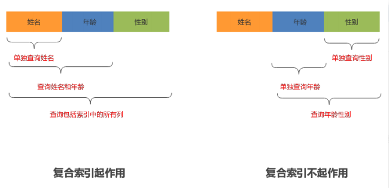

[TOC]

# 索引相关

索引是一种用于快速查询和检索数据的数据结构。常见的索引结构有: B树， B+树和Hash。

**优点**

- 减少的检索的数据量，加快数据的检索速度（大大）。 另外，通过创建唯一性索引，可以保证数据库表中每一行数据的唯一性。

**缺点**

- 创建索引和维护索引需要耗费许多时间：当对表中的数据进行增删改的时候，如果数据有索引，那么索引也需要动态的修改，会降低SQL执行效率。

- 占用物理存储空间 ：索引需要使用物理文件存储，也会耗费一定空间。

## 索引类型

Mysql索引类型有如下几种：

- 按索引存储结构划分：B Tree索引，Hash 索引， FULLTEXT全文索引，R Tree 索引
- 从应用层次划分：普通索引，唯一索引，主键索引，复合索引
- 从索引键值类型划分：主键索引，辅助索引（二级索引）
- 从数据存储和索引键值逻辑关系划分：聚簇索引，非聚簇索引

### 普通索引

最基础的索引类型，基于普通字段建立的索引，没有任何限制。

创建普通索引的方式有如下几种：

```
CREATE INDEX <索引的名字> ON TABLE_NAME (字段名);
ALTER TABLE TABLE_NAME ADD INDEX <索引的名字> (字段名);
alter table table_name drop index (字段名);
```

### 唯一索引

与普通索引类似，不同的是：索引字段必须唯一，但允许有空值。
在创建或者修改表时追加唯一约束，就会自动创建对应的唯一索引。

创建唯一索引的方法如下：

```
CREATE UNIQUE INDEX <索引名字> ON TABLE_NAME (字段名);
ALTER TABLE TABLE_NAME ADD UNIQUE INDEX <索引名字> (字段名);
```

### 主键索引

主键索引是一种特殊的唯一索引，它不允许有空值。
在创建或者修改表时追加主键约束即可，**每个表只能有一个主键。**

创建主键索引的方法如下：

```
ALTER TABLE TABLE_NAME ADD PRIMARY KEY (字段名);
```

### 复合索引

单一索引是指索引列为一列的情况，即新建索引的语句只实施在一列上；

用户可以在多个列上建立索引，这种索引叫做组复合索引（组合索引）。复合索引可以代替多个单一索引，相比多个单一索引复合 索引所需的开销更小。

索引同时有两个概念叫做窄索引和宽索引。

- 窄索引是指索引列为1-2列的索引
- 宽索引也就是索引列超 过2列的索引

设计索引的一个重要原则就是能用窄索引不用宽索引，因为窄索引往往比组合索引更有效。

创建组合索引的方法如下：

```
CREATE INDEX <索引的名字> ON tablename (字段名1，字段名2...); 
ALTER TABLE tablename ADD INDEX [索引的名字] (字段名1，字段名2...);
```

> **注意：**何时使用复合索引，要根据where条件建索引，注意不要过多使用索引，过多使用会对更新操作效 率有很大影响。 如果表已经建立了(col1，col2)，就没有必要再单独建立（col1）；如果现在有(col1)索引，如果查 询需要col1和col2条件，可以建立(col1,col2)复合索引，对于查询有一定提高。

### 全文索引

查询操作在数据量较少时，可以采用 like 模糊查询的方式。但是对于大量文本数据的查询，效率就有些低了。这时可以采用全文索引的方式进行优化。

在 Mysql 5.6之前的版本中，只有 MyISAM 存储引擎支持全文索引，在之后的版本中 InnoDB 引擎也开始支持全文索引。

创建全文索引的方法有如下几种：

```
CREATE FULLTEXT INDEX <索引的名字> ON TABLE_NAME (字段名);
ALTER TABLE TABLE_NAME ADD FULLTEXT <索引的名字> (字段名);
```

使用方式如下：

```
select * from table_name 
	where match(字段名) against('匹配字符');

select * from user 
	where match(name) against('zhang');
```

> 全文索引必须在字符串，文本字段上建立。
>
> 全文索引字段值必须在最小字符和最大字符之间才有效。（innoDB：3-84， myisam：4-84）
>
> 全文索引字段要进行切词处理，按syntax字符进行切割，例如baaa切分为b和aaa
>
> 全文索引匹配查询，默认使用的是等值匹配，如果想要匹配更多的结果，可以在布尔模式下搜索 a*

```
select * from user 
	where match(name) against ('a*' in boolean mode);
```

### 聚簇索引和辅助索引

聚簇索引和非聚簇索引：B+Tree的叶子节点存放主键索引值和行记录就属于聚簇索引；如果索引值和行 记录分开存放就属于非聚簇索引。

主键索引和辅助索引：B+Tree的叶子节点存放的是主键字段值就属于主键索引；如果存放的是非主键值 就属于辅助索引（二级索引）。

在InnoDB引擎中，主键索引采用的就是聚簇索引结构存储。

**聚簇索引（聚集索引）**

聚簇索引是一种数据存储方式，InnoDB的聚簇索引就是按照主键顺序构建 B+Tree结构。B+Tree 的叶子节点就是行记录，行记录和主键值紧凑地存储在一起。 这也意味着 InnoDB 的主键索引就 是数据表本身，它按主键顺序存放了整张表的数据，占用的空间就是整个表数据量的大小。通常说 的主键索引就是聚集索引。 

InnoDB的表要求必须要有聚簇索引： 

- 如果表定义了主键，则主键索引就是聚簇索引 
- 如果表没有定义主键，则第一个非空unique列作为聚簇索引 
- 否则InnoDB会从建一个隐藏的row-id作为聚簇索引 

**辅助索引** 

InnoDB辅助索引，也叫作二级索引，是根据索引列构建 B+Tree结构。但在 B+Tree 的叶子节点中 只存了索引列和主键的信息。二级索引占用的空间会比聚簇索引小很多， 通常创建辅助索引就是 为了提升查询效率。一个表InnoDB只能创建一个聚簇索引，但可以创建多个辅助索引。


**非聚簇索引** 

与InnoDB表存储不同，MyISAM数据表的索引文件和数据文件是分开的，被称为非聚簇索引结构


## 索引原理

MySQL官方对索引定义：是存储引擎用于快速查找记录的一种数据结构。需要额外开辟空间和数据维护 工作。

索引是物理数据页存储，在数据文件中（InnoDB，ibd文件），利用数据页(page)存储。 索引可以加快检索速度，但是同时也会降低增删改操作速度，索引维护需要代价。

索引涉及的理论知识：二分查找法、Hash和B+Tree。

### 二分查找法

二分查找法也叫作折半查找法，它是在有序数组中查找指定数据的搜索算法。

- 优点：等值查询、范围查询性能优秀。
- 缺点：更新数据、新增数据、删除数据维护成本高。

**流程**

- 首先定位left和right两个指针
- 计算(left+right)/2 
- 判断除2后索引位置值与目标值的大小比对 
- 索引位置值大于目标值就-1，right移动；如果小于目标值就+1，left移动

举个例子，下面的有序数组有17 个值，查找的目标值是7，过程如下

第一次查找


第二次查找


第三次查找


第四次查找


### Hash 查找

Hash底层实现是由Hash表来实现的，是根据键值 <key,value> 存储数据的结构。非常适合根据key查找 value值，也就是单个key查询，或者说等值查询。其结构如下所示：


从上面结构可以看出，Hash索引可以方便的提供等值查询，**但是对于范围查询就需要全表扫描了。** 

Hash索引在MySQL 中Hash结构主要应用在Memory原生的Hash索引 、InnoDB 自适应哈希索引。

InnoDB自适应哈希索引是为了提升查询效率，InnoDB存储引擎会监控表上各个索引页的查询，当 InnoDB注意到某些索引值访问非常频繁时，会在内存中基于B+Tree索引再创建一个哈希索引，使得内存中的 B+Tree 索引具备哈希索引的功能，即能够快速定值访问频繁访问的索引页。 

InnoDB自适应哈希索引：在使用Hash索引访问时，一次性查找就能定位数据，等值查询效率要优于 B+Tree。

自适应哈希索引的建立使得InnoDB存储引擎能自动根据索引页访问的频率和模式自动地为某些热点页 建立哈希索引来加速访问。另外InnoDB自适应哈希索引的功能，用户只能选择开启或关闭功能，无法进行人工干涉。

### B Tree 索引

MySQL数据库索引采用的是B+Tree结构，在B-Tree结构上做了优化改造。 

**B- Tree结构** 

- 索引值和data数据分布在整棵树结构中 
- 每个节点可以存放多个索引值及对应的data数据 
- 树节点中的多个索引值从左到右升序排列


B树的搜索：从根节点开始，对节点内的索引值序列采用二分法查找，如果命中就结束查找。没有命中会进入子节点重复查找过程，直到所对应的的节点指针为空，或已经是叶子节点了才结束。 

**B+ Tree结构** 

- 非叶子节点不存储data数据，只存储索引值，这样便于存储更多的索引值 
- 叶子节点包含了所有的索引值和data数据 

- 叶子节点用指针连接，提高区间的访问性能


相比B树，B+树进行范围查找时，只需要查找定位两个节点的索引值，然后利用叶子节点的指针进 行遍历即可。而B树需要遍历范围内所有的节点和数据，显然B+Tree效率高。 

### 回表查询
InnoDB索引有聚簇索引和辅助索引。聚簇索引的叶子节点存储行记录，InnoDB必须要有，且只有一个。辅助索引的叶子节点存储的是主键值和索引字段值，通过辅助索引无法直接定位行记录，通常情况下，需要扫码两遍索引树。先通过辅助索引定位主键值，然后再通过聚簇索引定位行记录，这就叫做回表查询，它的性能比扫一遍索引树低。

总结：通过索引查询主键值，然后再去聚簇索引查询记录信息

### 覆盖索引

只需要在一棵索引树上就能获取SQL所需的所有列数据，无需回表，速度更快，这就叫做索引覆盖。

实现索引覆盖最常见的方法就是：将被查询的字段，建立到组合索引。

### 最左前缀原则

复合索引使用时遵循最左前缀原则，最左前缀顾名思义，就是最左优先，即查询中使用到最左边的列，那么查询就会使用到索引，如果从索引的第二列开始查找，索引将失效。



## 索引分析（Explain）

MySQL 提供了一个 EXPLAIN 命令，它可以对 SELECT 语句进行分析，并输出 SELECT 执行的详细信 息，供开发人员有针对性的优化。例如：

```
EXPLAIN SELECT * from user WHERE id < 3;
```

EXPLAIN 命令的输出内容大致如下：


**select_type** 

表示查询的类型。常用的值如下： 

- SIMPLE ： 表示查询语句不包含子查询或union 
- PRIMARY：表示此查询是外层的查询 
- UNION：表示此查询是UNION的第二个或后续的查询
- DEPENDENT UNION：UNION中的第二个或后续的查询语句，使用了外面查询结果 
- UNION RESULT：UNION的结果 
- SUBQUERY：SELECT子查询语句 
- DEPENDENT SUBQUERY：SELECT子查询语句依赖外层查询的结果。

常见的查询类型是SIMPLE，表示我们的查询没有子查询也没用到UNION查询。

**type**

表示存储引擎查询数据时采用的方式。比较重要的一个属性，通过它可以判断出查询是全表扫描还 是基于索引的部分扫描。常用属性值如下，从上至下效率依次增强。 

- ALL：表示全表扫描，性能差。 
- index：表示基于索引的全表扫描，先扫描索引再扫描全表数据。 
- range：表示使用索引范围查询。使用>、>=、<、<=、in等等。  
- ref：表示使用非唯一索引进行单值查询。 
- eq_ref：一般情况下出现在多表join查询，表示前面表的每一个记录，都只能匹配后面表的一 行结果。 
- const：表示使用主键或唯一索引做等值查询，常量查询。 
- NULL：表示不用访问表，速度快。 

**possible_keys** 

表示查询时能够使用到的索引。注意并不一定会真正使用，显示的是索引名称。 

**key** 

表示查询时真正使用到的索引，显示的是索引名称。 

**rows** 

MySQL查询优化器会根据统计信息，估算SQL要查询到结果需要扫描多少行记录。原则上rows是 越少效率越高，可以直观的了解到SQL效率高低。 

**key_len** 

表示查询使用了索引的字节数量。可以判断是否全部使用了组合索引。 key_len的计算规则如下： 

- 字符串类型 
  - 字符串长度跟字符集有关：latin1=1、gbk=2、utf8=3、utf8mb4=4 
  - char(n)：n*字符集长度 
  - varchar(n)：n * 字符集长度 + 2字节 
- 数值类型 
  - TINYINT：1个字节 
  - SMALLINT：2个字节 
  - MEDIUMINT：3个字节 
  - INT、FLOAT：4个字节 
  - BIGINT、DOUBLE：8个字节 
- 时间类型 
  - DATE：3个字节 
  - TIMESTAMP：4个字节 
  - DATETIME：8个字节 
- 字段属性 
  - NULL属性占用1个字节，如果一个字段设置了NOT NULL，则没有此项。

**Extra** 

Extra表示很多额外的信息，各种操作会在Extra提示相关信息，常见几种如下：

- Using where 表示查询需要通过索引回表查询数据。 
- Using index 表示查询需要通过索引，索引就可以满足所需数据。 
- Using filesort 表示查询出来的结果需要额外排序，数据量小在内存，大的话在磁盘，因此有Using filesort 建议优化。 
- Using temprorary 查询使用到了临时表，一般出现于去重、分组等操作。


## 问题总结

### MySQL在使用like模糊查询时，索引能不能起作用？

MySQL在使用Like模糊查询时，索引是可以被使用的，只有把%字符写在后面才会使用到索引。

```
select * from user where name like '%o%'; //不起作用
select * from user where name like 'o%'; //起作用
select * from user where name like '%o'; //不起作用
```

### 如果MySQL表的某一列含有NULL值，那么包含该列的索引是否有效？

对MySQL来说，NULL是一个特殊的值，从概念上讲，NULL意味着“一个未知值”，它的处理方式与其他值有些不同。比如：不能使用=，<，>这样的运算符，对NULL做算术运算的结果都是NULL，count时不会包括NULL行等，NULL比空字符串需要更多的存储空间等。

NULL列需要增加额外空间来记录其值是否为NULL。对于MyISAM表，每一个空列额外占用一位，四舍五入到最接近的字节。

虽然MySQL可以在含有NULL的列上使用索引，但NULL和其他数据还是有区别的，不建议列上允许为NULL。最好设置NOT NULL，并给一个默认值，比如0和 ‘’ 空字符串等，如果是datetime类型，也可以设置系统当前时间或某个固定的特殊值，例如'1970-01-01 00:00:00'。

### 为什么唯一索引的插入速度比不上普通索引？

这个问题就要从Insert Buffer开始讲起了，在进行非聚簇索引的插入时，先判断插入的索引页是否在内存中。如果在，则直接插入；如果不在，则先放入Insert Buffer 中，然后再以一定频率和情况进行Insert Buffer和原数据页合并(merge)操作。
这么做的优点:能将多个插入合并到一个操作中，就大大提高了非聚簇索引的插入性能。
InnoDB 从 1.0.x 版本开始引入了 Change Buffer，可以算是对 Insert Buffer 的升级。从这个版本开始，InnoDB 存储引擎可以对 insert、delete、update 都进行缓存。
**唯一索引的插入比普通索引慢的原因就是:**
唯一索引无法利用Change Buffer
普通索引可以利用Change Buffer
**为什么唯一索引的更新不使用 Change Buffer？**
因为唯一索引为了保证唯一性，需要将数据页加载进内存才能判断是否违反唯一性约束。但是，既然数据页都加载到内存了，还不如直接更新内存中的数据页，没有必要再使用Change Buffer。
为什么唯一索引的查找速度比普通索引快？
最后回答一下，唯一索引的搜索速度比普通索引快的原因就是:
普通索引在找到满足条件的第一条记录后，还需要判断下一条记录，直到第一个不满足条件的记录出现。
唯一索引在找到满足条件的第一条记录后，直接返回，不用判断下一条记录了。

### 为什么 B+ 树比 B 树更适合应用于数据库索引？

https://leetcode-cn.com/circle/discuss/F7bKlM/

### 索引的创建原则

最适合索引的列是出现在 WHERE 子句中的列，或连接子句中的列，而不是出现在 SELECT 关键字后的列。

索引列的基数越大，索引效果越好。

根据情况创建复合索引，复合索引可以提高查询效率。

因为复合索引的基数会更大。

避免创建过多的索引，索引会额外占用磁盘空间，降低写操作效率。

主键尽可能选择较短的数据类型，可以有效减少索引的磁盘占用提高查询效率。

对字符串进行索引，应该定制一个前缀长度，可以节省大量的索引空间。

### MySQL 索引的“使用”注意事项？

应尽量避免在 WHERE 子句中使用 != 或 <> 操作符、使用 OR 来连接条件、对字段进行表达式操作、对字段进行函数操作，否则将引擎放弃使用索引而进行全表扫描。优化器将无法通过索引来确定将要命中的行数,因此需要搜索该表的所有行。

>  注意，column IS NULL 也是不可以使用索引的。

不要在 WHERE 子句中的 = 左边进行函数、算术运算或其他表达式运算，否则系统将可能无法正确使用索引。

复合索引遵循前缀原则。

如果 MySQL 评估使用索引比全表扫描更慢，会放弃使用索引。如果此时想要索引，可以在语句中添加强制索引。

列类型是字符串类型，查询时一定要给值加引号，否则索引失效。

LIKE 查询，% 不能在前，因为无法使用索引。如果需要模糊匹配，可以使用全文索引。

### Mysql 中数据库索引的工作机制是什么？

数据库索引，是数据库管理系统中一个排序的数据结构，以协助快速查询、更新数据库表中数据。索引的实现通常使用B树及其变种B+树

### 聚集索引和非聚集索引的区别

聚集索引：表数据按照索引的顺序存储，索引的顺序和表中记录的物理顺序一致。叶子节点存储了真实的数据行，不再有另外单独的数据页。一张表中最多只能创建一个聚集索引，因为真实数据的物理顺序只能有一种。

非聚集索引：索引的逻辑顺序和数据存储的物理顺序无关，叶子节点包含索引字段值及指向数据页数据行的逻辑指针，其行数量与数据表行数据量一致。

## 唯一性索引和主键索引的区别

- 主键索引只能创建一个，唯一索引可以创建多个
- 主键索引列不能是空值，唯一索引列可以为空值
- 主键索引严格来讲就是表的主键，是一种约束；唯一索引是一种索引，它是一种数据结构，二者有本质的差别
- 主键索引可以作为其他表的外键，而唯一索引不可以
- 主键一定会创建一个唯一索引，但有唯一索引的列不一定是主键

