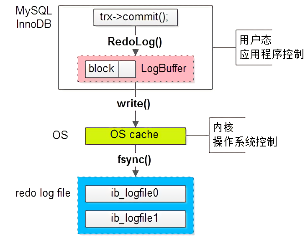

[TOC]


## 什么是数据库事务

在执行SQL语句的时候，某些业务要求，一系列操作必须全部执行，而不能仅执行一部分。例如，一个转账操作：

```
-- 从id=1的账户给id=2的账户转账100元
-- 第一步：将id=1的A账户余额减去100
UPDATE accounts SET balance = balance - 100 WHERE id = 1;
-- 第二步：将id=2的B账户余额加上100
UPDATE accounts SET balance = balance + 100 WHERE id = 2;
```

这两条SQL语句必须全部执行，或者，由于某些原因，如果第一条语句成功，第二条语句失败，就必须全部撤销。

这种把多条语句作为一个整体进行操作的功能，被称为数据库*事务*。数据库事务可以确保该事务范围内的所有操作都可以全部成功或者全部失败。如果事务失败，那么效果就和没有执行这些SQL一样，不会对数据库数据有任何改动。

数据库事务的特性：ACID

## ACID

**原子性：**事务是一个原子操作单元，其对数据的修改，要么全都执行，要么全都不执行。

**一致性：**指的是事务开始之前和事务结束之后，数据库的完整性限制未被破坏。一致性包括两方面的内 容，分别是约束一致性和数据一致性。

**隔离性：**指的是一个事务的执行不能被其他事务干扰，即一个事务内部的操作及使用的数据对其他的并 发事务是隔离的。

**持久性：**指的是一个事务一旦提交，它对数据库中数据的改变就应该是永久性的，后续的操作或故障不 应该对其有任何影响，不会丢失。

## 并发事务会引发哪些问题？如何解决？

**丢失更新：**当两个或多个事务更新同一行记录，会产生更新丢失现象。可以分为回滚覆盖和提交覆盖。

- 回滚覆盖：一个事务回滚操作，把其他事务已提交的数据给覆盖了。 
- 提交覆盖：一个事务提交操作，把其他事务已提交的数据给覆盖了。

**脏读：**读到了数据库中未提交的数据。（读未提交）。事务T1读到了事务T2未提交的数据，并对该数据进行操作然后提交，但是事务T2对撤销了该事务，导致事务T1操作的是错误的数据。

**不可重复读：**一个事务T1在读取表中的数据后，另一个事务T2对表中的数据进行了修改，多次读取的结果不一样

**幻读：**一个事务T1读取按一定条件读取数据库中的某些数据后，另一个事务T2插入或者删除了一些记录，当T1再次读取该数据库时，出现了前后不一致的情况。（事务T1对表的全部数据进行了修改，事务T2在表里插入了一些数据，导致事务T1再次操作该表时，发现还有未修改的数据，好像出现了幻觉一样）

## 不可重复读和幻读的区别

不可重复读：由于数据修改引起的，

幻读：由于数据插入和删除引起的，在可重复读中，sql第一次读取数据后，就将这些数据加锁，其他事物无法修改这些数据，但是可以insert数据，所以事务A先前读取了数据，或者修改了全部数据，事务B还是可以insert数据，这是事务A就会发现多了一条数据，这就是幻读

##  Mysql 中 InnoDB 支持的四种事务隔离级别名称，以及逐级之间的区别？

隔离级别：四种隔离级别（读未提交、读已提交、可重复读、串行化）

- **读未提交：**解决了回滚覆盖类型的更新丢失，隔离级别最低，会引发脏读、不可重复读和幻读
- **读已提交：**读到的都是已提交的数据，会引发不可重复读和幻读
- **可重复读：**解决了不可重复读，它确保同一事务的多个实例在并发读取数据 时，会看到同样的数据行。避免了脏读、不可重复读，会引发幻读
- **串行化：**所有的增删改查串行执行。它通过强制事务排序，解决相互冲突，从而解决 幻度的问题。这个级别可能导致大量的超时现象的和锁竞争，效率低下。


数据库的事务隔离级别越高，并发问题就越小，但是并发处理能力越差（代价）。读未提交隔离级别最 低，并发问题多，但是并发处理能力好。以后使用时，可以根据系统特点来选择一个合适的隔离级别， 比如对不可重复读和幻读并不敏感，更多关心数据库并发处理能力，此时可以使用Read Commited隔 离级别。 事务隔离级别，针对Innodb引擎，支持事务的功能。像MyISAM引擎没有关系。

**mysql的默认隔离级别是：可重复读。**myISAM和InnoDB都支持表级锁，但Innodb默认是行级锁。

**oracle**支持读已提交和串行化两种隔离级别，**默认情况是读已提交**

## Mysql 事务实现的底层原理

MySQL 的隔离性是通过锁机制来保证的，而原子性、一致性和持久性则是通过数据库的预写式日志（Write-Ahead Logging，WAL），具体来说是 redo log 和 undo log 来保证的。

### redo log

redo log 也就是重做日志，用来实现事务的持久性，即 ACID 中的 D。我们知道 InnoDB 存储引擎是以页为单位来管理存储空间的，我们的增删改查等操作本质上都是在访问和操作数据页，而在真正访问数据页之前，需要先把磁盘上的数据页读到内存中，具体来说是 Buffer Pool 中。为了保证持久性（就是对于一个已经提交的事务，即使系统发生了崩溃，这个事务对数据库所做的更改也不能丢失），需要把内存中的修改同步回磁盘（fsync），一个简单的做法就是在事务提交之前将该事务所修改的所有页面都刷新到磁盘，但是这个简单粗暴的做法有几个问题。

- 刷新一个完整的数据页过于浪费。有时我们可能仅仅修改了数据页中的一个字节，但是在事务提交之前却不得不将一个完整的数据页从内存刷新到磁盘。
- 随机 IO 刷新比较慢。一个事务可能包含多条语句，即使是一条语句也有可能需要修改多个数据页，而且修改的这些页面也有可能并不相邻，这就意味着将它们刷新到磁盘时，需要进行很多随机 IO，而随机 IO 要比顺序 IO 慢很多。

其实我们没有必要在每次事务提交时就把内存中所有修改过的页面都刷新到磁盘上，我们只需要把修改了哪些东西记录一下即可。比方说某个事务将系统表空间的第 100 号页面中的偏移量为 1000 的那个字节的值由 1 改为了 2，我们只需要记录这个即可。这样即使系统突然崩溃了，在重启之后只要按照上述内容重新更新一下数据页，系统就能恢复该事务对数据库所做的修改。

这样做有很多好处。

- redo 日志所占用的空间很小。存储表空间的 ID、页号、偏移量以及需要更新的值，这些内容所需要的存储空间很小。同时并发的事务共享 redo log 存储空间，它们的 redo log 按照语句的执行顺序，依次交替地记录在一起，以减少日志占用的空间。
- redo 日志其实是**批量写入**的。事务对数据页所做的更改不会直接写入日志文件，而是先写入 redo log buffer，然后再将 buffer 中的数据以每秒钟一次的频率一并写入日志文件中。
- 同时 redo log 只进行**顺序追加**的操作，也就是说它使用的是**顺序 IO**，因此性能更好。

### 数据丢失的问题

对于随机写性能差的情况，常见的优化方法有两个：

- 一个是先写日志，将随机写优化为顺序写；

- 另一个就是将单次写优化为批量写。既然要实现批量写，就需要引入缓存。

  这里使用沈剑老师的图来展示 redo log 的三层架构。



redo log 最终落盘的流程为：首先，事务提交时，会将对数据页的修改写入 log buffer。接着只有当 MySQL 发起系统调用写文件时，log buffer 中的数据才会写到系统缓存中。最后在写文件的系统调用完成后，还需要调用 fsync 方法落盘，这也是最慢的一步。如果不进行 flush，那么什么时候落盘是由操作系统决定的。

在 redo log 的三层架构中，MySQL 做了一次批量写优化，操作系统也做了一次批量写优化，这样确实能够提升性能，但是缺点也很明显。MySQL 在事务提交时，将 redo log 写入缓存中后，就会认为事务提交成功。如果 MySQL 在 log buffer 中的数据在写入操作系统缓存之前就崩溃了，那么就会出现数据丢失。同样的，如果在操作系统的缓存没有落盘之前，系统崩溃，那么也会出现数据丢失。

对于有的业务来说，可能允许性能较低但不允许数据丢失；而有的业务可能必须要高性能高吞吐，但是可以能够容忍少量的数据丢失。MySQL 提供了一个 `innodb_flush_log_at_trx_commit` 参数，通过它可以控制事务提交时 redo log 的刷新策略，从而适应不同的业务需要。

| 值   | 目的             | 描述                                                         |
| :--- | :--------------- | :----------------------------------------------------------- |
| 0    | 最佳性能         | 此时每隔一秒才会将 log buffer 中的数据批量地写入到操作系统缓存中，同时 MySQL 会主动调用 fsync。如果数据库发生崩溃，这种策略可能会导致 1 秒的数据丢失 |
| 1    | 强一致性         | 每次事务提交时，都会将 log buffer 中的数据写入到操作系统缓存中，同时 MySQL 会主动调用 fsync。**这种策略是 MySQL 默认的策略** |
| 2    | 平衡性能与一致性 | 每次事务提交时，都会将 log buffer 中的数据写入到操作系统缓存中，然后每隔一秒主动调用 fsync 将操作系统缓存落盘，由于操作系统也会不定时地调用 fsync，所以在这种策略下，如果操作系统崩溃，那么最多也就丢失 1 秒的数据，而操作系统与数据库相比，出现崩溃的概率更低 |

### undo log

重做日志记录了事务的行为，通过它可以对数据页进行重做操作。但是事务有时还需要进行回滚，这时就需要记录回滚前的状态，比如插入一条记录，那么至少要把这条记录的主键值记录下来；修改一条记录，至少要把修改前的旧值记录下来。因此在对数据库进行修改时，InnoDB 存储引擎不但会产生 redo，还会产生一定量的 undo。这样如果用户执行的事务或者语句由于某种原因失败了，又或者用户使用 ROLLBACK 语句请求回滚，就可以利用这些 undo 信息将数据回滚到修改之前的状态。

Undo Log产生和销毁：Undo Log在事务开始前产生；事务在提交时，并不会立刻删除undo log，innodb会将该事务对应的undo log放入到删除列表中，后面会通过后台线程purge thread进 行回收处理。Undo Log属于逻辑日志，记录一个变化过程。

Undo Log存储：undo log采用段的方式管理和记录。在innodb数据文件中包含一种rollback segment回滚段，内部包含1024个undo log segment。可以通过下面一组参数来控制Undo log存 储。

```
show variables like '%innodb_undo%';
```

**Undo Log作用** 

- 实现事务的原子性 Undo Log 是为了实现事务的原子性而出现的产物。事务处理过程中，如果出现了错误或者用户执 行了 ROLLBACK 语句，MySQL 可以利用 Undo Log 中的备份将数据恢复到事务开始之前的状态。 
- 实现多版本并发控制（MVCC） Undo Log 在 MySQL InnoDB 存储引擎中用来实现多版本并发控制。事务未提交之前，Undo Log 保存了未提交之前的版本数据，Undo Log 中的数据可作为数据旧版本快照供其他并发事务进行快 照读。
