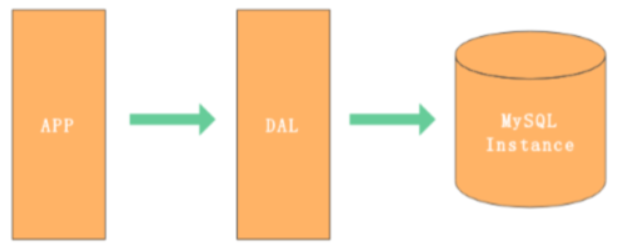
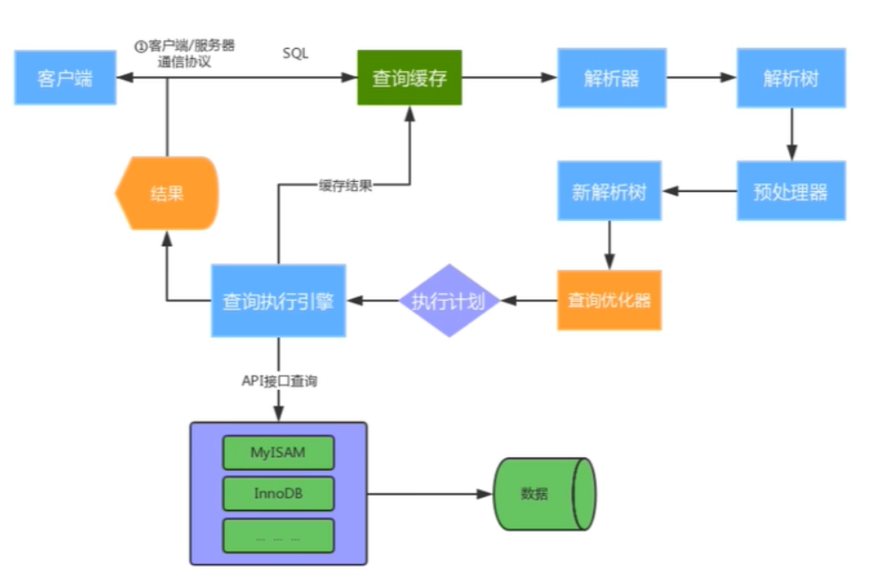

## Mysql 应用架构演变

一个简单的网站架构一般包含以下几层

用户请求 -->应用层 --> 服务层 --> 存储层

- 用户请求-->应用层的优化：nginx + tomcat集群进行优化
- 应用层-->服务层的优化：分布式，微服务
- 服务层-->存储层：数据库存储及优化

网站在不同的并发访问量和数据量级下，MySQL应用架构的演变过程。

### 架构V1.0 - 单机单库

一个简单的网站或者应用，背后的架构可以非常简单，数据存储只需要一个MySQL Instance 就能满足数据读取和写入需求（这里忽略掉了数据备份的Instance），处于这个阶段的系统，一般会把所有的信息都存到一个MySQL Instance里面。

> DAL （Data Access Layer）数据访问层
>
> 主要功能：负责数据库的访问。简单的说就是实现对数据表的CRUD

#### V1.0 瓶颈

- 数据量太大，超出一台服务器承受能力范围
- 读写数据量太大，超出一台服务器承受能力范围
- 可用性太差，一台服务器挂掉，应用也会挂掉

### 架构V2.0 - 主从架构

V2.0 架构主要解决架构V1.0下的**高可用**和**读扩展**问题，通过给Instance挂载从库解决读取的压力，主库宕机也可以通过主从切换保障高可用。在MySQL的场景下就是通过主从结构（爽主结构也属于特殊的主从结构），主库抗写压力，通过从库来分担读压力，对于写少读多的应用，V2.0主从架构完全能够胜任。

#### V2.0 瓶颈

- 数据量太大，超过一台服务器承受能力范围
- 写操作太多，超出一台服务器的承受能力范围

### 架构V3.0 - 分库分表

对于V1.0 和 V2.0遇到写入瓶颈和存储瓶颈时，可以通过水平拆分来解决，水平拆分和垂直拆分有较大的区别，垂直拆分完的结果，每个Instance都拥有完整的数据，而水平拆分之后，任何实例都只有全量的 1/n 的数据。下图所示，将UserInfo 拆分为3个Sharding，每个Sharding持有总量的 1/3数据，3个Sharding数据的总和等于一份完整数据。

#### V3.0架构的挑战

- 数据如何路由（分片）

- - 范围拆分
  - List 拆分
  - Hash 拆分

- 数据库一致性

### V4.0 云数据库

云数据库（云计算）现在是各大IT公司内部作为节约成本的一个突破口，对于数据存储的MySQL来说，如何让其成为Saas（Software as a Service）是关键点。MySQL作为一个Saas服务，服务提供商负责解决可配置性，可扩展性，多用户存储结构设计等这些疑难问题。

## Mysql 基础架构

## Mysql 体系架构

MySQL Server架构自顶向下大致可以分网络连接层、服务层、存储引擎层和系统文件层。

### 网络连接层

客户端连接器（Client Connectors）：提供与MySQL服务器建立的支持。目前几乎支持所有主流 的服务端编程技术，例如常见的 Java、C、Python、.NET等，它们通过各自API技术与MySQL建立链接

### 服务层（MySQL Server）

服务层是MySQL Server的核心，主要包含系统管理和控制工具、连接池、SQL接口、解析器、查询优 化器和缓存六个部分。

- **连接池（Connection Pool）：**负责存储和管理客户端与数据库的连接，一个线程负责管理一个连接。

- - Authentication 权限控制
  - Thread Reuse 线程复用
  - Connection Limits 连接数限制
  - Check Memory 内存检查
  - Caches 缓存

- **系统管理和控制工具（Management Services & Utilities）：**例如备份恢复、安全管理、集群 管理等 
- **SQL接口（SQL Interface）：**用于接受客户端发送的各种SQL命令，并且返回用户需要查询的结果。比如DML、DDL、存储过程、视图、触发器等。 

> DML (Data Manipulation Language) 数据操纵语言。用户通过它可以实现对数据库的基本操作。
>
> DDL

- **解析器（Parser）：**负责将请求的SQL解析生成一个"解析树"。然后根据一些MySQL规则进一步检查解析树是否合法。 
- **查询优化器（Optimizer）：**当“解析树”通过解析器语法检查后，将交由优化器将其转化成执行计 划，然后与存储引擎交互。

> select uid,name from user where gender=1; 
>
> 选取 --> 投影 --> 联接 策略 
>
> 1）select先根据where语句进行**选取**，并不是查询出全部数据再过滤 
>
> 2）select查询根据uid和name进行属性**投影**，并不是取出所有字段 
>
> 3）将前面选取和**投影**联接起来终生成查询结果 

- **缓存（Cache&Buffer）：** 缓存机制是由一系列小缓存组成的。比如表缓存，记录缓存，权限缓存，引擎缓存等。如果查询缓存有命中的查询结果，查询语句就可以直接去查询缓存中取数据。

### 存储引擎层

存储引擎负责MySQL中数据的存储与提取，与底层系统文件进行交互。MySQL存储引擎是插件式的， 服务器中的查询执行引擎通过接口与存储引擎进行通信，接口屏蔽了不同存储引擎之间的差异 。现在有 很多种存储引擎，各有各的特点，常见的是MyISAM和InnoDB。 

### 系统文件层

该层负责将数据库的数据和日志存储在文件系统之上，并完成与存储引擎的交互，是文件的物理存储 层。主要包含日志文件，数据文件，配置文件，pid 文件，socket 文件等。

#### 日志文件 

- 错误日志（Error log） 

- - 默认开启，show variables like '%log_error%' 

- 通用查询日志（General query log） 

- - 记录一般查询语句，show variables like '%general%'; 

- 二进制日志（binary log） 

- - 记录了对MySQL数据库执行的更改操作，并且记录了语句的发生时间、执行时长；但是它不 记录select、show等不修改数据库的SQL。
  - 主要用于数据库恢复和主从复制。 
  - show variables like '%log_bin%'; //是否开启 
  - show variables like '%binlog%'; //参数查看 
  - show binary logs;//查看日志文件 

- 慢查询日志（Slow query log）

- - 记录所有执行时间超时的查询SQL，默认是10秒。 
  - show variables like '%slow_query%'; //是否开启 
  - show variables like '%long_query_time%'; //时长 

- 配置文件 

- - 用于存放MySQL所有的配置信息文件，比如my.cnf、my.ini等。 

- 数据文件 

- - db.opt 文件：记录这个库的默认使用的字符集和校验规则。 
  - frm 文件：存储与表相关的元数据（meta）信息，包括表结构的定义信息等，每一张表都会 有一个frm 文件。 
  - MYD 文件：MyISAM 存储引擎专用，存放 MyISAM 表的数据（data)，每一张表都会有一个 .MYD 文件。 
  - MYI 文件：MyISAM 存储引擎专用，存放 MyISAM 表的索引相关信息，每一张 MyISAM 表对 应一个 .MYI 文件。 
  - ibd文件和 IBDATA 文件：存放 InnoDB 的数据文件（包括索引）。InnoDB 存储引擎有两种 表空间方式：独享表空间和共享表空间。独享表空间使用 .ibd 文件来存放数据，且每一张 InnoDB 表对应一个 .ibd 文件。共享表空间使用 .ibdata 文件，所有表共同使用一个（或多 个，自行配置）.ibdata 文件。 
  - ibdata1 文件：系统表空间数据文件，存储表元数据、Undo日志等 。 
  - ib_logfile0、ib_logfile1 文件：Redo log 日志文件。

- pid 文件 

- - pid 文件是 mysqld 应用程序在 Unix/Linux 环境下的一个进程文件，和许多其他 Unix/Linux 服务 端程序一样，它存放着自己的进程 id。 

- socket 文件 

- - socket 文件也是在 Unix/Linux 环境下才有的，用户在 Unix/Linux 环境下客户端连接可以不通过 TCP/IP 网络而直接使用 Unix Socket 来连接 MySQL。 

## SQL 运行机制

### ①建立连接

（Connectors&Connection Pool），通过客户端/服务器通信协议与MySQL建立连 接。MySQL 客户端与服务端的通信方式是 “ 半双工 ”。对于每一个 MySQL 的连接，时刻都有一个 线程状态来标识这个连接正在做什么。 

**通讯机制：** 

双工：能同时发送和接收数据，例如平时打电话。 

半双工：指的某一时刻，要么发送数据，要么接收数据，不能同时。例如早期对讲机 

单工：只能发送数据或只能接收数据。例如单行道 

**线程状态：**

show processlist; //查看用户正在运行的线程信息，root用户能查看所有线程，其他用户只能看自己的 

- id：线程ID，可以使用kill xx； user：启动这个线程的用户 
- Host：发送请求的客户端的IP和端口号 
- db：当前命令在哪个库执行 
- Command：该线程正在执行的操作命令 

- - Create DB：正在创建库操作 
  - Drop DB：正在删除库操作 
  - Execute：正在执行一个PreparedStatement 
  - Close Stmt：正在关闭一个PreparedStatement 
  - Query：正在执行一个语句 
  - Sleep：正在等待客户端发送语句 
  - Quit：正在退出 
  - Shutdown：正在关闭服务器 

- Time：表示该线程处于当前状态的时间，单位是秒 
- State：线程状态 

- - Updating：正在搜索匹配记录，进行修改 
  - Sleeping：正在等待客户端发送新请求 
  - Starting：正在执行请求处理 
  - Checking table：正在检查数据表 
  - Closing table : 正在将表中数据刷新到磁盘中 
  - Locked：被其他查询锁住了记录 
  - Sending Data：正在处理Select查询，同时将结果发送给客户端 

- Info：一般记录线程执行的语句，默认显示前100个字符。想查看完整的使用show full processlist; 

### ②查询缓存

（Cache&Buffer），这是MySQL的一个可优化查询的地方，如果开启了查询缓存且在 查询缓存过程中查询到完全相同的SQL语句，则将查询结果直接返回给客户端；如果没有开启查询 缓存或者没有查询到完全相同的 SQL 语句则会由解析器进行语法语义解析，并生成“解析树”。 

- 缓存Select查询的结果和SQL语句 
- 执行Select查询时，先查询缓存，判断是否存在可用的记录集，要求是否完全相同（包括参数值），这样才会匹配缓存数据命中。 
- 即使开启查询缓存，以下SQL也不能缓存 

- - 查询语句使用SQL_NO_CACHE 
  - 查询的结果大于query_cache_limit设置 
  - 查询中有一些不确定的参数，比如now() 

- show variables like '%query_cache%'; //查看查询缓存是否启用，空间大小，限制等 
- show status like 'Qcache%'; //查看更详细的缓存参数，可用缓存空间，缓存块，缓存多少等

### ③解析器

（Parser）将客户端发送的SQL进行语法解析，生成"解析树"。预处理器根据一些MySQL 规则进一步检查“解析树”是否合法，例如这里将检查数据表和数据列是否存在，还会解析名字和别名，看看它们是否有歧义，后生成新的“解析树”。 

### ④查询优化器

（Optimizer）根据“解析树”生成优的执行计划。MySQL使用很多优化策略生成 优的执行计划，可以分为两类：静态优化（编译时优化）、动态优化（运行时优化）。 

- 等价变换策略 

- - 5=5 and a>5 改成 a > 5 
  - a < b and a=5 改成b>5 and a=5 
  - 基于联合索引，调整条件位置等 

- 优化count、min、max等函数 

- - InnoDB引擎min函数只需要找索引左边 
  - InnoDB引擎max函数只需要找索引右边 
  - MyISAM引擎count(*)，不需要计算，直接返回 

- 提前终止查询 

- - 使用了limit查询，获取limit所需的数据，就不在继续遍历后面数据 

- in的优化 

- - MySQL对in查询，会先进行排序，再采用二分法查找数据。比如where id in (2,1,3)，变 成 in (1,2,3)  

### ⑤查询执行引擎负责执行 SQL 语句

此时查询执行引擎会根据 SQL 语句中表的存储引擎类型，以 及对应的API接口与底层存储引擎缓存或者物理文件的交互，得到查询结果并返回给客户端。若开 启用查询缓存，这时会将SQL 语句和结果完整地保存到查询缓存（Cache&Buffer）中，以后若有 相同的 SQL 语句执行则直接返回结果。 

- 如果开启了查询缓存，先将查询结果做缓存操作 
- 返回结果过多，采用增量模式返回

## Mysql innodb 页结构

- 各个数据⻚可以组成⼀个双向链表 
- ⽽每个数据⻚中的记录⼜可以组成⼀个单向链表 
  - 每个数据⻚都会为存储在它⾥边⼉的记录⽣成⼀个⻚⽬录，在通过主键查找某条记录的时候可 以在⻚⽬录中使⽤⼆分法快速定位到对应的槽，然后再遍历该槽对应分组中的记录即可快速找 到指定的记录 
  - 以其他列(⾮主键)作为搜索条件：只能从最⼩记录开始依次遍历单链表中的每条记录。 

所以说，如果我们写 select * from user where username='zhangsan' 这样没有进⾏任何优化的sql语句，默认 会这样做：

- 定位到记录所在的⻚ 需要遍历双向链表，
- 找到所在的⻚ 从所在的⻚内中查找相应的记录 
- 由于不是根据主键查询，只能遍历所在⻚的单链表了 

很明显，在数据量很⼤的情况下这样查找会很慢！看起来跟回表有点点像。