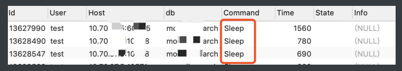
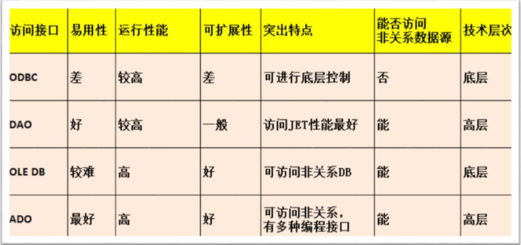
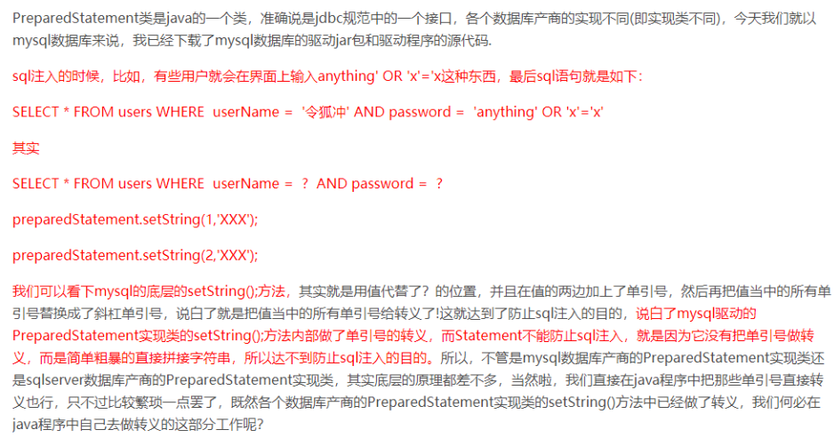

## mysql 和 oracle 的区别

https://www.cnblogs.com/bailing80/p/11440927.html

**(1) 对事务的提交**

   MySQL 默认是自动提交，而 Oracle 默认不自动提交，需要用户手动提交

**(2) 分页查询**

   MySQL 是直接在 SQL 语句中写 "select... from ...where...limit x, y", 有 limit 就可以实现分页; 而 Oracle 则是需要用到伪列 ROWNUM 和嵌套查询

**(3) 事务隔离级别**

​    MySQL 是 read commited 的隔离级别，而 Oracle 是 repeatable read 的隔离级别，同时二者都支持 serializable 串行化事务隔离级别，可以实现最高级别的

**(4) 对事务的支持**

   MySQL 在 innodb 存储引擎的行级锁的情况下才可支持事务，而 Oracle 则完全支持事务

**(5) 保存数据的持久性**

   MySQL 是在数据库更新或者重启，则会丢失数据，Oracle 把提交的 sql 操作线写入了在线联机日志文件中，保持到了磁盘上，可以随时恢复

**(6) 并发性**

   MySQL 以表级锁为主，对资源锁定的粒度很大，如果一个 session 对一个表加锁时间过长，会让其他 session 无法更新此表中的数据。

 虽然 InnoDB 引擎的表可以用行级锁，但这个行级锁的机制依赖于表的索引，如果表没有索引，或者 sql 语句没有使用索引，那么仍然使用表级锁。

 Oracle 使用行级锁，对资源锁定的粒度要小很多，只是锁定 sql 需要的资源，并且加锁是在数据库中的数据行上，不依赖与索引。所以 Oracle 对并

 发性的支持要好很多。

**(7) 逻辑备份**

   MySQL 逻辑备份时要锁定数据，才能保证备份的数据是一致的，影响业务正常的 dml 使用, Oracle 逻辑备份时不锁定数据，且备份的数据是一致

**(8) 复制**

   MySQL: 复制服务器配置简单，但主库出问题时，丛库有可能丢失一定的数据。且需要手工切换丛库到主库。

   Oracle: 既有推或拉式的传统数据复制，也有 dataguard 的双机或多机容灾机制，主库出现问题是，可以自动切换备库到主库，但配置管理较复杂。

**(9) 性能诊断**

   MySQL 的诊断调优方法较少，主要有慢查询日志。

   Oracle 有各种成熟的性能诊断调优工具，能实现很多自动分析、诊断功能。比如 awr、addm、sqltrace、tkproof 等   

**(10) 权限与安全**

   MySQL 的用户与主机有关，感觉没有什么意义，另外更容易被仿冒主机及 ip 有可乘之机。

   Oracle 的权限与安全概念比较传统，中规中矩。

**(11) 分区表和分区索引**

   MySQL 的分区表还不太成熟稳定。

   Oracle 的分区表和分区索引功能很成熟，可以提高用户访问 db 的体验。

**(12) 管理工具**

   MySQL 管理工具较少，在 linux 下的管理工具的安装有时要安装额外的包（phpmyadmin， etc)，有一定复杂性。

   Oracle 有多种成熟的命令行、图形界面、web 管理工具，还有很多第三方的管理工具，管理极其方便高效。

**(13) 最重要的区别**

   MySQL 是轻量型数据库，并且免费，没有服务恢复数据。

   Oracle 是重量型数据库，收费，Oracle 公司对 Oracle 数据库有任何服务。

**(13)自动增长的数据类型处理**

​     MYSQL 有自动增长的数据类型，插入记录时不用操作此字段，会自动获得数据值。ORACLE 没有自动增长的数据类型，需要建立一个自动增长的序列号，插入记录时要把序列号的下一个值赋于此字段。

**(14)单引号的处理**

​     MYSQL 里可以用双引号包起字符串，ORACLE 里只可以用单引号包起字符串。在插入和修改字符串前必须做单引号的替换：把所有出现的一个单引号替换成两个单引号

## 关系型和非关系型数据库的区别

关系型数据库是简单的表结构，优点：易于维护，使用方便，直接用sql语句进行查询，支持复杂的多表的连接查询；缺点：读写性能差，尤其是面对海量数据的高效率读写；固定的表结构，灵活性差；高并发读写需求，面临硬盘I/O的瓶颈

非关系型数据库：（包括四种：键值存储数据库Redis，列存储数据库HBase，文档数据库MongoDB CoachDB，图形数据库IinforGrid）优点：格式灵活，支持以上四种格式；速度快；扩展性好；容易部署。缺点：不支持事务，不支持sql，不利于对复杂的查询

## 数据库三范式是什么?

设计关系型数据库时，需要遵从不同的规范，设计合理的关系型数据库，不同的规范被称为不同的范式，各种范式呈递次规范，越高的范式数据库冗余约小。在关系型数据库中有六中范式：第一范式（1NF），第二范式（2NF），第三范式（3NF），BCNF，第四范式（4NF），第五范式(5NF)。一般数据库设计到第三范式就行了。

**第一范式**

确保数据表中每列（字段）的原子性。

如果数据表中每个字段都是不可再分的最小数据单元，则满足第一范式。

例如：user用户表，包含字段id,username,password

**第二范式**

在第一范式的基础上更进一步，目标是确保表中的每列都和主键相关。

如果一个关系满足第一范式，并且除了主键之外的其他列，都依赖于该主键，则满足第二范式。

例如：一个用户只有一种角色，而一个角色对应多个用户。则可以按如下方式建立数据表关系，使其满足第二范式。

user用户表，字段id,username,password,role_id

role角色表，字段id,name

用户表通过角色id（role_id）来关联角色表

**第三范式**

在第二范式的基础上更进一步，目标是确保表中的列都和主键直接相关，而不是间接相关。

例如：一个用户可以对应多个角色，一个角色也可以对应多个用户。则可以按如下方式建立数据表关系，使其满足第三范式。

user用户表，字段id,username,password

role角色表，字段id,name

user_role用户-角色中间表，id,user_id,role_id

像这样，通过第三张表（中间表）来建立用户表和角色表之间的关系，同时又符合范式化的原则，就可以称为第三范式。

## 范式和反范式的优缺点

**反范式：**违反范式规则的数据库设计理念

范式的优点和缺点：

- 范式化的更新操作通常比反范式化要快
- 当数据较好的范式化时，就只有很少或没有重复数据，所有只需要修改更少的数据
- 范式化的表通常更小，可以更好的存放在内存中，所以执行操作会更快
- 很少有多余的数据意味着检索列表数据时更少需要distinct或者group by 语句
- 范式化的缺点是通常表需要关联，稍微复杂一些的查询语句在符合范式的表上都可能需要至少一次的关联，可能会更多。这不但代价昂贵，也可能是一些索引策略无效。

反范式的优点和缺点：

- 反范式化的表因为所有的数据都在一张表中，可以很好的避免关联
- 如果不需要关联表，则对大部分查询最差的情况－即使表没有使用索引－是全表扫描。当数据比内存大时这可能比关联要快得多，因为这样避免了随机I/O。
- 关联会使的，在执行数据库语句时，使得需要在一个索引中又排序又过滤。如果采用反范式化组织数据将两张表的字段合并一下，并且增加一个索引，就可以不通过关联写出这个查询。
- 表格内的冗余较多，删除数据时候会造成表有些有用的信息丢失。

混用范式化和反范式化

- 完全范式和完全反范式在实际的开发中几乎不存在。
- 最常见的反范式化数据的方法是复制或者缓存，在不同的表中存储相同的特定列。在MySQL5.0和更新版中，可以使用触发器更新缓存值，这使得实现这样的方案变得更简单。
- 另一个从父表冗余一些数据到子表的理由是排序的需要
- 缓存衍生值也是有用的；就是说对于一些数量统计显示，可以单独设定一个子查询来计算并显示或者在主表中建立一个统计字段保存和更新这个值

## myisam 和 innodb 的区别？

**事务和外键**

- InnoDB支持事务和外键，具有安全性和完整性，适合大量insert或update操作
- MyISAM不支持事务和外键，它提供高速存储和检索，适合大量的select查询操作

**锁机制**

- InnoDB支持行级锁，锁定指定记录。**基于索引来加锁实现。**
- MyISAM支持表级锁，锁定整张表。

**索引结构**

- InnoDB使用聚集索引（聚簇索引），索引和记录在一起存储，既缓存索引，也缓存记录。
- MyISAM使用非聚集索引（非聚簇索引），索引和记录分开。

**并发处理能力**

- MyISAM使用表锁，会导致写操作并发率低，读之间并不阻塞，读写阻塞。
- InnoDB读写阻塞可以与隔离级别有关，可以采用多版本并发控制（MVCC）来支持高并发

**存储文件**

- InnoDB表对应两个文件，一个.frm表结构文件，一个.ibd数据文件。InnoDB表最大支持64TB；
- MyISAM表对应三个文件，一个.frm表结构文件，一个MYD表数据文件，一个.MYI索引文件。从MySQL5.0开始默认限制是256TB。

### 适用场景

#### MyISAM

- 不需要事务支持（不支持）
- 并发相对较低（锁定机制问题）
- 数据修改相对较少，以读为主
- 数据一致性要求不高

#### InnoDB  

需要事务支持（具有较好的事务特性）

行级锁定对高并发有很好的适应能力

数据更新较为频繁的场景

数据一致性要求较高

硬件设备内存较大，可以利用InnoDB较好的缓存能力来提高内存利用率，减少磁盘IO

### 总结

两种引擎该如何选择？

是否需要事务？有，InnoDB

是否存在并发修改？有，InnoDB

是否追求快速查询，且数据修改少？是，MyISAM

在绝大多数情况下，推荐使用InnoDB

## 数据库连接池的作用

**为什么会出现连接池：** 在操作数据库的时候，可能会出现频繁的建立连接、关闭连接的情况。这样会大大降低系统的性能。

**连接池：** 资源池是为了解决资源频繁分配和释放所造成的问题而出现的，应用在数据库管理领域就是建立一个数据库的连接池，当需要建立连接时，调用getConnection方法获得连接；当使用完毕时，通过releaseConnection方法直接返回，并不是释放连接，只是由连接池收回，以便下一次使用。

**作用：**

- 资源复用：数据库的连接得到了重用，避免了频繁的创建连接、释放连接引起的性能开销。在减少系统消耗的基础上，也增进了系统运行环境的平稳性。
- 更快的响应速度：数据库连接池在初始化的过程中，往往已经建立了若干数据库连接置于池中备用。此时连接的初始化工作已经完成。对于业务请求而言，直接利用现有的可用连接，避免了数据库连接初始化和释放过程的时间，从而缩短了系统整体响应的时间。
- 统一的连接管理，避免了数据库连接泄漏：在较完备的数据库连接池实现中，可以根据预先的连接占用超时设定，强制收回被占用的连接。从而避免了常规数据库连接操作中可能出现的资源泄露。

## 如何查看空闲连接列表

show processlist

下图就是我在⾃⼰的数据库表执⾏命令的结果，其中的Command列显示为Sleep 的这⼀⾏，就表示现在系统⾥⾯有⼀个空闲连接。



这⾥需要注意的是，我们数据库的客户端太久没响应，连接器就会⾃动断开了，这个时间参数 是wait_timeout控制住的，默认时⻓为8⼩时。 

断开后重连的时候会报错，如果你想再继续操作，你就需要重连了。

### 那除了重新链接，还有别的⽅式么？

使⽤⻓连接。 

但是这⾥有个缺点，使⽤⻓连接之后，内存会飙得很快，我们知道MySQL在执⾏过程中临时使⽤的内存 是管理在连接对象⾥⾯的。 

只有在链接断开的时候才能得到释放，那如果⼀直使⽤⻓连接，那就会导致OOM（Out Of Memory）， 会导致MySQL重启，在JVM⾥⾯就会导致频繁的Full GC。

也可以，定期断开⻓连接，使⽤⼀段时间后，或者程序⾥⾯判断执⾏过⼀个占⽤内存⽐较⼤的查询后就 断开连接，需要的时候重连就好了。

或者，执⾏⽐较⼤的⼀个查询后，执⾏mysql_reset_connection可以重新初始化连接资源。这个过程相⽐上 ⾯⼀种会好点，不需要重连，但是会初始化连接的状态。

## 数据库连接的几种常用方式



了解：https://zhuanlan.zhihu.com/p/67472219

## 如何高效处理大库DDL

https://www.cnblogs.com/mysql-dba/p/6192897.html

## Mysql 视图

视图是一个虚拟表，是从数据库中一个或多个表中导出来的表，其内容由查询定义。同真实表一样，视图包含一系列带有名称的列和行数据。但是，数据库中只存放了视图的定义，而并没有存放视图中的数据。这些数据存放在原来的表中。使用视图查询数据时，数据库系统会从原来的表中取出对应的数据。因此，视图中的数据是依赖于原来的表中的数据的。一旦表中的数据发生改变，显示在视图中的数据也会发生改变。

视图是存储在数据库中的查询的SQL语句，它主要出于两种原因：安全原因，视图可以隐藏一些数据，例如，员工信息表，可以用视图只显示姓名、工龄、地址，而不显示社会保险号和工资数等；另一个原因是可使复杂的查询易于理解和使用。

### 视图的作用

对其中所引用的基础表来说，视图的作用类似于筛选。定义视图的筛选可以来自当前或其他数据库的一个或多个表，或者其他视图。通过视图进行查询没有任何限制，通过它们进行数据修改时的限制也很少。视图的作用归纳为如下几点。

#### 简单性

看到的就是需要的。视图不仅可以简化用户对数据的理解，也可以简化他们的操作。那些被经常使用的查询可以被定义为视图，从而使得用户不必为以后的操作每次指定全部的条件。

#### 安全性

视图的安全性可以防止未授权用户查看特定的行或列，使有权限用户只能看到表中特定行的方法，如下：

（1）在表中增加一个标志用户名的列。

（2）建立视图，使用户只能看到标有自己用户名的行。

（3）把视图授权给其他用户。

#### 逻辑数据独立性

视图可以使应用程序和数据库表在一定程度上独立。如果没有视图，程序一定是建立在表上的。有了视图之后，程序可以建立在视图之上，从而程序与数据库表被视图分割开来。视图可以在以下几个方面使程序与数据独立。

（1）如果应用建立在数据库表上，当数据库表发生变化时，可以在表上建立视图，通过视图屏蔽表的变化，从而使应用程序可以不动。

（2）如果应用建立在数据库表上，当应用发生变化时，可以在表上建立视图，通过视图屏蔽应用的变化，从而使数据库表不动。

（3）如果应用建立在视图上，当数据库表发生变化时，可以在表上修改视图，通过视图屏蔽表的变化，从而使应用程序可以不动。

（4）如果应用建立在视图上，当应用发生变化时，可以在表上修改视图，通过视图屏蔽应用的变化，从而使数据库可以不动。

https://blog.csdn.net/pan_junbiao/article/details/86132535

## mysql中查看sql执行情况的几种方法

1. 查看log日志是否开启
   show variables like 'general_log'
   set GLOBAL general_log='ON';
   SET GLOBAL general_log_file = '/tmp/mysql.log'
   不使用的时候记得关掉，否则会大量占用磁盘空间。

2. show processlist命令查看了当前正在执行的sql语句,同时可以查看用户的当前连接

3. 查看慢日志
   show variables like '%slow_query_log%';
   show variables like 'long_query_time%';设置慢日志记录什么样的SQL，默认10s
   log-queries-not-using-indexes：未使用索引的查询也被记录到慢查询日志中,一般也开启这个变量

4. show status查看mysql运行状态（to learn）
   比如查看mysql中有多少条慢查询记录： show global status like '%Slow_queries%';

5. 查看sql的执行时间

   ```
   show profiles;
   
   -- 查看profiles功能是否开启
   select @@profiling;
   
   -- 开启profiles功能
   set profiling=1;
   
   +----------+------------+----------------------------+
   | Query_ID | Duration   | Query                      |
   +----------+------------+----------------------------+
   |        1 | 0.00173700 | select * from ip           |
   |        2 | 0.00057500 | select porxy, port from ip |
   +----------+------------+----------------------------+
   ```

6. 查看sql执行耗时详细信息

   ```
   show profile for query Query_ID;
   +----------------------+----------+
   | Status               | Duration |
   +----------------------+----------+
   | starting             | 0.000073 |
   | checking permissions | 0.000031 |   ---检查是否在缓存中  
   | Opening tables       | 0.000207 |   ---打开表
   | init                 | 0.000067 |   ---初始化
   | System lock          | 0.000040 |   ---锁系统
   | optimizing           | 0.000005 |   ---优化查询
   | statistics           | 0.000021 |
   | preparing            | 0.000015 |   ---准备
   | executing            | 0.000003 |   ---执行
   | Sending data         | 0.000993 |
   | end                  | 0.000006 |
   | query end            | 0.000007 |
   | closing tables       | 0.000011 |
   | freeing items        | 0.000169 |
   | cleaning up          | 0.000089 |
   +----------------------+----------+
   ```

7. sql 执行情况分析

   使用explain分析sql执行情况

   ```
   explain select * from ip;
   
   +----+-------------+-------+------+---------------+------+---------+------+------+-------+
   | id | select_type | table | type | possible_keys | key  | key_len | ref  | rows | Extra |
   +----+-------------+-------+------+---------------+------+---------+------+------+-------+
   |  1 | SIMPLE      | ip    | ALL  | NULL          | NULL | NULL    | NULL |  400 | NULL  |
   +----+-------------+-------+------+---------------+------+---------+------+------+-------+
   ```

   | select_type    | table          | type             | possible_keys              | key                | key_len        | rows                     | Extra                |
   | :------------- | :------------- | :--------------- | :------------------------- | :----------------- | :------------- | :----------------------- | :------------------- |
   | 表示查询的类型 | 输出结果集的表 | 表示表的连接类型 | 表示查询时，可能使用的索引 | 表示实际使用的索引 | 索引字段的长度 | 扫描出的行数(估算的行数) | 执行情况的描述和说明 |

## mysql 外键优缺点

**优点：**

设置外键可以保证数据的完整性与关联性，杜绝数据冗余

级联操作方便，比如涉及一个离职用户的所有相关信息，可以直接删除这个用户就能做到所有信息一起删除的操作

**缺点：**

主表进行修改或变更，会波及一大片从表，顿时会使公司部分业务处于不可用的状态，不利中小公司的设计，一般中小型公司都没有dba，开发人员对数据库了解的不够深，容易误操作，所以建议不用使用过多的外键来操作相关业务表

而且对于insert,  update,  delete等操作时都会先检查外键的约束条件再操作，性能有所下降

**结论：**

1. 在大型系统中（性能要求不高，安全要求高），使用外键；在大型系统中（性能要求高，安全自己控制），不用外键；小系统随便，最好用外键。
2. 用外键要适当，不能过分追求
3. 不用外键而用程序控制数据一致性和完整性时，应该写一层来保证，然后个个应用通过这个层来访问数据库。

## varchar和char 的区别

char是一种固定长度的类型，varchar则是一种可变长度的类型，它们的区别是： char(M)类型的数据列里，每个值都占用M个字节，如果某个长度小于M，MySQL就会在它的右边用空格字符补足．（在检索操作中那些填补出来的空格字符将被去掉）在varchar(M)类型的数据列里，每个值只占用刚好够用的字节再加上一个用来记录其长度的字节（即总长度为L+1字节）．

**在mysql中,char和varchar都表示字符串类型.但他们存储和检索数据的方式并不相同.**

在表结构定义中声明char和varchar类型时,必须指定字符串的长度.也就是该列所能存储多少个字符**（不是字节,是字符）.例如：char(10)和varchar(10)都能存储10个字符.**

声明为char的列长度是固定的,char的长度可选范围在0-255之间.也就是char最大能存储255个字符.如果该列是utf8编码,则该列所占用的字节数=字符数*3。如果是gbk编码则该列所占用的字节数=字符数*2.

声明为varchar的列长度是可变的,在mysql5.0.3之前varchar的长度范围为0-255,mysql5.0.3之后varchar的长度范围为0-65535个字节.采用varchar类型存储数据需要1-2个字节(长度超过255时需要2个字节)来存储字符串的实际长度.如果该列的编码为gbk,每个字符最多占用2个字节,最大长度不能超过32766个字符.如果该列的编码为utf8,每个字符最多占3个字节,最大字符长度为21845.

总结:

 ① char和varchar最大的不同就是一个是固定长度,一个是可变长度.由于是可变长度,因此存储的是实际字符串再加上一个记录字符串长度的字节。如果分配给char或varchar列的值超过 列的最大长度,则对值进行裁剪.

 ②varchar(M)和char(M),M都表示字符数.varchar的最大长度为65535个字节,不同的编码所对应的最大可存储的字符数不同.char最多可以存放255个字符,不同的编码最大可用字节数不同.

**length()与char_length()**

length():Return the length of a string in bytes.返回字符串所占的字节数(受编码影响).

char_length():Return number of characters in argument.返回字符串中的字符数.

## like 和 regexp 的区别

`like` 整个字段匹配表达式成功才返回

`regexp` 部分字符匹配表达式成功即可返回

LIKE匹配整个列。如果被匹配的文本在列值 中出现，LIKE将不会找到它，相应的行也不被返回（除非使用 通配符）。而REGEXP在列值内进行匹配，如果被匹配的文本在 列值中出现，REGEXP将会找到它，相应的行将被返回。

## truncate delete drop的区别

drop(DDL 语句)：是不可逆操作，会将表所占用空间全部释放掉；

truncate(DDL 语句)：只针对于删除表的操作，在删除过程中不会激活与表有关的删 除触发器并且不会把删除记录放在日志中；当表被 truncate 后，这个表和索引会恢 复到初始大小； 

delete(DML 语句)：可以删除表也可以删除行，但是删除记录会被计入日志保存， 而且表空间大小不会恢复到原来；

执行速度：drop>truncate>delete。

## SQL 注入

SQL注入是比较常见的网络攻击方式之一，它不是利用操作系统的BUG来实现攻击，而是针对程序员编程时的疏忽，通过SQL语句，实现无帐号登录，甚至篡改数据库。

1. 永远不要信任用户的输入，要对用户的输入进行校验，可以通过正则表达式，或限制长度，对单引号和双"-"进行转换等。

2. 永远不要使用动态拼装SQL，可以使用参数化的SQL或者直接使用存储过程进行数据查询存取。

3. 永远不要使用管理员权限的数据库连接，为每个应用使用单独的权限有限的数据库连接。

4. 不要把机密信息明文存放，请加密或者hash掉密码和敏感的信息。

5. 应用的异常信息应该给出尽可能少的提示，最好使用自定义的错误信息对原始错误信息进行包装，把异常信息存放在独立的表中。

Java我们用PreparedStatement

```
String sql= "select * from users where username=? and password=?;
   PreparedStatement preState = conn.prepareStatement(sql);
   preState.setString(1, userName);
   preState.setString(2, password);
   ResultSet rs = preState.executeQuery();
```

或者，我们可以用正则，把 有 单引号(‘)，分号(;) 和 注释符号(–)的语句给替换掉来防止SQL注入

```
return str.replaceAll(".*([';]+|(--)+).*", " ");
```

PreparedStatement防止sql注入原理：https://blog.csdn.net/czh500/article/details/78830636



SQL注入验证：https://www.jianshu.com/p/078df7a35671

## Mysql 函数

数学函数

- Abs（num）求绝对值 
- floor（num）向下取整 
- ceil（num）向上取整

字符串函数

- insert (s1,index,length,s2) 替换函数 
  - S1 表示被替换的字符串
  - s2 表示将要替换的字符串 
  - Index 表示被替换的位置, 从 1 开始 
  - Lebgth 表示被替换的长度 
- upper（str），ucase（str）将字母改为大写 
- lower（str），lcase（str）将字母改为小写 
- left（str，length）返回 str 字符串的前 length 个字符 
- right（str，length）返回 str 字符串的后 length 个字符 
- substring（str，index，length）返回 str 字符串从 index 位开始长度为 length 个字符（index 从 1 开始） 
-  reverse（str）将 str 字符串倒序输出

日期函数

- curdate（）、current_date( ) 获取当前日期
- curtime（）、current_time( ) 获取当前日期
- now（）获取当前日期和时间 
- datediff（d1、d2）d1 和 d2 之间的天数差 
- adddate（date，num）返回 date 日期开始，之后 num 天的日期 
- subdate（date，num）返回 date 日期开始，之前 num 天的日期

聚合函数

- Count（字段）根据某个字段统计总记录数（当前数据库保存到多少条数据）
- sum（字段）计算某个字段的数值总和
- avg（字段）计算某个字段的数值的平均值
-  Max（字段）、min（字段）求某个字段最大或最小值

## 数据库备份

```
以下命令需要在未登录状态下执行

-- 导出整个数据库
mysqldump -u 用户名 -p 数据库名 > 导出文件名

-- 导出一个表
mysqldump -u 用户名 -p 数据库名 表名 > 导出文件名

-- 导出一个数据库结构
mysqldump -u dbuser -p -d --add-drop-table
dbname >d:/dbname_db.sql

-d 没有数据 
--add-drop-table 在每个 create 语句之前增加一个 drop table
```
=======
## 关于数据库自增ID

一张表，里面有 ID 自增主键，当 insert 了 17 条记录之后，删除了第 15,16,17 条记录， 再把 Mysql 重启，再 insert 一条记录，这条记录的 ID 是 18 还是 15 ？
- 如果表的类型是 MyISAM，那么是 18 因为 MyISAM 表会把自增主键的最大 ID 记录到数据文件里，重启 MySQL 自增主键的最大 ID 也不会丢失 
- 如果表的类型是 InnoDB，那么是 15 InnoDB 表只是把自增主键的最大 ID 记录到内存中，所以重启数据库或者是对表进行 OPTIMIZE 操作，都会导致最大 ID 丢失

## 与 Oracle 相比，Mysql 有什么优势？ 

- Mysql 是开源软件，随时可用，无需付费。 
- Mysql 是便携式的。操作简单、部署方便
- 带有命令提示符的 GUI。 
- Mysql 的引擎是插件式

## mysql中float、double、decimal的区别

浮点数以 8 位精度存储在 FLOAT 中，并且有四个字节。 

浮点数存储在 DOUBLE 中，精度为 18 位，有八个字节。

float类型表示单精度浮点数值，double类型表示双精度浮点数值，float和double都是浮点型，而decimal是定点型；

MySQL 浮点型和定点型可以用类型名称后加（M，D）来表示，M表示该值的总共长度，D表示小数点后面的长度，M和D又称为精度和标度，如float(5,2)的 可显示为999.99，MySQL保存值时会进行四舍五入，如果插入999.009，则结果为999.01。

float和double在不指定精度时，默认会按照实际的精度来显示，而DECIMAL在不指定精度时，默认整数为10，小数为0。

float和double求SUM的结果都是不精确的，只有decimal求SUM得到的是精准数值：

所以，decimal 类型是适合财务和货币计算的128位数据类型。

## LENGTH()与CHAR_LENGTH()区别

无论是LENGTH()还是CHAR_LENGTH()都是为了统计字符串的长度。只不过，LENGTH()是按照字节来统计的，CHAR_LENGTH()是按照字符来统计的。例如：一个包含5个字符且每个字符占两个字节的字符串而言，LENGTH()返回长度10，CHAR_LENGTH()返回长度是5；如果对于单字节的字符，则两者返回结果相同。