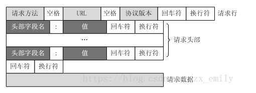
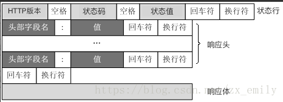
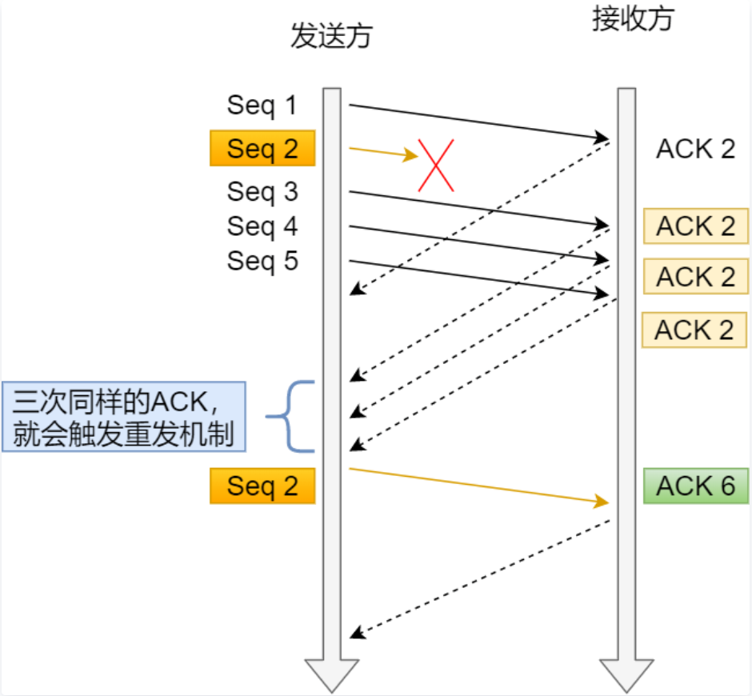
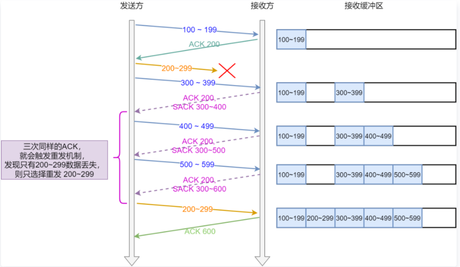
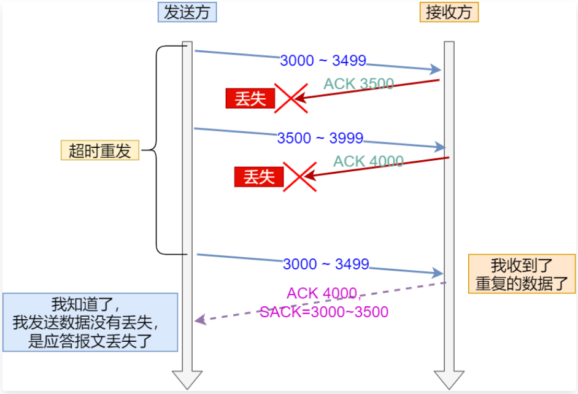
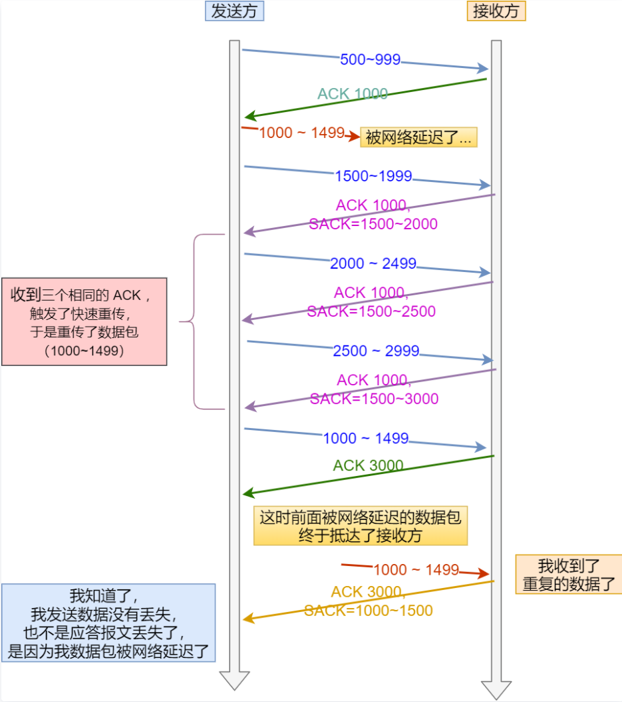
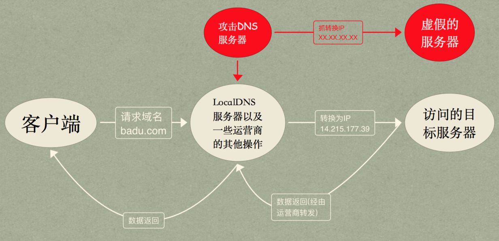

[TOC]

## 为什么网络要分层？

**网络分层的原则：**每一层独立于其它层完成自己的工作，而不需要相互依赖，上下层之间通 过标准结构来互相通信，简单易用又具有拓展性。复杂的系统需要分层，因为每一层都需要专注于一类事情。我们的网络分层的原因也是一 样，每一层只专注于做一类事情。

为什么计算机网络要分层呢？ ,我们再来较为系统的说一说：

- **各层之间相互独立：**各层之间相互独立，各层之间不需要关心其他层是如何实现的，只 需要知道自己如何调用下层提供好的功能就可以了（可以简单理解为接口调用）。这个 和我们对开发时系统进行分层是一个道理。

- **提高了整体灵活性 ：**每一层都可以使用最适合的技术来实现，你只需要保证你提供的功能以及暴露的接口的规则没有改变就行了。这个和我们平时开发系统的时候要求的高内 聚、低耦合的原则也是可以对应上的。

- **大问题化小：**分层可以将复杂的网络问题分解为许多比较小的、界线比较清晰简单的小问题来处理和解决。这样使得复杂的计算机网络系统变得易于设计，实现和标准化。这 个和我们平时开发的时候，一般会将系统功能分解，然后将复杂的问题分解为容易理解 的更小的问题是相对应的，这些较小的问题具有更好的边界（目标和接口）定义。

## TCP/IP 4 层模型了解么？

TCP/IP 4 层模型:

1. 应用层
2. 传输层
3. 网络层
4. 网络接口层 (链路层和物理层)

## HTTP 是哪一层的协议？http常见的状态码

**HTTP 协议 属于应用层的协议。**

HTTP 协议是基于 TCP 协议的，发送 HTTP 请求之前首先要建立 TCP 连接也就是要经历 3 次握手。目前使用的 HTTP 协议大部分都是 1.1。在 1.1 的协议里面，默认是开启了 Keep-Alive 的，这样的话建立的连接就可以在多次请求中被复用了。

另外， HTTP协议是无状态的协议，它无法记录客户端用户的状态，一般我们都是通过Session 来记录客户端用户的状态。

常见的状态码： 200、301、302、403、404、500、503

| COde                | Description                                                  |
| ------------------- | ------------------------------------------------------------ |
| 200                 | 请求被成功处理                                               |
| 301 永久性重定向    | 比如建设一个网站后，将网站的url变换了，重新申请一个域名，但是希望之前的用户访问之前url仍然可以访问到，就可以做一个重定向新的url下面。比如京东最早域名www.360buy.com名重定向到现在www.jd.com |
| 302 临时性重定向    | 比如用户在未登录时访问个人中心页面，这时可以临时重定向到登录的 url。 |
| 304 Not Modified    | 当客户端拥有可能过期的缓存时， 会携带缓存的标识 etag、时间等信息询问服务器缓存是否仍可复用， 而 304 是告诉客户端可以 复用缓存。 |
| 400 请求出错        | 由于语法格式有误，服务器无法理解此请求。不作修改，客户程序就无法重复此请求。 |
| 401 未授权          | （未授权） 请求要求身份验证。 对于需要登录的网页，服务器可能返回此响应。 |
| 403 没有访问权限    | 系统中某些页面只有在某些权限下才能访问， 当用户去访问了一个本身没有访问权限的 url，回报 403 错误。 |
| 404 没有对应资源    | 一般是自己输入了一个 url，这个 url 并不合法。 404 找不到，Web 服务器找不到您所请求的文件或脚本。 请检查 URL 以确保路径正确。 |
| 405 不允许此方法    | 405 不允许此方法，对于请求所标识的资源， 不允许使用请求行中所指定的方法。 (get/post/put/delete / 请求用混淆了，更正即可) 请确保为所请求的资源设置了正确的 MIME 类型 |
| 406 不可接受        | 根据此请求中所发送的 “接受” 标题， 此请求所标识的资源只能生成内容特征为 “不可接受” 的响应实体 |
| 500 服务器错误      | 比如服务器某一个函数代码出错了，有没有捕获异常，这时候会报 500 错误。 500 服务器的内部错误，Web 服务器不能执行此请求。请稍后重试此请求。 |
| 501 未实现          | 501 未实现，Web 服务器不支持实现此请求所需的功能。请检查 URL 中的错误 |
| 502 网关出错        | Bad Gateway 网关出错，当用作网关或代理时， 服务器将从试图实现此请求时所访问的 upstream 服务器中接收无效的响应 |
| 503 服务器停机      | 系统正在维护或者服务器暂停的时候，回报 500 错误。            |
| 504 Gateway Timeout | 代理服务器无法及时的从上游获得响应                           |

## HTTP 和 HTTPS 什么区别？

**端口 ：**HTTP的URL由“http://”起始且默认使用端口80，而HTTPS的URL由“https://”起始且默认使用端口443。

**安全性和资源消耗：**HTTP协议运行在TCP之上，所有传输的内容都是明文，客户端和服务器端都无法验证对方的身份。HTTPS是运行在SSL之上的HTTP协议，SSL运行在TCP之上。所有传输的内 容都经过加密，加密采用对称加密，但对称加密的密钥用服务器方的证书进行了非对称加密。所以说，HTTP 安全性没有 HTTPS高，但是 HTTPS 比HTTP耗费更多服务器资源。

## 讲一下对称加密算法和非对称加密算法？

**对称加密：**密钥只有一个，加密解密为同一个密码，且加解密速度快，典型的对称 加密算法有DES、AES等；对称加密相比非对称加密算法来说，加解密的效率要高得多、加密速度快。但是缺陷在于对于密钥的管理和分发上比较困难，不是非常安全，密钥管理负担很重。

**非对称密钥加密：**指的是加、解密使用不同的密钥，一把作为公开的公钥，另一把作为私钥。公钥加密的信息，只有私钥才能解密。典型的非对称加密算法有RSA、DSA等。安全性更高，公钥是公开的，密钥是自己保存的，不需要将私钥给别人。缺点：加密和解密花费时间长、速度慢，只适合对少量数据进行加密。

HTTPS 采用的加密方式: HTTPS 采用混合的加密机制。所有传输的内容都经过加密，加密采用对称加密，但对称加密的密钥用服务器方的证书进行了非对称加密。

## HTTP报文详解？详细说一下请求报文

HTTP有两种报文：请求报文和响应报文。

**请求报文**

以下是wireshark抓出来的一段HTTP请求报文

```
GET /admin_ui/rdx/core/images/close.png HTTP/1.1
Accept: */*
Referer: http://xxx.xxx.xxx.xxx/menu/neo
Accept-Language: en-US
User-Agent: Mozilla/4.0 (compatible; MSIE 7.0; Windows NT 6.1; WOW64; Trident/7.0; SLCC2; .NET CLR 2.0.50727; .NET CLR 3.5.30729; .NET CLR 3.0.30729; .NET4.0C; .NET4.0E)
Accept-Encoding: gzip, deflate
Host: xxx.xxx.xxx.xxx
Connection: Keep-Alive
Cookie: startupapp=neo; is_cisco_platform=0; rdx_pagination_size=250%20Per%20Page; SESSID=deb31b8eb9ca68a514cf55777744e339
```

HTTP的请求报文由四部分组成：请求行(request line)、请求头部(header)、空行和请求数据(request data)



- 请求行：由请求方法、URL(包含参数)和协议版本组成
- 请求头部：由多个key-value值组成
- 空行：请求报文使用空行将请求头部和请求数据分隔
- 请求数据：GET方法没有携带数据，POST方法会携带一个body

**响应报文**

```
HTTP/1.1 200 OK
Bdpagetype: 1
Bdqid: 0xacbbb9d800005133
Cache-Control: private
Connection: Keep-Alive
Content-Encoding: gzip
Content-Type: text/html
Cxy_all: baidu+f8b5e5b521b3644ef7f3455ea441c5d0
Date: Fri, 12 Oct 2018 06:36:28 GMT
Expires: Fri, 12 Oct 2018 06:36:26 GMT
Server: BWS/1.1
Set-Cookie: delPer=0; path=/; domain=.baidu.com
Set-Cookie: BDSVRTM=0; path=/
Set-Cookie: BD_HOME=0; path=/
Set-Cookie: H_PS_PSSID=1433_21112_18560_26350_27245_22158; path=/; domain=.baidu.com
Vary: Accept-Encoding
X-Ua-Compatible: IE=Edge,chrome=1
Transfer-Encoding: chunked

<!DOCTYPE html>
<!--STATUS OK-->
```

HTTP的响应报文由四部分组成：状态行、响应头、空行、响应体(数据)



- 状态行：由协议版本、状态码和状态值组成
- 响应头：由多个key-value值组成
- 空行：响应报文使用空行将响应头和响应体分隔
- 响应体：响应数据，在上面是一段HTML

## TCP三次握手的过程，以及三次握手的原因？

https://blog.csdn.net/qzcsu/article/details/72861891

三次握手过程中涉及一下三项信息（存储在tcp包首部）

- **seq**：Sequence number 缩写seq ，TCP通信过程中某一个传输方向上的字节流的每个字节的序号，通过这个来确认发送的数据**有序**，比如现在序列号为1000，发送了1000，下一个序列号就是2000。
- **ack**：Acknowledge number 缩写ack，TCP对上一次seq序号做出的确认号，用来响应TCP报文段，给收到的TCP报文段的序号seq加1。
- **TCP的标志位：**每个TCP段都有一个目的，这是借助于TCP标志位选项来确定的，允许发送方或接收方指定哪些标志应该被使用，以便段被另一端正确处理。用的最广泛的标志是 **SYN**，**ACK** 和 **FIN**，用于建立连接，确认成功的段传输，最后终止连接。

> 1. **SYN**：简写为`S`，同步标志位，用于建立会话连接，同步序列号；
> 2. **ACK**： 简写为`.`，确认标志位，对已接收的数据包进行确认；
> 3. **FIN**： 简写为`F`，完成标志位，表示我已经没有数据要发送了，即将关闭连接；

- 第一次握手(SYN=1, seq=x):

  客户端发送一个 TCP 的 SYN 标志位置1的包，指明客户端打算连接的服务器的端口，以及初始序号 X,保存在包头的序列号(Sequence Number)字段里。

  **发送完毕后，客户端进入 `SYN_SEND` 状态。**

- 第二次握手(SYN=1, ACK=1, seq=y, ack=x+1):

  服务器发回确认包(ACK)应答。即 SYN 标志位和 ACK 标志位均为1。服务器端选择自己 ISN 序列号，放到 Seq 域里，同时将确认序号(Acknowledgement Number)设置为客户的 seq 加1，即X+1。 

  **发送完毕后，服务器端进入 `SYN_RCVD` 状态。**

- 第三次握手(ACK=1，ack=y+1)

  客户端再次发送确认包(ACK)，SYN 标志位为0，ACK 标志位为1，并且把服务器发来 ACK 的序号字段+1，放在确定字段中发送给对方，并且在数据段放写seq的+1

  发送完毕后，客户端进入 `ESTABLISHED` 状态，当服务器端接收到这个包时，也进入 `ESTABLISHED` 状态，TCP 握手结束。

**三次握手的目的：**双方确认自己与对方的 发送与接收是正常的，从而建立可靠的通信信道。

> 第一次握手：Client 什么都不能确认；Server 确认了对方发送正常，自己接收正常
>
> 第二次握手：Client 确认了：自己发送、接收正常，对方发送、接收正常；Server 确认了：对方发送正常，自己接收正常
>
> 第三次握手：Client 确认了：自己发送、接收正常，对方发送、接收正常；Server 确认了：自己发送、接收正常，对方发送、接收正常

第三次握手是为了防止失效的连接请求到达服务器，让服务器错误打开连接。

> 一句话，主要防止已经失效的连接请求报文突然又传送到了服务器，从而产生错误。
>
> 如果使用的是两次握手建立连接，假设有这样一种场景，客户端发送了第一个请求连接并且没有丢失，只是因为在网络结点中滞留的时间太长了，由于TCP的客户端迟迟没有收到确认报文，以为服务器没有收到，此时重新向服务器发送这条报文，此后客户端和服务器经过两次握手完成连接，传输数据，然后关闭连接。此时此前滞留的那一次请求连接，网络通畅了到达了服务器，这个报文本该是失效的，但是，两次握手的机制将会让客户端和服务器再次建立连接，这将导致不必要的错误和资源的浪费。
>
> 如果采用的是三次握手，就算是那一次失效的报文传送过来了，服务端接受到了那条失效报文并且回复了确认报文，但是客户端不会再次发出确认。由于服务器收不到确认，就知道客户端并没有请求连接。

### 第2次握手传回了ACK，为什么还要传回SYN？

接收端传回发送端所发送的ACK是为了告诉客户端，我接收到的信息确实就是你所发送的信号了，这表明从客户端到服务端的通信是正常的。而回传SYN则是为了建立并确认从服务端到客户端的通信。”

> SYN 同步序列编号(Synchronize Sequence Numbers) 是 TCP/IP 建立连接时使用的握手信号。在客户机和服务器之间建立正常的 TCP 网络连接时，客户机首先发出一个 SYN 消息，服务器使用 SYN-ACK 应答表示接收到了这个消息，最后客户机再以 ACK(Acknowledgement）消息响应。这样在客户机和服务器之间才能建立起可靠的 TCP 连接，数据才可以在客户机和服务器之间传递。

## TCP四次挥手的过程，以及四次挥手的原因？

https://blog.csdn.net/qzcsu/article/details/72861891

TCP 的连接的拆除需要发送四个包，因此称为四次挥手(Four-way handshake)，也叫做改进的三次握手。客户端或服务器均可主动发起挥手动作。

- 第一次挥手(FIN=1，seq=x)

  假设客户端想要关闭连接，客户端发送一个 FIN 标志位置为1的包，表示自己已经没有数据可以发送了，但是仍然可以接受数据。

  发送完毕后，客户端进入 `FIN_WAIT_1` 状态。

- 第二次挥手(ACK=1，ack=x+1)

  服务器端确认客户端的 FIN 包，发送一个确认包，表明自己接受到了客户端关闭连接的请求，但还没有准备好关闭连接。

  发送完毕后，服务器端进入 `CLOSE_WAIT` 状态，客户端接收到这个确认包之后，进入 `FIN_WAIT_2` 状态，等待服务器端关闭连接。

- 第三次挥手(FIN=1，seq=y)

  服务器端准备好关闭连接时，向客户端发送结束连接请求，FIN 置为1。

  发送完毕后，服务器端进入 `LAST_ACK` 状态，等待来自客户端的最后一个ACK。

- 第四次挥手(ACK=1，ACKnum=y+1)

  客户端接收到来自服务器端的关闭请求，发送一个确认包，并进入 `TIME_WAIT`状态，等待可能出现的要求重传的 ACK 包。

  服务器端接收到这个确认包之后，关闭连接，进入 `CLOSED` 状态。

  客户端等待了某个固定时间（两个最大段生命周期，2MSL，2 Maximum Segment Lifetime）之后，没有收到服务器端的 ACK ，认为服务器端已经正常关闭连接，于是自己也关闭连接，进入 `CLOSED` 状态。

**CLOSE-WAIT 状态问题：**

客户端发送了 FIN 连接释放报文之后，服务器收到了这个报文，就进入了 CLOSE-WAIT 状态。这个状态是为了让服务器端发送还未传送完毕的数据，传送完毕之后，服务器会发送FIN 连接释放报文。

**TIME-WAIT 状态问题**

客户端接收到服务器端的 FIN 报文后进入此状态，此时并不是直接进入 CLOSED 状态，还需要等待一个时间计时器设置的时间 2MSL。这么做有两个理由：

- 确保最后一个确认报文能够到达。如果 B 没收到 A 发送来的确认报文，那么就会重新发送连接释放请求报文，A 等待一段时间就是为了处理这种情况的发生。

- 等待一段时间是为了让本连接持续时间内所产生的所有报文都从网络中消失，使得下一 个新的连接不会出现旧的连接请求报文。

### 为什么建立连接是三次握手，关闭连接确是四次挥手呢？

建立连接的时候， 服务器在LISTEN状态下，收到建立连接请求的SYN报文后，把ACK和SYN放在一个报文里发送给客户端。
而关闭连接时，服务器收到对方的FIN报文时，仅仅表示对方不再发送数据了但是还能接收数据，而自己也未必全部数据都发送给对方了，所以己方可以立即关闭，也可以发送一些数据给对方后，再发送FIN报文给对方来表示同意现在关闭连接，因此，己方ACK和FIN一般都会分开发送，从而导致多了一次。

#### 如果已经建立了连接，但是客户端突然出现故障了怎么办？

TCP还设有一个保活计时器，显然，客户端如果出现故障，服务器不能一直等下去，白白浪费资源。服务器每收到一次客户端的请求后都会重新复位这个计时器，时间通常是设置为2小时，若两小时还没有收到客户端的任何数据，服务器就会发送一个探测报文段，以后每隔75秒发送一次。若一连发送10个探测报文仍然没反应，服务器就认为客户端出了故障，接着就关闭连接。

## TCP的可靠性体现在哪里？

https://cloud.tencent.com/developer/article/1629739

TCP 是通过序列号、确认应答、重发控制、连接管理以及窗口控制等机制实现可靠性传输的。

### 重传机制

TCP 实现可靠传输的方式之一，通过序列号与确认应答。

在 TCP 中，当发送端的数据到达接收主机时，接收端主机会返回一个确认应答消息，表示已收到消息。

但在错综复杂的网络，并不一定每次都能正常的数据传输，万一数据在传输过程中丢失了呢？ **丢包**

所以 TCP 针对数据包丢失的情况，会用**重传机制**解决。

接下来说说常见的重传机制：

- 超时重传
- 快速重传
- SACK
- D-SACK

#### 超时重传

重传机制的其中一个方式，就是在发送数据时，设定一个定时器，当超过指定的时间后，没有收到对方的 `ACK` 确认应答报文，就会重发该数据，也就是我们常说的**超时重传**。

TCP 会在以下两种情况发生超时重传：

- 数据包丢失
- 确认应答丢失

#### 快速重传

TCP 还有另外一种**快速重传（Fast Retransmit）机制**，它**不以时间为驱动，而是以数据驱动重传**。



在上图，发送方发出了 1，2，3，4，5 份数据：

- 第一份 Seq1 先送到了，于是就 Ack 回 2；
- 结果 Seq2 因为某些原因没收到，Seq3 到达了，于是还是 Ack 回 2；
- 后面的 Seq4 和 Seq5 都到了，但还是 Ack 回 2，因为 Seq2 还是没有收到；
- **发送端收到了三个 Ack = 2 的确认，知道了 Seq2 还没有收到，就会在定时器过期之前，重传丢失的 Seq2。**
- 最后，接收到收到了 Seq2，此时因为 Seq3，Seq4，Seq5 都收到了，于是 Ack 回 6 。

所以，快速重传的工作方式是当收到三个相同的 ACK 报文时，会在定时器过期之前，重传丢失的报文段。

快速重传机制只解决了一个问题，就是超时时间的问题，但是它依然面临着另外一个问题。就是**重传的时候，是重传之前的一个，还是重传所有的问题。**

比如对于上面的例子，是重传 Seq2 呢？还是重传 Seq2、Seq3、Seq4、Seq5 呢？因为发送端并不清楚这连续的三个 Ack 2 是谁传回来的。

根据 TCP 不同的实现，以上两种情况都是有可能的。可见，这是一把双刃剑。

为了解决不知道该重传哪些 TCP 报文，于是就有 `SACK` 方法。

#### SACK 方法

还有一种实现重传机制的方式叫：`SACK`（ Selective Acknowledgment 选择性确认）。

这种方式需要在 TCP 头部「选项」字段里加一个 `SACK` 的东西，它**可以将缓存的地图发送给发送方**，这样发送方就可以知道哪些数据收到了，哪些数据没收到，知道了这些信息，就可以**只重传丢失的数据**。

如下图，发送方收到了三次同样的 ACK 确认报文，于是就会触发快速重发机制，通过 `SACK` 信息发现只有 `200~299` 这段数据丢失，则重发时，就只选择了这个 TCP 段进行重复。



如果要支持 `SACK`，必须双方都要支持。在 Linux 下，可以通过 `net.ipv4.tcp_sack` 参数打开这个功能（Linux 2.4 后默认打开）。

#### Duplicate SACK

Duplicate SACK 又称 `D-SACK`，其主要**使用了 SACK 来告诉「发送方」有哪些数据被重复接收了。**

下面举例两个栗子，来说明 `D-SACK` 的作用。

*栗子一号：ACK 丢包*



ACK 丢包

- 「接收方」发给「发送方」的两个 ACK 确认应答都丢失了，所以发送方超时后，重传第一个数据包（3000 ~ 3499）
- **于是「接收方」发现数据是重复收到的，于是回了一个 SACK = 3000~3500**，告诉「发送方」 3000~3500 的数据早已被接收了，因为 ACK 都到了 4000 了，已经意味着 4000 之前的所有数据都已收到，所以这个 SACK 就代表着 `D-SACK`。
- 这样「发送方」就知道了，数据没有丢，是「接收方」的 ACK 确认报文丢了。

*栗子二号：网络延时*



网络延时

- 数据包（1000~1499） 被网络延迟了，导致「发送方」没有收到 Ack 1500 的确认报文。
- 而后面报文到达的三个相同的 ACK 确认报文，就触发了快速重传机制，但是在重传后，被延迟的数据包（1000~1499）又到了「接收方」；
- **所以「接收方」回了一个 SACK=1000~1500，因为 ACK 已经到了 3000，所以这个 SACK 是 D-SACK，表示收到了重复的包。**
- 这样发送方就知道快速重传触发的原因不是发出去的包丢了，也不是因为回应的 ACK 包丢了，而是因为网络延迟了。

可见，`D-SACK` 有这么几个好处：

1. 可以让「发送方」知道，是发出去的包丢了，还是接收方回应的 ACK 包丢了;
2. 可以知道是不是「发送方」的数据包被网络延迟了;
3. 可以知道网络中是不是把「发送方」的数据包给复制了;

在 Linux 下可以通过 `net.ipv4.tcp_dsack` 参数开启/关闭这个功能（Linux 2.4 后默认打开）。

### 滑动窗口

https://cloud.tencent.com/developer/article/1629739


## TCP滑动窗口是干什么的？拥塞控制如何实现的？

https://cloud.tencent.com/developer/article/1629739


## TCP和UDP有什么区别？及其适用的场景。

TCP和UDP都是传输层的通信协议，但是他们的通信机制和应用场景不同。

TCP（Transmission Control Protocol）又叫传输控制协议，TCP是面向连接的，并且是一种可靠的协议，在基于TCP进行通信时，通信双方需要建立TCP连接，建立连接需要经过三次握手，握手成功才可以通信。

TCP优缺点：可靠，稳定。但是效率比较低，占用系统资源，容易被攻击

> TCP的可靠性体现在传输数据之前，三次握手建立连接（四次挥手断开连接），并且在数据传递时，有确认，窗口，重传，拥塞控制机制，数据传完之后断开连接来节省系统资源。
>
> 传输数据之前建立连接，这样会消耗时间，而且在消息传递时，确认机制，重传机制和拥塞机制都会消耗大量的时间，而且要在每台设备上维护所有的传输连接。而且每一个连接都会占用系统的CPU，内存等硬件软件资源。并且TCP的取而机制，三次握手机制导致TCP容易被人利用，实现DOS，

UDP是一种面向无连接，且不可靠的协议，在通信过程中，它并不像TCP那样需要先建立一个连接，只要目的地址，端口号，源地址，端口号确定了，就可以直接发送信息报文，并且不需要一定能收到或者完整的数据。它仅仅提供了校验和机制来保障报文是否完整，若校验失败，则直接将报文丢弃，不做任何处理。

UDP优缺点：传输快，但是不可靠也不稳定

> UDP没有TCP的握手，确认窗口，重传，拥塞机制。UDP是一个无状态的传输机制，所以在传输数据时非常快。UDP没有TCP这些机制，相应被利用的漏洞就少一点。但是UDP的攻击也是存在的，比如：UDP 的flood攻击。
>
> 因为UDP没有TCP的那些可靠机制，在网络质量不好的时候容易发生丢包。

**区别：**

1. `TCP`面向连接，`UDP`面向非连接

>  面向连接的服务，通信双方在进行通信之前，要先在双方建立起一个完整的可以彼此沟通的通道(`TCP`三次握手建立连接)，在通信过程中，整个连接的情况一直可以被**实时地监控和管理**
>  非面向连接的服务，不需要预先建立一个联络两个通信节点的连接，需要通信的时候，发送节点就可以往网络上发送信息，让信息自主地在网络上去传，一般在传输的过程中不再加以监控。

2. `TCP`提供可靠服务，`UDP`不提供可靠服务
3. `TCP`面向字节流，`UDP`面向报文
4. `TCP`数据传输慢，`UDP`数据传送快

> 注意：
>  `TCP`并不能保证数据一定会被对方接收到，因为这是不可能的。`TCP`能够做到的是，如果有可能，就把数据递送到接收方，否则就（通过放弃重传并且中断连接这一手段）通知用户。因此准确说 `TCP` 也不是 100% 可靠的协议，它所能提供的是数据的可靠递送或故障的可靠通知。

**UDP的应用场景：** 对当前网络通讯质量要求不高的时候，要求网络通讯速度尽量的快，这时就使用UDP。进行视频聊天或者看直播，可以使用UDP协议，因为即使几个画面丢失了，对用户来说影响也不是很大

**TCP的应用场景：**当对网络通信质量有要求时需要用TCP，发消息的场景以及文件传输，要确保发送的消息不丢失


## 浏览器访问一个网址的时候都有哪些过程？分别用到了什么协议。

1. 解析url ，获取域名。通过 **DNS 协议** 得到相应的ip
2. 浏览器与服务器创建连接
3. 构建并发送http请求
4. 服务器处理请求并返回 HTTP 报文
5. 浏览器解析渲染页面
6. 断开连接

浏览器在拿到 url 时，首先会对 url 进行解析，将域名与实际的文件路径分离，然后需要使用 DNS 协议，通过域名得到 IP 地址。

> 浏览器会查询浏览器缓存，如果有这个网址的缓存就可以直接获取到 IP，如果没有就进一步访问本机缓存，如果本机缓存也没有才会发起 DNS 请求。
>
> 而 DNS 的服务器是一个树状结构，对于域名来说是倒着进行解析的，根节点是根 DNS 服务器，他的子节点为 com、cn 这种顶级域 dns 服务器，然后进一步向下进行解析。
>
> 以 baidu.com 为例，当我们的电脑需要发起 DNS 请求的时候，会先对根 DNS 服务器发起请求，这个服务器的 IP 地址一般在每台电脑上都有，我们一般会设置为 8.8.8.8 或者 114.114.114.114，我们的电脑在访问根 DNS 服务器后，会得到 con 域 DNS 服务器的 IP，然后会继续访问 con 域 DNS 服务器，这时就能得到 baicu.com 的 IP 地址了。

得到 ip 后浏览器会先与服务器通过 TCP 三次握手建立连接，然后构建 HTTP 请求。

> 在解析 url 时，我们能获取到需要请求资源的资源路径、端口号、请求参数等信息，这些信息会被存储在 http 头中，通过 DNS 请求获取到 ip 后，浏览器会构建并发送 HTTP 请求或者 HTTPS 请求，HTTPS 就是在 HTTP 的基础上加了一个 TLS 协议来进行数据加密，这个我们待会说。
>
> HTTP 请求有很多种，但对资源的操作离不开增删改查，也就对应着 POST、DELETE、PUT、GET 请求。最常用的是 GET 和 POST，其区别在于 GET 的参数是在 url 中的，而 POST 的参数是在请求的 body 中。
> 以 GET 为例，当需要发送 HTTP 请求的时候，同样也不是直接就发送了，需要先查询浏览器缓存。浏览器中的缓存分为强缓存和协商缓存，浏览器发起 HTTP 请求时首先会根据 http 头信息来判断是存有强缓存，以及其是否过期，如果有强缓存且未过期则命中，不会发送请求到服务器了。如果强缓存没命中，则会向服务器发起请求，这个请求的 Header 头中会带有浏览器最后一次请求该资源的时间和一个资源校验码(使用资源修改时间、资源大小等信息生成)，服务器收到这个请求后会判断协商缓存是否过期，如果过期则返回新的资源信息，如果没过期则返回 304 状态码，表示资源未更新，可以使用缓存中的资源。

HTTP 请求发出后会将数据包交给下层协议栈处理，在传输层和网络层该数据包会被分别加上 TCP 头和 IP 头，并且被发送出去，沿路的网关会收到这个数据包并进行识别和转发，直到该数据包被服务器收到，通过相同的流程返回回复数据包。

一般来说，浏览器第一次从服务器请求的资源都是一个 HTML 文件，例如服务端默认的 index.html 等，浏览器获取到这个 HTML 文件就会对其进行解析，构建出一棵DOM树，并通过执行其中的 js 代码发起更多的请求，请求渲染页面需要的其他资源，CSS 或者一些外链的图片等，拿到 CSS 后将其与 DOM 树结合进行更进一步的渲染，我们就能看到页面了。

> 最后再补充一下 HTTPS，由于 HTTP 是使用信息明文传播，所以会有窃听、篡改、冒充等风险，所以 HTTPS 在 HTTP 的基础上加上了 SSL 层，通过加密的方式来保证数据安全。
>
> SSL 通过加密防止窃听，通过签名来防止篡改，通过证书来防止冒充。
>
> HTTPS 协议在客户端与服务端开始通信前，会进行密钥协商，通过一轮非对称加密，一般是RSA加密来传递后序通信过程使用的对称密钥，由于非对称加密较慢，后续通信过程中使用对称加密。在密钥协商的过程中，服务端会将自己的证书发送给客户端，客户端会到 CA 机构通过摘要值验证证书的合法性，从而防止中间人攻击。

https://leetcode-cn.com/circle/discuss/UrcaDQ/

https://blog.fundebug.com/2019/02/28/what-happens-from-url-to-webpage/

**使用的协议：**

- DNS 协议
- TCP 协议（建立连接）
- IP 协议（建立TCP协议时，需要发送数据，发送数据在网络层使用IP协议）
- OPSF协议（IP数据包在路由器之间转发，路由选择协议）
- ARP协议（路由器在于服务器通信时，需要将ip地址转换为MAC地址，需要ARP协议）
- HTTP协议（TCP连接建立完成之后，需要使用http协议访问网页）

## DNS解析过程，DNS劫持了解吗？

DNS完成的工作是：域名到IP地址的解析。将域名和IP地址相互映射的一个分布式数据库。

第一步：客户机提出域名解析请求，并将该请求发送给本地域名服务器。

第二步：当本地域名服务器收到请求后，就先查询本地缓存，如果有该纪录项，则本地域名

服务器就直接把查询结果返回。

第三步：如果本地缓存中没该纪录，则本地域名服务器就直接把请求发给根域名服务器，然 后根域名服务器再返回给本地域名服务器一个所查询域(根子域)主域名服务器地址。

第四步：本地服务器再向上一步返回的域名服务器发送请求，然后接受请求的服务器查询自 己的缓存，如果没该纪录，则返回相关下级域名服务器地址。

第五步：重复第四步，直到找到正确纪录。

第六步：本地域名服务器把返回结果保存到缓存，以备下一次使用，同时还将结果返回给客 户机。

**DNS劫持：**DNS劫持又称[域名劫持](https://baike.baidu.com/item/域名劫持)，是指在劫持的网络范围内拦截域名解析的请求，分析请求的域名，把审查范围以外的请求放行，否则返回假的IP地址或者什么都不做使请求失去响应，其效果就是对特定的网络不能访问或访问的是假网址。其实本质就是对DNS解析服务器做手脚，或者是使用伪造的DNS解析服务器可以通过下图来展示



**解决办法**

DNS的劫持过程是通过攻击运营商的解析服务器来达到目的。我们可以不用运营商的DNS解析而使用自己的解析服务器或者是提前在自己的App中将解析好的域名以IP的形式发出去就可以绕过运营商DNS解析，这样一来也避免了DNS劫持的问题。

HTTP劫持：你DNS解析的域名的IP地址不变。在和网站交互过程中的劫持了你的请求。在网站发给你信息前就给你返回了请求。

DNS在区域传输的时候使用TCP协议,其他时候使用UDP协议。

## GET和POST有什么不一样？

https://learnku.com/articles/25881

https://juejin.cn/post/6844903489127219214

使用上的区别：

1. GET使用URL或Cookie传参，而POST将数据放在BODY中。

2. GET方式提交的数据有长度限制，则POST的数据则可以非常大。

3. POST比GET安全，因为数据在地址栏上不可见。

**本质区别：GET请求是幂等性的，POST请求不是**


## session和cookie的问题？

Cookie 和 Session都是用来跟踪浏览器用户身份的会话方式

Cookie 一般用来保存用户信息，Session 的主要作用就是通过服务端记录用户的状态

Cookie 数据保存在客户端(浏览器端)，Session 数据保存在服务器端。相对来说 Session 安全性更高。如果要在 Cookie 中存储一些敏感信息，不要直接写入 Cookie 中，最好能将Cookie 信息加密然后使用到的时候再去服务器端解密。

## HTTP是不保存状态的协议,如何保存用户状态?

HTTP 是一种无状态协议。HTTP 协议自身不对请求和响应之间的通信状态进行保存。主要通过session机制来进行解决，Session 的主要作用就是通过服务端记录用户的状态。

在服务端保存 Session 的方法很多，最常用的就是内存和数据库(比如是使用内存数据库redis 保存)。既然 Session 存放在服务器端，那么我们如何实现 Session 跟踪呢？大部分情况下， 我们都是通过在 Cookie 中附加一个 Session ID 来方式来跟踪。

Cookie 被禁用怎么办**?** 最常用的就是利用 URL 把 Session ID 直接附加在URL路径的后面。

## Arp协议？

Arp协议能通过接收端的ip地址解析到mac地址。

如果发送端和目标端的主机都在同一个网段，发送端发送数据帧前检查是否拥有接收端的 mac地址，如果没有，则启动arp，先检查缓存ip-mac表中是否有接收端的mac地址，如果有 则直接拿来即用，如果没有则在本网段（局域网）广播arp包，本网段各计算机都收到arp请 求，从发送来的数据中检查请求过来的ip地址与自己是否一致，如果不一致，则丢弃，如果 ip一致，则单播返回mac地址给请求的计算机，发送端便获取到了接收端的mac地址，接收 到接收端的mac地址它还会缓存一份，用于下次拿来即用。

如果请求端和目标端的主机不在同一个网段呢？arp广播的数据是被路由阻断的，不能跨到不同的网段进行广播的，因为这样广播会导致广播数据泛滥。如果不在同一个网段，则请求端 拿到的目标端的mac地址其实是它网关的mac地址，将数据帧给到网关再进行下一跳转发， 下一跳同样在自己的网段寻找到目标主机mac地址或再找到下一跳mac地址。

## DDos攻击了解吗？

分布式拒绝服务，一般来说是指攻击者利用一些被控制的设备对目标网站在较短的时间内发 起大量请求，大规模消耗目标网站的主机资源，让它无法正常服务。

### 说下DOS攻击和DDOS攻击，发生在tcp三次握手的哪个阶段


## HTTPS如何实现


HTTP2.0讲一下

## Mac 地址和 ip 地址的区别？既然有了 Mac 地址，为什么还要 ip 地址呢？

MAC地址是烧录在网卡或者接口上的**物理地址**，具有**全球唯一性**，一般不能被改变。IP地址是网络中的主机或接口在网络中的**逻辑地址**，在**同一个网络内具有唯一性**。

## 电子邮件的发送过程?

一个电子邮件系统由三部分组成：用户代理、邮件服务器以及邮件协议。

邮件协议包含发送协议和读取协议，发送协议常用 SMTP，读取协议常用 POP3 和 IMAP。

用户A的邮箱是QQ邮箱，他要发往的邮箱是163邮箱，用户A写好一封邮件点击发送， 即提交到了QQ邮箱服务器，使用的是SMTP协议。

QQ邮箱会对A发送邮件的收件地址进行解析，判断是否为内部邮箱的账号，如果也是QQ邮箱，会直接存储到自己的存储空间，如果不是则会发送到指定邮箱服务器，使用 的也是SMTP协议。

163的邮箱服务器收到邮件后会再次判断该邮件是否为自己的邮件，如果是则存到自己的存储空间，等待POP3服务去读取邮件。

用户B收到消息后，打开客户端访问163服务器，调用POP3服务。

Pop3服务接到指令后，读取存储空间中发送给B的未读邮件服务。

将读取到的邮件返回给客户端软件。
