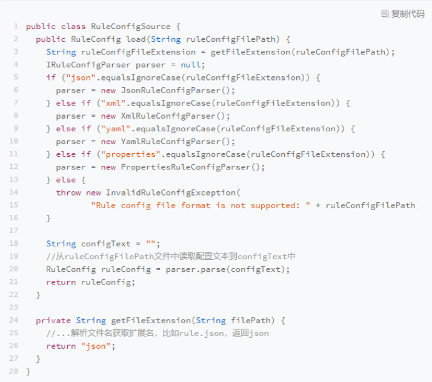
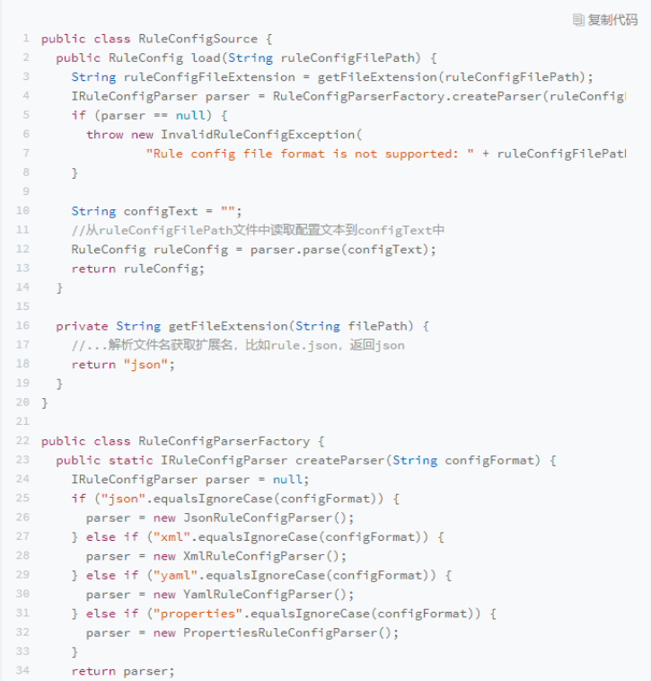
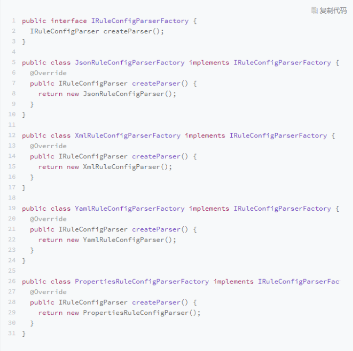
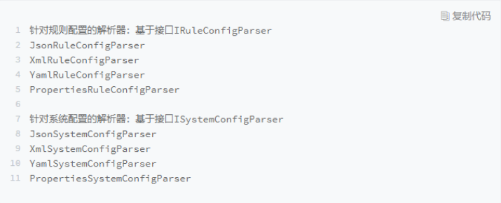
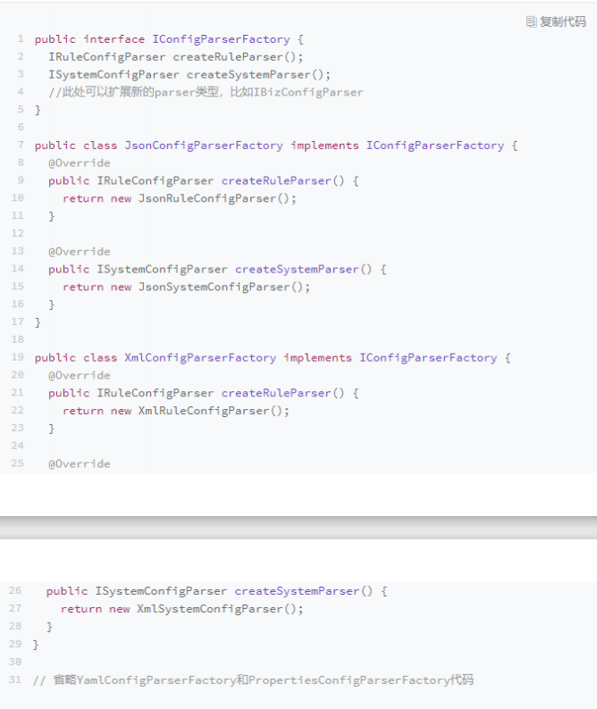

## 创建型

### 单例模式

单例设计模式( Singleton Design Pattern)理解起来非常简单。一个类只允许创建个对
象(或者实例),那这个类就是一个单例类,这种设计模式就叫作单例设计模式,简称单例
模式。

#### 为什么要使用单例?

从业务概念上,有些数据在系统中只应该保存一份,就比较适合设计为单例类。比如,系统
的配置信息类、连接池类、ID生成器类。除此之外,我们还可以使用单例解决资源访问冲突的问题

#### 单例存在哪些问题?

大部分情况下,我们在项目中使用单例,都是用它来表示一些全局唯一类,比如配置信息
类、连接池类、ID生成器类。单例模式书写简洁、使用方便,在代码中,我们不需要创建
对象,直接通过类似 Id Generator getInstance0 geld0这样的方法来调用就可以了。但
是,这种使用方法有点类似硬编码( hard code),会带来诸多问题。

**单例类对OOP（面向对象）特性的支持不友好**

我们知道,OOP的四大特性是封装、抽象、继承、多态。单例这种设计模式对于其中的抽
象、继承、多态都支持得不好。

以 IDGenerator 为例，GeNerator的使用方式违背了基于接口而非实现的设计原则,也就违背了广义上理解的OOP的抽象特性。如果未来某一天,我们希望针对不同的业务采用不同的ID生成算法。比如,订单ID和用户ID采用不同的ID生成器来生成。为了应对这个需求变化,我们需要修改所有用到 GeNerator类的地方,这样代码的改动就会比较大。

除此之外,单例对继承、多态特性的支持也不友好。这里我之所以会用“不友好”这个词,
而非“完全不支持”,是因为从理论上来讲,单例类也可以被继承、也可以实现多态,只是
实现起来会非常奇怪,会导致代码的可读性变差。不明白设计意图的人,看到这样的设计,
会觉得莫名其妙。所以,一旦你选择将某个类设计成到单例类,也就意味着放弃了继承和多
态这两个强有力的面向对象特性,也就相当于损失了可以应对未来需求变化的扩展性

**单例类会隐藏类之间的依赖关系**

我们知道,代码的可读性非常重要。在阅读代码的时候,我们希望一眼就能看出类与类之间
的依赖关系,搞清楚这个类依赖了哪些外部类

通过构造函数、参数传递等方式声明的类之间的依赖关系,我们通过查看函数的定义,就能
很容易识别出来。但是,单例类不需要显示创建、不需要依赖参数传递,在函数中直接调用
就可以了。如果代码比较复杂,这种调用关系就会非常隐蔽。在阅读代码的时候,我们就需
要仔细查看每个函数的代码实现,才能知道这个类到底依赖了哪些单例类

**单例类对代码的扩展性不友好**

单例类只有一个对象实例，如果未来某一天，我们需要在代码中创建两个实例或多个实例，那就要对代码有比较大的改动。

以数据库连接池为例，在系统设计初期,我们觉得系统中只应该有一个数据库连接池,这样能方便我们控制对数据库连接资源的消耗。所以,我们把数据库连接池类设计成了单例类。但之后我们发现,系统中有些SQL语句运行得非常慢。这些SQL语句在执行的时候,长时间占用数据库连接资源,导致其他SQL请求无法响应。为了解决这个问题,我们希望将慢SQL与其他SQL隔离开来执行。为了实现这样的目的,我们可以在系统中创建两个数据库连接池,慢SQL独享—个数据库连接池,其他SQL独享另外—个数据库连接池,这样就能避免慢SQL影响到其他SQL的执行。

如果我们将数据库连接池设计成单例类,显然就无法适应这样的需求变更,也就是说,单例
类在某些情况下会影响代码的扩展性、灵活性。所以,数据库连接池、线程池这类的资源
池,最好还是不要设计成单例类。实际上,一些开源的数据库连接池、线程池也确实没有设
计成单例类。

**单例对代码的可测试性不友好**

单例模式的使用会影响到代码的可测试性。如果单例类依赖比较重的外部资源,比如DB,
我们在写单元测试的时候,希望能通过mock的方式将它替换掉。而单例类这种硬编码式
的使用方式,导致无法实现mock替换

除此之外,如果单例类持有成员变量(比如 GeNerator中的id成员变量),那它实际上
相当于一种全局变量,被所有的代码共享。如果这个全局变量是一个可变全局变量,也就是
说,它的成员变量是可以被修改的,那我们在编写单元测试的时候,还需要注意不同测试用
例之间,修改了单例类中的同一个成员变量的值,从而导致测试结果互相影响的问题。

**单例不支持有参数的构造函数**

单例不支持有参数的构造函数,比如我们创建一个连接池的单例对象,我们没法通过参数来
指定连接池的大小。针对这个问题,我们来看下都有哪些解决方案。

- 创建完实例之后，在调用init函数传递参数。
- 将参数放到 getInstance()方法中。
- 将参数放到另外一个全局变量中。

#### 有何替代的解决方案?

为了保证全局唯一,除了使用单例,我们还可以**用静态方法来实现**。这也是项目开发中经常
用到的一种实现思路。不过,静态方法这种实现思路,并不能解决我们之前提到的问题。如果要完全解决这些问题,我们可能要从根上,寻找其他方式来实现全局唯一类了。比如,通过工厂模式、IOC容器(比如 Spring IOC容器)来保证,由过程序员自己来保证(自己在编写代码的时候自己保证不要创建两个类对象。

有人把单例当作反模式,主张杜绝在项目中使用。我个人觉得这有点极端。模式没有对错,
关键看你怎么用。如果单例类并没有后续扩展的需求,并且不依赖外部系统,那设计成单例
类就没有太大问题。对于一些全局的类,我们在其他地方new的话,还要在类之间传来传
去,不如直接做成单例类,使用起来简洁方便。

#### 单例与静态类的区别?

1. 静态类比单例模式的效率更高，因为静态方法在编译期就完成了静态绑定。
2. 单例对象可以被延迟初始化。而静态类总是在类被加载的时候就初始化。
3. 在做单元测试的时候，静态类比单例类更难被 `mock`，因此也更难被测试。而单例类很容易被 mock 来执行单元测试。
4. `Java` 中的静态方法是不能被覆写的，这就导致某些情况不够灵活。而你随时可以继承一个非 `final` 的单例类来覆写其中的方法。

#### 具体实现

单例的实现分为**饿汉模式**和**懒汉模式**。顾名思义，饿汉模式就好比他是一个饿汉，而且有一定的危机意识，他会提前把食物囤积好，以备饿了之后直接能吃到食物。对应到程序中指的是，在类加载时就会进行单例的初始化，以后访问时直接使用单例对象即可。

**饿汉模式的实现代码如下：**

```java
public class Singleton {
    // 声明私有对象
    private static Singleton instance = new Singleton();    
    // 获取实例（单例对象）
    public static Singleton getInstance() {
        return instance;
    }

    private Singleton() {}

    // 方法
    public void sayHi() {
        System.out.println("Hi,Java.");
    }
}

class SingletonTest {
    public static void main(String[] args) {
        // 调用单例对象
        Singleton singleton = Singleton.getInstance();
        // 调用方法
        singleton.sayHi();
    }
}
```

饿汉模式，它的优点是线程安全，因为单例对象在类加载的时候就已经被初始化了，当调用单例对象时只是把早已经创建好的对象赋值给变量；它的缺点是可能会造成资源浪费，如果类加载了单例对象（对象被创建了），但是一直没有使用，这样就造成了资源的浪费。

懒汉模式也被称作为**饱汉模式**，顾名思义他比较懒，每次只有需要吃饭的时候，才出去找饭吃，而不是像饿汉那样早早把饭准备好。对应到程序中指的是，当每次需要使用实例时，再去创建获取实例，而不是在类加载时就将实例创建好。

**懒汉模式的实现代码如下：**

```java
public class Singleton {
    // 声明私有对象
    private static Singleton instance;
    // 获取实例（单例对象）
    public static Singleton getInstance() {
        if (instance == null) {
            instance = new Singleton();
        }
        return instance;
    }

    private Singleton() {}

    // 方法
    public void sayHi() {
        System.out.println("Hi,Java.");
    }
}

class SingletonTest {
    public static void main(String[] args) {
        Singleton singleton = Singleton.getInstance();
        singleton.sayHi();
    }
}
```

懒汉模式，它的优点是不会造成资源的浪费，因为在调用的时候才会创建被实例化对象；它的缺点在多线程环境下是非线程是安全的，比如多个线程同时执行到 if 判断处，此时判断结果都是未被初始化，那么这些线程就会同时创建 n 个实例，这样就会导致意外的情况发生。

**双重检测实现代码如下：**

为了保证懒汉模式的线程安全我们最简单的做法就是给获取实例的方法上加上 synchronized（同步锁）修饰。如果将整个方法都被 synchronized 所包围，会因此增加了同步开销，降低了程序的执行效率。为了改进程序的执行效率，我们将 synchronized 放入到方法中，以此来减少被同步锁所修饰的代码范围，实现代码如下：

```java
public class Singleton {

    // 声明私有对象
    private volatile static Singleton instance;
    // 获取实例（单例对象）
    public static Singleton getInstance() {
        // 第一次判断
        if (instance == null) {
            synchronized (Singleton.class) {
                // 第二次判断
                if (instance == null) {
                    instance = new Singleton();
                }
            }
        }
        return instance;
    }

    private Singleton() { }

    // 类方法
    public void sayHi() {
        System.out.println("Hi,Java.");
    }
}
```

**静态内部类的实现代码如下：**

静态内部类和饿汉方式有异曲同工之妙，它们都采用了类装载的机制来保证，当初始化实例时只有一个线程执行，从而保证了**多线程下的安全操作**。JVM 会在类初始化阶段（也就是类装载阶段）创建一个锁，该锁可以保证多个线程同步执行类初始化的工作，因此在多线程环境下，类加载机制依然是线程安全的。

但静态内部类和饿汉方式也有着细微的差别，饿汉方式是在程序启动时就会进行加载，因此可能造成资源的浪费；而静态内部类只有在调用 getInstance() 方法时，才会装载内部类从而完成实例的初始化工作，因此不会造成资源浪费的问题。由此可知，此方式也是较为推荐的单例实现方式。

```java
public class Singleton {
    // 静态内部类
    private static class SingletonInstance {
        private static final Singleton instance = new Singleton();
    }

    // 获取实例（单例对象）
    public static Singleton getInstance() {
        return SingletonInstance.instance;
    }
    
    private Singleton() {}
    
    // 类方法
    public void sayHi() {
        System.out.println("Hi,Java.");
    }
}
```

**枚举实现代码如下：**

单例的另一种实现方式为枚举，它也是《Effective Java》作者极力推荐地单例实现方式，因为枚举的实现方式不仅是线程安全的，而且只会装载一次，无论是序列化、反序列化、反射还是克隆都不会新创建对象。它的实现代码如下：

```java
public class Singleton {
    // 枚举类型是线程安全的，并且只会装载一次
    private enum SingletonEnum {
        INSTANCE;
        // 声明单例对象
        private final Singleton instance;
        // 实例化
        SingletonEnum() {
            instance = new Singleton();
        }

        private Singleton getInstance() {
            return instance;
        }
    }

    // 获取实例（单例对象）
    public static Singleton getInstance() {
        return SingletonEnum.INSTANCE.getInstance();
    }

    private Singleton() { }

    // 类方法
    public void sayHi() {
        System.out.println("Hi,Java.");
    }
}

class SingletonTest {
    public static void main(String[] args) {
        Singleton singleton = Singleton.getInstance();
        singleton.sayHi();
    }
}
```

### 工厂模式

一般情况下，工厂模式分为三种更加细分的类型：简单工厂，工厂方法和抽象工厂。

在这三种细分的工厂模式中,简单工厂、工厂方法原理比较简单,在实际的项目中也比较常
用。而抽象工厂的原理稍微复杂点,在实际的项目中相对也不常用。所以,我们今天讲解的
重点是前两种工厂模式。对于抽象工厂,你稍微了解一下即可。

当创建逻辑比较复杂,是一个“大工程”的时候,我们就考虑使用工厂模式,封装对象的创
建过程,将对象的创建和使用相分离。

何为创建逻辑比较复杂呢?我总结了下面两种情况。

- 类似规则配置解析的例子,代码中存在i-else分支判断,动态地根据不同的类型创建不同的对象。针对这种情况,我们就考虑使用工厂模式,将这一大坨 if-else创建对象的代码抽离出来,放到工厂类中。

- 尽管我们不需要根据不同的类型创建不同的对象,但是,单个对象本身的创建过程比较复杂,比如前面提到的要组合其他类对象,做各种初始化操作。在这种情况兄下,我们也可以考虑使用工厂模式,将对象的创建过程封装到工厂类中

对于第一种情况,当每个对象的创建逻辑都比较简单的时候,我推荐使用简单工厂模式,将多个对象的创建逻辑放到一个工厂类中。当每个对象的创建逻辑都比较复杂的时候,为了避免设计—个过于庞大的简单工厂类,我推荐使用工厂方法模式,将创建逻辑拆分得更细,每个对象的创建逻辑独立到各自的工厂类中。同理,对于第二种情况,因为单个对象本身的创建逻辑就比较复杂,所以,我建议使用工厂方法模式

除了刚刚提到的这几种情况之外,如果创建对象的逻辑并不复杂,那我们就直接通过new来创建对象就可以了,不需要使用工厂模式

工厂模式,它的作用无外乎下面这四个。这也是判断要不要使用工厂模式的最本质的参考标准

- **封装变化:**创建逻辑有可能变化,封装成工厂类之后,创建逻辑的变更对调用者透明。

- **代码复用:**创建代码抽离到独立的工厂类之后可以复用。

- **隔离复杂性:**封装复杂的创建逻辑,调用者无需了解如何创建对象。

- **复杂度:**将创建代码抽离出来,让原本的函数或类职责更单一,代码更简洁

#### 简单工厂

在下面这段代码中,我们根据配置文件的后缀(json、Xml、yam、 properties),选择不
同的解析器( JsonRuleConfigParser、 XmIRuleConfigParser将存储在文件中的配置解析成内存对象 RuleConfig



为了让代码逻辑更加清晰，可读性更好，我们可以将上面代码中设计 parser 创建的部分逻辑剥离出来，抽象成 createParaser() 函数。

为了让类的职责更加单一，代码更加清晰，我们还可以进一步将 createParaser() 函数剥离到一个单独的类中，让这个类只负责对象的创建。而这个类就是简单工厂模式类。



大部分工厂类都是以“Factory"这个单词结尾的,但也不是必须的,比如Java中的DateFormat、 Calender。除此之外,工厂类中创建对象的方法一般都是 create开头,比如代码中的 create Parser(),但有的也命名为 getInstance()、 createInstance() newInstance(),有的甚至命名为 valueof0(比如 Java String类的 valueof0函数)等等,这个我们根据具体的场景和习惯来命名就好。

在上面的代码实现中,我们每次调用 Rule Config ParserFactory的 create Parser0的时候,都要创建一个新的 parser。实际上,如果 parser可以复用,为了节省内存和对象创建的时间,我们可以将parser事先创建好缓存起来。当调用 createParser0函数的时候,我们从缓存中取出 parser对象直接使用。


对于上面两种简单工厂模式的实现方法,如果我们要添加新的 parser,那势必要改动到Rule Config Parser Factory的代码,那这是不是违反开闭原则呢?实际上,如果不是需要频繁地添加新的 parser,只是偶尔修改-下 Rule ConfigParserFactory代码,稍微不符合开闭原则,也是完全可以接受的。

除此之外,在 Rule ConfigParser Factory的第一种代码实现中,有一组分支判断逻辑,是不是应该用多态或其他设计模式来替代呢?实际上,如果 if 分支并不是很多,代码中有if分支也是完全可以接受的。应用多态或设计模式来替代 if 分支判断逻辑,也并不是没有任何缺点的,它虽然提高了代码的扩展性,更加符合开闭原则,但也增加了类的个数,牺牲了代码的可读性。

总结一下,尽管简单工厂模式的代码实现中,有多处讦分支判断逻辑,违背开闭原则,但权衡扩展性和可读性,这样的代码实现在大多数情况下(比如,不需要频繁地添加parser,也没有太多的 parser)是没有问题的。

#### 工厂方法

如果我们非要将if分支逻辑去掉，比较经典的处理方法就是**利用多态**， 按照多态的实现思路，对上面的代码进行重构。重构之后代码如下：



实际上，这就是工厂模式的典型代码实现。这样当我们新增一种 parser 的时候，只需要新增一个实现了 IRuleConfigParserFactory 接口的 Factory 类即可。**所以工厂方法模式比简单工厂模式更加符合开闭原则。**

##### 什么时候用工厂方法模式，而非简单工厂模式呢

我们前面提到,之所以将某个代码块剥离出来,独立为函数或者类,原因是这个代码块的逻
辑过于复杂,剥离之后能让代码更加清晰,更加可读、可维护。但是,如果代码块本身并不
复杂,就几行代码而已,我们完全没必要将它拆分成单独的函数或者类。

基于这个设计思想,当对象的创建逻辑比较复杂,不只是简单的neW一下就可以,而是要
组合其他类对象,做各种初始化操作的时候,我们推荐使用工厂方法模式,将复杂的创建逻
辑拆分到多个工厂类中,让每个工厂类都不至于过于复杂。而使用简单工厂模式,将所有的
创建逻辑都放到一个工厂类中,会导致这个工厂类变得很复杂

除此之外,在某些场景下,如果对象不可复用,那工厂类每次都要返回不同的对象。如果我
们使用简单工厂模式来实现,就只能选择第一种包含 if 分支逻辑的实现方式。如果我们还
想避免烦人的 if-else分支逻辑,这个时候,我们就推荐使用工厂方法模式。

### 抽象工厂

在简单工厂和工厂方法中,类只有一种分类方式。比如,在规则配置解析那个例子中,解析器类只会根据配置文件格式(Json、Xm、Yam.)来分类。但是,如果类有两种分类方式,比如,我们既可以按照配置文件格式来分类,也可以按照解析的对象(Rue规则配置还是 System系统配置)来分类,那就会对应下面这8个 parser类。



针对这种特殊的场景,如果还是继续用工厂方法来实现的话,我们要针对每个 parser都编
写一个工厂类,也就是要编写8个工厂类。如果我们未来还需要增加针对业务配置的解析器(比如 BizConfig Parser),那就要再对应地增加4个工厂类。而我们知道,过多的类也会让系统难维护。这个问题该怎么解决呢

抽象工厂就是针对这种非常特殊的场景而诞生的。我们可以让一个工厂负责创建多个不同类
型的对象( Rule ConfigParser、 System ConfigParser等),而不是只创建一种 parser对象。这样就可以有效地减少工厂类的个数。具体的代码实现如下所示

