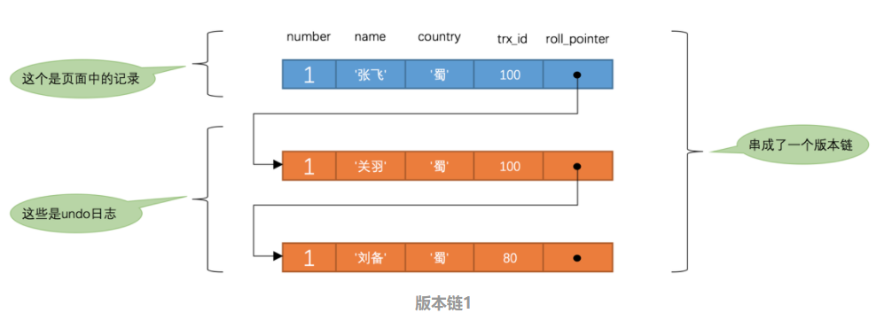
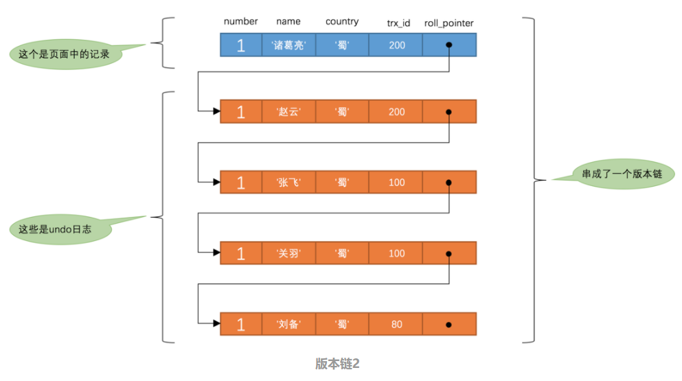

[TOC]

多版本并发控制(Multi-Version Concurrency Control, MVCC)  是MySQL中基于乐观锁理论实现隔离级别的方式，用于实现读已提交和可重复读取隔离级别的实现。

MVCC最大的优势：读不加锁，读写不冲突。在读多写少的OLTP应用中，读写不冲突是非常重要的，极大的增加了系统的并发性能

## MVCC 实现

> 系统版本号：一个递增的数字，每开始一个新的事务，系统版本号就会自动递增。
>
> 事务版本号：事务开始时的系统版本号。

MVCC是通过在每行记录后面保存两个隐藏的列：DB_TRX_ID（trx_id）和 DB_ROLL_PTR（roll_pointer）来实现的。每次事务对某条记录进行修改时，都会把该事务的事务 ID 赋值给 trx_id 隐藏列，同时还会把该条记录的旧版本写入到 undo log 中，而这个 roll_pointer 就相当于一个指针，通过它可以找到该记录修改前的信息。

> 在这里需要着重说明下事务id，当我们开启一个事务，并不会马上获得事务id，哪怕我们在事务中执行select语句，也是没有事务id的（事务id为0），只有执行insert/update/delete语句才能获得事务id，这一点尤为重要。
>
> ##### SELECT
>
> select时读取数据的规则为：创建版本号<=当前事务版本号，删除版本号为空或>当前事务版本号。
>
> 创建版本号<=当前事务版本号保证取出的数据不会有后启动的事务中创建的数据。这也是为什么在开始的示例中我们不会查出后来添加的数据的原因
>
> 删除版本号为空或>当前事务版本号保证了至少在该事务开启之前数据没有被删除，是应该被查出来的数据。
>
> ##### INSERT
>
> insert时将当前的系统版本号赋值给创建版本号字段。
>
> ##### UPDATE
>
> 插入一条新纪录，保存当前事务版本号为行创建版本号，同时保存当前事务版本号到原来删除的行，实际上这里的更新是通过delete和insert实现的。
>
> ##### DELETE
>
> 删除时将当前的系统版本号赋值给删除版本号字段，标识该行数据在那一个事务中会被删除，即使实际上在位commit时该数据没有被删除。根据select的规则后开启懂数据也不会查询到该数据。

### 版本链

每次对记录进行改动，都会写一条 undo log，同时每条 undo log 也都有一个 old_trx_id 属性和一个 old_roll_pointer 属性（INSERT 操作对应的 undo log 没有这些属性，因为该记录没有更早的版本）用于记录自身版本和上一个 undo log 的回滚段指针。最终这些 undo log 就连接起来形成了一个链表，这个链表称之为版本链，版本链的头节点就是当前记录的最新值。


### ReadView

对于使用 READ UNCOMMITTED 隔离级别的事务来说，由于可以读到未提交事务修改过的记录，因此直接读取记录的最新版本即可。对于使用 SERIALIZABLE 隔离级别的事务来说，InnoDB 规定必须使用加锁的方式来访问记录。而对于使用 READ COMMITTED 和 REPEATABLE READ 隔离级别的事务来说，如果一个事务修改了记录但尚未提交，其他事务是不能读取记录的最新版本的。此时就需要判断版本链中的哪个版本是可以被当前事务访问的，为此 InnoDB 的设计人员提出了 ReadView 的概念。

| ReadView 组成部分 | 描述                                                         |
| :---------------- | :----------------------------------------------------------- |
| m_ids             | 在生成 ReadView 时当前系统中活跃的读写事务（区别于只读事务，默认的事务就是读写事务）的事务 ID 列表 |
| min_trx_id        | 在生成 ReadView 时当前系统中活跃的读写事务中最小的事务 ID，也就是 m_ids 中的最小值 |
| max_trx_id        | 系统应该给下一个事务分配的 ID 值                             |
| creator_trx_id    | 生成该 ReadView 的事务 ID 值                                 |

> 只有在对记录做改动（INSERT、DELETE、UPDATE）时才会为事务分配事务 ID，否则在一个只读事务中的事务 ID 默认都是 0。

有了这个 ReadView，这样在访问某条记录时，只需要按照以下规则判断记录的某个版本是否可见：

1. 被访问版本的 trx_id 与 ReadView 中的 creator_trx_id 相同，说明当前事务在访问自己修改过的记录，因此该版本可以被当前事务访问。

2.  被访问版本的 trx_id 小于 ReadView 中的 min_trx_id 值，说明该版本的事务在当前事务生成 ReadView 前已经提交，所以该版本可以被当前事务访问。

3. 被访问版本的 trx_id 在 min_trx_id 与 max_trx_id 之间，说明需要判断 trx_id 值是否在 m_ids 列表中，如果在，说明创建 ReadView 的事务还是活跃的，该版本不可以被当前事务访问；如果不在，说明创建 ReadView 时生成该版本的事务已经提交，那么该版本可以被当前事务访问。

4. 被访问版本的 trx_id 大于或等于 ReadView 中的 max_trx_id 值，说明生成该版本的事务在当前事务生成 ReadView 之后才开启，所以该版本不可以被当前事务访问。

在 MySQL 中，READ COMMITTED 隔离级别与 REPEATABLE READ 隔离级别的一个很大的区别就是它们生成 ReadView 的时机不同。

- 在读提交隔离级别中，每次读取数据前都会生成一个 ReadView。

- 在使用 REPEATABLE READ 隔离级别的事务中，只会在第一次执行查询语句时生成一个 ReadView，之后该事务中所有的查询操作都会重复使用这个 ReadView。

为了方便说明，这里先创建一张表：

```sql
CREATE TABLE hero (
    number INT,
    name VARCHAR(100),
    country VARCHAR(100),
    PRIMARY KEY (number)
) Engine=InnoDB CHARSET=utf8;

INSERT INTO hero VALUES (1, '刘备', '蜀');
```

#### READ COMMITTED

**在读提交隔离级别中，每次读取数据前都会生成一个 ReadView。**

假如现在系统中有两个事务 ID 分别为 100、200 的事务在运行。

```
-- 事务 100
BEGIN;
UPDATE hero SET name = '关羽' WHERE number = 1;
UPDATE hero SET name = '张飞' WHERE number = 1;

-- 事务 200
BEGIN;
-- 更新了其他表的一些记录，这里这么做是因为只有修改操作才会生成事务 ID
```

此时 hero 表中主键值为 1 的记录的版本链类似下面这样：



假设此时有一个 READ COMMITTED 隔离级别的事务开始执行：

```
BEGIN;
-- 事务 100、200 还未提交，得到的是刘备的信息
SELECT * FROM hero WHERE number = 1;
```

那么这个查询的执行过程大概是这样：

首先在执行 SELECT 语句时会生成一个 ReadView，m_ids 列表的内容就是 `[100, 200]`，min_trx_id 为 100，而 max_trx_id 为 201，creator_trx_id 则为 0。

然后开始从版本链中寻找可见的记录，由于最新版本的 trx_id 为 100，处于 min_trx_id 与 max_trx_id 之间，而同时 trx_id 为 100 的事务还处于活跃状态，所以该版本不能被当前事务访问。那么此时就根据 roll_pointer 跳到下一个版本中。同样的，这个版本的 trx_id 值也是 100，因此继续到下一个版本。这个版本中的 trx_id 为 80，小于 ReadView 中的 min_trx_id，因此这个版本是符合要求的，所以返回的就是该版本的信息。

接下来我们把事务 100 提交，然后在事务 200 中更新一下记录：

```
-- 事务 100
BEGIN;
UPDATE hero SET name = '关羽' WHERE number = 1;
UPDATE hero SET name = '张飞' WHERE number = 1;
COMMIT;

-- 事务 200
BEGIN;
-- 更新了其他表的一些记录，这里这么做是因为只有修改操作才会生成事务 ID
UPDATE hero SET name = '赵云' WHERE number = 1;
UPDATE hero SET name = '诸葛亮' WHERE number = 1;
```

此时的 hero 表中，主键值为 1 的记录的版本链类似下面这样：



然后我们再到刚才的事务中继续查找主键值为 1 的记录：

```
BEGIN;
-- 事务 100、200 还未提交，得到的是刘备的信息
SELECT * FROM hero WHERE number = 1;

-- 再次查询，此时事务 100 已经提交，事务 200 还未提交，得到的是张飞的信息
SELECT * FROM hero WHERE number = 1;
```

这个查询的执行过程大概是这样的：

首先**在执行查询时会再次生成一个 ReadView**，m_ids 的值为 `[200]`，min_trx_id 变成了 200，而 max_trx_id 为 201，creator_trx_id 为 0。

然后从版本链中查询可见的记录，最新版本记录的 trx_id 为 200，在事务活跃列表中，因此不符合规则。以此类推，只有 trx_id 为 100、name 列的内容为“张飞”的版本符合规则。

#### REPEATABLE READ

与 READ COMMITTED 隔离级别不同，在使用 REPEATABLE READ 隔离级别的事务中，只会在第一次执行查询语句时生成一个 ReadView，之后该事务中所有的查询操作都会重复使用这个 ReadView。


## 幻读

其实在 InnoDB 中，读操作可以分为两种：快照读（Snapshot Read/Consistent Read）和当前读（Current Read/Locking Read）。

快照读就是简单的 SELECT 操作，不需要加锁，读取的是当前记录的快照。

而当前读则是特殊的读操作，读取的是记录的最新数据，包括隐含当前读逻辑的插入、更新和删除，以及一些手工添加锁的读，比如 `SELECT ... FOR UPDATE`、`SELECT ... LOCK IN SHARE MODE`，它们都属于当前读，需要加锁。

**对于快照读来说，不存在幻读的问题；而对于当前读来说，会出现幻读的问题。**

如果我们的项目中需要解决幻读的话也有两个办法：

- 使用串行化读的隔离级别
- MVCC+next-key locks：next-key locks由record locks(索引加锁) 和 gap locks(间隙锁，每次锁住的不光是需要使用的数据，还会锁住这些数据附近的数据)

实际上很多的项目中是不会使用到上面的两种方法的，串行化读的性能太差，而且其实幻读很多时候是我们完全可以接受的。


https://juejin.cn/post/6844903799534911496

https://blog.nekolr.com/2020/07/14/MySQL%20MVCC%20%E5%8E%9F%E7%90%86/

https://www.cnblogs.com/CodeBear/p/12710670.html