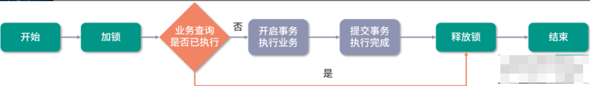

## 什么是幂等性？如何保证接口的幂等性？

幂等性最早是数学里面的一个概念，后来被用于计算机领域，用于表示任意多次请求均与一次请求执行的结果相同，也就是说对于一个接口而言，无论调用了多少次，最终得到的结果都是一样的。比如以下代码：

```java
public class IdempotentExample {

    // 变量
    private static int count = 0;

    /**
     * 非幂等性方法
     */
    public static void addCount() {
        count++;
    }

    /**
     * 幂等性方法
     */
    public static void printCount() {
        System.out.println(count);
    }
}
```

对于变量 count 来说，如果重复调用 addCount() 方法的话，会一直累加 count 的值，因为 addCount() 方法就是非幂等性方法；而 printCount() 方法只是用来打印控制台信息的。因此，它无论调用多少次结果都是一样的，所以它是幂等性方法。

#### 幂等性注意事项

幂等性的实现与判断需要消耗一定的资源，因此不应该给每个接口都增加幂等性判断，要根据实际的业务情况和操作类型来进行区分。例如，我们在进行查询操作和删除操作时就无须进行幂等性判断。查询操作查一次和查多次的结果都是一致的，因此我们无须进行幂等性判断。删除操作也是一样，删除一次和删除多次都是把相关的数据进行删除（这里的删除指的是条件删除而不是删除所有数据），因此也无须进行幂等性判断。

#### 幂等性的关键步骤

实现幂等性的关键步骤分为以下三个：

- 每个请求操作必须有唯一的 ID，而这个 ID 就是用来表示此业务是否被执行过的关键凭证，例如，订单支付业务的请求，就要使用订单的 ID 作为幂等性验证的 Key；
- 每次执行业务之前必须要先判断此业务是否已经被处理过；
- 第一次业务处理完成之后，要把此业务处理的状态进行保存，比如存储到 Redis 中或者是数据库中，这样才能防止业务被重复处理。

**知道了幂等性的概念，那如何保证幂等性呢？**

幂等性的实现方案通常分为以下几类：

- 前端拦截
- 使用数据库实现幂等性
- 使用 JVM 锁实现幂等性
- 使用分布式锁实现幂等性

下面我们分别来看它们的具体实现过程。

#### 1. 前端拦截

前端拦截是指通过 Web 站点的页面进行请求拦截，比如在用户点击完“提交”按钮后，我们可以把按钮设置为不可用或者隐藏状态，避免用户重复点击。

但前端拦截有一个致命的问题，如果是懂行的程序员或者黑客可以直接绕过页面的 JS 执行，直接模拟请求后端的接口，这样的话，我们前端的这些拦截就不能生效了。因此除了前端拦截一部分正常的误操作之外，后端的验证必不可少。

#### 2. 数据库实现

数据库实现幂等性的方案有三个：

- 通过悲观锁来实现幂等性
- 通过唯一索引来实现幂等性
- 通过乐观锁来实现幂等性

**① 悲观锁**

使用悲观锁实现幂等性，一般是配合事务一起来实现，在没有使用悲观锁时，我们通常的执行过程是这样的，首先来判断数据的状态，执行 SQL 如下：

```
select status from table_name where id='xxx';
```

然后再进行添加操作：

```
insert into table_name (id) values ('xxx');
```

最后再进行状态的修改：

```
update table_name set status='xxx';
```

但这种情况因为是非原子操作，所以在高并发环境下可能会造成一个业务被执行两次的问题，当一个程序在执行中时，而另一个程序也开始状态判断的操作。因为第一个程序还未来得及更改状态，所以第二个程序也能执行成功，这就导致一个业务被执行了两次。

在这种情况下我们就可以使用悲观锁来避免问题的产生，实现 SQL 如下所示：

```
begin;  # 1.开始事务
select * from table_name where id='xxx' for update; # 2.查询状态
insert into table_name (id) values ('xxx'); # 3.添加操作
update table_name set status='xxx'; # 4.更改操作
commit; # 5.提交事务
```

在实现的过程中需要注意以下两个问题：

- 如果使用的是 MySQL 数据库，必须选用 innodb 存储引擎，因为 innodb 支持事务；
- id 字段一定要是主键或者是唯一索引，不然会锁表，影响其他业务执行。

**② 唯一索引**

我们可以创建一个唯一索引的表来实现幂等性，在每次执行业务之前，先执行插入操作，因为唯一字段就是业务的 ID，因此如果重复插入的话会触发唯一约束而导致插入失败。在这种情况下（插入失败）我们就可以判定它为重复提交的请求。

唯一索引表的创建示例如下：

```
CREATE TABLE `table_name` (
  `id` int NOT NULL AUTO_INCREMENT,
  `orderid` varchar(32) NOT NULL DEFAULT '' COMMENT '唯一id',
  PRIMARY KEY (`id`),
  UNIQUE KEY `uq_orderid` (`orderid`) COMMENT '唯一约束'
) ENGINE=InnoDB;
```

**③ 乐观锁**

乐观锁是指在执行数据操作时（更改或添加）进行加锁操作，其他时间不加锁，因此相比于整个执行过程都加锁的悲观锁来说，它的执行效率要高很多。

乐观锁可以通过版本号来实现，例如以下 SQL：

```
update table_name set version=version+1 where version=0;
```

#### 3. JVM 锁实现

JVM 锁实现是指通过 JVM 提供的内置锁如 Lock 或者是 synchronized 来实现幂等性。使用 JVM 锁来实现幂等性的一般流程为：首先通过 Lock 对代码段进行加锁操作，然后再判断此订单是否已经被处理过，如果未处理则开启事务执行订单处理，处理完成之后提交事务并释放锁，执行流程如下图所示：



JVM 锁存在的最大问题在于，它只能应用于单机环境，因为 Lock 本身为单机锁，所以它就不适应于分布式多机环境。

#### 4. 分布式锁实现

分布式锁实现幂等性的逻辑是，在每次执行方法之前先判断是否可以获取到分布式锁，如果可以，则表示为第一次执行方法，否则直接舍弃请求即可，执行流程如下图所示：


需要注意的是分布式锁的 key 必须为业务的唯一标识，我们通常使用 Redis 或者 ZooKeeper 来实现分布式锁；如果使用 Redis 的话，则用 set 命令来创建和获取分布式锁，执行示例如下：

```
127.0.0.1:6379> set lock true ex 30 nx
OK # 创建锁成功
```

其中，ex 是用来设置超时时间的；而 nx 是 not exists 的意思，用来判断键是否存在。如果返回的结果为“OK”，则表示创建锁成功，否则表示重复请求，应该舍弃。


**如何定位问题？ 解决思路和处理方法？**


**最近在做的比较熟悉的项目是哪个？画一下项目技术架构图**


**单机上一个线程池正在处理服务，如果忽然断电怎么办（正在处理和阻塞队列里的请求怎么办）**


**接口如何处理重复请求？**


**知道osgi吗 它是如何实现的**


**知道字节码吗？字节码获取方式都有哪些？**

字节码也就是class文件。
在程序中获取类对象的方法就是获取字节码的方式。

```
1.类名.class,例如System.class;
2.对象.getClass(),例如New Date().getClass()
3.Class.forName("类名")，例如Class.forName("Java.Util.Date");
123
```

字节码角度讲int y=5单纯压入int类型变量，赋值为5，而Integer x=5则会调用Integer.valueOf()的方法。x==y会使用到if_icmp方法比较。

Integer x = 5， int y = 5 比较x == y 都经过了哪些步骤?


