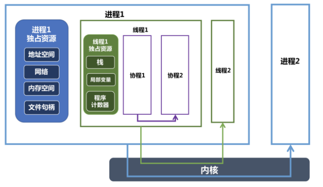

## 进程和线程

**进程：**是一个实体，每个进程都有他自己的地址空间，是**系统进行资源分配和调度的基本单位**。进程是程序的一次执行过程，系统运行一个程序即是一个进程从创建，运行到消亡的过程。

在 Java 中，当我们启动 main 函数时其实就是启动了一个 JVM 的进程，而 main 函数所在的线程就是这个进程中的一个线程，也称主线程。

**线程：**线程是进程的一个实体,是CPU调度和分派的基本单位。

一个进程在其执行的过程中可以产生多个线程。与进程不同的是同类的多个线程共享进程的**堆**和**方法区**资源，但每个线程有自己的**程序计数器**、**虚拟机栈**和**本地方法栈**，所以系统在产生一个线程，或是在各个线程之间作切换工作时，负担要比进程小得多，也正因为如此，线程也被称为轻量级进程。

- 一个程序至少有一个进程，一个进程至少有一个线程。
- 线程比进程划分更细，所以执行开销更小，并发性更高
- 进程是一个实体，拥有独立的资源；而同一个进程中的多个线程共享进程的资源。

**总结：** 线程是进程划分成的更小的运行单位。线程和进程最大的不同在于基本上各进程是独立的，而各线程则不一定，因为同一进程中的线程极有可能会相互影响。线程执行开销小，但不利于资源的管理和保护；而进程正相反。

## 有了进程为什么还要线程？

- 每个进程都有自己的地址空间，即进程空间。一个服务器通常需要接收大量并发请求，为每一个请求都创建一个进程系统开销大、请求响应效率低
- 进程只能在一个时间干一件事，如果想同时干两件事或多件事，进程就无能为力了。
- 进程在执行的过程中如果阻塞，例如等待输入，整个进程就会挂起，即使进程中有些工作不依赖于输入的数据，也将无法执行。

## 协程

https://juejin.cn/post/6844903921471717389

协程，又称微线程。英文名Coroutine。**协程是一种用户态的轻量级线程。**

协程拥有自己的寄存器上下文和栈。协程调度切换时，将寄存器上下文和栈保存到其他地方，在切回来的时候，恢复先前保存的寄存器上下文和栈，协程存在于用户态，不会陷入到内核态，所以上下文的切换非常快。

对操作系统而言，线程是最小的执行单元，进程是最小的资源管理单元。无论是进程还是线程，都是由操作系统所管理的。协程不是被操作系统内核所管理的，而是完全由程序所控制，也就是在用户态执行。这样带来的好处是性能大幅度的提升，因为不会像线程切换那样消耗资源。

一个进程可以包含多个线程，一个线程可以包含多个协程。一个线程内的多个协程虽然可以切换，但是多个协程是串行执行的，只能在一个线程内运行，没法利用 CPU 多核能力。

协程与进程一样，切换是存在上下文切换问题的。

协程的好处：

1. 无需担心线程上下文切换的开销
2. 无需原子操作锁定及同步的开销
3. 方便切换控制流，简化编程模型

高并发+高扩展性+低成本：一个CPU支持上万的协程都不是问题。所以很适合用于高并发处理。

缺点：

1. 无法利用多核资源：协程的本质是个单线程,它不能同时将 单个CPU 的多个核用上,协程需要和进程配合才能运行在多CPU上.当然我们日常所编写的绝大部分应用都没有这个必要，除非是cpu密集型应用。
2. 进行阻塞（Blocking）操作（如IO时）会阻塞掉整个程序

**最佳实践**

1. 线程和协程推荐在IO密集型的任务(比如网络调用)中使用，而在CPU密集型的任务中，表现较差。
2. 对于CPU密集型的任务，则需要多个进程，绕开GIL的限制，利用所有可用的CPU核心，提高效率。
3. 所以大并发下的最佳实践就是多进程+协程，既充分利用多核，又充分发挥协程的高效率，可获得极高的性能。

## 进程、线程、协程的关系和比较



- 进程是资源分配的最小单位，会拥有独立的地址空间以及对应的内存空间，还有网络和文件资源等，不同进程之间资源都是独立的，可以通过进程间通信（管道、共享内存、信号量等方式）来进行交互。
- 线程为CPU调度的基本单位，除了拥有运行中必不可少的信息(如程序计数器、一组寄存器和栈)以外，本身并不拥有系统资源，所有线程会共享进程的资源，比如会共享堆资源。
- 协程可以认为是运行在线程上的代码块，协程提供的挂起操作会使协程暂停执行，而不会导致线程阻塞。一个线程内部可以创建几千个协程都没有任何问题。
- 进程的切换和线程切换中都包含了对应上下文的切换，这块都涉及到了内核来完成，即一次用户态到内核态的切换和一次内核态到用户态的切换。因为进程上下文切换保存的信息更多，所以进程切换代价会比线程切换代价更大。
- 协程是一个纯用户态的并发机制，同一时刻只会有一个协程在运行，其他协程挂起等待；不同协程之间的切换不涉及内核，只用在用户态切换即可，所以切换代价更小，更轻量级，适合IO密集型的场景。

## 进程间通信

进程间的通信主要包括管道，系统IPC（包括消息队列，信号量，共享存储），SOCKET

**匿名管道：**管道是一种半双工的通信方式，数据只能单向流动，而且只能在具有亲缘关系的进程间使用，进程的亲缘关系通常是指父子关系

**有名管道：**是半双工的方式，但是允许无亲缘关系的进程之间的通信。

> 管道通信在系统中，是以文件的方式进行读写的，匿名管道在物理上由文件系统的高速缓冲区构成，而命名管道则可在系统的临时文件中找到具体的文件，相当于通过外部文件来交流信息。父子进程间以比特流、字符流的方式传送信息。管道属于半双工通信，在父子进程中同时创建一对管道，然后利用其中一端（0端）来读数据，另一端（1端）来写数据。

**信号(Signal):**信号是比较复杂的通信方式，用于通知接受进程有某种事件发生，除了用于进程间通信外，进程还可以发送信号给进程本身。

**信号量：**是一个计数器，可以用来控制多个进程对共享资源的访问通常作为一种锁机制，防止某进程正在访问共享资源的时候，其他进程也访问该资源。因此作为一种进程间以及同一进程内不同线程之间的同步手段

> 对信号量的操作分为P操作和V操作，P操作是将信号量的值减一，V操作是将信号量的值加一。当信号量的值小于等于0之后，再进行P操作时，当前进程或线程会被阻塞，直到另一个进程或线程执行了V操作将信号量的值增加到大于0之时。锁也是用的这种原理实现的。
>
> 信号量我们需要定义信号量的数量，设定初始值，以及决定何时进行PV操作。

**消息队列：**消息队列是由消息的链表，存放在内核中并由消息队列标示符标识，消息队列克服了信号传递信息少，管道只能承载无格式字节流以及缓冲区大小受限等特点 

**共享存储：**共享内存是映射一段能被其他进程所访问的内存，这段共享内存由一个进程创建，但多个进程可以访问，共享内存是最快的IPC方式，是针对其他进程间通信方式运行效率低而专门设计的，往往与其他通信机制，如信号量配合使用，来实现进程间的相互通信

**套接字：**套接口也是一种进程间的通信机制，与其他通信机制不同的是，可以用于不同机器间的进程通信

## 线程间通信方式

https://blog.csdn.net/J080624/article/details/87454764

线程间的通信目的主要是用于线程同步，所以线程没有像进程通信中的用于数据交换的通信机制。

**锁机制**

互斥锁、条件变量、读写锁和自旋锁。

- 互斥锁确保同一时间只能有一个线程访问共享资源。当锁被占用时试图对其加锁的线程都进入阻塞状态(释放CPU资源使其由运行状态进入等待状态)。当锁释放时哪个等待线程能获得该锁取决于内核的调度。

- 读写锁当以写模式加锁而处于写状态时任何试图加锁的线程(不论是读或写)都阻塞，当以读状态模式加锁而处于读状态时“读”线程不阻塞，“写”线程阻塞。读模式共享，写模式互斥。

- 条件变量可以以原子的方式阻塞进程，直到某个特定条件为真为止。对条件的测试是在互斥锁的保护下进行的。条件变量始终与互斥锁一起使用。

- 自旋锁上锁受阻时线程不阻塞而是在循环中轮询查看能否获得该锁，没有线程的切换因而没有切换开销，不过对CPU的霸占会导致CPU资源的浪费。 所以自旋锁适用于并行结构(多个处理器)或者适用于锁被持有时间短而不希望在线程切换产生开销的情况。

**信号量（Semaphore）**

包括无名线程信号量和命名线程信号量。

线程的信号和进程的信号量类似，使用线程的信号量可以高效地完成基于线程的资源计数。信号量实际上是一个非负的整数计数器，用来实现对公共资源的控制。在公共资源增加的时候，信号量就增加；公共资源减少的时候，信号量就减少；只有当信号量的值大于0的时候，才能访问信号量所代表的公共资源。

**信号机制(Signal)**

类似进程间的信号处理。

 **violate全局变量-共享存储**

 **wait/notify**


## 进程调度算法

不同环境的调度算法目标不同，因此需要针对不同环境来讨论调度算法。

### 批处理系统

批处理系统没有太多的用户操作，在该系统中，调度算法目标是保证吞吐量和周转时间（从提交到终止的时间）。

**先来先服务 first-come first-serverd（FCFS）**

非抢占式的调度算法，按照请求的顺序进行调度。

有利于长作业，但不利于短作业，因为短作业必须一直等待前面的长作业执行完毕才能执行，而长作业又需要执行很长时间，造成了短作业等待时间过长。

**短作业优先 shortest job first（SJF）**

非抢占式的调度算法，按估计运行时间最短的顺序进行调度。

长作业有可能会饿死，处于一直等待短作业执行完毕的状态。因为如果一直有短作业到来，那么长作业永远得不到调度。

**最短剩余时间优先 shortest remaining time next（SRTN）**

最短作业优先的抢占式版本，按剩余运行时间的顺序进行调度。 当一个新的作业到达时，其整个运行时间与当前进程的剩余时间作比较。如果新的进程需要的时间更少，则挂起当前进程，运行新的进程。否则新的进程等待。

### 交互式系统

交互式系统有大量的用户交互操作，在该系统中调度算法的目标是快速地进行响应。

**时间片轮转**

将所有就绪进程按 FCFS 的原则排成一个队列，每次调度时，把 CPU 时间分配给队首进程，该进程可以执行一个时间片。当时间片用完时，由计时器发出时钟中断，调度程序便停止该进程的执行，并将它送往就绪队列的末尾，同时继续把 CPU 时间分配给队首的进程。

时间片轮转算法的效率和时间片的大小有很大关系：

因为进程切换都要保存进程的信息并且载入新进程的信息，如果时间片太小，会导致进程切换得太频繁，在进程切换上就会花过多时间。 而如果时间片过长，那么实时性就不能得到保证。

**优先级调度**

为每个进程分配一个优先级，按优先级进行调度。

为了防止低优先级的进程永远等不到调度，可以随着时间的推移增加等待进程的优先级。

**多级反馈队列**

一个进程需要执行 100 个时间片，如果采用时间片轮转调度算法，那么需要交换 100 次。

多级队列是为这种需要连续执行多个时间片的进程考虑，它设置了多个队列，每个队列时间片大小都不同，例如 1,2,4,8,..。进程在第一个队列没执行完，就会被移到下一个队列。这种方式下，之前的进程只需要交换 7 次。

每个队列优先权也不同，最上面的优先权最高。因此只有上一个队列没有进程在排队，才能调度当前队列上的进程。

可以将这种调度算法看成是时间片轮转调度算法和优先级调度算法的结合。

### 实时系统

实时系统要求一个请求在一个确定时间内得到响应。

分为硬实时和软实时，前者必须满足绝对的截止时间，后者可以容忍一定的超时。

## 内核态和用户态

https://www.cnblogs.com/bakari/p/5520860.html
https://zhuanlan.zhihu.com/p/69554144


如上图所示，从宏观上来看，Linux操作系统的体系架构分为用户态和内核态（或者用户空间和内核）。

内核从本质上看是一种软件——控制计算机的硬件资源，并提供上层应用程序运行的环境。用户态即上层应用程序的活动空间，应用程序的执行必须依托于内核提供的资源，包括CPU资源、存储资源、I/O资源等。为了使上层应用能够访问到这些资源，内核必须为上层应用提供访问的接口：即**系统调用**。

系统调用是操作系统的最小功能单位，这些系统调用根据不同的应用场景可以进行扩展和裁剪，现在各种版本的Unix实现都提供了不同数量的系统调用.

> 如Linux的不同版本提供了240-260个系统调用，FreeBSD大约提供了320个（reference：UNIX环境高级编程）。

我们可以把系统调用看成是一种不能再化简的操作（类似于原子操作，但是不同概念），在进行一些复杂操作时（给某个变量分配内存空间），就必须调用很多的系统调用。

如果从实现者（程序员）的角度来看，这势必会加重程序员的负担，良好的程序设计方法是：重视上层的业务逻辑操作，而尽可能避免底层复杂的实现细节。**库函数**正是为了将程序员从复杂的细节中解脱出来而提出的一种有效方法。它实现对系统调用的封装，将简单的业务逻辑接口呈现给用户，方便用户调用。库函数依据不同的标准也可以有不同的实现版本，如ISO C 标准库，POSIX标准库等。

Shell是一个特殊的应用程序，俗称命令行，本质上是一个命令解释器，它下通系统调用，上通各种应用，通常充当着一种“胶水”的角色，来连接各个小功能程序，让不同程序能够以一个清晰的接口协同工作，从而增强各个程序的功能。

同时，Shell是可编程的，它可以执行符合Shell语法的文本，这样的文本称为Shell脚本，通常短短的几行Shell脚本就可以实现一个非常大的功能，原因就是这些Shell语句通常都对系统调用做了一层封装。

为了方便用户和系统交互，一般，一个Shell对应一个终端，终端是一个硬件设备，呈现给用户的是一个图形化窗口。我们可以通过这个窗口输入或者输出文本。这个文本直接传递给shell进行分析解释，然后执行。

用户态的应用程序可以通过三种方式来访问内核态的资源：

1. 系统调用
2. 库函数
3. Shell脚本

**用户态和内核态的切换**

因为操作系统的资源是有限的，如果访问资源的操作过多，必然会消耗过多的资源，而且如果不对这些操作加以区分，很可能造成资源访问的冲突。

所以，为了减少有限资源的访问和使用冲突，Unix/Linux的设计哲学之一就是：对不同的操作赋予不同的执行等级，就是所谓特权的概念。简单说就是有多大能力做多大的事，与系统相关的一些特别关键的操作必须由最高特权的程序来完成。

Intel的X86架构的CPU提供了0到3四个特权级，数字越小，特权越高，Linux操作系统中主要采用了0和3两个特权级，分别对应的就是内核态和用户态。运行于用户态的进程可以执行的操作和访问的资源都会受到极大的限制，而运行在内核态的进程则可以执行任何操作并且在资源的使用上没有限制。

很多程序开始时运行于用户态，但在执行的过程中，一些操作需要在内核权限下才能执行，这就涉及到一个从用户态切换到内核态的过程。比如C函数库中的内存分配函数malloc()，它具体是使用sbrk()系统调用来分配内存，当malloc调用sbrk()的时候就涉及一次从用户态到内核态的切换，类似的函数还有printf()，调用的是wirte()系统调用来输出字符串，等等。

1. 系统调用
2. 异常事件： 当CPU正在执行运行在用户态的程序时，突然发生某些预先不可知的异常事件，这个时候就会触发从当前用户态执行的进程转向内核态执行相关的异常事件，典型的如缺页异常。
3. 外围设备的中断：当外围设备完成用户的请求操作后，会像CPU发出中断信号，此时，CPU就会暂停执行下一条即将要执行的指令，转而去执行中断信号对应的处理程序，如果先前执行的指令是在用户态下，则自然就发生从用户态到内核态的转换。

注意：**系统调用的本质其实也是中断，相对于外围设备的硬中断，这种中断称为软中断**，这是操作系统为用户特别开放的一种中断，如Linux int 80h中断。所以，从触发方式和效果上来看，这三种切换方式是完全一样的，都相当于是执行了一个中断响应的过程。但是从触发的对象来看，系统调用是进程主动请求切换的，而异常和硬中断则是被动的。

## 多路复用

https://www.cnblogs.com/aspirant/p/9166944.html

### 阻塞IO

阻塞 I/O，是指进程发起调用后，会被挂起（阻塞），直到收到数据再返回。如果调用一直不返回，进程就会一直被挂起。因此，当使用阻塞 I/O 时，需要使用多线程来处理多个文件描述符。

### 非阻塞IO

多线程切换有一定的开销，因此引入非阻塞 I/O。非阻塞 I/O 不会将进程挂起，调用时会立即返回成功或错误，因此可以在一个线程里轮询多个文件描述符是否就绪。

但是非阻塞 I/O 的缺点是：每次发起系统调用，只能检查一个文件描述符是否就绪。当文件描述符很多时，系统调用的成本很高。

### IO多路复用

I/O多路复用就通过一种机制，可以监视多个描述符，一旦某个描述符就绪（一般是读就绪或者写就绪），能够通知程序进行相应的读写操作。

select，poll，epoll都是IO多路复用的机制。

epoll和select都能提供I/O多路复用的解决方案。在现在的Linux内核里有都能够支持，其中epoll是Linux所特有，而select则应该是POSIX所规定，一般操作系统均有实现

因此引入了 I/O 多路复用，可以**通过一次系统调用，检查多个文件描述符的状态**。这是 I/O 多路复用的主要优点，相比于非阻塞 I/O，在文件描述符较多的场景下，避免了频繁的用户态和内核态的切换，减少了系统调用的开销。

>  I/O 多路复用相当于将「遍历所有文件描述符、通过非阻塞 I/O 查看其是否就绪」的过程从用户线程移到了内核中，由内核来负责轮询。

进程可以通过 select、poll、epoll 发起 I/O 多路复用的系统调用，这些系统调用都是同步阻塞的：如果传入的多个文件描述符中，有描述符就绪，则返回就绪的描述符；否则如果所有文件描述符都未就绪，就阻塞调用进程，直到某个描述符就绪，或者阻塞时长超过设置的 timeout 后，再返回。使用非阻塞 I/O 检查每个描述符的就绪状态。

如果 `timeout` 参数设为 NULL，会无限阻塞直到某个描述符就绪；如果 `timeout` 参数设为 0，会立即返回，不阻塞。

### Select

它仅仅知道了，有I/O事件发生了，却并不知道是哪那几个流（可能有一个，多个，甚至全部），我们只能无差别轮询所有流，找出能读出数据，或者写入数据的流，对他们进行操作。所以**select具有O(n)的无差别轮询复杂度**，同时处理的流越多，无差别轮询时间就越长。

**缺点**

1. 单个进程可以监视 fd 数量被限制，能监听端口的大小也有限制
2. 对 fd 进行线性扫描，即采用轮训的方式，效率低
3. 需要维护一个用来存在大量fd的数据结构，这样会使得用户空间向内核空间传递该结构时开销过大。

### Poll 

poll本质上和select没有区别，它将用户传入的数组拷贝到内核空间，然后查询每个fd对应的设备状态， **但是它没有最大连接数的限制**，原因是它是基于链表来存储的.

1. 大量的fd数据被整体复制与用户态和内核态之间
2. poll 还有一个特点是 **水平触发** 如何报告了fd之后，没有被处理，那么下次poll时会再次报告该fd

### Epoll

**epoll可以理解为event poll**，不同于忙轮询和无差别轮询，epoll会把哪个流发生了怎样的I/O事件通知我们。所以我们说epoll实际上是**事件驱动（每个事件关联上fd）**的，此时我们对这些流的操作都是有意义的。**（复杂度降低到了O(1)）**

epoll 有两种触发模式：水平触发和边缘触发。默认是水平触发。该模式下，只要fd还有数据可读，每次都会返回他的事件，提醒用户线程去操作。 而边缘触发模式，它只会触发一次，知道下一次在有数据流入之前都不会再提示，无论fd中是否有数据可读。，所以边缘触发模式下，读一个fd的时候一定要把他buffer读光。

1. 没有最大并发连接的限制，能打开的fd 的上限原大于 1024
2. 效率提升，不是轮询的方式，不会随着fd数目的增加而效率降低

Epoll最大的优点就在于它只管你 `活跃` 的连接，而跟连接总数无关，因此在实际的网络环境中，Epoll的效率就会远远高于select和poll。

### 为什么epoll 要有边缘触发模式

如果采用水平触发模式的话，系统中一旦有大量不需要读写的就绪文件描述符时，他们每次都会返回，大大降低处理程序检索自己所关系的就绪文件描述符的效率。而边缘触发每次就绪时只会触发一次，这种模式比水平触发效率高，系统不会充斥大量你不关系的就绪文件描述符。

### 什么是文件描述符 fd

文件描述符（file descriptor）是一个非负整数，从 0 开始。进程使用文件描述符来标识一个打开的文件。

系统为每一个进程维护了一个文件描述符表，表示该进程打开文件的记录表，而**文件描述符实际上就是这张表的索引**。当进程打开（`open`）或者新建（`create`）文件时，内核会在该进程的文件列表中新增一个表项，同时返回一个文件描述符 —— 也就是新增表项的下标。

一般来说，每个进程最多可以打开 64 个文件，`fd ∈ 0~63`。在不同系统上，最多允许打开的文件个数不同，Linux 2.4.22 强制规定最多不能超过 1,048,576。

### socket 和 fd 的关系

socket 是 Unix 中的术语。socket 可以用于同一台主机的不同进程间的通信，也可以用于不同主机间的通信。一个 socket 包含地址、类型和通信协议等信息，通过 `socket()` 函数创建：

```
int socket(int domain, int type, int protocol)
```

返回的就是这个 socket 对应的文件描述符 `fd`。

可以这样理解：**socket 是进程间通信规则的高层抽象，而 fd 提供的是底层的具体实现**。socket 与 fd 是一一对应的。**通过 socket 通信，实际上就是通过文件描述符 `fd` 读写文件**。这也符合 Unix“一切皆文件”的哲学。


